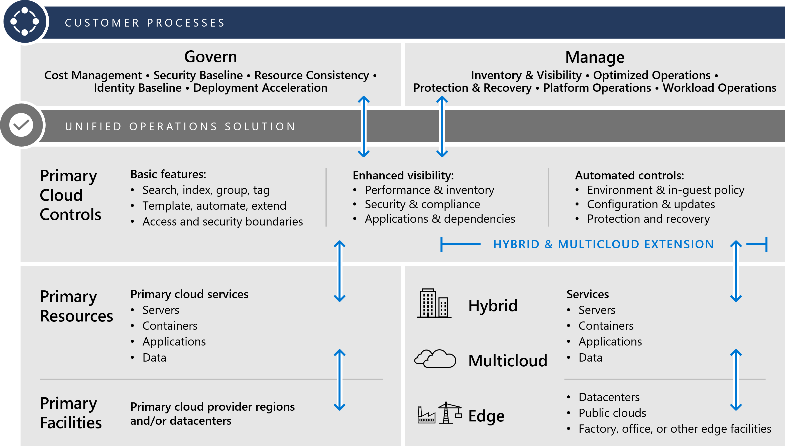

# Introduction to unified operations

One cloud dashboard, across hybrid, multicloud, and edge.

Hybrid, multicloud, and edge deployment approaches can often lead to increases in operating costs. The unexpected increase in cost is the result of duplicated or disparate operations, with one set of operating practices per cloud provider. **Unified operations** is the intentional approach of maintaining one set of tools and processes to consistently manage each cloud provider through a common set of governance and operations management practices.

## Understand and minimize costs through unified operations

In hybrid and multicloud strategies, the first increase in overhead costs might be duplicated cloud platform utilities: network, identity, governance, security, and operations tooling. In the longer term, business challenges could emerge, such as staffing core functions or teams with the skills needed to manage diverse environments.

Hybrid and multicloud strategies have led many decisions makers to incorrectly conclude that the cloud is more expensive than on-premises technologies. A recent Forrester Consulting study commissioned by Microsoft found that a hybrid and multicloud strategy can provide very significant [three-year return on investment, and substantial avoided on-premises infrastructure and staff costs](https://azure.microsoft.com/resources/forrester-tei-microsoft-azure-iaas/) for organizations. An Accenture and WSP environment and energy study further concluded that cloud solutions add significantly increased energy efficiencies for large deployments, with [organizations reducing energy use and carbon emissions by more than 30 percent against business applications installed on-premises](https://download.microsoft.com/download/7/3/9/739BC4AD-A855-436E-961D-9C95EB51DAF9/Microsoft_Cloud_Carbon_Study_2018.pdf), and for small deployments, reaching 90+ percent reductions with a shared cloud service.

Organizations can modernize and optimize overall operations using a simple approach to overcoming risks, overhead cost increases, or challenges related to staffing core functions. *Unified operations* is the approach to hybrid, multicloud, and edge cloud strategies that reduces short-term duplication and long-term strain on your technology staff. This article describes the provider-neutral approach of using unified operations to extend a single enterprise control plane across distributed assets in hybrid, multicloud, and edge environments.

More articles will follow, outlining the Azure approach to unified operations: delivering [governance](./govern.md) and [operations management](./manage.md) across heterogeneous hybrid, multicloud, and edge environments. The overall goal in an Azure-specific approach to unified operations would be to inventory, organize, and govern IT assets anywhere, on any infrastructure. This centralized enterprise control plane would provide a consistent cloud operations management experience across on-premises, multicloud, and edge environments.

## Primary cloud platform

Successful hybrid, multicloud, and edge strategies begin with a primary cloud platform.

Whether located in a public or private cloud, your primary cloud platform is where your operational processes are hosted, along with a set of defined cloud facilities. In Azure, those facilities are [Azure regions](https://azure.microsoft.com/global-infrastructure/), whereas on-premises, they could be datacenters. These facilities host cloud services necessary to manage core operations, and to support other workloads hosted on the platform. Your primary cloud platform will also include a series of controls-designed to support operations within that cloud.

> [!NOTE]
> Your primary cloud platform may not host all, or even the majority, of your workloads, but it does **host the services and controls required to complete core processes for operations management, governance, compliance, security, and so on**.
>
> [!CAUTION]
> You probably already have a primary cloud platform. Unfortunately, many cloud platforms were designed and built before operations required hybrid, multicloud, or edge deployment options. This has often led customers to replicate processes, using different cloud controls to manage cloud services across each cloud platform. If your cloud strategy calls for hybrid, multicloud, or edge deployment options **and** your primary cloud platform doesn't support them, consider a platform that can deploy the requisite functionalities for unified operations.
>

## Defining unified operations

The concept behind how unified operations works is simple: implement an extension, or gateway, in order to apply the controls in your primary cloud provider across your hybrid, multicloud, or edge deployments. Manage and govern your operations consistently-across heterogeneous on-premises, multicloud, and edge environments.

In implementing unified operations, a single enterprise control plane extends across your organization's distributed assets, bringing consistent management, application development, and cloud services to any infrastructure, anywhere, at scale. Enabling consistent management and governance for organizations, a gateway with such cloud controls extends consistent operations management and data services across disparate on-premises, multicloud and edge environments.

When identifying your primary cloud platform, it's important to ensure that cloud has the necessary toolsets to manage all of the clouds in your portfolio. Many cloud platforms were designed and built before operations required hybrid, multicloud, or edge deployment options. Insufficient capabilities in current operation tools could require operations teams to replicate processes-using different cloud controls to manage cloud services across each cloud platform. If your cloud strategy calls for hybrid, multicloud, or edge deployment options **and** your primary cloud platform doesn't support them, you should consider a platform that can deploy the requisite functionalities for unified operations.

## Unified operations

A single cloud management and operations experience across your portfolio of distributed assets at scale (bringing consistent governance, management, application development, and cloud services to any infrastructure, anywhere) enables an integrated hybrid and multicloud strategy that can increase your organization's future innovation, agility, and business growth. The addition of a gateway for cloud controls that extend management and data services to on-premises, multicloud and the edge, enables consistent management and governance for organizations; an integral hybrid and multicloud strategy that can increase your organization's future innovation, agility, and business growth, anywhere. Implement an extension (or gateway) in order to apply the controls in your primary cloud provider across your hybrid, multicloud, or edge deployments.

> [!WARNING]
> Implementation of unified operations can be relatively straightforward. But, if your cloud platform cannot manage the necessary primary unified operations processes, it will require additional capital expenditures, with costly development to create extensions, or gateways to other clouds. The main constraining factor why customers create duplicated or fractured operations and processes is because of existing primary cloud platforms with such limitations.
>
> An inconsistent approach to implementing unified operations can multiply cost inefficiencies for your organization-with increased operating costs (from duplicated cloud platform utilities, or operations tooling), and negative business impacts (staffing teams without the necessary cloud skilling in place).
>

If your current primary cloud provider does not offer the required capabilities for unified operations, consider optimizing your operations and processes using a modern cloud provider.

## Unified operations decomposed

This image displays the individual components required for unified operations, and shows how they interact with each other. The following sections provide a detailed outline for each unified operations component.

## Customer processes

The primary objective of unified operations is creating as much process consistency as possible across deployments. No cloud service provider will be able to reach 100% feature parity across all hybrid, multicloud, and edge deployments. However, the provider should be able to deliver baseline feature sets common across all deployments, so that your [governance](./govern.md) and [operations management](./manage.md) processes remain consistent.

Most commonly, customers require the ability to deliver consistency within their defined governance and operations management processes. To meet long-term requirements, your unified operations solution will need to be able to scale to meet these common processes, specified below.

### Common governance processes (tasks)

- **Cost management:** View, manage, or optimize costs, and **identify and provide mitigation guidance for cloud-related IT spend risk**.
- **Security baseline:** Audit, apply, or automate requirements from recommended security controls, and **identify and provide mitigation guidance for security-related business risks**.
- **Resource consistency:** Onboard, organize, and configure resources and services, and **identify and provide risk mitigation guidance for potential business risks**.
- **Identity baseline:** Enforce authentication and authorization across user identity and access, and **identify and provide risk-mitigation guidance for potential identity-related business risks**.
- **Deployment acceleration:** Drive consistency using templates, automation, and pipelines (for deployments, configuration alignment, and reusable assets), **establishing policies to ensure compliant, consistent, and repeatable resource deployment and configuration**.

### Common operations management processes (tasks)

- **Inventory and visibility:** Account for, and ensure reporting for all assets, and **collect and monitor your inventory's run state in enterprise-grade environments**.
- **Optimized operations:** Track, patch, and optimize supported resources and **minimize business interruption risks from configuration drift or vulnerabilities from inconsistent patch management**.
- **Protection and recovery:** Backup, business continuity, and disaster recovery best practices and **reduce the duration and impact of unpreventable outages**.
- [Platform operations](../../manage/azure-management-guide/platform-specialization.md): Specialized operations for common technology platforms such as SQL databases, virtual desktops, and SAP (for medium to high criticality workloads).
- [Workload operations](../../manage/azure-management-guide/workload-specialization.md): Specialized operations (for high priority/mission-critical workloads) with greater operations requirements.

Platform and workload operations both execute an equivalent *iterative process* to **improve system design, automate remediation, scale changes with a service catalog, and continuously improve system design, automation, and scale**.

Your primary cloud platform should be able to provide the required technical capabilities and tooling to automate processes, and reach the goals above for governance and operations management. Your unified operations solution should enable you to extend these processes across all hybrid, multicloud, and edge deployments.

## Primary cloud controls

Your primary cloud platform should include a number of important features to facilitate or automate the customer processes typically required in the cloud:

### Basic features

All of these basic features are required in order to deliver a cloud adoption plan, at scale:

- **Search, index, group, and tag** all deployed assets, extending basic visibility and management.
- **Templatize, automate, and extend tooling** for consistent deployments.
- **Create access and security boundaries** to protect deployed assets.

### Enhanced features

You will likely need most, if not all, of the following enhanced features to operate a hybrid and multicloud environment at scale:

- **Performance and inventory reporting**
- **Security and compliance auditing and automation**
- **Tracking and reporting on applications and dependencies**

### Automated controls

Automate your environment with tools to modernize your operations and optimize operational costs:

- **Environment and in-guest policy**
- **Configuration and updates**
- **Protection and recovery**

These features are likely already included in the control sets you are currently using to operate your primary cloud provider. There are likely many additional features and automated processes available in that set of controls. These are the primary control functionalities that should be available across hybrid, multicloud, and edge in your unified operations solution.

It's because they are implemented as primary controls that the features above are the ones that we commonly see lead to fractured or duplicated operations. As mentioned before, an inconsistent approach to implementing unified operations has effects from increased operating costs (for example, duplicated cloud platform utilities, operations tooling), can multiply cost inefficiencies for your organization, and incur significant capital expenditures in the early phase of the cloud adoption journey.

### Hybrid, multicloud gateway and enterprise control plane

To extend your primary cloud controls, you need to configure an extension, or gateway. This kind of extension will allow your controls to see and interact with resources that have been deployed outside of the cloud platform (**in fact, creating one control plane and greater visibility across disparate, heterogeneous environments**).

In Microsoft's cloud platforms, [Azure Arc](/azure/azure-arc/overview) is that extension. Azure Arc extends the same controls and processes used to govern the Azure cloud to other public and private clouds and the edge. It's these cloud controls that enable a unified operations approach to consistent governance and operations management processes across heterogeneous on-premises, multicloud, and edge environments.

Unified operations extends the reach of [**ARM**](/azure/azure-resource-manager/management/overview) (Azure Resource Manager), the "operating system" of Azure. ARM reaches outside Azure, to project those scattered resources inside Azure and represent them as first-class citizens. By bringing Azure services and management to any kind of infrastructure, the unified operations approach extends Azure's reach, and enables new hybrid and multicloud solutions.

Using a unified operations approach allows you to organize, govern, and secure any environment anywhere, with centralized visibility, operations, and compliance. Build cloud applications, anywhere, at scale, with standardized application services, from deployment to monitoring. Deploy Azure services anywhere, faster, consistently, and at scale with always-up-to-date Azure Arc enabled services.

Building, operating, and managing across traditional, cloud-native and distributed edge applications with consistent controls and processes for governance and operations management extends cloud innovations to scattered assets. New hybrid and multicloud scenarios can be unlocked from simplified management, faster application development, and consistent Azure services that are extended to all resource environments, on any infrastructure, across your entire IT estate.

A central Azure control plane that focuses on standardization, interoperability, and compliance enables consistent visibility and uniform governance and operations management across hybrid and multicloud infrastructures, which can increase productivity, reduce risk, and accelerate cloud adoption and migration practices and technologies for organizations.

## Next steps

To get started on your hybrid and multicloud journey, start with a quick review of the [strategy for hybrid and multicloud article](./strategy.md).
