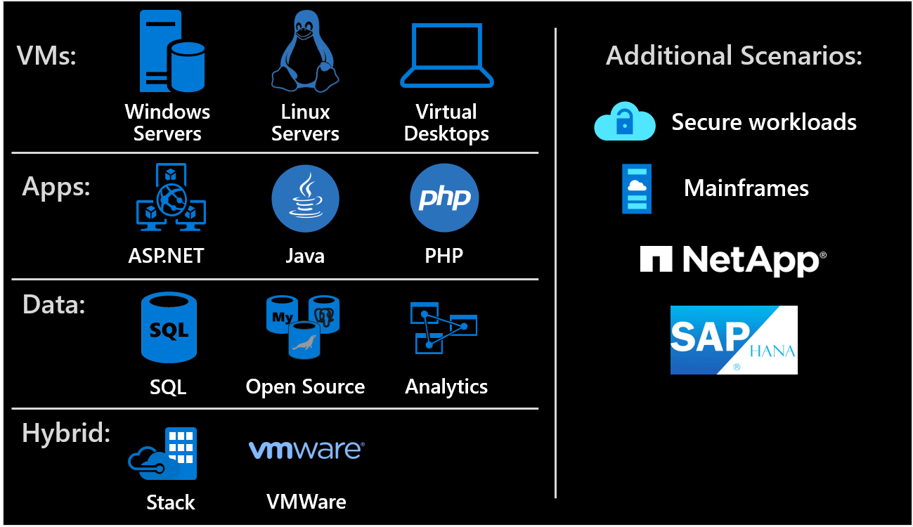

# The One Migrate approach to migrating the IT portfolio

Azure and Azure Migrate are both well known for hosting Microsoft technologies. But you might not be aware of Azure's ability to support migrations beyond Windows and SQL Server. The *One Migrate* scenarios captured in the Migrate methodology demonstrate the same set of consistent guidelines and processes for migrating both Microsoft and third-party technologies.

## Migration scenarios

The following diagram and table outline a number of scenarios that follow the same iterative Migrate methodology for migration and modernization.

| &nbsp; | &nbsp; | &nbsp; | &nbsp; |
|--|---------|---------|---------|
| Virtual machines | [Virtual machines](../migrate/azure-best-practices/contoso-migration-rehost-vm.md) | [Linux servers](../migrate/azure-best-practices/contoso-migration-rehost-linux-vm.md) | [Virtual desktops](./wvd/index.md) |
| Applications | [ASP.NET](../migrate/azure-best-practices/contoso-migration-refactor-web-app-sql.md) | [Java](/azure/developer/java/migration/migration-overview?bc=/azure/cloud-adoption-framework/_bread/toc.json&toc=/azure/cloud-adoption-framework/toc.json) | [PHP](../migrate/azure-best-practices/contoso-migration-refactor-linux-app-service-mysql.md) |
| Data | [SQL Server](../migrate/azure-best-practices/contoso-migration-rehost-vm-sql-managed-instance.md) | [Open-source databases](../migrate/azure-best-practices/sql-migration.md) | [Analytics](../migrate/azure-best-practices/analytics/analytics-solutions-overview.md) |
| Hybrid | [Azure Stack](./azure-stack/index.md) | [VMware](../migrate/azure-best-practices/vmware-host.md) | |
| Technology platforms | SAP (Classic & HANA) | Kubernetes | [Mainframes](../infrastructure/mainframe-migration/index.md) |
| Additional scenarios | [Secure workloads](../migrate/azure-best-practices/migrate-best-practices-security-management.md) | [Multitenant environments](/azure/lighthouse/how-to/migration-at-scale?bc=/azure/cloud-adoption-framework/_bread/toc.json&toc=/azure/cloud-adoption-framework/toc.json) | NetApp |

Watch this short video for more information about using the right tools to move, manage and optimize your cloud environment.

<!-- markdownlint-disable MD034 -->

> [!VIDEO https://www.microsoft.com/videoplayer/embed/RE4NHCS]

<!-- markdownlint-enable MD034 -->

## Migrate methodology

In each of the preceding migration scenarios, the same basic process will guide your efforts as you move your existing workloads to the cloud, as shown here:

In each scenario, you'll structure migration waves to guide the releases of multiple workloads. Establishing a cloud adoption plan and Azure landing zones through the plan and Ready methodologies helps to add structure to your migration waves.

During each iteration, follow the Migrate methodology to assess, deploy, and release workloads. To modify those processes to fit your organization's specific scenario, select any of the migration scenarios listed in the table.

## Next steps

If you aren't migrating a specific scenario, start by following the [four-step Cloud Adoption Framework migration process](../migrate/index.md).
