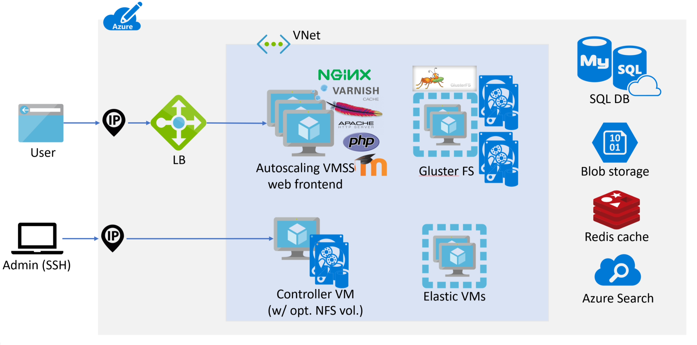

# Moodle migration architecture and templates

A Moodle migration to Azure includes the following tasks:

1. Deploy Azure infrastructure with Azure Resource Manager (ARM) templates.
1. [Download and install AzCopy](./migration-start.md#download-and-install-azcopy-on-the-controller-vm).
1. [Copy the Moodle backup archive to the controller virtual machine](./migration-start.md#copy-the-moodle-archive-to-the-controller-vm) instance in the Azure Resource Manager deployment.
1. [Migrate the Moodle application and configuration](./migration-start.md#import-the-moodle-database-to-azure).
1. [Set up the Moodle controller instance and worker nodes](./azure-infra-config.md).
1. [Configure PHP and the web server](./azure-infra-config.md).

This article describes Moodle Azure infrastructure options, and how to deploy Azure resources by using an ARM template that offers your choice of Azure functionality.

## Azure infrastructure

The following diagram shows an overview of Azure Moodle infrastructure resources:



## ARM template options

To deploy Moodle resources on Azure, you can use a fully configurable ARM template or one of several predefined ARM templates. A fully configurable deployment gives you the most flexibility and deployment choices. You can find the fully configurable template and the predefined templates at the [Moodle GitHub repository](https://github.com/Azure/Moodle).

A predefined deployment template uses one of four predefined Moodle sizes: minimal, short-to-mid, large, or maximal.

- *Minimal deployment* requires only two virtual machines (VMs), so it works with an Azure free trial subscription. This deployment uses network file system (NFS), MySQL, and a smaller autoscale web front-end VM SKU with one vCore. This template has a fast deployment time of under 30 minutes.

  [](https://portal.azure.com/#create/Microsoft.Template/uri/https%3A%2F%2Fraw.githubusercontent.com%2FAzure%2FMoodle%2Fmaster%2Fazuredeploy-minimal.json)

- *Small-to-mid deployment* supports up to 1,000 concurrent users. This deployment uses NFS, without high availability, and MySQL on eight vCores. This deployment doesn't include options like Elasticsearch or Azure Cache for Redis.

  [](https://portal.azure.com/#create/Microsoft.Template/uri/https%3A%2F%2Fraw.githubusercontent.com%2FAzure%2FMoodle%2Fmaster%2Fazuredeploy-small2mid-noha.json)

- *Large, high-availability deployment* supports more than 2,000 concurrent users. This deployment uses Azure Files, MySQL with 16 vCores, and Azure Cache for Redis without other options like Elasticsearch.

  [](https://portal.azure.com/#create/Microsoft.Template/uri/https%3A%2F%2Fraw.githubusercontent.com%2FAzure%2FMoodle%2Fmaster%2Fazuredeploy-large-ha.json)

- *Maximal* deployment uses Azure Files, MySQL with the highest SKU, Azure Cache for Redis, Elasticsearch on three VMs, and large storage sizes for both data disks and databases.

  [](https://portal.azure.com/#create/Microsoft.Template/uri/https%3A%2F%2Fraw.githubusercontent.com%2FAzure%2FMoodle%2Fmaster%2Fazuredeploy-maximal.json)

## Deploy the template

To deploy one of the predefined ARM templates:

1. In the preceding section, select the **Deploy to Azure** button for the deployment you want. This action takes you to the Azure portal.

1. On the **Custom deployment** page in the Azure portal, complete the mandatory **Subscription**, **Resource group**, **Region**, and **SSH Public Key** fields. For information on how to add the SSH key, see [Generating a new SSH key and adding it to the ssh-agent](https://docs.github.com/free-pro-team@latest/github/authenticating-to-github/generating-a-new-ssh-key-and-adding-it-to-the-ssh-agent).

   :::image type="content" source="images/custom-deployment.png" alt-text="Screenshot showing the Azure Custom deployment screen for a Moodle deployment ARM template." border="false":::

1. Select **Review + create**.

### Edit the template

The predefined ARM templates deploy the following default software versions:

- Ubuntu: 18.04 LTS
- PHP: 7.4
- Moodle: 3.8

If your on-premises PHP and Moodle versions differ from the preceding values, update the template versions to match by following these steps:

1. In the Azure portal, on the ARM template **Custom deployment** page, select **Edit template**.

1. In the **resources** section of the template, under **parameters**, add parameters for your Moodle and PHP versions.

   ```json
   "phpVersion":       { "value": "7.2" },
   "moodleVersion":    { "value": "MOODLE_38_STABLE"}
   ```

   For example, for Moodle 3.9, the `moodleVersion` value should be `MOODLE_39_STABLE`.

   :::image type="content" source="./images/edit-template.png" alt-text="Screenshot showing the Edit template page for a Moodle deployment ARM template." border="false":::

1. Select **Save**.

## Next steps

Continue to [Moodle migration resources](./migration-resources.md) for information about the resources that the ARM template deploys to Azure.
