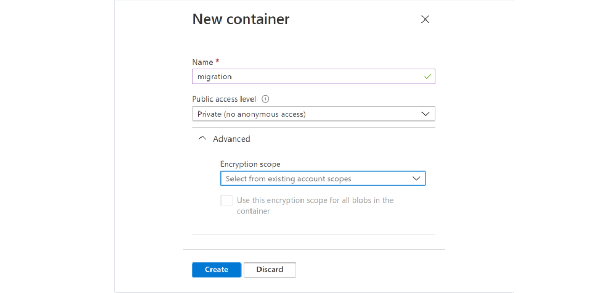
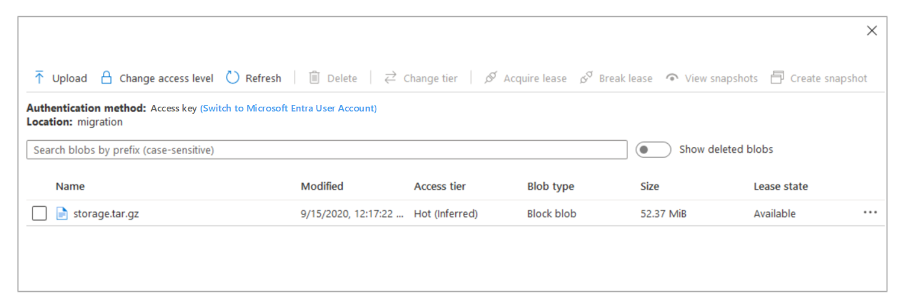

# How to prepare for a Moodle migration

## Pre-migration tasks

Exporting data from on-premises to Azure involves the following tasks:

- Install the Azure CLI.
- Create a subscription.
- Create a resource group.
- Create a storage account.
- Back up on-premises data.
- Download and install AzCopy.
- Copy archived files to Azure Blob.

## Install the Azure CLI

- Install Azure CLI on a host inside the on-premises infrastructure for all Azure-related tasks.

  ```bash
   curl -sL https://aka.ms/InstallAzureCLIDeb | sudo bash
  ```
        
- Log in to your Azure account.

  ```bash
  az login
  ```

- The az login command: Azure CLI will likely launch an instance or a tab inside of your default web browser and prompt you to log in to Azure with your Microsoft account. If the browser launch doesn't happen, open a new page at [https://aka.ms/devicelogin](https://aka.ms/devicelogin), and enter the authorization code displayed in your terminal.

-  To use the command line, enter the following command:

  ```bash
  az login -u <username> -p <password>
  ```
    
## Create a subscription

Skip this step if you have a subscription. If you don't have a subscription, you can choose to [create one within the Azure Portal](https://ms.portal.azure.com/#blade/Microsoft_Azure_Billing/SubscriptionsBlade) or opt for a [pay-as-you-go](https://azure.microsoft.com/offers/ms-azr-0003p/) subscription.

- To create the subscription with the Azure portal, navigate to **Subscriptions** from the **Home** section.

  

- This command sets the subscription:

  ```bash
  az account set --subscription "Subscription Name"

  Example: az account set --subscription "ComputePM LibrarySub"
  ```

## Create a resource group

Once the subscription is set up, you need to create a resource group. One option is to use Azure portal to create it. Navigate to **Home** section, search for **Resource group**, select it, fill in the mandatory fields, and select on **Create**.


Alternatively, you can use the Azure CLI to create a resource group.

- Provide the same default location from the previous steps.

  ```bash
  az group create -l location -n name -s Subscription_NAME_OR_ID
  ```

- Update the screenshot and subscription name with the sample test account.

  Example: az group create -l eastus -n manual_migration -s ComputePM LibrarySub

- In the previous step, a resource group is created as a "manual_migration". Use the same resource group in further steps.

Explore [location in Azure](https://azure.microsoft.com/global-infrastructure/data-residency/) for more information.

## Create a storage account

The next step is to [create a storage account](https://ms.portal.azure.com/#create/Microsoft.StorageAccount) within the resource group that's been created.
Storage accounts can be created with the Azure portal or the Azure CLI.

- To create with the portal, navigate to it, search for the storage account, and select the **Add** button. After filling in the mandatory fields, select **Create**.

  

- Alternatively, you can use the Azure CLI:

  ```bash
  az storage account create -n storageAccountName -g resourceGroupName --sku Standard_LRS --kind BlobStorage -l location
  ```

  Example: az storage account create -n onpremisesstorage -g manual_migration --sku Standard_LRS --kind BlobStorage -l eastus

- In the previous command, --kind Indicates the type of storage account. Once the storage account "onpremisesstorage" is created, this is used as the destination to take the on-premises backup.

## Back up on-premises data

- Before backing up on-premises data, enable **Maintenance mode** for the Moodle site. Run the following command from an on-premises virtual machine:

  ```bash
  sudo /usr/bin/php admin/cli/maintenance.php --enable
  ```

- Run the following command to check the status of the Moodle site:
            
  ```bash
  sudo /usr/bin/php admin/cli/maintenance.php
  ```

- When backing up on-premises Moodle and moodledata files, configurations, and databases, back up to a single directory. The following diagram summarizes this:

  

- To copy all data, create an empty storage directory in any desired location:

  ```bash
  sudo -s

  For example, the location is /home/azureadmin.

  cd /home/azureadmin
  mkdir storage
  ```

### Back up Moodle and moodledata

- The Moodle directory consists of site HTML content. Moodledata contains Moodle site data.

- The commands to copy Moodle and moodledata are:

  cp -R /var/www/html/moodle /home/azureadmin/storage/
  cp -R /var/moodledata /home/azureadmin/storage/
  ```

### Backup PHP and web server configurations

- Copy the PHP configuration files like php-fpm.conf, php.ini, pool.d, and conf.d directory to the phpconfig directory under the configuration directory.

- Copy the ngnix configurations like nginx.conf and sites-enabled/dns.conf to the nginxconfig directory under the configuration directory.

  ```bash
  cd /home/azureadmin/storage
  mkdir configuration
  ```

- The commands to copy nginx and PHP configurations are:

  cp -R /etc/nginx /home/azureadmin/storage/configuration/nginx
  cp -R /etc/php /home/azureadmin/storage/configuration/php
            

### Create a backup of the database

- If you already have mysql-client installed, skip the step to install it. If you don't have mysql-client, now is the time to do this:

  ```bash
  sudo -s
  ```

- Run the following command to check whether or not mysql-client is installed:

  mysql -V
  ```

- If the mysql-client isn't installed, run the following command:

  sudo apt-get install mysql-client
  ```	

- This command will allow to you to back up the database:

  mysqldump -h dbServerName -u dbUserId -pdbPassword dbName > /home/azureadmin/storage/database.sql

- Replace dbServerName, dbUserId, dbPassword, and dbName with on-premises database details.

- Create an archive storage.tar.gz file of backup directory:

  ```bash
  cd  /home/azureadmin/
  tar -zcvf storage.tar.gz storage
  ```

## Download and install AzCopy

Execute the following commands to install AzCopy:

  ```bash
  sudo -s
  wget https://aka.ms/downloadazcopy-v10-linux
  tar -xvf downloadazcopy-v10-linux
  sudo rm /usr/bin/azcopy
  sudo cp ./azcopy_linux_amd64_*/azcopy /usr/bin/
  ```

## Copy archived files to Azure Blob

Use AzCopy to copy archived on-premises files to Azure Blob.

- To use AzCopy, generate the SAS token first. Go to the created **Storage account resource**, and navigate to **Shared access signature** in the left panel.

  

- Select **Container** and checkboxes, and set the start and expiry date of the SAS token. Select **Generate SAS and connection string**.

  
        
- Copy and save the SAS token for future use.

- The command to create a container in the storage account:

  ```bash
  az storage container create --account-name <storageAccontName> --name <containerName> --auth-mode login
  ```

  Example: az storage container create --account-name onpremisesstorage --name migration --auth-mode login

  --auth-mode login means authentication mode at login. After login, the container will be created.
  ```

- The container can also be created with the Azure portal. Navigate to the same storage account created, select the container, and then select the **Add** button.
            
- After entering the mandatory container name, select the **Create** button.
    
  
    
- The command to copy archive file to blob storage:

  ```bash
  sudo azcopy copy '/home/azureadmin/storage.tar.gz' 'https://<storageAccountName>.blob.core.windows.net/<containerName>/<SAStoken>'

  Example: azcopy copy '/home/azureadmin/storage.tar.gz' 'https://onpremisesstorage.blob.core.windows.net/migration/?sv=2019-12-12&ss='
  ```

  

- There should now be a copy of your archive inside of the Azure Blob account.

## Next steps

Continue to [Moodle migration tasks, architecture, and template](/migration-arch.md) for more information about the Moodle migration process.