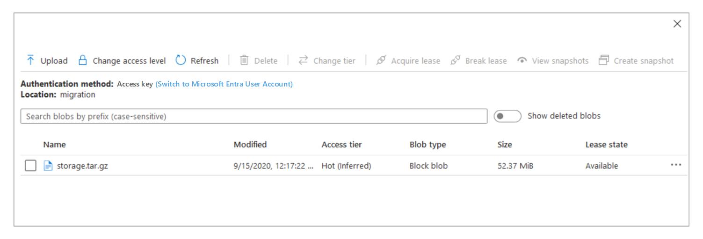

<!-- cspell:ignore downloadazcopy mysqldump onpremisesstorage zcvf -->

# How to prepare for a Moodle migration

Before you migrate a Moodle application from your on-premises environment to Azure, you should export your data. This guide explains the steps of the export process.

## Install the Azure CLI

Follow these steps to set up the Azure CLI in your on-premises environment:

1. On a host that you can use for Azure tasks, enter this command to install the Azure CLI:

   ```bash
   curl -sL https://aka.ms/InstallAzureCLIDeb | sudo bash
   ```

1. In the Azure CLI, enter this command to sign in to your Azure account:

   ```bash
   az login -u <username> -p <password>
   ```

1. If the Azure CLI opens a browser window or tab, sign in to Azure with your Microsoft account. If a browser window doesn't open, go to [https://aka.ms/devicelogin](https://aka.ms/devicelogin), and enter the authorization code displayed in your terminal.

## Create a subscription

Skip this step if you already have an Azure subscription.

If you don't have an Azure subscription, you can [create one for free](https://azure.microsoft.com/free/). You can also either set up a [pay-as-you-go subscription](https://azure.microsoft.com/offers/ms-azr-0003p/), or you can create a subscription in the Azure portal.

- To use the Azure portal to create a subscription, open [**Subscriptions**](https://ms.portal.azure.com/#blade/Microsoft_Azure_Billing/SubscriptionsBlade), select **Add**, and enter the required information.

  

- To use the Azure CLI to create a subscription, enter this command:

  ```azurecli
  az account set --subscription '<subscription name>'
  ```

 An example command is:

  `az account set --subscription 'ComputePM LibrarySub'`

## Create a resource group

Once you set up your Azure subscription, create a resource group in Azure using either the Azure portal or the Azure CLI.

- To use the Azure portal, follow these steps:

  1. Open [**Resource Groups**](https://ms.portal.azure.com/#blade/HubsExtension/BrowseResourceGroups), and select **Add**.

  1. Enter your subscription name, a resource group name, and a region. See [Data residency in Azure](https://azure.microsoft.com/global-infrastructure/data-residency/) for a list of available regions. Make a note of the name of the resource group that you enter so that you can use that name in later steps.

  1. Select **Review + create**.

  

- To use the Azure CLI to create a resource group, enter this command:

  ```azurecli
  az group create -l <region> -n <resource group name> -s '<subscription name>'
  ```

  For example, enter:

  `az group create -l eastus -n manual_migration -s 'ComputePM LibrarySub'`

  The value you provide with the `-l` parameter specifies the default location. Use the same location that you used in previous steps. Make a note of the name of the resource group that you create, and use that name in later steps.

## Create a storage account

Next, create a storage account within the resource group that you just created. You'll use this storage account to back up your on-premises Moodle data.

You can use either the Azure portal or the Azure CLI to create a storage account.

- To use the Azure portal, follow these steps:

  1. Go to [**Create storage account**](https://ms.portal.azure.com/#create/Microsoft.StorageAccount).

  1. Enter the following information:

     - Your Azure subscription name
     - The name of the resource group that you just created
     - A storage account name
     - Your region

  1. For **Account kind**, select **BlobStorage** from the drop-down list.

  1. For **Replication**, select **Read-access geo-redundant storage (RA-GRS)** from the drop-down list.

  1. Select **Review + create**.

  

- To use the Azure CLI to create the storage account, enter this command:

  ```azurecli
  az storage account create -n <storage account name> -g <resource group name> --sku <storage account SKU> --kind <storage account type> -l <region>
  ```

  An example command is:

  `az storage account create -n onpremisesstorage -g manual_migration --sku Standard_LRS --kind BlobStorage -l eastus`

  The `--kind` parameter specifies the storage account's type.

## Back up on-premises data

Before backing up your on-premises Moodle data, turn on **Maintenance mode** on your Moodle website by following these steps:

1. From the Moodle instance in your on-premises environment, enter this command:

   ```bash
   sudo /usr/bin/php admin/cli/maintenance.php --enable
   ```

2. Enter the following command to check the status of your Moodle website:

   ```bash
   sudo /usr/bin/php admin/cli/maintenance.php
   ```

You should back up on-premises Moodle and moodledata files, configurations, and databases to a single directory. The following diagram summarizes this recommendation:


### Create a storage directory

Before copying your data, create an empty storage directory in any desired location. For example, if the location is `/home/azureadmin`, enter these commands:

  ```bash
  sudo -s
  cd /home/azureadmin
  mkdir storage
  ```

### Back up Moodle directories

In your on-premises environment, the `moodle` directory contains website HTML content. The `moodledata` directory contains Moodle website data.

Enter these commands to copy files from the `moodle` and `moodledata` directories into the storage directory:

  ```bash
  cp -R /var/www/html/moodle /home/azureadmin/storage/
  cp -R /var/moodledata /home/azureadmin/storage/
  ```

### Back up PHP and web server configurations

To back up configuration files, follow these steps:

1. Enter these commands to create a new directory under your storage directory:

   ```bash
   cd /home/azureadmin/storage
   mkdir configuration
   ```

2. Enter these commands to copy the PHP and NGINX configuration files:

   ```bash
   cp -R /etc/php /home/azureadmin/storage/configuration/
   cp -R /etc/nginx /home/azureadmin/storage/configuration/
   ```

   The `php` directory stores PHP configuration files, such as `php-fpm.conf`, `php.ini`, `pool.d`, and `conf.d`. The `nginx` directory stores ngnix configurations, such as `nginx.conf` and `sites-enabled/dns.conf`.

### Back up the database

Follow these steps to back up your database:

1. Enter these commands to check whether mysql-client is installed:

   ```bash
   sudo -s
   mysql -V
   ```

2. If mysql-client is installed, skip this step. Otherwise, enter this command to install mysql-client:

   ```bash
   sudo apt-get install mysql-client
   ```

3. Enter this command to back up the database:

   ```bash
   mysqldump -h <database server name> -u <database user ID> -p<database password> <database name> > /home/azureadmin/storage/database.sql
   ```

   For `<database server name>`, `<database user ID>`, `<database password>`, and `<database name>`, use the values that your on-premises database uses.

### Create an archive

Enter this command to create an archive file, `storage.tar.gz`, for your backup directory:

```bash
cd /home/azureadmin/ tar -zcvf storage.tar.gz storage
```

## Download and install AzCopy

Enter the following commands to install AzCopy:

```bash
sudo -s
wget https://aka.ms/downloadazcopy-v10-linux
tar -xvf downloadazcopy-v10-linux
sudo rm /usr/bin/azcopy
sudo cp ./azcopy_linux_amd64_*/azcopy /usr/bin/
```

## Copy archived files to Azure Blob Storage

Follow these steps to use AzCopy to copy archived on-premises files to Azure Blob Storage.

### Generate a security token

To generate a shared access signature (SAS) token for AzCopy, follow these steps:

1. In the Azure portal, go to the page for the storage account you created earlier.

1. In the left panel, select **Shared access signature**.

   

1. Under **Allowed resource types**, select **Container**.

1. Under **Start and expiry date/time**, enter a start and end time for the SAS token.

1. Select **Generate SAS and connection string**.

   

1. Make a copy of the SAS token to use in later steps.

### Create a container

Create a container in the storage account. You can either use the Azure CLI or the Azure portal for this step.

- To use the Azure CLI, enter this command:

  ```bash
  az storage container create --account-name <storage account name> --name <container name> --auth-mode login
  ```

  An example command is:

  `az storage container create --account-name onpremisesstorage --name migration --auth-mode login`

  When you use the `--auth-mode` parameter with a value of `login`, Azure uses your credentials for authentication and then creates the container.

- To use the Azure portal to create the container, follow these steps:

  1. In the portal, go to the page for the storage account you created earlier.

  1. Select **Container**, and then select **Add**.

  1. Enter a name for the container, and then select **Create**.

     

### Copy the archive file to Azure Blob Storage

Enter this command to copy your archive file to the container that you created in Blob Storage:

```bash
sudo azcopy copy /home/azureadmin/storage.tar.gz 'https://<storage account name>.blob.core.windows.net/<container name>/<SAS token>'
```

An example command is:

`azcopy copy /home/azureadmin/storage.tar.gz 'https://onpremisesstorage.blob.core.windows.net/migration/?sv=2019-12-12&ss='`

Your Blob Storage account should now contain a copy of your archive.



## Next steps

Continue to [Moodle migration architecture and templates](./migration-arch.md).
