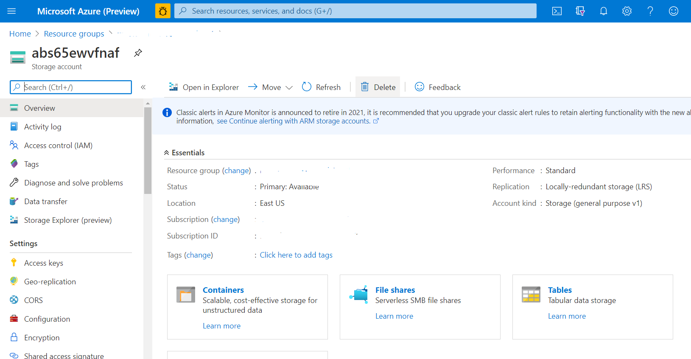

# Moodle migration resources

When you use an Azure Resource Manager (ARM) template to migrate Moodle, the deployment creates resources within Azure. As part of this deployment process, additional deployments automatically run through child templates. The following sections describe these deployments and the resources they create.

## Network template

The network template deployment creates the following resources:

- [Azure Virtual Network](/azure/virtual-network/virtual-networks-overview): A representation of your own network in the cloud. Virtual network is a logical isolation of the Azure cloud that's dedicated to your subscription. When you create a virtual network, your services and virtual machines within it can communicate directly and securely in the cloud. The virtual network that the network template creates includes the virtual network name, API version, location, DNS server name, and address space. The address space contains a range of IP addresses that subnets can use.

- [Network security group (NSG)](/azure/virtual-network/network-security-groups-overview): A networking filter, or firewall, that contains a list of security rules. These rules allow or deny network traffic to resources connected to a virtual network.

- [Network interface](/azure/virtual-network/virtual-network-network-interface): An interface that an Azure virtual machine can use to communicate with the internet, Azure, and on-premises resources.

- [Subnet](/azure/virtual-network/virtual-network-manage-subnet): A smaller network inside a large network. Subnets are also known as subnetworks. By default, an IP address in a subnet can communicate with any other IP address inside the virtual network.

- [Public IP address](/azure/virtual-network/public-ip-addresses#:~:text=public%20ip%20addresses%20enable%20azure,IP%20assigned%20can%20communicate%20outbound): An IP address that an Azure resource uses to communicate with the internet. The address is dedicated to the Azure resource.

- [Azure Load Balancer](/azure/virtual-machines/windows/tutorial-load-balancer#:~:text=an%20azure%20load%20balancer%20is,traffic%20to%20an%20operational%20vm): A load balancer that efficiently distributes network or application traffic across multiple servers in a server farm. Load balancer ensures high availability and reliability by only sending requests to servers that are online.

- [Azure Application Gateway](/azure/application-gateway/overview): An alternative to Load Balancer. All four predefined ARM templates deploy Load Balancer. If you use a fully configurable deployment instead of an ARM template, you can choose Application Gateway instead of Load Balancer. Application Gateway is a web-traffic load balancer that you can use to manage traffic to your web applications. Application Gateway can make routing decisions based on the additional attributes of an HTTP request, such as a URI path or host header.

- [Azure Cache for Redis](/azure/azure-cache-for-redis/cache-overview): An in-memory data store based on the open-source software redis. Redis improves the performance and scalability of an application that heavily stores back-end data. It can process large volumes of application requests by keeping frequently accessed data in the server memory. This data can be written to and read from quickly.

## Storage template

The storage account template deployment creates an Azure Storage account of type FileStorage. The account has premium performance, locally redundant storage (LRS) replication, and 1 terabyte (TB) of storage. The predefined template is configured so that a storage account with Azure Files creates file shares.

An [Azure Storage account](/azure/storage/common/storage-account-overview) contains Azure Storage data objects, such as blobs, files, queues, tables, and disks. The storage account provides a unique namespace for your Azure Storage data that's accessible from anywhere in the world over HTTP or HTTPS. The following types of Azure storage accounts are available: General-Purpose v1, General-Purpose v2, BlockBlobStorage, FileStorage, and Blob Storage. The replication type can be geo-redundant or LRS and zone-redundant storage. The performance types are standard and premium, and an individual storage account can store up to 500 TB of data, like any other Azure service.

ARM templates support the following storage account types:

- [Network File System (NFS)](/windows-server/storage/nfs/nfs-overview): An account type that a remote host can use to mount file systems over a network. The remote host can interact with those file systems as though they're mounted locally. With this design, system administrators can consolidate resources into centralized servers in the network.

- [GlusterFS](/azure/virtual-machines/workloads/sap/high-availability-guide-rhel-glusterfs): An open-source distributed file system that can scale out in building-block fashion to store multiple petabytes of data.

- [Azure Files](/azure/storage/files/storage-files-introduction): The only public cloud file storage that delivers secure, SMB-based, and fully managed cloud file shares that can also be cached on-premises for performance and compatibility. For NFS and GlusterFS, the replication is standard LRS, and the storage type is general-purpose v1. For Azure Files, the replication is premium LRS, and the type is FileStorage.

These storage mechanisms differ depending on which deployment you choose. NFS and GlusterFS create a container, and Azure Files creates a file share. For minimal and short-to-mid Moodle sizes, the template supports NFS. For large and maximal sizes, the template supports Azure Files. To access the containers and file shares, go to the Azure portal, and select the storage account in the resource group.

## Database template

The database template deployment creates an [Azure Database for MySQL](/azure/mysql/) server. Azure Database for MySQL is easy to set up, manage, and scale. It automates the management and maintenance of your infrastructure and database server, including routine updates, backups, and security. Azure Database for MySQL is built with the latest community edition of MySQL, including versions 5.6, 5.7, and 8.0. To access the database server that the template creates, go to the Azure portal and open the resource group that the deployment process provides. Then go to **Azure Database for MySQL server**. The template gives the database server a server name, a server admin login name, a MySQL version, and a performance configuration.

## Virtual machine template

The virtual machine template deployment designates a virtual machine as a controller virtual machine. The operating system for the controller virtual machine is Ubuntu 18.04.

Virtual machine extensions are small applications that provide post-deployment configuration and automation tasks on [Azure Virtual Machines](/azure/virtual-machines/extensions/overview). A virtual machine extension runs a shell script that installs Moodle on the controller virtual machine and captures log files. It creates the `stderr` and `stdout` log files in the `/var/lib/waagent/custom-script/download/0/` folder. You can view these files as a root user.

## Scale set template

The scale set template deployment creates a [virtual machine scale set](/azure/virtual-machine-scale-sets/overview). By using a virtual machine scale set, you can deploy and manage a set of autoscaling virtual machines. You can scale the number of virtual machines in the scale set manually or define rules to autoscale based on resource usage like [CPU](/visualstudio/profiling/average-cpu-utilization), memory demand, or network traffic. When an instance scales up, it deploys a virtual machine. Then a shell script runs that installs Moodle prerequisites and sets up cron jobs. A virtual machine in a scale set has a private IP address. For more information on viewing the virtual machine instances in a scale set and how to access these instances, see the [virtual machine scale set documentation](/azure/virtual-machine-scale-sets/tutorial-create-and-manage-cli#view-the-vm-instances-in-a-scale-set).

## Next steps

Continue to [Moodle manual migration steps](./migration-start.md) for the next steps in the Moodle migration process.
