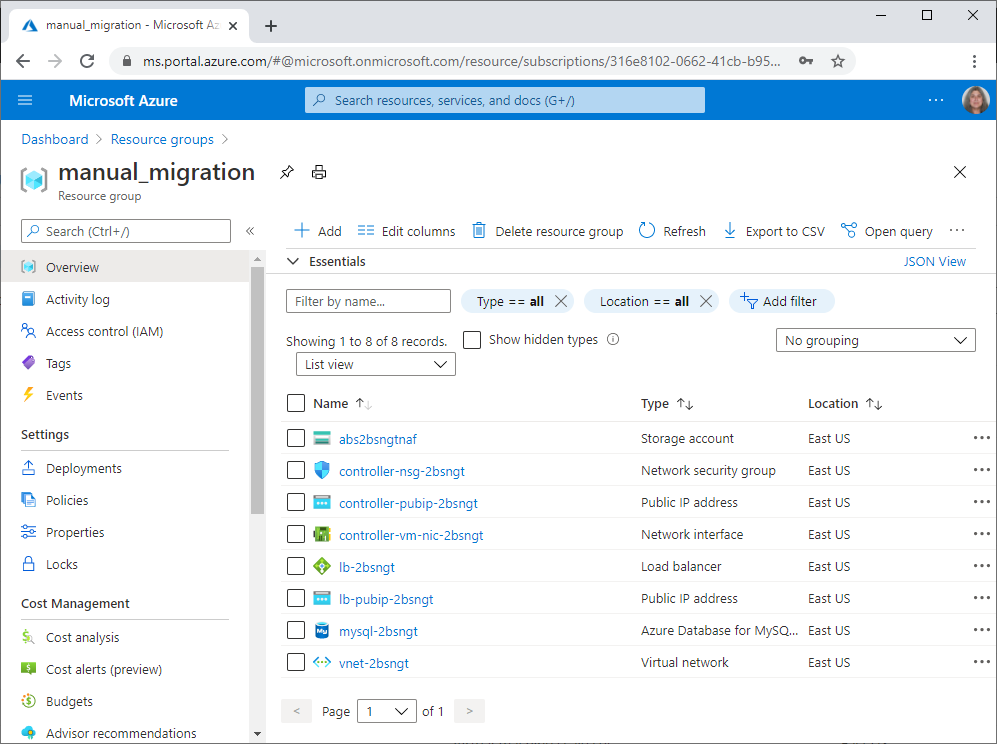
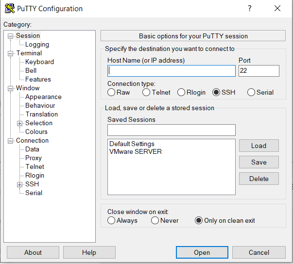
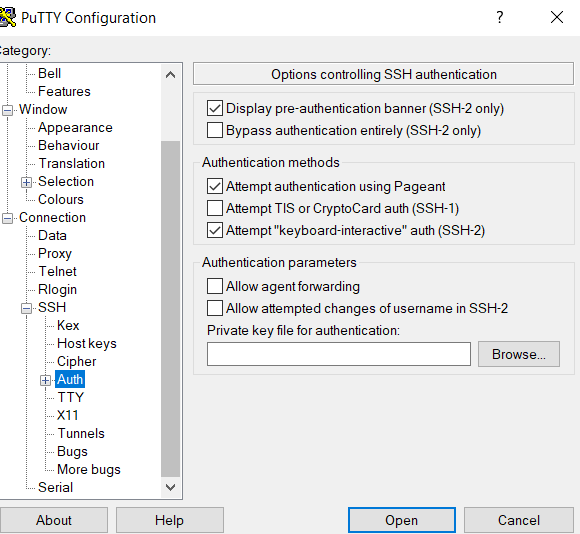
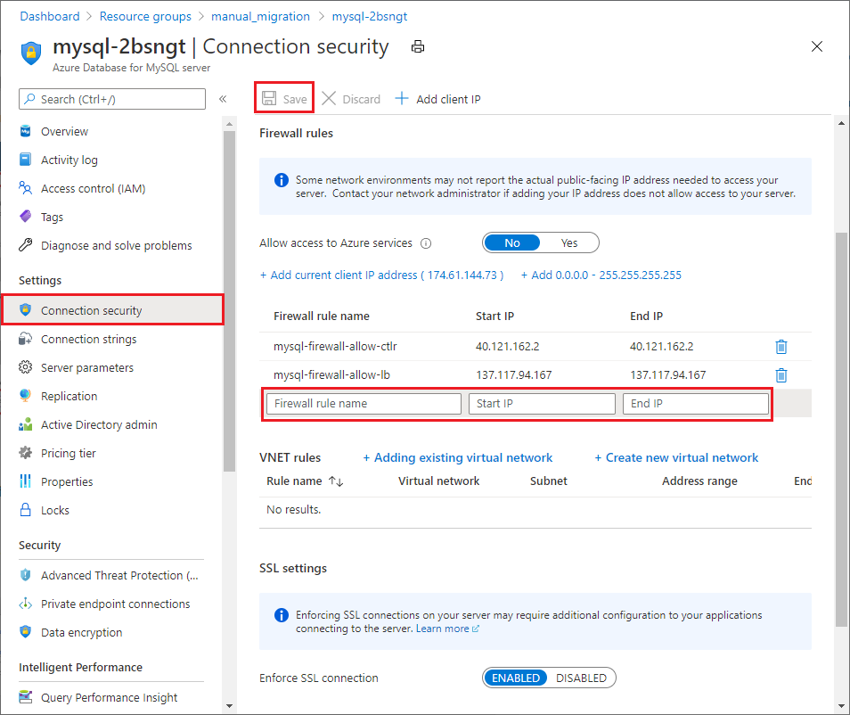
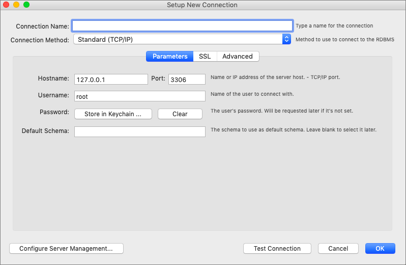

# Moodle manual migration steps

This article describes the steps to migrate the on-premises Moodle archive to Azure. The contents of this Moodle archive include the Moodle application, relevant configuration, and a copy of the database from the on-premises Moodle deployment. Once you successfully import the on-premises backup into the Azure infrastructure, you carry out configuration updates for Moodle.

Before you begin this process, make sure to complete all the steps in these articles:

- [How to prepare for a Moodle migration](./migration-pre.md)
- [Moodle migration architecture and templates](./migration-arch.md)

After the Azure Resource Manager (ARM) template deployment finishes, sign in to the [Azure portal](https://portal.azure.com/) and go to the resource group you created as part of the deployment process. Review the list of newly created infrastructure resources. The created resources look similar to the following image, depending on the ARM template you used for deployment.



## Copy the Moodle archive

The first step in the migration process is to copy the Moodle backup archive from Azure Blob Storage to the controller virtual machine (VM) for the Moodle deployment. This is the same archive you created in [Create an archive](./migration-pre.md#create-an-archive).

### Sign in to the controller virtual machine

1. Use a free, open-source terminal emulator or serial console tool like [PuTTY](https://www.putty.org/) to sign in to a controller VM.

1. In **PuTTY Configuration**, enter the public IP address of the controller VM as the **Host Name**.

1. In the left navigation, expand **SSH**.

   

1. Select **Auth**, and find the SSH key file you used to deploy the Azure infrastructure with the ARM template.

1. Select **Open**. For user name, enter **azureadmin**, as it's hard-coded in the template.

   

For more information about PuTTY, see [PuTTY general FAQ/troubleshooting questions](https://documentation.help/PuTTY/faq.html).

<!-- cspell:ignore downloadazcopy -->

### Download and install AzCopy on the controller VM

After you sign in to the controller VM, run the following commands to install AzCopy:

  ```bash
  sudo -s
  wget https://aka.ms/downloadazcopy-v10-linux
  tar -xvf downloadazcopy-v10-linux
  sudo rm /usr/bin/azcopy
  sudo cp ./azcopy_linux_amd64_*/azcopy /usr/bin/
  ```

### Back up the current configuration

Before you start the import process, it's recommended to back up the default or current configuration.

1. Create a backup directory:

   ```bash
   cd /home/azureadmin/
   mkdir -p backup
   mkdir -p backup/moodle
   mkdir -p backup/moodle/html
   ```

1. Create backups of the `moodle` and `moodledata` directories:

   ```bash
   mv /moodle/html/moodle /home/azureadmin/backup/moodle/html/moodle
   mv /moodle/moodledata /home/azureadmin/backup/moodle/moodledata
   ```

<!-- cspell:ignore zxvf -->

### Copy the Moodle archive to the controller VM

1. Run the following commands to download the compressed `storage.tar.gz` backup file from Azure Blob Storage to the controller VM `/home/azureadmin/` directory:

   ```bash
   sudo -s
   cd /home/azureadmin/
   azcopy copy "https://<storageaccount>.blob.core.windows.net/<container>/<BlobDirectoryName><SAStoken>" "/home/azureadmin/storage.tar.gz"
   ```

   Substitute your own storage account and SAS token values. For example:

   `azcopy copy "https://onpremisesstorage.blob.core.windows.net/migration/storage.tar.gz?sv=2019-12-12&ss=" "/home/azureadmin/storage.tar.gz"`

1. Extract the compressed file to a directory.

   ```bash
   cd /home/azureadmin
   tar -zxvf storage.tar.gz
   ```

### Import Moodle files to Azure

Once extracted, you can find the `storage` directory under `home/azureadmin`. This `storage` directory contains `moodle`, `moodledata`, and `configuration` directories, and a database backup file. You copy each of these files and directories to the target locations in the following steps:

1. Copy the `moodle` and `moodledata` directories to a shared location under `/moodle`.

   ```bash
   cp -rf /home/azureadmin/storage/moodle /moodle/html/
   cp -rf /home/azureadmin/storage/moodledata /moodle/moodledata
   ```

## Import the Moodle database to Azure

Connect to the Azure Database for MySQL server, and import the on-premises Moodle database archive to Azure Database for MySQL.

### Connect to the MySQL server

Azure Database for MySQL instances are protected by a firewall. All connections to the server and the databases inside the server are rejected by default. Before connecting to Azure Database for MySQL for the first time, configure the firewall to allow access for the controller VM's public IP address or IP address range.

You can configure the firewall by using the Azure command line (Azure CLI) or the Azure portal.

Run the following Azure CLI command, substituting your own values for the placeholders:

```azurecli
az mysql server firewall-rule create --resource-group <myresourcegroup> --server <mydemoserver> --name <AllowMyIP> --start-ip-address <192.168.0.1> --end-ip-address <192.168.0.1>
```

Or, in the Azure portal, select the Azure Database for MySQL server from your deployed Moodle infrastructure resources. In the server page's left navigation, select **Connection security**.

You can add allowed IP addresses and configure firewall rules here. Select **Save** after you've created the rules.



You can now connect to the MySQL server by using the [`mysql`](https://dev.mysql.com/doc/refman/8.0/en/mysql.html) command-line tool or [MySQL Workbench](https://dev.mysql.com/doc/workbench/en/).



To get connection information, go to your MySQL server's **Overview** page in the Azure portal. Use the copy icons next to each field to copy the **Server name** and **Server admin login name**.

For example, your server name might be `mydemoserver.mysql.database.azure.com`, and the server admin login name might be `myadmin@mydemoserver`.

You also need the password. If you need to reset the password, select **Reset password** in the menu bar.

Use these database server details in the following sections.

### Import the Moodle database to Azure Database for MySQL

1. Create a MySQL database to import the on-premises database into:

   ```bash
   mysql -h $server_name -u $server_admin_login_name -p$admin_password -e "CREATE DATABASE $moodledbname CHARACTER SET utf8;"
   ```

1. Assign the correct permissions to the database:

   ```bash
   mysql -h $server_name -u $server_admin_login_name -p$admin_password -e "GRANT ALL ON $moodledbname.* TO '$server_admin_login_name' IDENTIFIED BY '$admin_password';"
   ```

1. Import the database:

   ```bash
   mysql -h $server_name -u $server_admin_login_name -p$admin_password $moodledbname < /home/azureadmin/storage/database.sql
   ```

## Update configurations

After importing the on-premises Moodle database archive to Azure Database for MySQL, update the following configurations on the controller VM as necessary:

- Update the Moodle config file.
- Configure directory permissions.
- Configure PHP and NGINX web servers.
- Update the DNS name and other variables.
- Install any missing PHP extensions.
- Ensure the web server instances on the controller VM are stopped.
- Copy the config files to a shared location for copying to virtual machine scale sets.

### Update the Moodle config file

Update the database detail parameters in the Moodle configuration file `/moodle/config.php`.

To get the DNS name for this task:

1. In the Azure portal, select the **Load Balancer public IP address** from your deployed Moodle infrastructure resources.

1. On the **Overview** page, select the copy icon next to the **DNS name**.

To update the `config.php` file:

1. Enter the following commands to edit `config.php` in the `nano` editor:

   ```bash
   cd /moodle/html/moodle/
   nano config.php
   ```

1. Update the database details in the file, using the values you copied from the Azure portal:

   ```php
   $CFG->dbhost    = 'localhost';                // Change 'localhost' to the server name.
   $CFG->dbname    = 'moodle';                   // Change 'moodle' to the newly created database name.
   $CFG->dbuser    = 'root';                     // Change 'root' to the server admin login name.
   $CFG->dbpass    = 'password';                 // Change 'password' to the server admin login password.
   $CFG->wwwroot   = 'https://on-premises.com';  // Change 'on-premises' to the DNS name.
   $CFG->dataroot  = '/var/moodledata';          // Change the path to '/moodle/moodledata'.
   ```

1. After making the changes, press Ctrl+O to save the file and Ctrl+X to exit the editor.

You can store the on-premises `dataroot` directory at any location.

### Configure directory permissions

- Assign 755 and www-data owner:group permissions to the `moodle` directory.

  ```bash
  sudo chmod 755 /moodle/html/moodle sudo chown -R www-data:www-data /moodle/html/moodle
  ```

- Assign 770 and www-data owner:group permissions to the `moodledata` directory.

  ```bash
  sudo chmod 770 /moodle/moodledata sudo chown -R www-data:www-data /moodle/moodledata
  ```

### Update web config files

Back up and update the NGINX `conf` file:

```bash
sudo mv /etc/nginx/sites-enabled/*.conf /home/azureadmin/backup/
cd /home/azureadmin/storage/configuration/
sudo cp -rf nginx/sites-enabled/*.conf /etc/nginx/sites-enabled/
```

Back up and update the PHP `www.conf` file:

```bash
_PHPVER='/usr/bin/php -r "echo PHP_VERSION;" | /usr/bin/cut -c 1,2,3'
echo $_PHPVER
sudo mv /etc/php/$_PHPVER/fpm/pool.d/www.conf /home/azureadmin/backup/www.conf
sudo cp -rf /home/azureadmin/storage/configuration/php/$_PHPVER/fpm/pool.d/www.conf /etc/php/$_PHPVER/fpm/pool.d/
```

### Update the NGINX configuration variables

Update the Azure cloud DNS name to the on-premises Moodle application's DNS name.

1. Open the NGINX configuration file:

   ```bash
   nano /etc/nginx/sites-enabled/*.conf
   ```

1. The ARM template deployment sets the NGINX server to port 81. Update the `SERVER_PORT` in the file to 81 if it's not 81.

1. Update the `server_name`. For example, for a `server_name on-premises.com`, update `on-premises.com` with the DNS name. In most cases, the DNS name doesn't change in the migration.

1. Update the HTML `root` directory location. For example, update `root /var/www/html/moodle;` to `root /moodle/html/moodle;`.

   The on-premises root directory can be at any location.

1. After making the changes, press Ctrl+O to save the file and Ctrl+X to exit.

<!-- cspell:ignore mbstring mcrypt bcmath -->

### Install any missing PHP extensions

The ARM deployment templates install the following PHP extensions:

- `fpm`
- `cli`
- `curl`
- `zip`
- `pear`
- `mbstring`
- `dev`
- `mcrypt`
- `soap`
- `json`
- `redis`
- `bcmath`
- `gd`
- `mysql`
- `xmlrpc`
- `intl`
- `xml`
- `bz2`

If the on-premises Moodle application has any PHP extensions that aren't on the controller VM, you can install them manually.

To get the list of PHP extensions in the on-premises application, run:

```bash
php -m
```

To install missing extensions, run:

```bash
sudo apt-get install -y php-<extension>
```

### Ensure the web server instances on the controller VM are stopped

1. Restart the web servers.

   ```bash
   sudo systemctl restart nginx
   sudo systemctl restart php$_PHPVER-fpm
   ```

1. Stop the web servers.

   ```bash
   sudo systemctl stop nginx
   sudo systemctl stop php$_PHPVER-fpm
   ```

When a request reaches Azure Load Balancer, it now redirects to virtual machine scale set instances and not to the controller VM.

### Copy configuration files

Copy PHP and web server configuration files to a shared location for later copying to virtual machine scale set instances.

To create the directory for configuration files in a shared location, run:

```bash
mkdir -p /moodle/config
mkdir -p /moodle/config/php
mkdir -p /moodle/config/nginx
```

To copy the PHP and web server configuration files to the shared directory, run:

```bash
cp /etc/nginx/sites-enabled/* /moodle/config/nginx
cp /etc/php/$_PHPVER/fpm/pool.d/www.conf /moodle/config/php
```

## Next steps

Continue to [Set up the Moodle controller instance and worker nodes](./azure-infra-config.md) for the next steps in the Moodle migration process.
