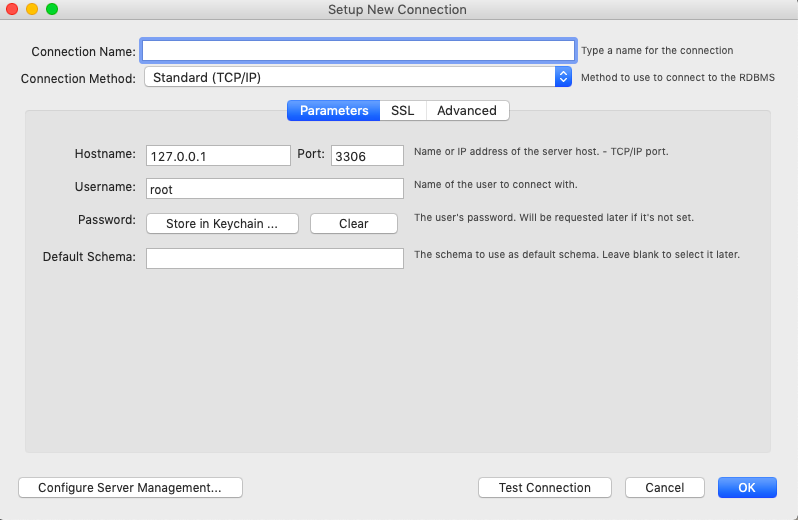

-   ### Manual Moodle migration follow the below steps 
    - After completion of deployment, Login into [Azure](http://portal.azure.com/).
    - Go to the created Resource Group and find all the created resources. 
    - The following image will give some idea on how the resources will be created.
    

-  **Controller Virtual Machine**
    - Login into this controller machine using any of the free open-source terminal emulator or serial console tools. 
        - Copy the public IP of controller Virtual Machine to use as the hostname.
        - Expand SSH in navigation panel and click on Auth and browse the same SSH key file given while deploying the Azure infrastructure using the ARM template.
        - Click on Open and it will prompt for give the username. Give it as azureadmin as it is hard coded in template.
        
        
        - [Putty general FAQ/troubleshooting questions](https://documentation.help/PuTTY/faq.html).
        - Browse and select the SSH key and click on Open button.
        - After the login, run the following set of commands to migrate. 
        
        -   **Download and install AzCopy**
            - Execute the below commands to install AzCopy
                ```bash
                sudo -s
                wget https://aka.ms/downloadazcopy-v10-linux
                tar -xvf downloadazcopy-v10-linux
                sudo rm /usr/bin/azcopy
                sudo cp ./azcopy_linux_amd64_*/azcopy /usr/bin/
                ```
        -   **Copy over the backup archive to the Controller Virtual Machine instance from the ARM deployment.**
            -   Download the compressed backup file(storage.tar.gz) from blob storage to Controller virtual Machine at /home/azureadmin/ location.
                ```bash
                sudo -s
                cd /home/azureadmin/
                azcopy copy 'https://storageaccount.blob.core.windows.net/container/BlobDirectoryName<SASToken>' '/home/azureadmin/'

                # Example: azcopy copy 'https://onpremisesstorage.blob.core.windows.net/migration/storage.tar.gz?sv=2019-12-12&ss=' '/home/azureadmin/storage.tar.gz'
                ```
            - Extract the compressed content to a directory.
                ```bash
                cd /home/azureadmin
                tar -zxvf storage.tar.gz
                ```
    - **Migration of Moodle application and configuration**
        -   Before migrating take a backup of existing configuration.
        -   A backup directory is extracted as storage/ at /home/azureadmin.
        -   This storage directory contains moodle, moodledata and configuration directory along with database backup file. These will be copied to desired locations.
        -   Create a backup directory.
            ```bash
            cd /home/azureadmin/
            mkdir -p backup
            mkdir -p backup/moodle
            mkdir -p backup/moodle/html
            ```
        - Create backup of moodle and moodledata directories.
            ```bash
            mv /moodle/html/moodle /home/azureadmin/backup/moodle/html/moodle
            mv /moodle/moodledata /home/azureadmin/backup/moodle/moodledata
            ```
        - Copy on-premises moodle and moodledata directories to shared location (/moodle).
            ```bash
            cp -rf /home/azureadmin/storage/moodle /moodle/html/
            cp -rf /home/azureadmin/storage/moodledata /moodle/moodledata
            ```

        - Importing the moodle Database to Azure moodle DB.
        -  **Configure firewall:**
			- Azure Databases for MySQL are protected by a firewall. By default, all connections to the server and the databases inside the server are rejected. Before connecting to Azure Database for MySQL for the first time, configure the firewall to add the client machine's public network IP address (or IP address range).

				```bash
				az mysql server firewall-rule create --resource-group myresourcegroup --server mydemoserver --name AllowMyIP --start-ip-address 192.168.0.1 --end-ip-address 192.168.0.1
				```
			- Click your newly created MySQL server, and then click Connection security.

	            
			
            - You can Add My IP or configure firewall rules here. Click on save after you have created the rules.
            - You can now connect to the server using mysql command-line tool or MySQL Workbench GUI tool.

  
        - Get connection information:

            - From the MySQL server resource page, note down Server Name and Server admin login name. You may click the copy button next to each field to copy to the clipboard.

            

        - For example, the server name is mydemoserver.mysql.database.azure.com, and the server admin login is myadmin@mydemoserver.

            - Before importing database, make sure that Azure Database for MySQL server details are handy.
            - Navigate to Azure Portal and go to the created Resource Group.
            - Select the Azure Database for MySQL server resource.
            - In the overview panel find Azure Database for MySQL server details such as Server name, Server admin login name.
            - Reset the password by clicking the Reset Password button at top let of the page.
            - Use above gathered database server details in the below commands.

        - Import the on-premises database to Azure Database for MySQL.
        - Create a database to import on-premises database.
            ```bash  
            mysql -h $server_name -u $server_admin_login_name -p$admin_password -e "CREATE DATABASE $moodledbname CHARACTER SET utf8;"
            ```
        - Assign right permissions to database.
            ```bash
            mysql -h $server_name -u $server_admin_login_name -p$admin_password -e "GRANT ALL ON $moodledbname.* TO '$server_admin_login_name' IDENTIFIED BY '$admin_password';"
            ``` 
        - Import the database.
            ```bash
            mysql -h $server_name -u $server_admin_login_name -p$admin_password $moodledbname < /home/azureadmin/storage/database.sql
            ```
        
        - [Database general FAQ/troubleshooting questions](https://docs.azure.cn/en-us/mysql-database-on-azure/mysql-database-tech-faq)

        - Update the database details in moodle configuration file (/moodle/config.php).
            - Update the following parameters in config.php.
            - Prior to this make sure that DNS name is handy.
                - Navigate to Azure Portal and go to the created Resource group.
                - Find the Load Balancer public IP and get the DNS name from overview panel. 
            - dbhost, dbname, dbuser, dbpass, dataroot and wwwroot
                ```bash
                cd /moodle/html/moodle/
                nano config.php
                # Update the database details and save the file.
                #
                # Example:
                # $CFG->dbhost    = 'localhost';                - change the localhost with servername.
                # $CFG->dbname    = 'moodle';                   - change moodle to newly created database name.
                # $CFG->dbuser    = 'root';                     - change root with Server admin login name.
                # $CFG->dbpass    = 'password';                 - change password with Server admin login password.
                # $CFG->wwwroot   = 'http://on-premises.com';   - change on-premises with DNS name.
                # $CFG->dataroot  = '/var/moodledata';          - change the path to '/moodle/moodledata'
                    # On-premises dataroot directory can be at any location.
                # 
                # After the changes, Save the file. 
                # Press CTRL+o to save and CTRL+x to exit.
                ```
        
        - Configure directory permissions.
            - Set 755 and www-data owner:group permissions to moodle directory.
                ```bash
                sudo chmod 755 /moodle/html/moodle
                sudo chown -R www-data:www-data /moodle/html/moodle
                ```
            - Set 770 and www-data owner:group permissions to moodledata directory.
                ```bash
                sudo chmod 770 /moodle/moodledata
                sudo chown -R www-data:www-data /moodle/moodledata
                ``` 
        
        - Update the nginx conf file.
            ```bash
            sudo mv /etc/nginx/sites-enabled/*.conf  /home/azureadmin/backup/ 
            cd /home/azureadmin/storage/configuration/
            sudo cp -rf nginx/sites-enabled/*.conf  /etc/nginx/sites-enabled/
            ```
        - Update the PHP config file.
            ```bash
            _PHPVER=`/usr/bin/php -r "echo PHP_VERSION;" | /usr/bin/cut -c 1,2,3`
            echo $_PHPVER
            sudo mv /etc/php/$_PHPVER/fpm/pool.d/www.conf /home/azureadmin/backup/www.conf 
            sudo cp -rf /home/azureadmin/storage/configuration/php/$_PHPVER/fpm/pool.d/www.conf /etc/php/$_PHPVER/fpm/pool.d/ 
            ```
        -   Install Missing PHP extensions.
                - ARM template install the following PHP extensions - fpm, cli, curl, zip, pear, mbstring, dev, mcrypt, soap, json, redis, bcmath, gd, mysql, xmlrpc, intl, xml and bz2.
        -   To know the PHP extensions which are installed on on-premises run the below command on on-premises virtual machine to get the list.
            ```bash
            php -m
            ```
            - Note: If on-premises has any additional PHP extensions which are not present in Controller Virtual Machine can be installed manually.
                ```bash
                sudo apt-get install -y php-<extensionName>
                ```
        
        - Update DNS Name and root directory location
            -   Update the Azure cloud DNS name with the on-premises DNS name.
                ```bash
                nano /etc/nginx/sites-enabled/*.conf
                # Above command will open the configuration file.
                #
                # ARM Template deployment will set the nginx server on port 81.
                # Please update the server port to 81 if it is not 81.
                #
                # Update the server name.
                # Example: server_name on-premises.com; update the on-premises.com with DNS Name. 
                # Most of the cases DNS may remain same in the migration.
                # 
                # Update the HTML root directory location.
                # Example: 'root /var/www/html/moodle;' update as  'root /moodle/html/moodle;'.
                # root directory in the on-premises can be at any location
                #
                # After the changes, Save the file. 
                # Press CTRL+o to save and CTRL+x to exit.
                ``` 

        - Restart the webservers.
            ```bash
            sudo systemctl restart nginx 
            sudo systemctl restart php$_PHPVER-fpm  
            ``` 
        - Stop the webservers.
            -   Whenever a request comes to load balancer, it will be redirected to VMSS instances but not to the Controller Virtual Machine.
                ```bash
                sudo systemctl stop nginx 
                sudo systemctl stop php$_PHPVER-fpm  
                ```
    - **Copy of Configuration files:**
        -   Copying php and webserver configuration files to shared location.
        -   Configuration files can be copied to VMSS instance(s) from the shared location easily.
        -   Creating directory for configuration in shared location.
            ```bash
            mkdir -p /moodle/config
            mkdir -p /moodle/config/php
            mkdir -p /moodle/config/nginx
            ```
        -   Copying the php and webserver config files to configuration directory.
            ```bash
            cp /etc/nginx/sites-enabled/* /moodle/config/nginx
            cp /etc/php/$_PHPVER/fpm/pool.d/www.conf /moodle/config/php
            ```
            