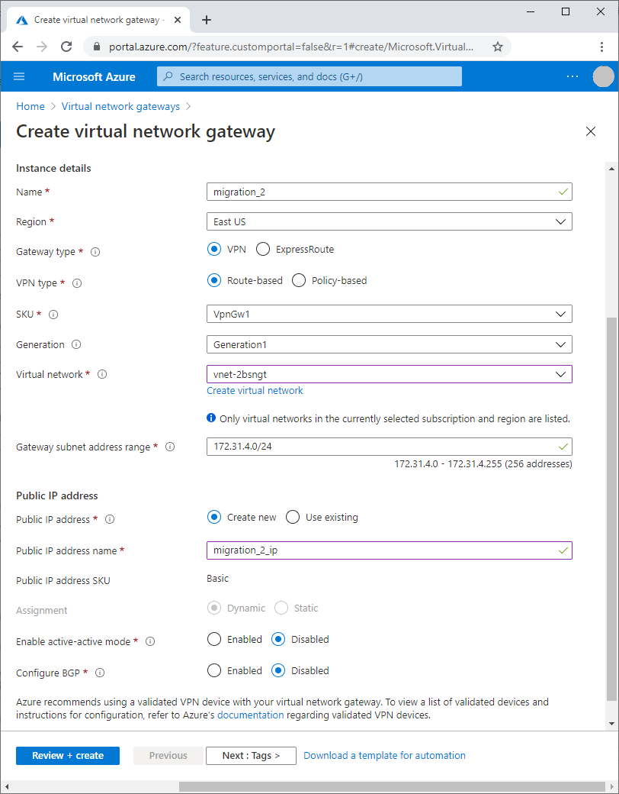

# Create a virtual network gateway and connect to VMs

After you deploy the Azure Moodle resources, create an Azure virtual network gateway and connect to the Moodle virtual machine scale set instances through private IP addresses.

## Create a virtual network gateway

You can create the virtual network gateway by using the Azure portal or the Azure command-line interface (Azure CLI).

In the [Azure portal](https://portal.azure.com):

1. Search for and select **Virtual network gateways**.
   
1. Select **Create virtual network gateway**.
   
1. On the **Create virtual network gateway** page, complete the following fields:
   - Select your **Subscription**.
   - Fill in a **Name** for the gateway.
   - Select the **Virtual network** that the Moodle Azure Resource Manager (ARM) template deployed.
   - Fill in a **Public IP address name**.
   
1. Leave the rest of the fields at their default filled-in values.
   
1. Select **Create**.



Or, run the following Azure CLI command to create the gateway:

```azcli
az network vnet-gateway create -g <MyResourceGroup> -n <MyVnetGateway> --public-ip-address <MyGatewayIp> --vnet <MyVnet> --gateway-type Vpn --sku VpnGw1 --vpn-type RouteBased --no-wait
```

## Generate certificates

Use the Windows PowerShell ISE to generate root and child certificates.

- Run the following command to generate the root certificate:

  ```azurepowershell
  $cert = New-SelfSignedCertificate -Type Custom -KeySpec Signature `
  -Subject "CN=P2SRootCert" -KeyExportPolicy Exportable `
  -HashAlgorithm sha256 -KeyLength 2048 `
  -CertStoreLocation "Cert:\CurrentUser\My" -KeyUsageProperty Sign -KeyUsage CertSign
  ```

- Run the following command to generate the child certificate:

  ```azurepowershell
  New-SelfSignedCertificate -Type Custom -DnsName P2SChildCert -KeySpec Signature `
  -Subject "CN=P2SChildCert" -KeyExportPolicy Exportable `
  -HashAlgorithm sha256 -KeyLength 2048 `
  -CertStoreLocation "Cert:\CurrentUser\My" `
  -Signer $cert -TextExtension @("2.5.29.37={text}1.3.6.1.5.5.7.3.2")
  ```

## Export the certificates

Export the certificates to install them on your systems.

1. From the Windows Start menu, select **Run**, and enter **mmc**.
   
1. In Microsoft Management Console left navigation pane, under the **Personal** folder, select **Certificates**.
   
   Find the **P2SRootCert** and **P2SChildCert** certificates.

To export the root certificate:

1. Right-click or press and hold **P2SRootCert**, point to **All Tasks**, and then select **Export**.
1. In the **Certificate Export Wizard**, select **Next**.
1. Select **No, do not export the private key**, and then select **Next**.
1. Select **Base-64 encoded X.509(.cer)**, and then select **Next**.
1. Enter a file name, and select **Next**.
1. Select **Finish**.
1. The message **The export was successful** appears. Select **OK**.

To export the child certificate:

1. Right-click or press and hold **P2SChildCert**, point to **All Tasks**, and then select **Export**.
1. In the **Certificate Export Wizard**, select **Next**.
1. Select **Yes, export the private key**, and then select **Next**.
1. Select **Personal information exchange - PKCS #12 (.PFX)**, and then select **Next**.
1. Select the **Password** checkbox, and provide and confirm the password.
1. Under **Encryption**, select **TripleDES-SHA1**, and then select **Next**.
1. Enter a file name, and select **Next**.
1. Select **Finish**.
1. The message **The export was successful** appears. Select **OK**.

- Open the root certificate file in your choice editor, and copy the code.

## Configure the virtual network gateway

1. Open the exported root certificate file in a text editor, and copy the contents.
1. In the Azure portal, go to your virtual network gateway.
1. In the left navigation, select **Point-to-site-configuration**.
1. Select **Configure now**.
1. Under **Address pool**, add the GatewaySubnet address pool, for example `192.168.xx.0/24`.
1. Under **Tunnel type**, select **IKEv2**.
1. Under **Authentication type**, select **Azure certification**.
1. Under **Root certificates**:
   - Enter **Root** for **Name**.
   - Paste the copied root certificate code under **Public certificate data**.
1. Select **Save**.

## Download and connect through the VPN client

1. After the virtual private network configuration saves, select **Download VPN client** in the menu bar.
1. Extract the contents of the downloaded VPN client zip file, open the `WindowsAMD64` folder, and run the `VpnClientSetupAmd64.exe` file to install the VPN client.
1. In Windows, go to **Control Panel** > **Network and Internet** > **Network Connections** to see the installed VPN.
1. Right-click the VPN, and select **Connect**.
1. In the **VPN** window, select **Connect**.

The VPN gateway connection is established.

## Configure SSH password authentication

To configure password authentication:

1. Open the `sshd` config file with the `vi` text editor:
   
   ```bash
   sudo vi /etc/ssh/sshd_config
   ```
   
1. Update the following parameters:
   
   - Change `PasswordAuthentication` from `no` to `yes`.
   - Find the commented `UseLogin`, remove the `#`, and change the value to `yes`.
   
1. Press ESC and type `:wq!` to save the changes.
   
1. Restart `sshd` by running the following command:
   
   ```bash
   sudo systemctl restart sshd
   ```
   
1. Run the following command to set a new password:
   
   ```bash
   sudo passwd <username>
   ```
   
   For example, `sudo passwd azureadmin` sets a new password for the user `azureadmin`.
   
1. At the prompts, type and retype the new password.

Password authentication is now complete.

## Sign in to a VM instance from the controller VM

Sign in to virtual machines (VMs) with private IP addresses through SSH.

1. Sign in to the controller VM.
   
1. Run this command to connect to a private VM:
   
   ```bash
   sudo ssh <username>@<private_IP>
   ```
   
   For example: `sudo ssh azureadmin@102.xx.xx.xx`
   
1. At the prompt, enter the password.

## Next steps

Continue to [Moodle manual migration steps](migration-start.md) for the next steps in the Moodle migration process.
