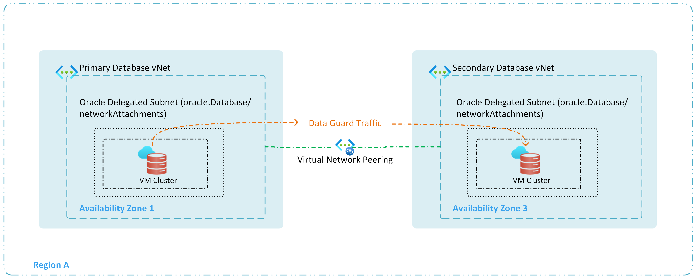
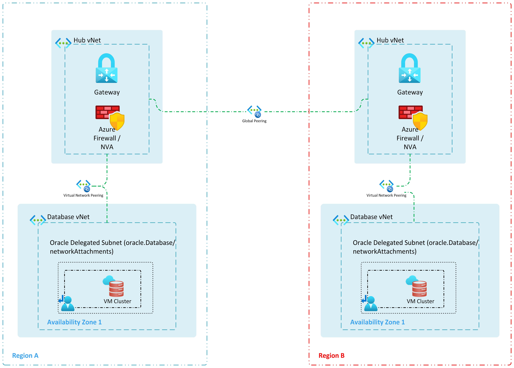
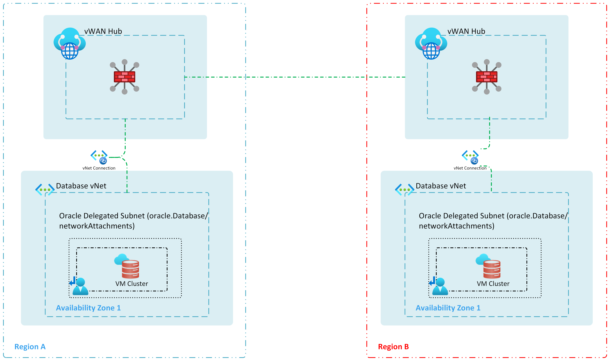

# BCDR Connectivity Design for Oracle Database@Azure - Exadata Database Service

This document focuses on high availability (HA) and disaster recovery (DR) connectivity considerations for Oracle Database@Azure - Exadata Database Service deployments. It begins by addressing within-region redundancy, then expands to cross-region architectures to ensure your environments remain resilient and meet low RPO/RTO requirements.

The key requirements that must be addressed include:

- Low latency: Minimizing latency for database traffic for optimal performance.
- Business Continuity and disaster recovery (BCDR): Availability of Oracle Database@Azure - Exadata Database Service and related applications is the key to ensure business operations are intact with low Recovery Point Objective (RPO)/ Recovery Time Objective (RTO).

Network connectivity between primary and standby Oracle Database@Azure - Exadata Database Service instances can be established via both Azure Networking and OCI Networking, with the default route being through Azure.  This document will primarily focus on architecting for networking within Azure. For in-depth guidance on BCDR, refer to the [BCDR](./oracle-disaster-recovery-oracle-database-azure.md) documentation.

**Redundancy within the same region**

For within-region redundancy, two separate Oracle Database@Azure - Exadata Database Service deployments and two separate VNets are required—each aligned with a different Availability Zone.

The following diagram illustrates a within-region redundant setup, using two Oracle Database@Azure - Exadata Database Service deployments in separate VNets to span multiple Availability Zones:

Figure 1: In-Region Redundancy for Oracle Database@Azure - Exadata Database Service

> **Note:** Data Guard uses the underlying Azure Network. Data replication is via peered Azure VNet within the Azure region and does not leverage the OCI network. Data ingress/egress charges apply.

**Redundancy across regions**

To deploy a redundant network setup across regions, traffic can be configured in Azure or OCI. The following patterns provide guidance for scenarios where traffic must remain within Azure.

**Hub and Spoke:**

**VWAN:**

**Design Considerations**

- **Networking Options for BCDR:** Network connectivity between primary and standby Oracle Database@Azure instances can be established via both Azure Networking and OCI Networking, with the default route being through Azure.
- **Egress Costs:** Egress costs between VNets should be accounted for when replicating data.
- **Availability Zones:** Ensure that the two Oracle Database@Azure - Exadata Database Service deployments span different Availability Zones to isolate failures at the AZ level.
- **Data Guard Configuration:** For DR, Data Guard should be configured for optimal performance to ensure close to Zero RPO and minimal RTO. Refer to [BCDR](./oracle-disaster-recovery-oracle-database-azure.md) for more details.
- **Synchronous Replication:** Configure Data Guard in synchronous mode for optimal performance and near-zero RPO/RTO within the same region. Refer to the [BCDR](./oracle-disaster-recovery-oracle-database-azure.md) documentation for more details.
- Supported network topologies are
  - vWAN based connectivity
  - Peering with Hub network

**Design Recommendations**

- **Minimize NVAs:** Minimize the use of NVAs in the network path, as each additional hop introduces latency that can degrade Data Guard replication performance.
- **Availability Zones:** Ensure that the two Oracle Database@Azure - Exadata Database Service deployments span different Availability Zones to isolate failures at the AZ level.
- **Plan for Costs and Growth:** Analyze ingress and egress costs, future growth, and potential changes to your network architecture. Align your design with your business continuity goals and budget constraints.
- **Asynchronous Replication for Cross-Region DR:** Due to higher latency between geographically distant regions, consider using asynchronous Data Guard replication. This mode tolerates increased latency without significantly impacting production performance, while still providing a robust DR capability

**Next Steps**

Following, you must consider the connection from your Oracle Database on-premises to your Oracle Database@Azure - Exadata Database Service. This is to prepare for your migration. Review the next chapter about [Migration Connectivity Design](./migration-connectivity-design.md).
