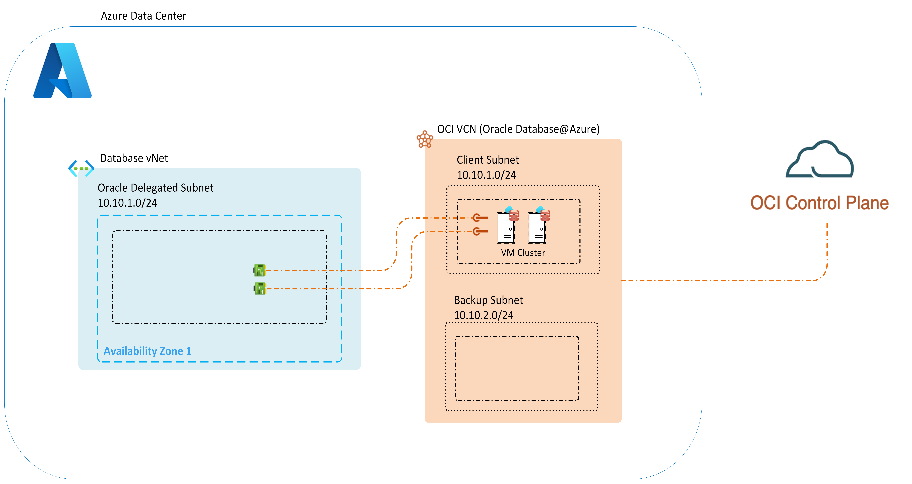

# Core Network Design for Oracle Database@Azure - Exadata Database Service

Understanding the core networking concepts of Oracle Database@Azure - Exadata Database Service is foundational for successful adoption. Unlike most Azure services, Oracle Database@Azure has a unique architecture hosted within an Azure Data Center with out-of-the-box connectivity to the Oracle Cloud Infrastructure (OCI) Control Plane. This document outlines key design considerations and recommendations for configuring and managing network connectivity to support Oracle Database@Azure - Exadata Database Service workloads effectively.

The following diagram illustrates the core networking architecture and relationship between Azure VNets and Oracle Cloud Infrastructure (OCI) Virtual Cloud Networks (VCNs) for Oracle Database@Azure - Exadata Database Service.

The Client Subnet in the OCI VCN maps to the Oracle Database delegated subnet in Azure. In addition, a Backup subnet is also created only within the OCI VCN that is used solely for OCI managed backups.

## Design Considerations

When designing your network topology for Oracle Database@Azure - Exadata Database Service, consider the following Oracle-specific factors:

- **Availability Zone Selection:** Oracle Database@Azure - Exadata Database Service services are deployed into specific availability zones, which are subscription-specific and impact latency and resilience. The physical datacenter may differ between subscriptions. For further details, review [Logical and Physical Availability Zones](https://learn.microsoft.com/azure/reliability/availability-zones-overview?tabs=azure-cli#physical-and-logical-availability-zones)
- **Inherited Region and AZ Settings:** When deploying an Exadata Infrastructure Instance, Region and Availability Zones are effectively mapped to it and any VM Clusters created within the Exadata Infrastructure Instance inherit the same settings.
- **VM Cluster Limits:** Each Oracle Database@Azure - Exadata Database Service SKU can include up to [eight VM clusters.](https://docs.oracle.com/en-us/iaas/exadatacloud/doc/exa-service-desc.html#ECSCM-GUID-B0820870-D946-4879-85BF-C95FF25979CF) Ensure your virtual network is configured before VM cluster creation and decide whether to connect clusters to the same or separate virtual networks.
- **No Default Internet Access:** Exadata has no direct internet access by default. If internet access is required (for patching or outbound dependencies), it must be configured.
- **Subnet Sizing:** Define subnet sizes according to Oracle’s SKU specifications, which differ based on the chosen instance type. Consult [Plan for IP Address Space for Oracle Database@Azure - Exadata Database Service](https://learn.microsoft.com/azure/oracle/oracle-db/oracle-database-plan-ip) for sizing guidelines.
- **Delegated Subnet Constraint:** You can create only one ODAA delegated subnet per VNet. This constraint influences how you plan your VNet layout, especially if you anticipate multiple database deployments. Also refer to the [Network Planning for Oracle Database@Azure - Exadata Database Service](https://learn.microsoft.com/azure/oracle/oracle-db/oracle-database-network-plan) for detailed requirements.
- **Azure NSG Limitation:** Azure NSGs aren't currently supported on Oracle delegated subnets. They must be configured on OCI.
- **Split DNS Model:** ODAA follows a split DNS model. DNS must be configured on both Azure and Oracle Cloud Infrastructure (OCI). Refer to [Oracle Database@Azure - Exadata Database Service DNS Setup](https://techcommunity.microsoft.com/blog/fasttrackforazureblog/oracle-databaseazure-dns-setup/4304513) for further information.
- **Private DNS Naming Rules:** When default DNS settings are used in creating VM clusters, the Private DNS Zone will automatically be named based on the VNet and Subnet selected for the VM Cluster. The name of this zone will be "oci" + the first 10 alphabetic characters of the VNet and Subnet names. For example, VNet "vnet-exadata-prod" + Subnet "snet-exadata-prod" will output ocisnetexadata.ocivnetexadata.oraclevcn.com.

## Design Recommendations

- **Minimize NVAs:** Minimize the use of NVAs in the network path, as each extra hop introduces latency that can degrade database performance. Use NVAs only when required, such as for traffic inspection or compliance purposes, and ensure their placement is optimized to reduce unnecessary routing.
- **Optimize for Bandwidth and Latency:** Optimize bandwidth and latency by colocating resources interacting with Oracle Database@Azure – Exadata Database Service within the same availability zone.
- **Configure NSGs in OCI:** Configure NSGs on the Oracle subnet through OCI to enable connectivity with source and destination networks.
- **Ensure Unique DNS Names:** If using default DNS settings, ensure that the first 10 characters of the VNet+Subnet names for any Exadata environments are unique. If not, a DNS resolver won't be able to distinguish between the environments.

**Further Guidance**

Beyond the core network design concepts for Oracle Database@Azure - Exadata Database Service, also consider the connectivity requirements for your applications, other Azure services (such as Blob Storage, Azure Netapp Files), on-premises environments, and your BCDR configuration.

Next Steps

Proceed to the [Application Connectivity Design](./application-connectivity-design.md) guidance to learn how to connect your applications to Oracle Database@Azure - Exadata Database Service efficiently and securely.
