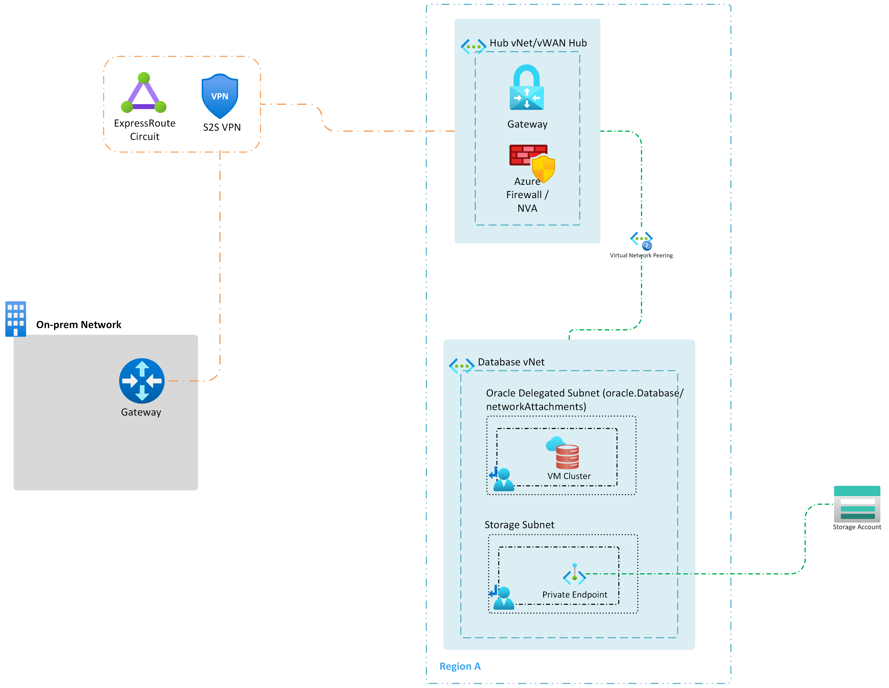

# Oracle Database@Azure - Exadata Database Service migration connectivity design

Preparing for a successful Oracle Database@Azure - Exadata Database Service migration often involves establishing secure, high-bandwidth connectivity between your current source environment and Azure. This document outlines foundational networking connectivity strategies for migration. For comprehensive migration steps and methodologies, refer to the [Migration Documentation](./oracle-migration-planning.md).

The following architecture diagram describes the connectivity between Oracle Database@Azure - Exadata Database Service and an on-premises or other source site:

Figure 1: Connectivity to Oracle Database@Azure - Exadata Database Service from on-premises or other sources

NOTE: Due to a current limitation on connectivity from Oracle Database@Azure - Exadata Database Service to Private Endpoints, connectivity to a Private Endpoint requires an intermediate hop through a routing device such as an Network Virtual Appliance (NVA). This appliance can be a Hub NVA such as an Azure Firewall or third Party NVA or, for nonproduction environments, a dedicated Virtual Machine used for IP forwarding, such as in this [blog post](https://techcommunity.microsoft.com/blog/fasttrackforazureblog/creating-a-local-network-virtual-appliance-in-azure-for-oracle-databaseazure/4218101).

The following diagram includes Azure NetApp Files and doesn't require an intermediate hop for connectivity.

Figure 2: Connectivity to other sources and Azure NetApp Files

Design Considerations

- **High Throughput Requirements:** Migrations often involve large data transfers. Ensure network paths support sustained high throughput.
- **Connectivity Options:** Both ExpressRoute and VPN tunnels can be used to connect on-premises environments to Oracle Database@Azure - Exadata Database Service. ExpressRoute provides more predictable performance and lower latency.
- **Shared Connectivity Impact:** If the same ExpressRoute or VPN connection is used by other services, ensure that increased migration traffic doesn't negatively impact their performance.

Design Recommendations

- **Prefer ExpressRoute Over VPN:** For on-premises to Oracle Database@Azure - Exadata Database Service connectivity, ExpressRoute is recommended due to its dedicated bandwidth, predictable performance, and lower latency.
- **Capacity Planning:** Confirm that your chosen ExpressRoute circuit has sufficient bandwidth headroom for the migration phase. Ensure this doesn't affect other workloads and if necessary, utilize bandwidth limiting.

Next Steps

With your network connectivity planned and established, proceed to the [Migration Documentation](./oracle-migration-planning.md) to begin or refine your migration strategy.
