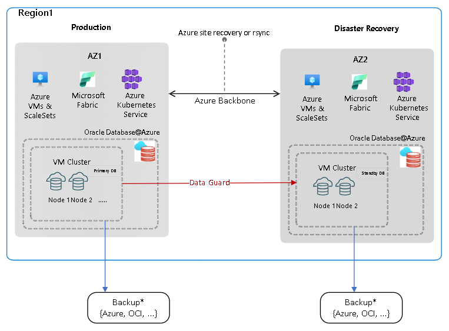
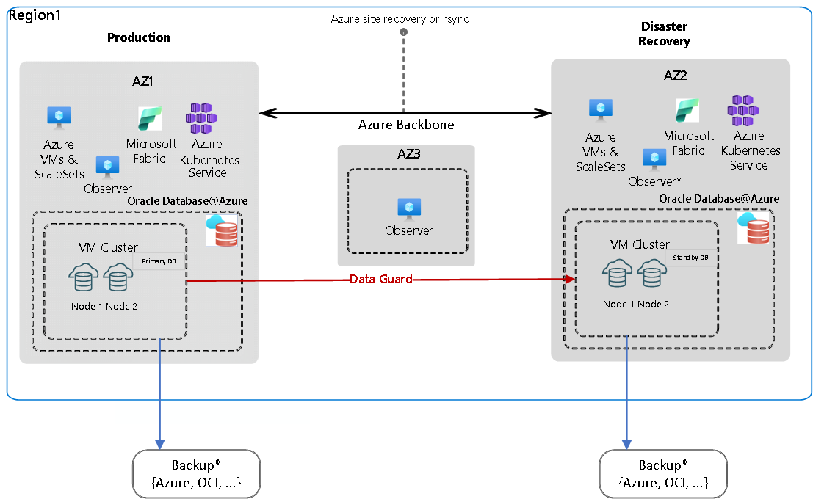
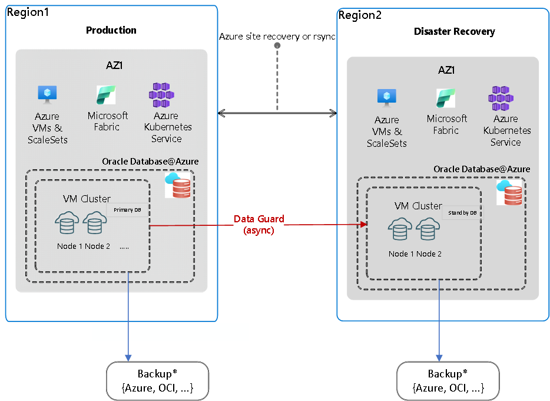
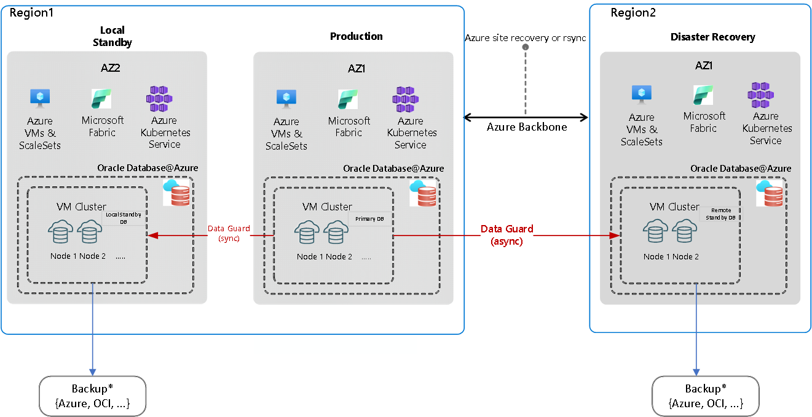
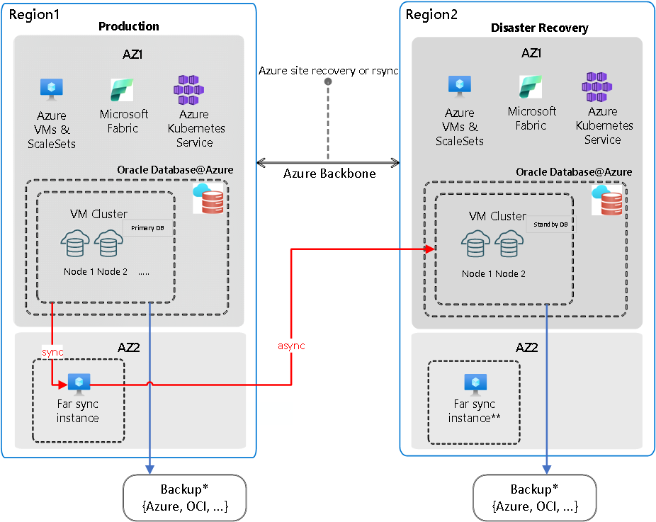
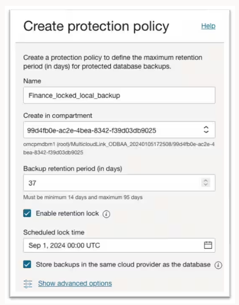

---
title: Business continuity and disaster recovery for Oracle Database@Azure
description: Learn about business continuity and disaster recovery (BCDR) for Oracle Database@Azure and how to build a resilient architecture for your workload environment.
author: gkayali
ms.author: guherk
ms.date: 11/21/2024
ms.topic: conceptual
ms.custom: e2e-oracle
--- 

# Business continuity and disaster recovery considerations for Oracle Database@Azure

This article expands on considerations and recommendations that are defined in the [Azure landing zone design area for business continuity and disaster recovery (BCDR)](../../ready/landing-zone/design-area/management-business-continuity-disaster-recovery.md) incorporating with [Oracle Maximum Availability Architecture](https://docs.oracle.com/en/database/oracle/oracle-database/21/haovw/db-azure1.html#GUID-E8360630-A2B8-4A46-9CBF-56EF0BF8A00F) (MAA)  principles for Exadata Database Services on Oracle Database@Azure.

The first step to building a resilient architecture for your Oracle databases running on Oracle Database@Azure is to identify the availability requirements for the solution. It is essential to establish the recovery time objective (RTO) and recovery point objective (RPO) for different levels of failures, including both planned and unplanned events. The RTO defines the maximum downtime that an application can tolerate after a disaster. The RPO specifies the maximum data loss that an application can tolerate. This is a critical pre-requisite to be addressed before starting BCDR design. Once the requirements of your solution are established, you can proceed to design your Oracle Database@Azure environment to align with your specified RTO and RPO. 

## Design considerations

- The service is available in two different availability zones within a region, ensuring service reliability and disaster recovery(DR). To verify the deployment location of your Oracle Database@Azure, check your VM Cluster in the Azure portal. For information on service availability, refer to the [Region availability for Oracle Database@Azure](https://learn.microsoft.com/en-us/azure/oracle/oracle-db/oracle-database-regions). 

- The Oracle Database@Azure solution and its core components are limited to the availability zone in which you create the instance. The service isn't multi-zonal and doesn't span multiple regions. To achieve multi-zonal or multi-regional resiliency, you can deploy new Oracle Database@Azure instances to target availability zones or regions. 

- The Oracle Database@Azure solution provides native Oracle technologies, such as Real Application Clusters (RAC) and Data Guard, for high availability and Disaster Recovery(DR) respectively. 

  Note that both Data Guard and Active Data Guard are supported for DR architecture.

- Oracle Database@Azure, by default, provides high availability against database instance and hardware level failures. This architecture aligns with [MAA Silver](https://docs.oracle.com/en/database/oracle/oracle-database/21/haovw/db-azure1.html#GUID-91572193-DF8E-4D7A-AF65-7A803B89E840) level. 

  Additionally, planned maintenance operations can be conducted in a rolling manner. 

  However, the default single zone architecture has **zero fault tolerance** against **site or regional failures**. 

- The solution offers automated Data Guard configuration for disaster recovery. This setup **protects from site failures** by requiring an additional Oracle Database@Azure deployment in a different availability zone or region.  
**Note** that automated Data Guard supports only single standby replication. If multiple standby deployments are required, manual Data Guard replication configuration is necessary. 

- Network connectivity between primary and standby Oracle Database@Azure instances can be established via both Azure Networking and OCI Networking, with the default route being through Azure.   

- The service has 99.95% Availability and Manageability SLA. For detailed information, refer to [Oracle PaaS and IaaS Public Cloud Services Pillar Document](https://www.oracle.com/us/corporate/contracts/paas-iaas-pub-cld-srvs-pillar-4021422.pdf). 

- Oracle Database@Azure offers three main backup options: 

  - **Automatic Backup**: This includes two integrated solutions, OCI Object Storage and Autonomous Recovery Service, which are managed via the OCI portal. 

    Autonomous Recovery Service is designed for enterprise-level mission-critical workloads requiring stringent RTO/ RPO and offers 99.9% Availability [SLA](https://www.oracle.com/us/corporate/contracts/paas-iaas-pub-cld-srvs-pillar-4021422.pdf). 
    
    OCI Object storage is appropriate for workloads with less stringent recovery time and recovery point objectives, offering a cost-effective general-purpose backup solution. 
    
    These solutions enable automatic scheduling and management of database backups with a pre-defined retention period.  For details, refer to [manage database backup and recovery documentation](https://docs.oracle.com/en-us/iaas/exadatacloud/doc/ecs-managing-db-backup-and-recovery.html).  

  - **Manual Backup**: Oracle Database@Azure can be configured to stream database backups to Azure Storage services, including Blob, Azure Files (via private endpoints), and Azure NetApp Files (ANF). 

    This option requires manual configuration and ongoing maintenance. 
  
    **Note** that currently using private endpoints with  Oracle Database@Azure requires [deploying a local NVA](https://techcommunity.microsoft.com/blog/fasttrackforazureblog/creating-a-local-network-virtual-appliance-in-azure-for-oracle-databaseazure/4218101) into Oracle Database@Azure Vnet. For details refer to the [network Planning](https://learn.microsoft.com/en-us/azure/oracle/oracle-db/oracle-database-network-plan). 

  - **Third-Party Backup Solutions**: Third-party backup solutions available on the Azure Marketplace can also be utilized for storing database backups. 

    example : [Commvault](https://documentation.commvault.com/2024e/essential/oracle_database_at_azure.html) 

## Design recommendations

Consider these BCDR recommendations for Oracle Database@Azure to build a resilient architecture tailored to your specific requirements. 
It is recommended to configure at least two Oracle Database@Azure instances with Data Guard to ensure protection against single-site failures. This setup aligns with the [MAA Gold](https://docs.oracle.com/en/database/oracle/oracle-database/21/haovw/db-azure1.html#GUID-7A38AFBF-0184-46EA-ACB1-1188BBAA2B67) standard. 

### Multi-zone BCDR

- The Multi-zone Oracle Database@Azure BCDR architecture is recommended for customers seeking a zero or near-zero RPO with multi-zone redundancy while meeting single-region data residency requirements. 

- This solution includes a secondary Oracle Database@Azure deployment in a different AZ within the same region. To ensure resilience against database, cluster, or availability zone failures, implement a standby database located in the secondary Database@Azure instance. This setup provides **protection** against **site-level failures**.  

- It is recommended to maintain a symmetric standby instance with resources equivalent to the primary database to ensure consistent performance during switchover and failover operations. 

  Alternatively, you can configure the standby database with minimal resources and scale up the VM cluster dynamically as needed after switchover or failover. However, this approach may introduce additional time for scaling operations and their reflection at the database level.  

  ]

- You can configure Data Guard redo transport mode according to your application services and RPO requirements as such :  

  - **Maximum Availability Mode (SYNC)**: Recommended for environments where **data integrity and zero data loss** are the highest priorities. This mode synchronously replicates data to the standby database, ensuring **RPO = 0**. 

  - **Maximum Performance Mode (ASYNC)**: Recommended for environments where  **system performance is critical**, and a small degree of data loss is acceptable. This mode uses asynchronous replication, resulting in **RPO > 0 (near zero)**.

- Use [Oracle Fast Start Failover](https://www.oracle.com/technical-resources/articles/smiley-fsfo.html)(FSFO) to automate failover operation, when possible, to minimize RTO and reduce errors. 

  **Note** that Fast Start Failover is not a managed service and requires manual configuration. 

  For this setup, additional virtual machines running Oracle Data Guard Observers are required to enable Oracle Data Guard Fast-Start Failover. These observer VMs monitor the database and replication status, automating the failover process. 

  

   
  If you require a symmetrical disaster recovery architecture in the event of a failover, it is advisable to position an observer instance at the location where the secondary Oracle Database@Azure deployment is configured. 

### Multi-region BCDR

- For a regional BCDR strategy, it is recommended to implement a secondary Oracle Database@Azure deployment with a standby database located in a different region where the service is available.  
This setup provides **protection** against full **regional outages**.

- Configure Data Guard in Maximum Performance mode(ASYNC) for regional disaster recovery based on your application requirements and network latency between your primary and secondary region. For more information, see [Azure network latency test results](https://learn.microsoft.com/en-us/azure/networking/azure-network-latency?tabs=Americas%2CWestUS). 

  **Note** that automated data guard only allow Maximum Performance mode(ASYNC) configuration for cross region deployments.

  

- Multi-zone and multi-region BCDR recommendations focus on database service resiliency. To ensure overall workload resiliency, consider leveraging Azure services and features such as Azure Virtual Machine Scale Sets, Azure Site Recovery and Azure Front Door to design robust architecture across availability zones or regions. 

### Extended BCDR Scenarios

  - **Local and Remote Standby**
  
    To address specific requirements for robust service availability and resilience against regional outages, implementing multiple standby databases is a recommended approach for mission-critical workloads. 

    A local standby database on an Oracle Database@Azure deployment resides in a different availability zone (AZ) within the same region. This setup provides a viable solution for latency-sensitive applications by addressing zero data loss failover requirements through SYNC Data Guard replication, ensuring service availability without impacting application throughput or overall response time. 
    
    A remote standby database on an Oracle Database@Azure instance, located in a different region, addresses regional disaster recovery requirements. 

    

    This architecture is ideal for mission-critical workloads and requires a minimum of three Oracle Database@Azure  deployments.  

    **Note** that if a symmetrical configuration is required in case of a failover scenario, an additional standby database on Oracle Database@Azure should be placed in the secondary region, within a different availability zone. 

    **Note**  that this setup requires manual Data guard replication configuration. 

  - **Far Sync Architecture** 
  
    If there is a certain requirement to implement zero data loss replication at any distance, this can be achieved through Data Guard Far Sync configuration. This involves placing a [far sync instance](https://docs.oracle.com/en/database/oracle/oracle-database/19/sbydb/creating-oracle-data-guard-far-sync-instance.html) closer to the primary Oracle Database@Azure deployment, essentially in another AZ within the same region, to synchronously send the redo logs. The far sync instance then transfers these logs asynchronously to the standby database running in the secondary Oracle Database@Azure deployment in another region. This setup effectively achieves a zero data loss replication between regions. 

     

     If you’re looking for a symmetrical DR architecture in case of a failover, a far sync instance should be placed in a separate AZ where the secondary Oracle Database@Azure deployment is configured. 

    **Note** that the far sync configuration requires an Active Data Guard (ADG) license and must be manually configured. 

### Backup Recommendations

- If backups are the only solution for BCDR requirements, take into consideration that RTO will be higher compared to replication scenarios, as it depends on database size and backup methods used. 

- To comply with regulations requiring data and backups to stay in Azure, these solutions are the options: 
  - Use Autonomous Recovery Service in Azure. During backup configuration, select “[Store backup in the same cloud provider as the database](https://docs.oracle.com/en/cloud/paas/recovery-service/dbrsu/azure-multicloud-recoveryservice.html)”. 

    

  - Utilize Azure Storage Services like Blob, AzureFiles, and Azure Netapp Files to mount storage as NFS points on the database server and stream RMAN backups to Azure storage. 

- If your organization requires long-term backup retention, you can configure user-configured backups to Azure Storage. 

- When backups are configured to Azure Storage services,  

  - Use Cronjobs at the database node level to schedule backups at certain times based on your backup strategy. 

  - Use  Azure's underlying storage replication features like ZRS and GRS for the replication of the backups. 

- Manually back up Oracle Database@Azure virtual machines to restore critical files in case of accidental deletions or corruptions.  For details refer to Exadata Cloud Compute Node Backup and Restore Operations (Doc ID 2809393.1).  

## Other Recommendations

- If it is necessary to keep data exclusively within Azure, please consider the following:  

  - Ensure Data Guard traffic is routed through the Azure network.  

  - Select a database backup solution that aligns with your specific backup strategy. 
  
    Available options are Azure Recovery Services in Azure, user-defined backup to Azure Storage, or third-party backup solutions within Azure.

- Test failover and switchover operations to help ensure that they work in a real disaster scenario. Use [Oracle Fast Start Failover](https://www.oracle.com/technical-resources/articles/smiley-fsfo.html) to automate failover operations when possible to minimize errors. Leverage [Application Continuity](https://docs.oracle.com/en/database/oracle/oracle-database/19/racad/ensuring-application-continuity.html#GUID-C1EF6BDA-5F90-448F-A1E2-DC15AD5CFE75) to seamlessly mask the outage at the application layer.  

- For active-active environments, consider using [Oracle GoldenGate](https://www.oracle.com/integration/goldengate/) for real-time data integration and replication capabilities. Note that it requires application-level awareness to handle conflict resolution effectively. 

  **Note**  that Oracle GoldenGate isn't included in the solution, so you might incur licensing costs. 

- To minimize interruptions for your workload, schedule planned maintenance during off-peak hours, and when applicable utilize rolling manner updates to ensure a seamless process. 

- Use infrastructure as code (IaC) to deploy the initial Oracle Database@Azure instance and virtual machine clusters. For Oracle Database@Azure Automation details, refer to [QuickStart Oracle Database@Azure with Terraform or OpenTofu Modules](https://docs.oracle.com/en/learn/dbazure-terraform/index.html#introduction). 

  If you want to install these individually use the bottom links for the modules. 

  - [Oracle Database@Azure Infrastructure AVM](https://registry.terraform.io/modules/Azure/avm-res-oracledatabase-cloudexadatainfrastructure/azurerm/latest) 
  - [Oracle Database@Azure VM Cluster AVM](https://registry.terraform.io/modules/Azure/avm-res-oracledatabase-cloudvmcluster/azurerm/latest)  

- Use IaC to deploy databases in OCI. You can use IaC to replicate the same deployment to a DR site and minimize the risk of human error. 

## Next steps

- [Identity and access management for Oracle Database@Azure](oracle-iam-odaa.md)
- [Security guidelines for Oracle Database@Azure](oracle-security-overview-odaa.md)
- [Network topology and connectivity for Oracle Database@Azure](oracle-network-topology-odaa.md)
