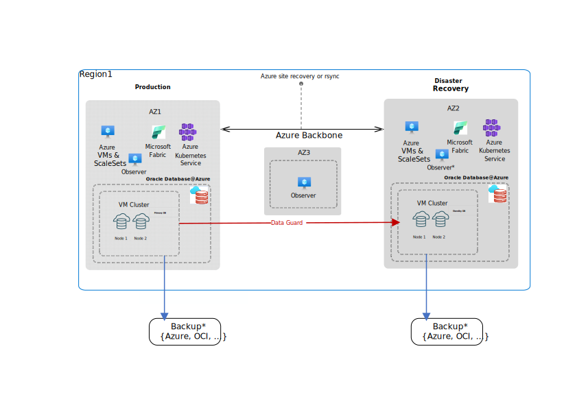
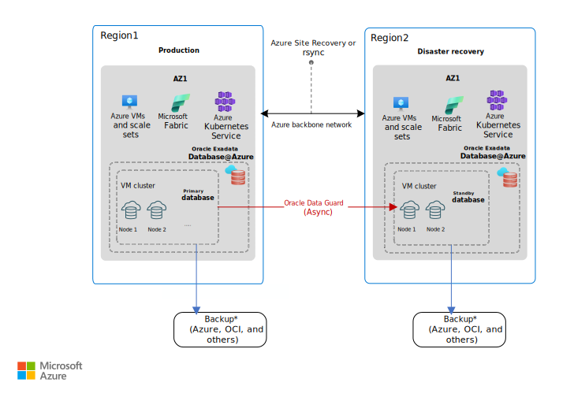

---
title: Business continuity and disaster recovery for Oracle Database@Azure using Oracle Exadata Database
description: Learn about business continuity and disaster recovery (BCDR) for Oracle Database@Azure and how to build a resilient architecture for your workload environment.
author: gkayali
ms.author: guherk
ms.date: 01/09/2025
ms.topic: conceptual
ms.custom: e2e-oracle
--- 

# Business continuity and disaster recovery considerations for Oracle Database@Azure

This article expands on the business continuity and disaster recovery (BCDR) considerations and recommendations outlined in the [Azure landing zone design area](../../ready/landing-zone/design-area/management-business-continuity-disaster-recovery.md), incorporating [Oracle Maximum Availability Architecture](https://docs.oracle.com/en/database/oracle/oracle-database/21/haovw/db-azure1.html#GUID-E8360630-A2B8-4A46-9CBF-56EF0BF8A00F) (MAA) principles for Oracle Database@Azure (OracleDB@Azure) using Oracle Exadata Database.

The first step to building a resilient architecture for your Oracle databases running on OracleDB@Azure is to identify the availability requirements for the solution. It's essential to establish the recovery time objective (RTO) and recovery point objective (RPO) for different levels of failures, including both planned and unplanned events. The RTO defines the maximum downtime that an application/business can tolerate after a disruption. The RPO specifies the maximum duration of data loss that an application/business can tolerate. This exercise is a critical prerequisite to be addressed before starting BCDR design. Once the requirements of your solution are established, you can proceed to design your OracleDB@Azure environment to align with your specified RTO and RPO.

To learn more, see Azure Well-Architected Framework's guidelines on [designing a disaster recovery strategy](/azure/well-architected/reliability/disaster-recovery)

## Design considerations

- The service is available in two different availability zones within a region, ensuring service reliability and disaster recovery (DR). To verify the deployment location of your Oracle Exadata Database service, check your virtual machine (VM) Cluster in the Azure portal.

- Oracle Exadata Database and its core components are limited to the availability zone in which you create the instance. The service isn't multi-zonal and doesn't span multiple regions. To achieve multi-zonal or multi-regional resiliency, you can deploy new Oracle Exadata Database instances to target availability zones or regions.

- Oracle Exadata Database provides native Oracle technologies, such as Real Application Clusters (RAC) and Data Guard, for high availability and disaster recovery respectively.

  Both Data Guard and Active Data Guard are supported for DR architecture.

- Oracle Exadata Database, by default, provides high availability against database instance and hardware level failures. This architecture aligns with [MAA Silver](https://docs.oracle.com/en/database/oracle/oracle-database/21/haovw/db-azure1.html#GUID-91572193-DF8E-4D7A-AF65-7A803B89E840) level.

  Additionally, planned maintenance operations can be conducted in a rolling manner.

  However, the default single zone architecture has **zero fault tolerance** against **site or regional failures**.

- The solution offers automated Data Guard configuration for disaster recovery. This setup **protects from site failures** by requiring another Oracle Exadata Database deployment in a different availability zone or region.  
**Note** that automated Data Guard supports only single standby replication. If multiple standby deployments are required, manual Data Guard replication configuration is necessary.

- Network connectivity between primary and standby Oracle Exadata Database instances can be established via both Azure Networking and Oracle Cloud Infrastructure (OCI) Networking, with the default route being through Azure.

- Here are the three **backup options** available for Oracle Exadata Database:

  - **OCI Managed Backup**: This option includes two integrated solutions, Autonomous Recovery Service and OCI Object Storage which are managed via the OCI portal.

    Autonomous Recovery Service is designed for enterprise-level mission-critical workloads requiring stringent RTO/RPO and offers availability through Service Level Agreement (SLA). For more information, see [Oracle PaaS and IaaS Public Cloud Services Pillar Document](https://www.oracle.com/us/corporate/contracts/paas-iaas-pub-cld-srvs-pillar-4021422.pdf).

    OCI Object storage is appropriate for workloads with less stringent recovery time and recovery point objectives, offering a general-purpose backup solution.

    These solutions enable automatic scheduling and management of database backups with a predefined retention period. For more information, see [Manage Database Backup and Recovery on Oracle Exadata Database Service on Dedicated Infrastructure](https://docs.oracle.com/iaas/exadatacloud/doc/ecs-managing-db-backup-and-recovery.html).

  - **Self-managed Backup**: Oracle Exadata Database can be configured to stream database backups to Azure Storage services, including Blob, Azure Files (via private endpoints), and Azure NetApp Files (ANF).

    This option requires manual configuration and ongoing maintenance.
  
    **Note** that currently using private endpoints with  OracleDB@Azure require [deploying a local Network Virtual Appliance](https://techcommunity.microsoft.com/blog/fasttrackforazureblog/creating-a-local-network-virtual-appliance-in-azure-for-oracle-databaseazure/4218101) into OracleDB@Azure virtual network. For more information, see [Network planning for Oracle Database@Azure](/azure/oracle/oracle-db/oracle-database-network-plan).

  - **Third-Party Backup Solutions**: Third-party backup solutions available on Azure Marketplace, such as [Commvault](https://documentation.commvault.com/2024e/essential/oracle_database_at_azure.html), can also be utilized to manage and store database backups.

## Design recommendations

Consider these BCDR recommendations for Oracle Exadata Database to build a resilient architecture tailored to your specific requirements.

It's recommended to configure at least two OracleDB@Azure Oracle Exadata Database instances with Data Guard to ensure protection against single-site failures. This setup aligns with the [MAA Gold](https://docs.oracle.com/en/database/oracle/oracle-database/21/haovw/db-azure1.html#GUID-7A38AFBF-0184-46EA-ACB1-1188BBAA2B67) standard.

### Multi-zone BCDR

- The Multi-zone BCDR architecture is recommended for customers seeking a zero or near-zero RPO with multi-zone redundancy while meeting single-region data residency requirements.

- This solution includes a secondary Oracle Exadata Database deployment in a different AZ within the same region. To ensure resilience against database, cluster, or availability zone failures, implement a standby database located in the secondary instance. This setup provides **protection** against **site-level failures**.  

- It's recommended to maintain a symmetric standby instance with resources equivalent to the primary database to ensure consistent performance during switchover and failover operations.

  Alternatively, you can configure the standby database with minimal resources and scale up the VM cluster dynamically as needed after switchover or failover. However, this approach might introduce additional time for scaling operations and their reflection at the database level.  

  

- You can configure Data Guard redo transport mode according to your application services and RPO requirements as such:  

  - **Maximum Availability Mode (SYNC)**: Recommended for environments where **data integrity and zero data loss** are the highest priorities. This mode synchronously replicates data to the standby database, ensuring **RPO = 0**.

  - **Maximum Performance Mode (ASYNC)**: Recommended for environments where  **system performance is critical**, and a small degree of data loss is acceptable. This mode uses asynchronous replication, resulting in **RPO > 0 (near zero)**.

- Use [Oracle Fast Start Failover](https://www.oracle.com/technical-resources/articles/smiley-fsfo.html)(FSFO) to automate failover operation, when possible, to minimize RTO and reduce errors.

  **Note** that Fast Start Failover isn't a managed service and requires manual configuration.

  For this setup, extra virtual machines running Oracle Data Guard Observers are required to enable Oracle Data Guard Fast-Start Failover. These observer VMs monitor the database and replication status, automating the failover process.

  

  If you require a symmetrical disaster recovery architecture if there is a failover, it's advisable to position an observer instance at the location where the secondary Oracle Exadata Database deployment is configured.

### Multi-region BCDR

- For a regional BCDR strategy, implement a secondary Oracle Exadata Database deployment with a standby database located in a different region where the service is available.  
This setup provides **protection** against full **regional outages**.

- Configure Data Guard to replicate asynchronously for regional disaster recovery based on your application requirements and network latency between your primary and secondary region. For more information, see [Azure network latency test results](/azure/networking/azure-network-latency).

  **Note** that automated data guard only allow Maximum Performance mode (ASYNC) configuration for cross region deployments.

  

- Multi-zone and multi-region BCDR recommendations focus on database service resiliency. To ensure overall workload resiliency, consider using Azure services and features such as Azure Virtual Machine Scale Sets, Azure Site Recovery and Azure Front Door to design robust architecture across availability zones or regions.

### Extended BCDR Scenarios

#### Local and Remote Standby

  To address specific requirements for robust service availability and resilience against regional outages, implementing multiple standby databases is a recommended approach for mission-critical workloads.

  A local standby database on an Oracle Exadata Database deployment resides in a different availability zone (AZ) within the same region. This setup provides a viable solution for latency-sensitive applications by addressing zero data loss failover requirements through SYNC Data Guard replication, ensuring service availability without impacting application throughput or overall response time.

  A remote standby database on an Oracle Exadata Database located in a different region addresses regional disaster recovery requirements.

  

  This architecture is ideal for mission-critical workloads and requires a minimum of three Oracle Exadata Database deployments.  

  **Note** that if a symmetrical configuration is required if there is a failover scenario, an additional standby database on Oracle Exadata Database should be placed in the secondary region, within a different availability zone.

  **Note**  that this setup requires manual Data Guard replication configuration.

#### Far Sync Architecture

  If there's a certain requirement to implement zero data loss replication at any distance, this can be achieved using Data Guard Far Sync configuration. This approach involves placing a [far sync instance](https://docs.oracle.com/en/database/oracle/oracle-database/19/sbydb/creating-oracle-data-guard-far-sync-instance.html) closer to the primary Oracle Exadata Database deployment, essentially in another AZ within the same region, to synchronously send the redo logs. The far sync instance then transfers these logs asynchronously to the standby database running in the secondary Oracle Exadata Database deployment in another region. This setup effectively achieves a zero data loss replication between regions.

  

  If you’re looking for a symmetrical DR architecture if there is a failover, a far sync instance should be placed in a separate AZ where the secondary Oracle Exadata Database deployment is configured.

  **Note** that the far sync configuration requires an Active Data Guard (ADG) license and must be manually configured.

### Backup recommendations

In case you're considering backups as the only solution for BCDR requirements, keep in mind that RTO will be higher compared to replication scenarios, as it depends on database size and backup methods used.

- **Backup data within Azure**: To meet organizational requirements mandating that data and backups remain in Azure, here are a few solutions:
  - **Use Autonomous Recovery Service in Azure**: During backup policy configuration, select “[Store backup in the same cloud provider as the database](https://docs.oracle.com/en/cloud/paas/recovery-service/dbrsu/azure-multicloud-recoveryservice.html)”.

    

  - **Use Azure Storage services**: Use Azure Storage Services like Blob, AzureFiles, and Azure NetApp Files to mount storage as NFS points on the database server and stream RMAN backups to Azure storage.

- **Long-term backup retention**: If your organization requires long-term backup retention, you can configure self-managed RMAN backups to Azure Storage.

- **Azure Storage backup configurations**: When backups are configured to Azure Storage services, consider these recommendations:
  - **Schedule with Cron jobs**: Use Cron jobs at the database node level to schedule backups at certain times based on your backup strategy.
  - **Replicate backups**: Use  Azure's underlying storage replication features like ZRS and GRS for the replication of backups.

- Manually back up Oracle Exadata Database virtual machines to restore critical files if there are accidental deletions or corruptions. For more information, see [Exadata Cloud Compute Node Backup and Restore Operations (Doc ID 2809393.1)](https://support.oracle.com/knowledge/Oracle%20Cloud/2809393_1.html).  

## Other Recommendations

- **Keeping data within Azure**: If it's necessary to keep data exclusively within Azure, ensure that Data Guard traffic is routed through the Azure network.

- **Test disaster recovery**: Test failover and switchover operations to help ensure that they work in a real disaster scenario.
  - Use [Oracle Fast Start Failover](https://www.oracle.com/technical-resources/articles/smiley-fsfo.html) to automate failover operations when possible to minimize errors.
  - Use [Application Continuity](https://docs.oracle.com/en/database/oracle/oracle-database/19/racad/ensuring-application-continuity.html#GUID-C1EF6BDA-5F90-448F-A1E2-DC15AD5CFE75) to seamlessly mask the outage at the application layer.

- **Real-time data and replication**: For active-active environments, consider using [Oracle GoldenGate](https://www.oracle.com/integration/goldengate/) for real-time data integration and replication capabilities. It requires application-level awareness to handle conflict resolution effectively.

  > [!NOTE]
  > Oracle GoldenGate isn't included in the solution and might incur additional licensing costs. See [OCI GoldenGate Pricing](https://www.oracle.com/integration/goldengate/pricing/).

- **Minimize interruptions**: To minimize interruptions for your workload, schedule planned maintenance during off-peak hours, and when applicable utilize rolling manner updates to ensure a seamless process.

- **Use infrastructure as code (IaC)**: For more reliable infrastructure automation, deploy the initial Oracle Exadata Database instance and virtual machine clusters using IaC. For more information about OracleDB@Azure automation, see [QuickStart Oracle Database@Azure with Terraform or OpenTofu Modules](https://docs.oracle.com/en/learn/dbazure-terraform/index.html#introduction).
  - Use Azure Verified Module (AVM) to deploy Oracle Exadata Database instances and virtual machine clusters. For more information, see:
    - [OracleDB@Azure - Azure Verified Module for Oracle Exadata Infrastructure](https://registry.terraform.io/modules/Azure/avm-res-oracledatabase-cloudexadatainfrastructure/azurerm/latest)
    - [OracleDB@Azure - Azure Verified Module for Oracle Exadata VM Cluster](https://registry.terraform.io/modules/Azure/avm-res-oracledatabase-cloudvmcluster/azurerm/latest)  
  - Use IaC to deploy databases in the OCI control plane. You can use IaC to replicate the same deployment to a DR site and minimize the risk of human error.

## Next steps

- [Identity and access management for OracleDB@Azure](./oracle-iam-odaa.md)
- [Security guidelines for OracleDB@Azure](./oracle-security-overview-odaa.md)
- [Network topology and connectivity for OracleDB@Azure](./oracle-network-topology-odaa.md)
