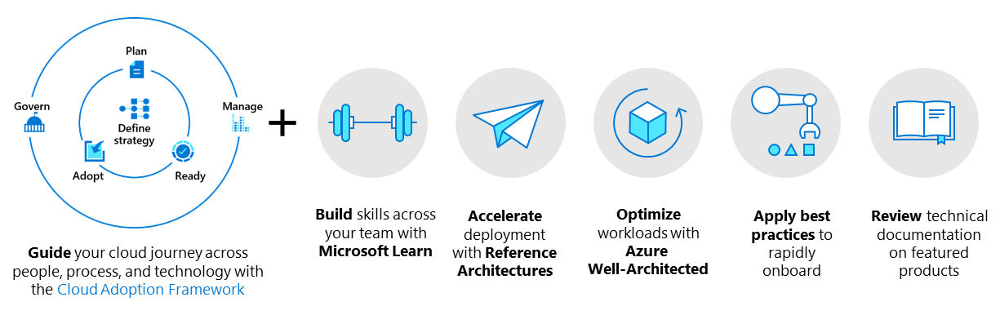

# Scenarios

Your journey to the cloud may become more nuanced in complexity as you consider the implementation of larger, more complex cloud adoption scenarios that best speak to your unique business requirements. These types of scenarios unify technical and non-technical considerations that can help your organization accelerate its overall cloud adoption journey.

Along your cloud adoption path, you'll encounter various key sets of guidance that can help you focus on your requirements. These may be the requirements that enable you to maximize your investment in the cloud. Read on for more pointed guidance across several areas of cloud adoption best practices guidance—from the holistic and modular guidance of the Microsoft Cloud Adoption Framework—to the workload-specific architectural guidance of the Azure Well-Architected Framework—to reference architectures, high-level scenario diagrams that include templatized components and the technical requirements to implement them, based on extensive customer experiences that represent the infrastructure your organization will rely on. Visualize an ideal technical architecture, then blend and integrate it into your environment.

Learn and benefit from a repository of successful cloud adoption experiences—best practices guidance—collected and codified from across the Microsoft customer and partner ecosystem. Read on for your answers about cloud adoption—and learn from successful migration and modernization experiences across our customer and partner communities. Let's make the cloud yours.

| &nbsp; | &nbsp; |
|--|--|
|   :::image type="icon" source="../_images/hybrid/cloud-journey.png"::: |   The Microsoft Cloud Adoption Framework for Azure guides you through each consideration and implementation along the phases of your cloud adoption journey. Use the Cloud Adoption Framework across your organization to prepare decision makers, central IT, and the cloud center of excellence (CCoE) for your organization's cloud adoption efforts. |
|   :::image type="icon" source="../_images/hybrid/hybrid-well-architected.png"::: |   The Azure Well-Architected Framework provides a set of Azure architecture best practices (cost management, operational excellence, performance efficiency, reliability, and security) to help you build and deliver great solutions. The Well-Architected Framework outlines the considerations that each workload owner should make when their workloads need to be deployed. |
|   :::image type="icon" source="../_images/hybrid/hybrid-architectures.png"::: |   Reference architectures aid in accelerating deployment for many common scenarios. |
|   :::image type="icon" source="../_images/hybrid/hybrid-best-practices.png"::: |   Best practices are level 300+ articles that help central IT teams onboard assets using Azure Arc, ARM templates, and other relevant Azure products. |
|   :::image type="icon" source="../_images/hybrid/hybrid-product-docs.png"::: |   Featured Azure products provide information about the products that support your strategy in Azure. |
|   :::image type="icon" source="../_images/hybrid/hybrid-skills.png"::: |   Microsoft Learn modules help you gain the hands-on skills required to implement, maintain, and support solutions in the cloud. |

## Implement your scenario

Each overview page provides guidance on implementing the scenario:

| &nbsp; | &nbsp; |
|--|--|
|   [Azure VMware Solution](../scenarios/azure-vmware/index.md) |   Use an Azure service built with VMware to migrate your VMware resources to a vSphere-based, single-tenant, private cloud on dedicated infrastructure. Minimize impact to business continuity, and reduce migration time by extending hybrid and multicloud agility, optimizing costs, and developing cloud skills. |
|   [Data management](./data-management/index.md): |   Implement sound cloud-native analytics and data governance. Ensure your business data is discoverable, accurate, trusted, and protected. |
|   [Hybrid and multicloud](./hybrid/index.md) |   Build, deploy, and migrate solutions between cloud platforms, and streamline operation. |
|   [Modern application platform](./aks/index.md) |   Enable rapid innovation and workload portability with Kubernetes and container integration. |
|   [SAP](./sap/index.md) |   These level 300+ articles help central IT teams onboard assets to a unified operations solution using Azure Arc, ARM templates, and other relevant Azure products. |
|   [Virtual desktops](./wvd/index.md) |   Integrate Azure Virtual Desktop (formerly Windows Virtual Desktop) into your cloud adoption journey. |
|   [Retail industry](../industry/retail/index.md) |   Discover retail industry cloud adoption components, common challenges, and supporting guidance. |
