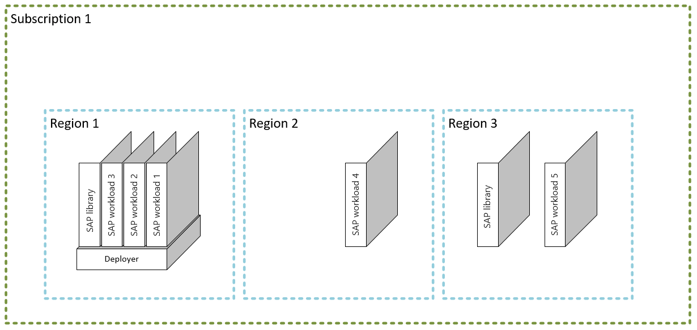

# Enterprise-scale support for SAP on Azure construction set

Enterprise-scale construction sets provide specific architectural approach and reference implementation that enables effective construction and operationalization of platform workload landing zones within the Cloud Adoption Framework enterprise-scale landing zone. After you have successfully implemented an enterprise-scale landing zone, they can use the SAP on Azure construction set. Review the enterprise-scale [overview](../../ready/enterprise-scale/index.md) and [implementation guidance](../../ready/enterprise-scale/implementation.md) before deploying the SAP on Azure construction set.

## Adopting the SAP on Azure construction set

Not all customers adopt SAP on Azure in the same way. The Cloud Adoption Framework for Azure enterprise-scale SAP on Azure construction set architecture varies between customers. The technical considerations and design recommendations of the SAP on Azure construction set might lead to different trade-offs based on your organization's scenario. If you follow the core recommendations, the resulting architecture sets your organization on a path to a sustainable scale. The SAP on Azure construction set is modular by design. You can customize environmental variables. The construction set approach to landing zones includes three sets of assets to support cloud teams:

- [Design guidelines](#design-guidelines)
- [Architecture](#architecture)
- [Implementation](#implementation)

## Design guidelines

You have to make critical decisions that drive the design of the Cloud Adoption Framework for Azure enterprise-scale landing zone. Consider these six critical design areas:

- [Identity and access management](./identity-and-access-management.md)
- [Network topology and connectivity](./network-topology-and-connectivity.md)
- [Management and monitoring](./management-and-monitoring.md)
- [Business continuity and disaster recovery](./business-continuity-and-disaster-recovery.md)
- [Security, governance,  and compliance](./security-governance-and-compliance.md)
- [Platform automation and DevOps](./platform-automation-and-devops.md)

## Architecture

The following image shows a conceptual reference architecture that demonstrates design areas:

## Implementation

The **SAP on Azure deployment automation framework** is a collection of processes combined with a flexible workflow. The [SAP deployment automation framework repository](https://github.com/Azure/sap-hana) has code that automatically deploys SAP landscapes in the Azure cloud.

The templates are split into two categories:

- Terraform modules deploy the infrastructure components in Azure:
  - VMs
  - Network
  - Storage
- Ansible playbooks run different roles to:
  - Set up and deploy VMs
  - Install SAP HANA
  - Install other required applications

Deploy and install the Ansible playbook components on the infrastructure that the Terraform modules built.

## Next steps

Review the design areas for the SAP on Azure construction set that are critical to making complete considerations and recommendations for your SAP on Azure construction set architecture:

- [Identity and access management](./identity-and-access-management.md)
