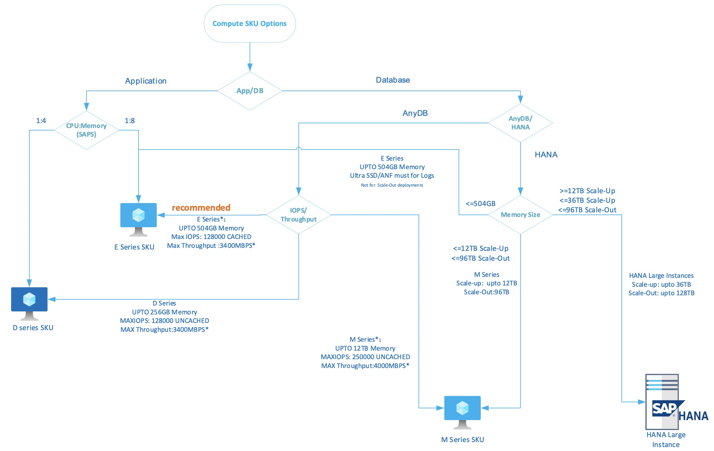
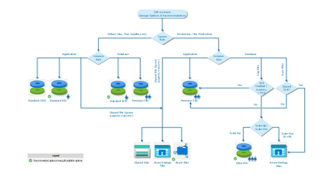

# Business continuity and disaster recovery for SAP Enterprise-Scale scenario

Your organization or enterprise needs to design suitable, platform-level capabilities that application workloads can consume to meet their specific requirements. Specifically, these application workloads have requirements pertaining to recover time objective (RTO) and recovery point objective (RPO). Be sure that you capture disaster recovery (DR) requirements to design capabilities appropriately for these workloads.

## Scenario and Scope

The recommendations and considerations made in this document are against the following criteria. If the scenarios changes, these recommendations and considerations may need to revalidated.

- Compute: Virtual Machines (not HANA Large Instances)
- Storage: Premium disks 
- VM SLA 99.95% (Availability set deployment) 
- SAP S/4HANA deployment: ASCS cluster; HANA(HSR) cluster 
- Single SID deployment 
- NFS using ANF for shared file system for cluster
- Operating system: Linux
- HANA Database size in memory: 2TB 
- RTO: 24h; RPO:4h 
- Backup: Long term retention required; full backup must be completed in 8h 
- Cost optimization deployment (QA instance on DR region running the prod instance) 
- Architecture Reference: https://docs.microsoft.com/azure/architecture/reference-architectures/sap/sap-s4hana

## Design considerations
Consider the following factors:
- You SAP systems may have various components like Web dispatcher, application servers, ASCS servers, database servers etc. Create a different Availability Set for Web Dispatcher, SAP application servers, Central Services, and HANA
Note: Though, this document illustrates the single SID deployment, Azure supports multi SID clusters deployment as well. Max of 5 SAP SIDs can be deployed in the Linux cluster running in Azure
- While designing for high availability protect all the SPOF’s (Single Point Of Failures) and design for resiliency. You can use linux pacemaker clustering for the ASCS (Central service) and Database VMs 
- Keep the database and application layer on separate clusters. 
- Leverage ANF for shared storage file system 

## Design recommendations
The following are best practices for your design:
- Do not mix servers of different roles in the same availability set. You should keep central services VMs, database VMs, application VMs in their own availability sets.
- Don’t combine ASCS  and DB in the same pacemaker cluster. Keep them in separate clusters  
- Primary Application Server (PAS) instance can be installed on ASCS cluster to optimize the cost. (Coordinate with JT team before we make it public)
- Redundant VMs should be behind in a load Standard balancer.
- VMs must be using premium disks (including OS disk) to be compliant with SLA guidelines for OS and data volumes. for shared disks, you will use ANF for this design
- Two ANF accounts needs to be created in two different regions with atleast premium service level
- ANF Should be on a separate subnet, one  subnet per VNET is allowed
- Use of same subs ID across the same landscape (multiple subs may be supported in future)
- For backups of SAP application server VMs: Use Azure Backup 
- For 2TiB HANA DB size or less, use Azure backup. *As of now, Az backup only support up to 2TiB. Az backup does not support HSR yet. Please see restrictions at <Add link>) 
For HANA DB >2TiB, use native HANA DB backup and copy it to blob requirements. You will need to use utilities like AZCOPY to copy the backup files to blob.
- Setup an express route connectivity between customer site (on-prem) to primary and secondary (DR) regions of Azure 
- You can also setup VPN connection between customer site (on-prem) to primary and secondary (DR) regions of Azure
- SLES: Either use SBD device (Up to 3 SBD devices in different FD’s) or use Azure fence agent (No additional VM’s required). In case if you are going to use Fence agents then ensure to refer the doc: https://docs.microsoft.com/azure/virtual-machines/workloads/sap/high-availability-guide-suse-pacemaker 
- For RHEL: Use Azure Fencing agent  
- For ASCS cluster: Use ASR to replicate teh cluster VMs to the DR site. When you  invoke DR, you will need to reconfigure  the pacemaker cluster on the DR site (Ex: replace VIP, corosync config etc)
- Use ASR for Application server replication to DR site
- Do NOT use ASR for DB server replication
- Use DB native replication method like HSR (HANA) DB DR sync
- Make sure VNET application requiring DR network access, that VNET is peered to the secondary (DR) region. For ex: HANA HSR replication will required SAP/HANADB VNET peered to the SAP/HANADB VNET of the secondary site - The best recommended
- You can also use VNET to ER peering - https://docs.microsoft.com/azure/expressroute/expressroute-howto-linkvnet-portal-resource-manager
- You can also use GlobalReach instead of VNET peerign 
- CIDR for the primary VNET should not conflict/overlap CIDR for the disaster site VNET 
- Load balancer configuration in front of dual web dispatchers, ASCS nodes and DB nodes
- Make sure the Floating IP is enabled on the Load balancer
- For ANF, ensure that you are using ANF paired region so you can take advantage of ANF features like CRR (in public preview). ANF paired regions are different than the Azure standard paired regions
- You can also use rsync utility to sync the data from one region to another in ANF, (One zone to another if using Zonal deployment)
- Deploy the DR resources in a RG, assigned to the same Azure region, where the DR  resources are created, so that the resource metadata is stored in the DR region. That will allow changes to the DR Azure resources, in case the production Azure region is down.

## Scalability for Compute and Storage in Azure for SAP Enterprise-Scale scenario.

### Design Considerations for Compute

- Consider using D-Series SKU for SAP application servers. D-Series provide 1:4 for CPU: Memory mapping.Consider using latest SKU generation eg: V3 or V4.
  Please refer the SAP note [1928533](https://launchpad.support.sap.com/#/notes/1928533) for certified D-series SKU for SAP deployment.
- Consider using [E-series](https://docs.microsoft.com/azure/virtual-machines/ev3-esv3-series?toc=/azure/virtual-machines/linux/toc.json&bc=/azure/virtual-machines/linux/breadcrumb/toc.json) or [M-Series](https://docs.microsoft.com/azure/virtual-machines/m-series?toc=/azure/virtual-machines/linux/toc.json&bc=/azure/virtual-machines/linux/breadcrumb/toc.json) SKU for AnyDB.  M & E series SKU's are memory optimized provide better CPU:Memory ratio.
- Consider design principle of scale-up first then scale-out. However, from cost perspective in some scenarios scale-out deployments could be cheaper compared to scale-up setup.
- Consider Scale-out for SAP application server over scale-up.
- Consider using E-series SKU for production non-prod cost-conscious deployments.
- For AnyDB production deployment consider IOPS and throughput limits of VM SKUs.

### Design Recommendations for Compute

- Use E-series SKU for SAP Java application servers. E-series has better memory compared to a D-series SKU with same IO and throughput limits. Java application servers are memory intensive and E-series will provide a better CPU: Memory mapping.
- Use E-series SKU for SAP AnyDB deployment compared to D-series. Bigger the cache better the performance of database. E-series SKUs have the following advantages over D-series:
  - 1:8 Memory mapping
  - Constrained core options available to save DB license costs without a compromise on IO and throughput limits.
- Combined IOPS/throughput of all the disks attached to a VM should be less than or equal IOPS and Throughput limits of VM. eg: P50 disk give 7500 IOPS with 250MBps throughput when this is attached to a Standard D8s_v3 which can only support 192 MBps doesn’t help realize throughput of P50 disk.
- Use M series SKU for HANA Production deployment. M series support 256GB to 12TB scale-up and 96TB of scale out.Refer to SAP [Hardware directory](https://www.sap.com/dmc/exp/2014-09-02-hana-hardware/enEN/iaas.html#categories=Microsoft%20Azure) for supported setup.
- Ultra-SSD or ANF should be used for log volumes in Production HANA deployments while using  E-series SKUs. Whilst using ANF for log volumes ANF, should also be used  HANA data volumes.
- [HANA Large Instances (HLI)](https://docs.microsoft.com/azure/virtual-machines/workloads/sap/hana-overview-architecture) for scale-up deployments larger than 12TB for OLTP.

### Design Considerations for Storage

- Azure has plethora of storage options to choose from, however for running SAP application servers consider the following storage options.
  - Standard SSD
  - Premium SSD
  - Ultra SSD
  - Azure Netapp Files (ANF)

- Storage options to consider for non-prod database deployments:
  - Standard SSD
  - Premium SSD
  - ANF
- Storage options to be considered for SAP Shared file systems eg: SAPMNT, TRANS
  - Azure Shared Disk (windows deployments)
  - Azure NetApp files
  - Azure Files NFS4.1 (preview)
- Storage option to be considered for database logs which require a lower latency of <1ms
  - Premium Storage with WA (only on M-series VM’s)
  - Ultra SSD
  - Azure Netapp Files (ANF)
- In a cost-conscious deployment consider deploying Pre-Production or test systems on standard SDD and convert to Premium for the period of test cycles as required. Eg: E20 disk is half the cost of a P20.
- In cost-conscious deployments consider [disk bursting](https://docs.microsoft.com/azure/virtual-machines/linux/disk-bursting#disk-level-bursting) feature for non-production workloads or [document](https://docs.microsoft.com/en-us/azure/virtual-machines/workloads/sap/hana-vm-operations-storage) in case of HANA deployment.
- Every Azure premium disk come with IOPS and throughout limit, consider striping disk instead of using single large disk for a cost-conscious deployment. Further details about stripe sizes can be found [here](https://docs.microsoft.com/azure/virtual-machines/workloads/sap/hana-vm-operations-storage).
- Consider using [Azure Disk encryption](https://docs.microsoft.com/azure/security/fundamentals/azure-disk-encryption-vms-vmss) for data disk on SAP application servers.
- Consider using [Azure Storage Service encryption](https://docs.microsoft.com/azure/storage/common/encryption-customer-managed-keys?toc=/azure/storage/blobs/toc.json) with customer managed keys(CMK) for database disks.

### Design Recommendations for Storage

- In a cost-conscious deployment use Standard SSD storage for SAP Non-Production (dev/test).
- Do not use IaaS NFS clusters for SAP Shared file systems, use [Azure shared disk on premium storage](https://docs.microsoft.com/azure/virtual-machines/workloads/sap/sap-high-availability-guide-wsfc-shared-disk) for Windows deployment, in Linux deployment use NFS on Azure Files or [Azure NetApp Files](https://docs.microsoft.com/azure/virtual-machines/workloads/sap/high-availability-guide-suse-netapp-files).
- Use Azure premium managed SSD disks for SAP application servers e.g.: usr/sap file systems.
- Azure premium managed storage must be used for the SAP Global Transport directory.  
- In Production deployments the OS disk size should be minimum of 128GB (P10), from our customer experiences all the application logging and monitoring agents actively write data on OS disk driving high IO requirement using a smaller disk will throttle  the disk performance.
- [Read-Only](https://docs.microsoft.com/azure/virtual-machines/premium-storage-performance#disk-caching) cache must be enabled for the data disks holding database data files for AnyDB deployment. Read-Only cache can only be enabled on disks smaller than 4095GB.
- Do not use Azure disk encryption for database disk, use only DB native encryption for databases. Example - Transparent Data Encryption (TDE) for Oracle or SQL server.
- Combined IOPS/throughput of all the disks attached to a VM should be less than or equal IOPS and Throughput limits of VM. eg: P50 disk give 7500 IOPS with 250MBps throughput when this is attached to a Standard D8s_v3 which can only support 192 MBps doesn’t help realize throughput of P50 disk.
