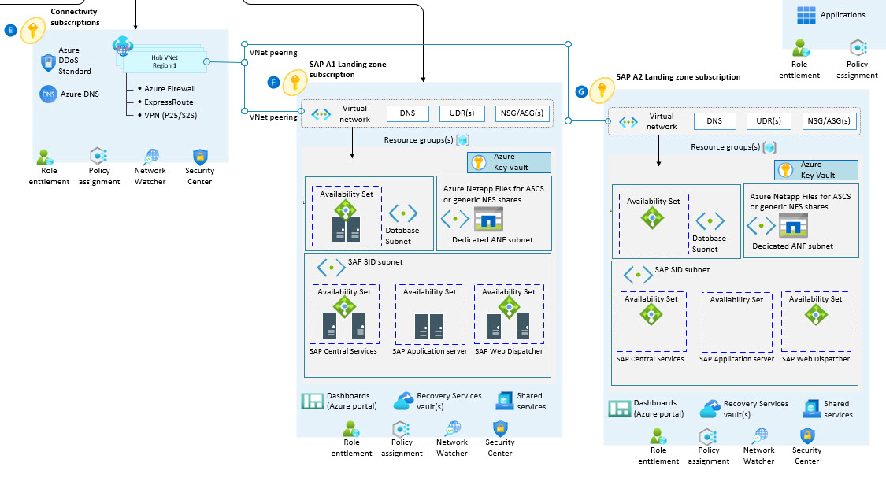

# Network topology and connectivity for an SAP migration

This article builds on the considerations and recommendations that are defined in [Azure landing zone design area for network topology and connectivity](../../ready/landing-zone/design-area/network-topology-and-connectivity.md). The guidance in this article examines key design considerations and best practices for networking and connectivity to, from, and within Microsoft Azure and SAP deployments. Because SAP is a mission-critical platform, your design should also follow the guidance on Azure landing zone design areas.

## Implement Azure ExpressRoute with high availability 

Azure ExpressRoute is designed for high availability to provide carrier-grade private network connectivity to Microsoft resources. There's no single point of failure in the ExpressRoute path within the Microsoft network. To maximize the availability, the customer and the service provider segment of your ExpressRoute circuit should also be built for high availability. Ensure that you connect the two physical links of your ExpressRoute circuit to two distinct edge devices in your network.
  
For recommendations to maximize your ExpressRoute circuit's availability, see the [ExpressRoute circuits resiliency recommendations](https://azure.github.io/Azure-Proactive-Resiliency-Library/services/networking/expressroute-circuits/). 
 
For more information, see the following articles:

- [Designing for high availability with ExpressRoute](/azure/expressroute/designing-for-high-availability-with-expressroute)
- [Azure Well-Architected Framework review - Azure ExpressRoute recommendations](/azure/well-architected/service-guides/azure-expressroute#recommendations)
- [Designing for disaster recovery with ExpressRoute private peering](/azure/expressroute/designing-for-disaster-recovery-with-expressroute-privatepeering)
- [Designing for high availability with ExpressRoute - Active-active connections](/azure/expressroute/designing-for-high-availability-with-expressroute#active-active-connections)

**Design considerations for SAP implementation:**

You can [dedicate](/azure/virtual-network/virtual-network-for-azure-services#services-that-can-be-deployed-into-a-virtual-network) and delegate subnets to certain services and then create instances of those services within those subnets. Although Azure helps you create multiple delegated subnets in a virtual network, you can only have one delegated subnet in a virtual network for Azure NetApp Files. If you use more than one delegated subnet for Azure NetApp Files, then you can't create a new volume.

**Use case:**

You need delegated subnets to implement Azure NetApp Files. This approach is popular for SAP deployments that share file systems. You need a delegated subnet only for an application gateway during load balancing or for SAP BusinessObjects Business Intelligence, which is a load-balancing SAP web application server.

## Configure DNS and name resolution for on-premises and Azure resources

Domain Name System (DNS) is a critical part of the Azure landing zone architecture. Some organizations might want to use their existing investments in DNS. Others might see cloud adoption as an opportunity to modernize their internal DNS infrastructure and use native Azure capabilities.

**Design recommendations for SAP implementation:**

Use the following use case recommendations when a virtual machine's DNS or virtual name doesn't change during migration.

**Use case:**

- Background DNS and virtual names connect many system interfaces in the SAP landscape, and customers are only sometimes aware of the interfaces that developers define over time. Connection challenges arise between systems when virtual or DNS names change after migrations. For simplicity, we recommend that you retain DNS aliases.

- Use different DNS zones to distinguish each environment, including sandbox, development, preproduction, and production environments, from each other. One exception is for SAP deployments that have their own virtual network. In this scenario, private DNS zones might not be necessary.

## Define an Azure network topology

Enterprise-scale landing zones support two network topologies. One topology is based on Azure Virtual WAN. The other is a traditional network topology that's based on a hub-and-spoke architecture. This section describes recommended SAP configurations and practices for both deployment models.

Use a network topology based on Virtual WAN if your organization plans to:

- Deploy resources across several Azure regions and connect your global locations to both Azure and on-premises environments.
- Fully integrate software-defined WAN deployments with Azure.
- Deploy up to 2,000 virtual machine workloads across all virtual networks that are connected to one Virtual WAN hub.

Organizations use Virtual WAN to meet large-scale interconnectivity requirements. Microsoft manages this service, which helps reduce overall network complexity and modernize your organization's network.

Use a traditional Azure network topology based on a hub-and-spoke architecture if your organization:

- Plans to deploy resources in only select Azure regions.
- Doesn't need a global, interconnected network.
- Has few remote or branch locations per region and needs fewer than 30 Internet Protocol Security (IPSec) tunnels.
- Requires full control and granularity to manually configure your Azure network.

**Design recommendations for SAP implementation:**

- Use Virtual WAN for Azure deployments in new, large, or global networks in which you need global transit connectivity across Azure regions and on-premises locations. By taking this approach, you don't need to manually set up transitive routing for Azure networking, and you can follow a standard for SAP on Azure deployments.

- Consider deploying network virtual appliances (NVAs) between regions only if you use partner NVAs. NVAs between regions or virtual networks aren't required if native NVAs are present. When you're deploying partner networking technologies and NVAs, follow the vendor's guidance to identify conflicting configurations with Azure networking.

- Virtual WAN manages connectivity between spoke virtual networks for Virtual WAN-based topologies, so you don't need to set up user-defined routes (UDRs) or NVAs. Maximum network throughput for network-to-network traffic in the same virtual hub is 50 Gbps. To overcome this bandwidth limitation, SAP landing zones can use virtual network peering to connect to other landing zones.

- Neither topology supports NVA deployments between an SAP application and a database server.

- Local and global virtual network peering provide connectivity and are the preferred approaches to ensure connectivity between landing zones for SAP deployments across multiple Azure regions.

## Plan for inbound and outbound internet connectivity

This section describes recommended connectivity models for inbound and outbound connectivity to and from the public internet. Azure-native network security services like Azure Firewall, Azure Web Application Firewall on Azure Application Gateway, and Azure Front Door are fully managed services, so you don't incur the operational and management costs that are associated with infrastructure deployments.

**Design recommendations for SAP implementation:**

- For customers who have a global footprint, [Azure Front Door](/azure/frontdoor/front-door-overview) facilitates SAP deployments by using Web Application Firewall policies to deliver and protect global HTTP and HTTPS applications across Azure regions.

- Take advantage of Web Application Firewall policies in Azure Front Door when you're using Azure Front Door and Application Gateway to protect HTTP and HTTPS applications. Block traffic to Application Gateway so that it receives traffic only from Azure Front Door.

- Application Gateway and Web Application Firewall have limitations when Application Gateway serves as a reverse proxy for SAP web apps. Because SAP Web Dispatcher and NetScaler are more intelligent than Application Gateway, you need to do extensive testing if you replace them with Application Gateway. Verify the most current status and list all of the supported, not supported, tested, and not tested scenarios, if possible.

- Use a web application firewall to scan your traffic when it's exposed to the internet. Another option is to use it with your load balancer or with resources, like Application Gateway or third-party solutions, that have built-in firewall capabilities.

- To prevent data leakage, use Azure Private Link to securely access platform as a service (PaaS) resources like Azure Blob Storage, Azure Files, Azure Data Lake Storage Gen2, and Azure Data Factory. Private endpoints can also help secure traffic between virtual networks and services like Azure Storage and Azure Backup. Traffic between your virtual network and the private endpoint-enabled service travels across the Microsoft global network, which prevents its exposure to the public internet.

## Plan for IP addressing

A plan for IP addressing in Azure is vital to ensure that:

- The IP address space doesn't overlap on-premises locations and Azure regions.
- The virtual network contains the correct address space.
- Subnet configuration plans occur in advance.

The following architecture diagram shows networking considerations in SAP on an Azure landing zone accelerator:

 

## Define network encryption requirements

This section explores key recommendations for encrypting networks between on-premises and Azure environments and across Azure regions.

**Design considerations for SAP Implementations:**

- Traffic isn't encrypted by default when you use ExpressRoute to configure private peering.

- You don't need to encrypt traffic over ExpressRoute for SAP deployments. SAP traffic typically consumes a lot of bandwidth and is sensitive to performance. IPSec tunnels encrypt internet traffic by default, and encryption or decryption could negatively affect the traffic's performance.

- The customer determines whether SAP traffic should be encrypted. To learn more about the network encryption options in enterprise-scale landing zones, see [Network topology and connectivity](../../ready/landing-zone/design-area/network-topology-and-connectivity.md).

## Segregate systems

There are different environments, including development, testing, quality, preproduction, and production environments, in an SAP scenario, and customers tend to categorize these systems into logical or physical constructs to uphold security and compliance standards. The idea is to manage all systems that have the same lifecycle in one common resource group. You can define these groups at various levels, like at the subscription or resource-group level. 

Your organization should also consider the security and policy structure while grouping resources in an SAP landscape. However, for SAP transports to flow between development, testing, quality, and production environments, your organization might need:

- Virtual network peering.
- Firewall port openings between virtual networks.
- UDR and network security group (NSG) rules.

We don't recommend that you host the database management system (DBMS) and application layers of SAP systems in different virtual networks and connect them by using virtual network peering. Excessive network traffic between the layers can accrue substantial costs.

**Additional recommendations for SAP implementations:**

- Neither topology supports placing the SAP application layer and SAP DBMS in different Azure virtual networks that aren't peered.

- You can use application security group (ASG) and NSG rules to define network security access-control lists between the SAP application and DBMS layers. You can add virtual machines to ASGs to help manage their security.

- Enable Azure accelerated networking on the virtual machines that you use in the SAP application and DBMS layers. The following operating system levels support accelerated networking in Azure:

  - Windows Server 2012 R2 or later
  - SUSE Linux Enterprise Desktop 12 SP3 or later
  - Red Hat Enterprise Linux 7.4 or later
  - Oracle Linux 7.5 
     - The kernel that's compatible with Red Hat Enterprise Linux requires release 3.10.0-862.13.1.el7. 
     - The Oracle Unbreakable Enterprise Kernel requires release 5.

- Make sure that you set up internal deployments for Azure Load Balancer to use the direct server return feature. This feature reduces latency when you use internal load balancer configurations for high-availability configurations on the DBMS layer.

- If you're using Load Balancer with Linux guest operating systems, ensure that the Linux network parameter `net.ipv4.tcp_timestamps` is set to `0`.

- For optimal network latency with SAP applications, consider using [Azure proximity placement groups](/azure/virtual-machines/workloads/sap/sap-proximity-placement-scenarios).

- For migration projects, consider tuning the network parameters. For example, you can improve performance by disabling the acknowledgments during the migration period.

- Explore the [SAP support portal](https://support.sap.com/en/index.html) and [SAP Note 2391465](https://launchpad.support.sap.com/#/notes/2931465) to learn more about implementing SAP.

## Design considerations for RISE implementations

When you run SAP RISE deployments in Azure, the integration of the SAP-managed environment with your own Azure ecosystem is paramount. To learn more about the best practices and guidance, see [Integrating Azure with SAP RISE managed workloads](/azure/virtual-machines/workloads/sap/sap-rise-integration).

SAP RISE implementation usually has two options, site-to-site VPN or virtual network peering, for connectivity. If you don't have any prior Azure workloads, site-to-site VPN might be the easier option. However, if you envision adopting Azure as a strategic platform, you might be interested in setting up a proper Azure landing zone and using virtual network peering to the SAP RISE tenant. For these scenarios, a simplified landing zone like the [Cloud Adoption Framework migration landing zone](/azure/governance/blueprints/samples/caf-migrate-landing-zone) might be a good option. You can easily adapt this blueprint to the customer's requirements, with a specific focus on the virtual network parameters.

Deploying cross-tenant virtual network peering to the SAP RISE tenant also requires more work. You need to carefully plan the virtual network architecture to ensure there are no overlapping Classless Inter-Domain Routing ranges. You must also properly [peer DNS to the SAP RISE tenant](/azure/sap/workloads/rise-integration).

Finally, if you decide to set up a Virtual WAN solution and you also need site-to-site VPN or ExpressRoute connections, you should consider the [limits and limitations](/azure/expressroute/how-to-configure-coexisting-gateway-portal#limits-and-limitations).