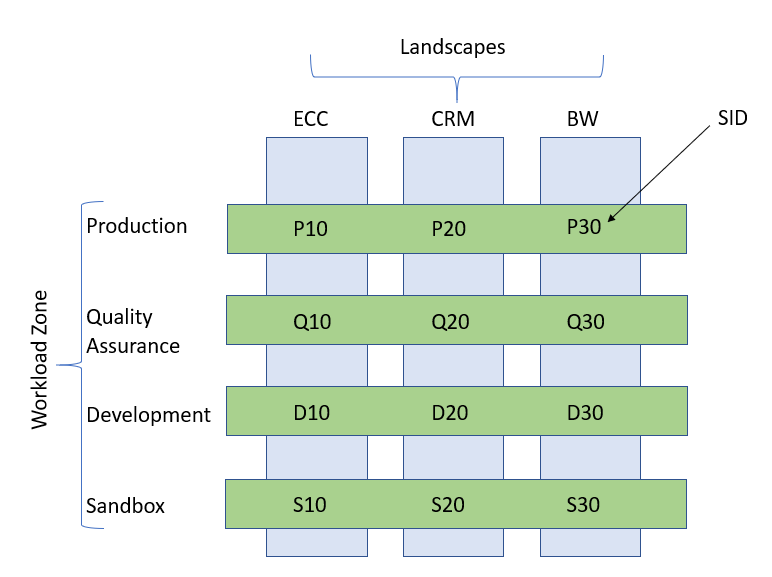
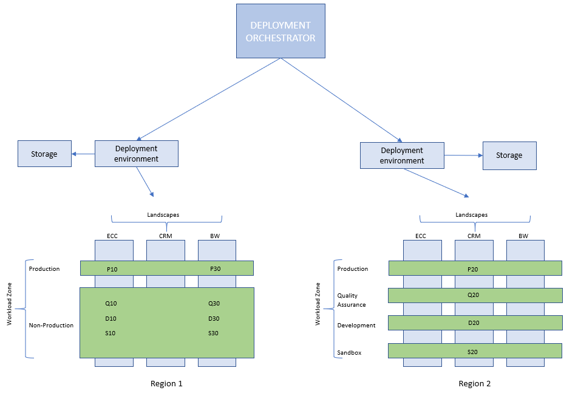

<!-- docutune:casing Snow -->

# Deployment options for SAP in Azure

The principles in the Cloud Adoption Framework for Azure can help with automating SAP in Azure. When forming your automation strategy and determining your approach, it's important to identify an SAP application's key components and use those observations to guide the strategy. Specifically in enterprise environments, deployment option should consider manual configuration, platform automation, and DevOps approaches used to support the SAP platform.

SAP applications are a critical technology backbone for many global enterprises, and Azure provides [guidance](./enterprise-scale-landing-zone.md) to ensure that solutions are certified, supported, and successfully implemented. Organizations can optimize Azure's agility to deploy SAP, automate deployment activities, configure systems, and perform other complex tasks for to ensure operational efficiency and controlled, code-malleable infrastructure deployments.

The [Microsoft SAP Automation repo](https://github.com/Azure/sap-hana) supports Azure-SAP customers to integrate scripts with current DevOps practices or use the code in its current state and directly from a cloned repository.

## SAP architecture

An SAP application estate consists of systems, workload zones, and landscapes.

### System

An SAP system is an instance of an SAP application that has the resources the application needs to run, like virtual machines (VMs), disks, load balancers, proximity placement groups, availability sets, subnets, and network security groups. The application is identified by an SID, a unique three-letter identifier. For lifecycle purposes, each system should deploy to a separate Azure resource group.

### Workload zone

A workload zone is also called a deployment environment. It divides the SAP application into environments like nonproduction or production, and it can segment a landscape further into tiers like development, quality assurance, and production. A deployment environment provides shared resources like virtual networks and key vaults to all systems in the workload zone.

### Landscape

A landscape is a collection of systems in different environments in an SAP application. The example diagram shows three SAP landscapes: SAP ERP Central Component (ECC), SAP customer relationship management (CRM), and SAP Business Warehouse (BW).

The following diagram illustrates the dependencies between SAP systems, workload zones, and landscapes. In the following illustration the customer has three landscapes: SAP ERP Central Component (ECC), SAP customer relationship management (CRM), and SAP Business Warehouse (BW). Each landscape has four workload zones: sandbox, development, quality assurance, and production. Each workload zone may contain one or more systems.

### Additional components

In addition to the SAP components the automation solution will need:

- An execution environment from where deployment activities can be performed
- Persistent storage for installation media and if Terraform is used to store Terraform state files

**Design recommendations:**

- Use a VM that has network connectivity to the target virtual networks to enable application configuration and installation.
- Use Azure Storage accounts for managing state files and as an installation source for SAP installation media.

## Preparation activities

### Deciding on a DevOps strategy

An SAP deployment automation should be implemented as a workflow that starts with deploying the infrastructure and is followed by configuring the operating system and installing the application.

**Design considerations:**

- Define the scope of automation needed:

  - Infrastructure
  - Configuring the operating system
  - Installing the application installation
  - Ongoing operations (run-state operations)

- Define the strategy for storing parameter files

**Design recommendations:**

- Store all parameter files in a source-control repository.
- Back up state and parameter files to prevent file corruption. For example, you can store Terraform state files on read-access geo-redundant-storage-based hot-tier storage accounts.

### Region planning

The SAP deployment automation framework supports deployments in multiple Azure regions. Each region will host:

- Deployment infrastructure
- An SAP library for state and SAP installation media
- 1-n workload zones
- 1-n SAP systems deployed in the workload zones

The following illustration shows a deployment strategy for two Azure regions.

**Design considerations:**

- Which Azure regions are in scope
- Disaster recovery

### Workload zone planning

A workload zone, also called a deployment environment, combines the workload virtual network, the credentials for the systems in that workload, and the service principal used for deploying those systems. Workload zones are regional because they depend on the virtual network in Azure. The naming convention for automation supports having workload zones in multiple Azure regions, each with their own virtual network.

The following are some common workload zone patterns:

#### Production and nonproduction

In this model, SAP environments are grouped into production or nonproduction zones.

#### Sandbox, development, quality assurance, production

In this model, SAP environments are grouped into sandbox, development, quality assurance, or production zones.

**Design considerations:**

- How many workload zones are required?
- For subscription design, does a subscription contain multiple workload zones?
- To which regions are the workloads deployed?
- Outbound internet connectivity
- Network connectivity to an on-premises network
- Is the deployment a greenfield deployment lacking Azure infrastructure for the workload or a brownfield deployment where some or all of the artifacts supporting the workload zone already exist?
- Does each workload zone need unique deployment credentials?

**Design recommendations:**

- Outbound internet connectivity should be provided by the networking team.
- Network connectivity to on-premises networks should be provided by the networking team.
- Use unique deployment credentials for each workload zone. If a workload zone exists in multiple regions, it should use the same deployment credentials across those regions.
- To simplify network planning, try to minimize the number of workload zones.

### SAP application planning

The SAP system is the actual SAP application, as it contains all Azure Artifacts required to host the SAP application. Refer to [SAP on Azure](/azure/virtual-machines/workloads/sap/get-started) to get started, plan, and consider deployment factors in detail.

**Design considerations:**

- Which back-end database to use
- The number of database servers
- If high availability is required
- The number of application servers
- The number of web dispatchers, if any
- The number of central-services instances
- VM sizes
- Decide whether to use an Azure Marketplace or a custom-built image. Custom-built images have several advantages like customer-specific operating system configurations, security hardening, and compliance tooling. Custom-built images can also help with streamlining the image lifecycle.
- Is the deployment a greenfield deployment lacking Azure infrastructure for the workload or a brownfield deployment where some or all of the artifacts supporting the workload zone already exist?
- The IP allocation strategy (Azure or provided by the customer)
- Naming Azure resources
- Defining requirements for managing credentials: can a workload zone's systems use the same credentials to access VMs?

**Design recommendations:**

- Use standard [naming conventions for the SAP Automation network](https://github.com/Azure/sap-hana/blob/master/documentation/SAP_Automation_on_Azure/Software_Documentation/standards-naming.md).

- Use the same credentials for each system deployed to a workload zone. Use Azure Key Vault to manage and store keys.

## The SAP deployment automation framework

The SAP deployment automation framework provides Terraform templates and Ansible playbooks, which can be used to build and configure environments to run SAP in Azure. The artifacts are hosted in the [Azure `sap-hana` repository](https://github.com/Azure/sap-hana), and Azure supports open-source deployment scripts (code isn't customized) for SAP in Azure.

### Automation capabilities

#### Supported platforms

Azure supports automating SAP deployments in Linux and Windows.

#### Supported topologies

The default model for automating SAP deployments is a distributed model with a database tier and an application tier. The application tier splits further into three tiers, application servers, central-services servers, and web dispatchers. The automation can also be deployed to a standalone server with a configuration that doesn't have an application tier.

#### Included capabilities

The SAP deployment automation framework capabilities matrix:

| Feature | Included | Notes |
|:-|:-|:-|
| Accelerated networking | Y | Accelerated networking is enabled on VMs. |
| Application security groups | N | These are on the roadmap. |
| Anchor VM | Y | A virtual machine that anchors the proximity placement group in an Availability Zone. |
| Application configuration | N | An Ansible-based configuration; to be released shortly. |
| Application installation | N | An Ansible-based installation; to be released shortly. |
| Authentication | Y | The authentication supports SSH-based and username-/password-based authentication. |
| Availability Zones | Y | The automation can deploy VMs in zones or across Availability Zones. |
| Azure Files for network file systems | N | These are on the roadmap. |
| Azure Firewall | Y | The automation can deploy an Azure Firewall in the deployer network. |
| Azure Load Balancer | Y | The automation uses standard load balancers from Azure Load Balancer. |
| Azure NetApp Files | N | These are on the roadmap. |
| Boot diagnostics storage account | Y | The boot diagnostics storage account is shared across all systems in a workload zone. |
| Azure key vaults | Y | New or current key vaults in Azure. |
| Customer images | Y | These custom images need to be replicated to the region. |
| Customer-managed disk encryption keys | Y | These keys need to be created ahead of time and stored in Azure Key Vault. |
| Deployment environment | Y | This is a VM in a network peered to the SAP network(s). |
| Disk sizing | Y | The default disk sizing is specified and can be configured. |
| IP addressing | Y | IP addresses are provided by the customer and Azure. |
| Naming convention | Y | This is the default naming convention; it can be customized. |
| Network security groups | Y | These are new or current network security groups. |
| Operating system configuration | N | This is an Ansible-based configuration; to be released shortly. |
| Proximity placement groups | Y | These are new or current proximity placement groups. |
| Resource group | Y | These are new or current resource groups. |
| Subnets | Y | These are new or current subnets. |
| Storage for SAP installation media | Y | This is a new or current storage account. |
| Storage for Terraform state | Y | This is a new or current storage account. |
| VM SKU | Y | All VM SKUs are configurable. |
| Virtual networks | Y | This is a new or current virtual network. |
| Witness storage account | Y | The witness storage account is shared across all systems in a workload zone; it's used for Windows high-availability scenarios. |

### Planning for the parameter files

SAP deployment automation uses JSON parameter files to configure the Azure environment with different parameter files for different artifacts. The development environment should clone the `SAP HANA` and customer repositories to the same root folder. Defining a folder structure and keeping parameter files in dedicated folders will simplify automated deployment operations.

**Design recommendations:**

All parameter files should be stored in a source control environment.