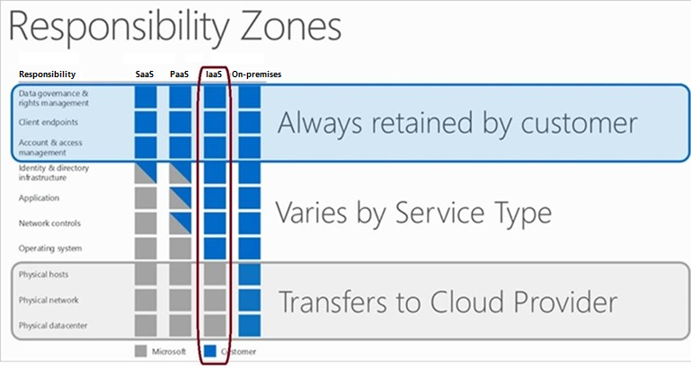
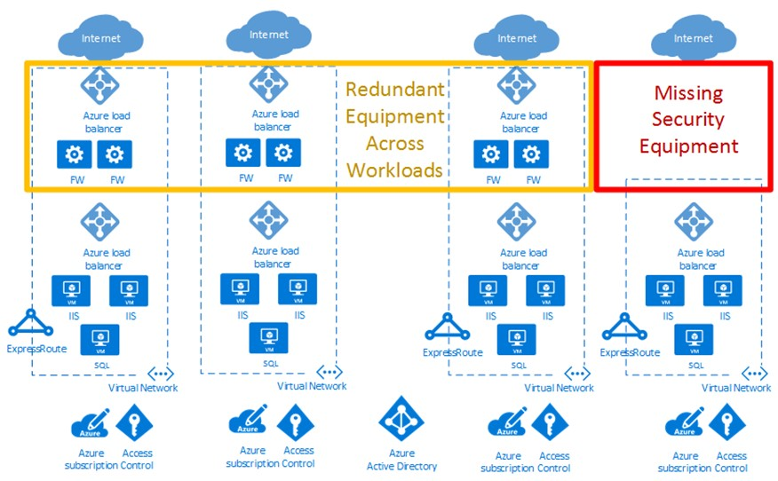
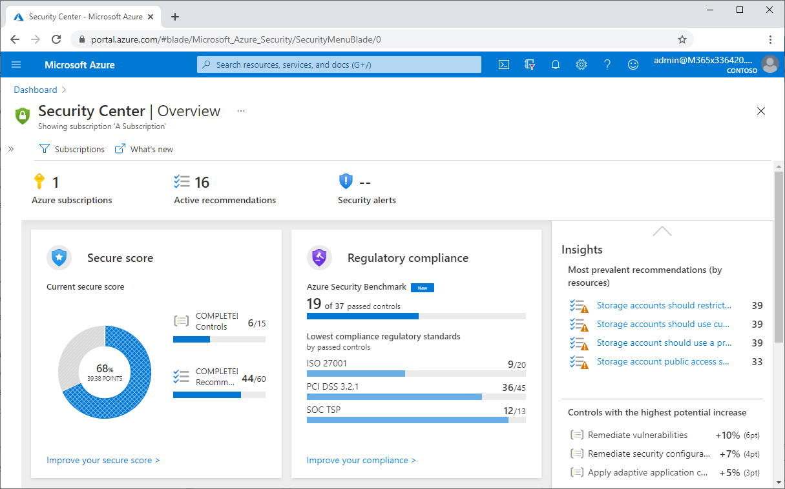
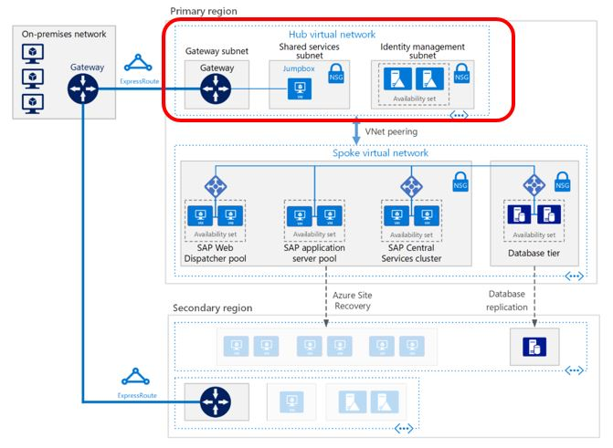
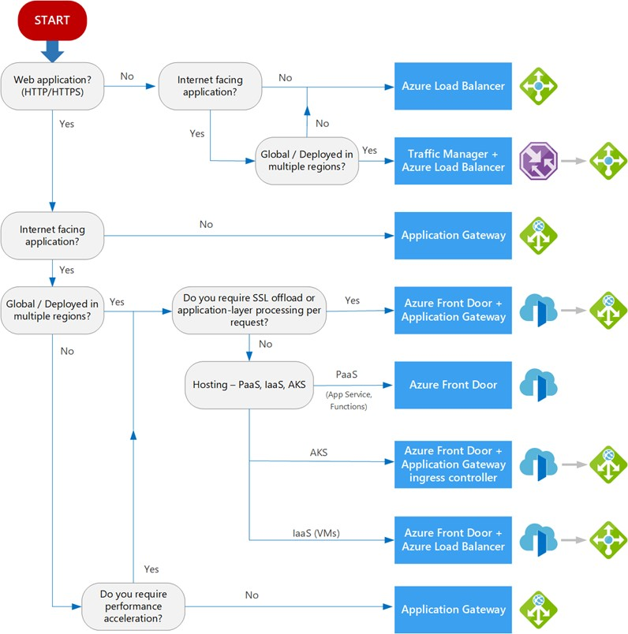

<!-- docutune:casing "Enterprise Edition" SOAR -->

# Governance disciplines for SAP on Azure

SAP is a common technology many organizations use in their most crucial workloads today. When planning SAP architecture, you should pay special attention to ensuring that the architecture is robust and secure. The goal of this article is to document the security, compliance, and governance design criteria for enterprise-scale SAP on Azure. The article discusses design recommendations, best practices, and design considerations specific to the deployment of the SAP platform on Azure. To fully prepare for governance of an enterprise solution, it is important to review the guidance in the [enterprise-scale design area for security governance and compliance](../../ready/enterprise-scale/security-governance-and-compliance.md)

Cloud solutions initially hosted single, relatively isolated applications. As the benefits of cloud solutions became clear, the cloud hosted many larger-scale workloads, like SAP on Azure. Addressing security, reliability, performance, and cost concerns of deployments in one or more regions became vital throughout the lifecycle of cloud services.

The vision for SAP enterprise-scale landing zone security, compliance, and governance on Azure is to give organizations tools and processes to prevent risk and make effective decisions. The enterprise-scale landing zone defines security governance and compliance roles and responsibilities, so everyone knows what is expected from them.

## Shared responsibility model

As you evaluate public cloud services, it's critical to understand which tasks the cloud provider versus the customer handle. Under the shared responsibility model, the division of responsibilities between a cloud provider and its customers depends on your workload's cloud hosting model: software as a service (SaaS), platform as a service (PaaS), or infrastructure as a service (IaaS). As a customer, you are always responsible for your data, endpoints, and account and access management, regardless of cloud deployment model.

The following diagram shows the division of tasks between responsibility zones in Microsoft's cloud shared responsibility model:

For more information about the shared responsibility model, see [Shared responsibility in the cloud](/azure/security/fundamentals/shared-responsibility).

## Security design recommendations

Security is a shared responsibility between Microsoft and customers. You can upload your own virtual machine (VM) and database images to Azure, or use images from the Azure Marketplace. However, these images need security controls that meet application and organizational requirements. You must apply your customer-specific security controls to the operating system, data, and SAP application layer.

For generally-accepted security guidance, refer to the [cybersecurity best practices](https://www.cisecurity.org/cybersecurity-best-practices/) from the Center for Internet Security (CIS).

### Enable Azure Security Center

Enterprises that use hub-spoke network topologies often deploy cloud architecture patterns across multiple Azure subscriptions. In the following cloud deployment diagram, the red box highlights a security gap. The yellow box shows an opportunity to optimize network virtual appliances across workloads and subscriptions.

[Azure Security Center](/azure/security-center/security-center-introduction) provides threat protection and gives you a holistic view of your entire enterprise security posture.

Enable Azure Security Center Standard for SAP on Azure subscriptions to:

- Strengthen the security posture your datacenters and provide advanced threat protection for on-premises and hybrid workloads across Azure and other clouds.

- See all-up security posture across SAP on Azure subscriptions, and see resource security hygiene across SAP VMs, disks, and applications.

- Delegate an SAP admin custom role with [just-in-time access](/azure/security-center/just-in-time-explained).

When you enable Azure Security Center Standard for SAP, make sure to exclude the SAP database servers from any policy that installs endpoint protection.

The following screenshot shows the Azure Security Center dashboard in the Azure portal:

### Enable Azure Sentinel

[Azure Sentinel](/azure/sentinel/overview) is a scalable, cloud-native, security information event management (SIEM) and security orchestration automated response (SOAR) solution. Azure Sentinel delivers intelligent security analytics and threat intelligence across the enterprise, providing a single solution for alert detection, threat visibility, proactive hunting, and threat response.

### Secure authentication

Single sign-on (SSO) is the foundation for integrating SAP and Microsoft products. Kerberos tokens from Active Directory, combined with third-party security products, have enabled this capability for both SAP GUI and web-browser-based applications for years. When a user signs in to their workstation and successfully authenticates, Active Directory issues them a Kerberos token. A third-party security product then uses the Kerberos token to handle the authentication to the SAP application without the user having to reauthenticate.

You can also encrypt data in transit from the user's front end towards the SAP application by integrating the third-party security product with secure network communications (SNC) for DIAG (SAP GUI), RFC, and SPNEGO for HTTPS.

Azure Active Directory (Azure AD) with SAML 2.0 can also provide SSO to a range of SAP applications and platforms like SAP NetWeaver, SAP HANA, and the SAP Cloud Platform.

### Harden operating systems

Make sure you harden the operating system to eradicate vulnerabilities that could lead to attacks on the SAP database.

A few additional checks ensure safe base installation:

- Check system file integrity regularly.
- Restrict access to the operating system.
- Restrict physical access to the server.
- Protect access to the server at the network level.

### Isolate virtual networks

Isolate and restrict access to network services and protocols. For tighter control, you can secure the recommended hub-and-spoke network architecture by using several Azure security mechanisms:

- Isolate the SAP application and database servers from the internet or from the on-premises network by passing all traffic through the hub virtual network, which is connected to the spoke network by virtual network peering. The peered virtual networks guarantee that the SAP on Azure solution is isolated from the public internet.

- Monitor and filter traffic using Azure Monitor, [Azure network security groups (NSGs)](/azure/virtual-network/network-security-groups-overview), or application security groups.

- Use [Azure Firewall](/azure/firewall/overview) or any of the market-available network virtual appliances (NVAs).

- For more advanced network security measures, implement a [network DMZ](/azure/architecture/reference-architectures/dmz/secure-vnet-dmz). For more information, see [Implement a DMZ between Azure and your on-premises datacenter](/azure/architecture/reference-architectures/dmz/secure-vnet-dmz).

- Isolate DMZs and NVAs from the rest of the SAP estate, configure Azure Private Link, and securely manage and control the SAP on Azure resources.

The following architectural diagram shows how to administer an Azure virtual network topology with isolation and restriction of network services and protocols through NSGs. Make sure your network security also complies with organizational security policy requirements.

For more information about SAP on Azure network security, see [SAP security operations on Azure](https://blogs.sap.com/2019/07/21/sap-security-operations-on-azure/).

### Encrypt data at rest

Data at rest is information in persistent storage on physical media, in any digital format. Media can include files on magnetic or optical media, archived data, and data backups. Azure offers a variety of data storage solutions including files, disks, blobs, and tables. Some Azure Storage data encryption at rest occurs by default with optional customer configuration. For more information, see [Azure data encryption at rest](/azure/security/fundamentals/encryption-atrest) and [Azure encryption overview](/azure/security/fundamentals/encryption-overview).

Server-side encryption (SSE) for SAP on Azure VMs protects your data and helps you meet organizational security and compliance commitments. SSE automatically encrypts data at rest on Azure-managed OS and data disks when persisting data to the cloud. SSE encrypts Azure-managed disk data transparently using 256-bit [AES encryption](https://en.wikipedia.org/wiki/Advanced_Encryption_Standard), one of the strongest block ciphers available, and is FIPS 140-2 compliant. SSE doesn't impact managed disk performance, and has no additional cost. For more information about the cryptographic modules underlying Azure-managed disks, see [Cryptography API: next generation](/windows/win32/seccng/cng-portal).

Azure Storage encryption is enabled for all Azure Resource Manager and classic storage accounts, and can't be disabled. Because your data is encrypted by default, you don't need to modify your code or applications to use Azure Storage encryption.

For SAP database server encryption, use the SAP HANA native encryption technology. If you're using Azure SQL Database, use [Transparent Data Encryption (TDE)](/sql/relational-databases/security/encryption/transparent-data-encryption) offered by the DBMS provider to secure your data and log files, and ensure the backups are also encrypted.

### Secure data in transit

Data is in transit or in flight when it moves from one location to another, whether internally on-premises or within Azure, or externally, like across the internet to the end user. Azure offers several mechanisms to keep data private in transit. All the mechanisms can use protection methods like encryption. These mechanisms include:

- Communication through virtual private networks (VPNs), using IPsec/IKE encryption
- Transport Layer Security (TLS) 1.2 or later via Azure components like Azure Application Gateway or Azure Front Door
- Protocols available on the Azure VMs, like Windows IPsec or SMB

Encryption using MACsec, an IEEE standard at the data-link layer, is automatically enabled for all Azure traffic between Azure datacenters. This encryption ensures customer data confidentiality and integrity. For more information, see [Azure customer data protection](/azure/security/fundamentals/protection-customer-data).

### Manage keys and secrets

To control and manage disk encryption keys and secrets for non-HANA Windows and non-Windows operating systems, use Azure Key Vault. Key Vault has capabilities for provisioning and managing SSL/TLS certificates. You can also protect secrets with hardware security modules (HSMs). SAP HANA isn't supported with Azure Key Vault, so you must use alternate methods like SAP ABAP or SSH keys.

### Secure web and mobile applications

For internet-facing applications like SAP Fiori, make sure to distribute load per application requirements while maintaining security levels. For Layer 7 security, you can use a third-party Web Application Firewall (WAF) available in the Azure Marketplace.

For mobile apps, [Microsoft Enterprise Mobility + Security](https://www.microsoft.com/security/business/enterprise-mobility-security) can integrate SAP internet-facing applications as it helps to protect and secure your organization and empowers your employees to work in new and flexible ways.

### Securely manage traffic

For internet-facing applications, you must make sure to distribute load per application requirements while maintaining security levels. The term load balancing refers to the distribution of workloads across multiple computing resources. Load balancing aims to optimize resource use, maximize throughput, minimize response time, and avoid overloading any single resource. Load balancing can also improve availability by sharing a workload across redundant computing resources.

Load balancers direct traffic to VMs in the application subnet. For high availability, this example uses SAP Web Dispatcher and Azure Standard Load Balancer. These two services also support capacity extension by scaling out. You can also use Azure Application Gateway or other partner products, depending on the traffic type and required functionality like Secure Sockets Layer (SSL) termination and forwarding.

You can categorize Azure load-balancing services along global versus regional and HTTP/S versus non-HTTP/S dimensions.

- Global load-balancing services distribute traffic across regional back ends, clouds, or hybrid on-premises services. These services route end-user traffic to the closest available backend. These services also maximize availability and performance by reacting to changes in service reliability or performance. You can think of these services as systems that load balance between application stamps, endpoints, or scale units hosted across different regions or geographies.

- Regional load-balancing services distribute traffic within virtual networks across VMs or zonal and zone-redundant service endpoints within a region. You can think of these services as systems that load balance between VMs, containers, or clusters within a region in a virtual network.

- HTTP/S load-balancing services are Layer 7 load balancers that only accept HTTP/S traffic and are intended for web applications or other HTTP/S endpoints. HTTP/S load-balancing services include features like SSL offload, WAF, path-based load balancing, and session affinity.

- Non-HTTP/S load-balancing services that can handle non-HTTP/S traffic are recommended for non-web workloads.

The following table summarizes the Azure load-balancing services by category:

| Service | Global or regional | Recommended traffic |
|---|---|---|
| Azure Front Door | Global | HTTP/S |
| Traffic Manager | Global | non-HTTP/S |
| Application Gateway | Regional | HTTP/S |
| Azure Load Balancer | Regional | non-HTTP/S |

- [Front Door](/azure/frontdoor/front-door-overview) is an application delivery network that provides global load-balancing and site acceleration service for web applications. Front Door offers Layer 7 capabilities like SSL offload, path-based routing, fast failover, and caching to improve performance and availability of your applications.

- [Traffic Manager](/azure/traffic-manager/traffic-manager-overview) is a DNS-based traffic load balancer that lets you distribute traffic optimally to services across global Azure regions, while providing high availability and responsiveness. Because Traffic Manager is a DNS-based load-balancing service, it loads balances only at the domain level. For that reason, it can't fail over as quickly as Front Door, because of common challenges around DNS caching and systems not honoring DNS TTL.

- [Application Gateway](/azure/application-gateway/overview) provides an managed application delivery controller with various Layer 7 load-balancing capabilities. You can use Application Gateway to optimize web-farm productivity by offloading CPU-intensive SSL termination to the gateway.

- [Azure Load Balancer](/azure/load-balancer/load-balancer-overview) is a high-performance, ultra-low-latency Layer 4 inbound and outbound load-balancing service for all UDP and TCP protocols. Load Balancer handles millions of requests per second. Load Balancer is zone-redundant, ensuring high availability across Availability Zones.

Refer to the following decision tree to make SAP on Azure application load-balancing decisions:

Every SAP application has unique requirements, so treat the preceding flow chart and recommendation as starting points for a more detailed evaluation. If your SAP application consists of multiple workloads, evaluate each workload separately. A complete solution may incorporate two or more load-balancing solutions.

### Monitor security

[Azure Monitor for SAP Solutions](/azure/virtual-machines/workloads/sap/azure-monitor-overview) is an Azure-native monitoring product for SAP landscapes that works with both [SAP on Azure Virtual Machines](/azure/virtual-machines/workloads/sap/hana-get-started) and [HANA Large Instances](/azure/virtual-machines/workloads/sap/hana-overview-architecture). With Azure Monitor for SAP Solutions, you can collect telemetry data from Azure infrastructure and databases in one central location and visually correlate telemetry data for faster troubleshooting.

### Security scoping decisions

The following recommendations are for various security scenarios. The in-scope requirements are for the security solution to be cost-effective and scalable.

| Scope (scenario) | Recommendation | Notes |
|---|---|---|
| See a consolidated view of all-up Azure and on-premises security posture. | Azure Security Center Standard | Azure Security Center Standard helps onboard Windows and Linux machines from on-premises and cloud and shows a consolidated security posture. |
| Encrypt all SAP on Azure databases to meet regulatory requirements. | SAP HANA native encryption and SQL TDE | For databases, use the SAP HANA native encryption technology. If you're using SQL Database, enable TDE. |
| Secure an SAP Fiori application for global users with HTTPS traffic. | Azure Front Door | Front Door is an application delivery network that provides global load balancing and site acceleration service for web applications. |

## Compliance and governance design recommendations

[Azure Advisor](/azure/advisor/advisor-overview) is free and helps you get a consolidated view across SAP on Azure subscriptions. Consult the Azure Advisor recommendations for reliability, resiliency, security, performance, cost, and operational excellence design recommendations.

### Use Azure Policy

Azure Policy helps enforce organizational standards and assess compliance at scale through its compliance dashboard. Azure Policy provides an aggregated view to evaluate the overall state of the environment, with the ability to drill down to per-resource, per-policy granularity.

Azure Policy also helps bring your resources to compliance through bulk remediation for existing resources and automatic remediation for new resources. Sample Azure policies are applying allowed locations to management group, requiring a tag and its value on resources, creating a VM using a managed disk, or naming policies.

### Manage SAP on Azure costs

Cost management is very important. Microsoft offers various ways to optimize costs, like reservations, right sizing, and snoozing. It's important to understand and set alerts for the [Azure cost spending limits](/azure/cost-management-billing/manage/spending-limit). You can extend this monitoring to integrate with the overall IT service management (ITSM) solution.

### Automate SAP deployments

Save time and reduce errors by automating SAP deployments. Deploying complex SAP landscapes into a public cloud is not an easy task. SAP basic teams might be very familiar with the traditional tasks of installing and configuring on-premises SAP systems. Designing, building, and testing cloud deployments often require additional domain knowledge. For more information, see [SAP enterprise-scale platform automation and DevOps](./eslz-platform-automation-and-devops.md).

### Lock resources for production workloads

Create required Azure resources at the start of your SAP project. When all additions, moves, and changes are finished, and the SAP on Azure deployment is operational, lock all resources. Only a super administrator can then unlock and permit a resource, such as a VM, to be modified. For more information, see [Lock resources to prevent unexpected changes](/azure/azure-resource-manager/management/lock-resources).

### Implement role-based access control

Customize role-based access control (RBAC) roles for SAP on Azure spoke subscriptions to avoid accidental network-related changes. You can allow the SAP on Azure infrastructure team members to deploy VMs to an Azure virtual network and restrict them from changing anything on the virtual network peered to the hub subscription. On the other hand, you allow members of the networking team to create and configure virtual networks, but prohibit them from deploying or configuring VMs in virtual networks where SAP applications are running.

### Use Azure Connector for SAP LaMa

Within a typical SAP estate, several application landscapes are often deployed, such an ERP, SCM, and BW, and there is an ongoing need to perform SAP system copies and SAP system refreshes. Examples are creating new SAP projects for technical or application releases, or periodically refreshing QA systems from production copies. The end-to-end process for SAP system copies and refreshes can be both time-consuming and labor intensive.

SAP Landscape Management (LaMa) Enterprise Edition can support operational efficiencies by automating several steps involved in the SAP system copy or refresh. [Azure Connector for LaMa](/azure/virtual-machines/workloads/sap/lama-installation) enables copying, deletion, and relocation of Azure-managed disks to help your SAP operations team perform SAP system copies and system refreshes rapidly, reducing manual efforts.

For VM operations, the Azure Connector for LaMa can reduce the run costs for your SAP estate on Azure. You can stop or deallocate and start your SAP VMs, which enables you to run certain workloads with a reduced utilization profile. For example, through the LaMa interface you can schedule your SAP S/4HANA sandbox VM to be online from 08:00-18:00, 10 hours per day, instead of running 24 hours. The Azure Connector for LaMa also lets you resize your VMs when performance demands arise directly from within LaMa.

### Compliance and governance scoping decisions

The following recommendations are for various compliance and governance scenarios. The in-scope requirements are for the solution to be cost-effective and scalable.

| Scope (scenario) | Recommendation | Notes |
|---|---|---|---|
| Configure a governance model for standard naming conventions, and pull reports based on cost center. | Azure Policy and Azure tags | Use Azure Policy and tagging together to meet the requirements. |
| Avoid accidental deletion of Azure resources. | Azure resource locks | Azure resource locks prevent accidental resource deletion. |
| Get a consolidated view of opportunity areas for cost optimization, resiliency, security, operational excellence, and performance for SAP on Azure resources | Azure Advisor | Azure Advisor is free and helps get a consolidated view across SAP on Azure subscriptions. |

## Next steps

- [Introduction to Azure security](/azure/security/fundamentals/overview)
- [SAP on Azure Architecture Guide](/azure/architecture/reference-architectures/sap/sap-overview)
- [SAP workloads on Azure: planning and deployment checklist](/azure/virtual-machines/workloads/sap/sap-deployment-checklist)
- [Best practices in migrating SAP applications to Azure, part 1](https://azure.microsoft.com/blog/best-practices-in-migrating-sap-applications-to-azure-part-1/)
- [SAP on Azure: designing for efficiency and operations](https://azure.microsoft.com/blog/sap-on-azure-designing-for-efficiency-operations/)
- [Azure Virtual Machines planning and implementation for SAP NetWeaver](/azure/virtual-machines/workloads/sap/planning-guide)
