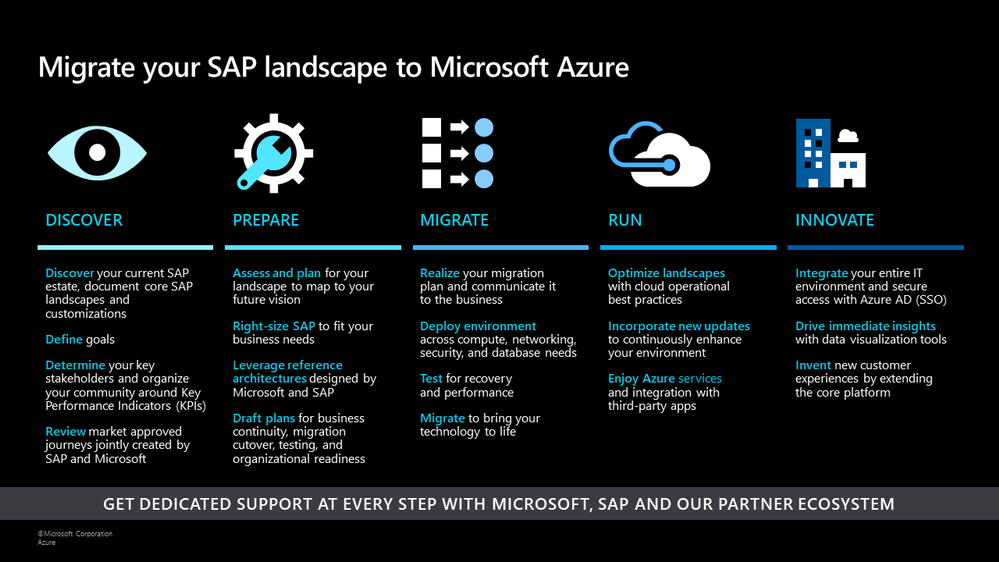

# Introduction to an SAP adoption scenario

This article series outlines the process for integrating an SAP platform into your cloud adoption efforts.

## Executive summary of SAP on Azure

These articles describe how SAP workloads impact your overall strategy, cloud adoption plan, and environmental readiness efforts, with detailed guidance on common drift for each effort. Once an environment is established, the series explains the processes for migrating an SAP platform and how to use cloud technologies to innovate on that platform. To support your cloud adoption needs, the series also outlines considerations and best practices for managing governance and operations throughout an SAP deployment.

To accelerate these efforts, the articles also include detailed technical resources that describe how to build an enterprise-scale landing zone that can support your mission-critical SAP needs.

## How to align to the SAP migration framework

The SAP on Azure team has produced a comprehensive framework for migrating and innovating with SAP on Azure. That framework is the main guide for organizations that focus on delivering the most successful SAP migration to Azure. If your highest priority is successfully migrating SAP to the cloud, then continue to use that guide.

This article series outlines an SAP scenario for the Cloud Adoption Framework, and it complements the current SAP migration framework. These articles are also designed for a slightly different audience with slightly different goals, and they can help your organization if you're integrating the migration of SAP into your overall cloud adoption plan. As organizations migrate to the cloud, they typically need to migrate, innovate, and manage a range of workloads and technology platforms to accomplish their business goals. Those efforts align with the methodologies in the Cloud Adoption Framework for consistent processes and approaches across various technology platforms and workloads.

If your team is following the guidance in both frameworks, you'll see very similar guidance just in packaging that better aligns with the audience and their objectives. Below is a list of terms for the methodologies that can help both audiences to have a similar conversation:

| &nbsp; | &nbsp; |
|---|---|
| **Discover** | When cloud adoption spans multiple technology platforms, it's helpful to separate the discovery process into two conversations: [`Strategy`](./strategy.md), to engage business executives during strategic alignment, and [`Plan`](./plan.md), to prepare the plan based on current and future-state data. |
| **Prepare** | The [Ready methodology](./ready.md) methodology prepares your team and the environment for the coming work. This scenario also integrates Azure landing zones to provide prebuilt and opinionated approaches to help your team to rapidly deploy environments that can support various technology platforms. |
| **Migrate** | The [Migrate methodology](./migrate.md) demonstrates how an SAP migration can integrate with other repeatable migration processes.|
| **Run** | The [Manage methodology](./manage.md) shows how a common operations baseline can address many of the run-state concerns addressed in [Migrate](./migrate.md) and also meet the operational needs of other technology platforms. |
| **Innovate** | The [Innovate methodology](./innovate.md) outlines how you can take your SAP platform to the next level and integrate cloud-native solutions into your workloads. |

The guidance aligns these sources to help your SAP and central IT teams work together during all phases of cloud adoption.

## The SAP adoption process

Adopting SAP workloads in the cloud incorporates and addresses most of the methodologies and phases within the Cloud Adoption Framework. Distinct constraints within each phase will require actions specific to SAP, and this article series maps standard processes to SAP-specific tasks.

## Next steps

The following articles provide guidance for specific points throughout the cloud adoption journey to help you succeed in adopting SAP in Azure.

- [Strategic impact of SAP in the cloud](./strategy.md)
- [Plan for SAP cloud adoption in Azure](./plan.md)
- [Review your environment or Azure landing zones](./ready.md)
- [Migrate an SAP platform to Azure](./migrate.md)
- [Innovate with SAP](./innovate.md)
- [Manage SAP](./manage.md)
