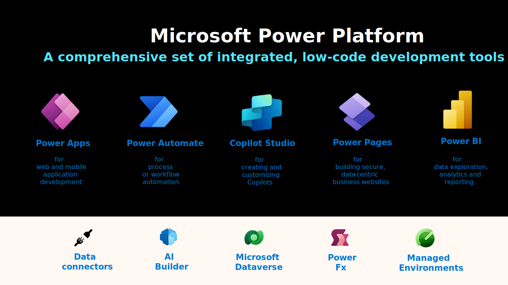

# Extend SAP with the Microsoft Power Platform

This article is part of the "SAP and Power Platform" article series.

- [Extend SAP with the Microsoft Power Platform](./sap-and-powerplatform-fundamental.md)
- [SAP and Power Platform Architecture Workflow](./sap-and-powerplatform-architecture-workflow.md)
- [Extend your SAP Landing Zone to support Power Platform](./sap-and-powerplatform-extend-landing-zone.md)

## Microsoft Power Platform components

Core changes to SAP require investments in care and maintenance to ensure you maintain forwards compatibility for future platform updates. The Microsoft Power Platform can help you extend SAP with extra functionality without changing the core SAP system.

This article provides an introduction to enhancing your SAP systems using these Microsoft Power Platform components:

- **Power Apps**
- **Power Automate**
- **Microsoft Copilot Studio**
- **Power Pages**
- **Power BI**

You can build end-to-end-business solutions using these individually or together and integrate them with SAP, Microsoft 365, Dynamics 365, Azure, or other apps. The following image illustrates the main components as an integrated, low-code development suite, offering immense potential when combined with SAP systems. It enables businesses to enhance their SAP landscapes by building custom applications, automating processes, integrate AI, and provide actionable insights, all while minimizing the need for extensive coding expertise.

These underlying features offer essential functionalities and capabilities for building seamless SAP integration:

- **Data connectors**: With out-of-the-box SAP connectors, the Power Platform can access and interact with SAP data without needing complex middleware. This allows for the smooth integration of SAP data into custom applications, automated workflows, or analytics dashboards.

- **AI builder**: Introduces intelligent automation to extract information from documents, images, text, or add predictive analytics into your SAP workflows. Users can also add generative AI capabilities into SAP processes, such as demand forecasting or intelligent inventory management, without needing in-depth AI expertise.

- **Microsoft Dataverse**: Acts as an optional additional data repository where SAP and other business data can be securely stored and managed. It allows SAP data to be buffered for off-line work or combined with non-SAP data, creating a unified data source for deeper insights and broader functionality.

- **Power Fx**: The low-code language that powers app development across the platform, enabling to easily create custom logic into the workflows that interact with SAP data.

- **Managed environments**: Facilitates governance, compliance, and scalability when deploying Power Platform solutions integrated with SAP systems. You're encouraged to adopt a structured approach by implementing development, test, and production environments, similar to best practices in the SAP landscape.

## Extend SAP application development with Power Apps or Power Pages

Power Apps is a suite of apps, services, and connectors that allows you to create custom business apps without coding. Users can rapidly develop web and mobile applications that extend SAP functionality. With prebuilt connectors for SAP, Power Apps allows businesses to build custom front-ends or lightweight applications that interact directly with their SAP data. This can streamline specific workflows, enable mobile access, and improve user experiences without modifying the core SAP system. 
There are three types of apps you can create with Power Apps:

- **Canvas Apps**: These apps start with a blank screen and the creator manually lays out each screen. This gives the creator complete control over the placement of each element on the canvas. Canvas apps are good for scenarios where the user is expecting a customized user experience.

- **Model-Driven Apps**: For complex business logic, model-driven apps might be a good fit. These apps require a [Microsoft Dataverse database](/power-apps/maker/data-platform/data-platform-intro). They're built on top of the data modeled in that database environment. Views and detail screens for model-driven apps are based on the data structure. The SAP data resides only in the SAP system database. Dataverse is the database of Power Platform. In certain use cases, Dataverse can be used as a temporary caching area for mobile workers when they have no connectivity to the backend SAP system.

- **Power Pages**: Enable teams to create professional internal or external websites with a no-code approach and integrate with other Power Platform components to make use of SAP data and functionality. This allows businesses to engage customers, partners, or employees by offering them a user-friendly web interface to interact with SAP systems, such as submitting requests or viewing real-time data insights.

All types of Power Apps can call Power Automate flows from where the connection to SAP is made.

## Automate SAP workflows with Power Automate

A Power Automate flow is a type of workflow that can automatically perform tasks such as sending notifications, copying files, collecting data, and more. These flows are designed to help users streamline routine tasks, automate processes, and improve collaboration and communication across their organization.

There are three types of flows in Power Automate:

- **Cloud Flows**: These are created when you want your automation to be triggered either automatically, instantly, or via a schedule. These are API based integrations that use SAP ERP, SAP OData, HTML, and other connectors. For example, you can use these flows to read or update objects in SAP such as an order, product, or stock information.

- **Desktop Flows**: These are used to automate tasks on the Web or the desktop and enables SAP users to automate mundane, rules-based tasks on their desktop in combination with their SAP Application Interfaces like SAP GUI or SAP Fiori. For example, automate repetitive tasks like entering customer or finance data from email or Excel into SAP.

  Desktop flows broaden the existing robotic process automation (RPA) capabilities in Power Automate and enable you to automate all repetitive desktop processes. Automating is done through the Power Automate desktop flow designer using the prebuilt drag-and-drop actions or recording your own desktop flows to run later. 

## Build intelligent SAP solutions with Microsoft Copilot Studio

Microsoft Copilot Studio offers an opportunity for you to enhance your SAP users' experience. These AI-driven copilots can be integrated with SAP systems, providing a more interactive and user-friendly interface.

- **Automated customer support**: Copilot Studio can handle routine inquiries and support tickets, freeing up human resources for more complex tasks. This leads to faster resolution times and improved customer satisfaction.

- **Self-service capabilities**: Users can interact with the copilots to perform simple tasks like data retrieval, status updates, and transaction initiations directly within the SAP system, fostering a sense of autonomy and efficiency.

- **Streamlined processes**: The integration of copilots with SAP automates various workflows, such as approvals, data entry, and report generation. This automation can reduce manual errors and accelerates business processes.

- **Personalized user interactions**: Copilot Studio can be programmed to provide personalized experiences based on user roles and preferences, making the SAP system more intuitive and user-friendly.

- **24/7 availability**: Unlike human agents, copilots are available around the clock, offering consistent support and ensuring business continuity outside regular working hours.

By using Copilot Studio, customers can significantly enhance the SAP user experience, making it more efficient, user-friendly, and responsive to their business needs.

## Enhance business intelligence with Power BI and SAP connectivity

Power BI offers versatile integration options for SAP Business Warehouse and SAP HANA, catering to different organizational needs and security considerations.

- **Direct Connection**: For real-time analytics, dynamic data visualization, and timely decision-making, Power BI can directly connect to SAP HANA and SAP Business Warehouse. This direct integration allows for immediate access and analysis of operational data, supporting high-speed analytics and in-depth reporting. It also supports single sign-on (SSO) ensuring SAP access roles and permissions are respected.
  - **SAP HANA** - [Use Kerberos for SSO to SAP HANA](/power-bi/connect-data/service-gateway-sso-kerberos-sap-hana)
  - **SAP BW** - [Use Kerberos for SSO to SAP BW using CommonCryptoLib (sapcrypto.dll)](/power-bi/connect-data/service-gateway-sso-kerberos-sap-bw-commoncryptolib)
  - **SAP BW** - [Use Kerberos for SSO to SAP BW using gx64krb5](/power-bi/connect-data/service-gateway-sso-kerberos-sap-bw-gx64krb)

- **Connect to an SAP HANA database** - [Power Query SAP HANA database connector](/power-query/connectors/sap-hana/overview)

- **Connect to an SAP BW Application Server** - [Power Query SAP Business Warehouse Application Server connector](/power-query/connectors/sap-bw/application-setup-and-connect)

- **Data extraction for sensitive environments**: For organizations cautious about direct connections to production environments, Power BI supports an alternative approach. Data can be extracted from SAP systems and then Power BI connects to this extracted dataset. This method ensures the protection of production environments and allows for analytics on a static copy of the data. The extraction should be scheduled to keep the Power BI dataset up to date without impacting the SAP systems' performance.

This flexibility in connecting Power BI with SAP systems—either through direct access for real-time insights or via data extraction for a more controlled approach—provides a tailored solution for effective SAP data analytics.

## Next steps

- [SAP and Power Platform Architecture Workflow](./sap-and-powerplatform-architecture-workflow.md)