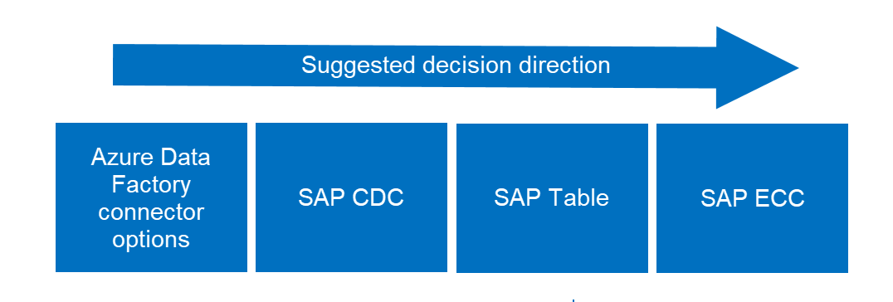
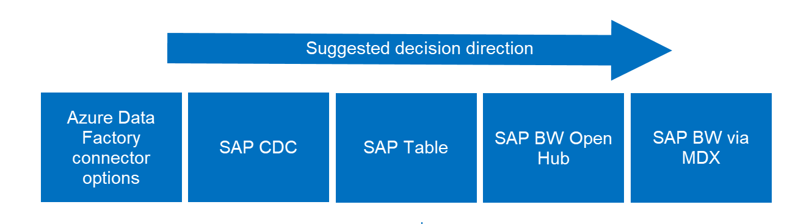

# SAP data integration with Azure: Choose the best SAP connector

This article is part of the "SAP extend and innovate data: Best practices" article series.

- [Identify SAP data sources](./sap-lza-identify-sap-data-sources.md)
- [Choose the best SAP connector](./sap-lza-choose-azure-connectors.md)
- [Performance and troubleshooting for SAP data extraction](./sap-lza-data-extraction-performance-troubleshooting.md)
- [Data integration security for SAP on Azure](./sap-lza-data-integration-security.md)
- [SAP data integration generic architecture](./sap-lza-data-reference-architecture.md)

**APPLIES TO:** :::image type="icon" source="media/applies-to/yes.png" border="false":::Azure Data Factory :::image type="icon" source="media/applies-to/yes.png" border="false":::Azure Synapse Analytics

This article is Part 2 of the SAP extend and innovate data: Best practices series. For the first article in the series, see [Identify SAP data sources](./sap-lza-identify-sap-data-sources.md).

SAP applications often run several mission-critical and core business processes, which generate a huge amount valuable business data. There are many SAP applications and solutions across OLTP, such as ECC, CRM, SCM, and OLAP, such as BW. SAP applications expose data in several ways. When customers combine SAP and non-SAP data and apply advanced data services, such as analytics and AI, they extract real-time, predictive insights. This method improves business outcomes. SAP data integration can be a large, complex project.

## Design considerations for integrating SAP data with Azure

Azure Data Factory and Azure Synapse Analytics pipelines provide several ways and connectors to integrate SAP data into Azure. The approach and SAP connectors you choose depends on several factors, such as the type of SAP application, type of data and how it's exposed, volume of data and expected latency, what you want to do with the data, and where you want to store it. Data can be stored in SAP or outside of SAP.

We recommend the following considerations to help you determine your approach and plan a high-level architecture.

- Define each of your business use cases and the expected outcome of each. Consider what problem the use case solves or what business outcome the use case achieves and how.
- Identify the applications and systems involved in the SAP data flow and data classification.
- Define the data profile including SAP source systems, for example ECC, S/4HANA, BW/4HANA, or BWoH. Define the volume and type of data, such as raw data or transformed data. Define the type of SAP objects where the data is available, for example underlying database, SAP data dictionary tables such as EKKO, AUFK, or logical objects such as CDS Views, SAP extractors, or BW objects.
- Identify the right connectors for each scenario. Azure provides several connectors to connect to SAP systems, and there might be more than one connector available for a given source system. But other factors, such as data volumes and SAP product versions, can influence this choice.
- Define what happens with the data, such as cleansing, validation, transformation, or enriching, and where it happens, for example in SAP or in Azure.
- Decide where the data is stored, for example a data lake or data warehouse, and how it's visualized, for example Power BI.
- Consider the expected latency and frequency of data ingestion, for example low latency, every 4 hours, or daily.
- Define governance, classification, access, security, and networking requirements.
- Determine if a single architecture pattern serves all use cases or if you need to establish multiple patterns based on the previous requirements.
- Identify the Azure services and internal organizations involved, and identify the skills and resources required, such as SAP, Azure data platform, security, and networking.
- Consider running a proof of concept with well-defined goal, scope, approach, and success criteria.

> [!TIP]
> Validate that present and future SAP components and versions support the solution.
>
> When possible, connect to SAP Message Server (Logon type: Group) instead of Application Server for load balancing.
>
> Most of the Azure connectors support connecting to SAP systems by using Secure Network Communications (SNC).
>
> Azure Data Factory and Azure Synapse Analytics pipelines provide [SAP templates](/azure/data-factory/industry-sap-templates) to get started with a pattern-based approach for SAP scenarios.
>
> Check if your SAP data extraction scenario affects SAP licensing.
>
> You can use [ABAP SDK for Azure](https://github.com/microsoft/ABAP-SDK-for-Azure) for tighter integration of SAP data with Azure.

## Choose the optimal connector

The following considerations help you get started with your approach based on where your data resides and in what form.

- If the data is modeled inside an SAP application and is available to consume in the form of logical objects, use a connector that works with logical objects by connecting to NetWeaver AS ABAP.
- If the data isn't modeled inside an SAP application but is available in data dictionary tables or views in the raw form, use a connector that works with raw data by connecting to NetWeaver AS ABAP.
- If the data is available in SAP OLAP or OLTP applications, use a connector that works with the respective application.
- If the data is available in SAP HANA database, use the SAP HANA connector that connects to the HANA database by using HANA ODBC drivers.
- There are generic connectors available that connect to the underlying anyDB (non-SAP) databases, like MS SQL, IBM, and Oracle.
- Azure provides SAP connectors for Azure Logic Apps, Power Apps, and Azure Functions to connect to SAP applications. These integration scenarios cover different use cases, but it's possible that there's overlap.

> [!TIP]
>
> If there isn’t a connector available for your application or scenario, consider moving the data to a supported application or scenario.

The following table shows the broader choices available depending on which SAP application you want to fetch data from.

| **Data location**  | **Scenario: Full load and manual delta**  | **Scenario: Full load and change data capture** |
| --------------------- | ------------------------------------      | ------------------------------------        |
| SAP HANA   | [SAP HANA](/azure/data-factory/connector-sap-hana?tabs=data-factory) | [SAP CDC](/azure/data-factory/connector-sap-change-data-capture)                                     |
| SAP BW  | [SAP Table](/azure/data-factory/connector-sap-table?tabs=data-factory), [SAP BW OpenHub](/azure/data-factory/connector-sap-business-warehouse-open-hub), [SAP BW via MDX](/azure/data-factory/connector-sap-business-warehouse?tabs=data-factory) | [SAP CDC](/azure/data-factory/connector-sap-change-data-capture)                                    |
| SAP ECC, SAP S/4 HANA  | [SAP Table](/azure/data-factory/connector-sap-table?tabs=data-factory), [SAP ECC](/azure/data-factory/connector-sap-ecc?tabs=data-factory)   | [SAP CDC](/azure/data-factory/connector-sap-change-data-capture)                                   |

The following table shows a summary of all SAP connectors available in Azure Data Factory and Azure Synapse Analytics for different SAP sources, scenarios, and the connector’s capabilities.

> [!TIP]
> The supported connectors and capabilities usually depend on the SAP product instance, for example BW on HANA vs. BW/4HANA, and its release. For more information, see the production documentation for each connector.
>
>For information about overall support for the SAP data integration scenario, see [SAP data integration](https://github.com/Azure/Azure-DataFactory/blob/main/whitepaper/SAP%20Data%20Integration%20using%20Azure%20Data%20Factory.pdf).

| SAP&#xa0;source&#xa0;application | Data&#xa0;type | Azure connector | Supported&#xa0;objects&#xa0;and&#xa0;mode | Protocol&#xa0;and&#xa0;connection | Authentication | More information | Parallelization and&#xa0;performance| Data&#xa0;volume |
|---|---|---|---|---|---|---|---|---|
| SAP applications based on NetWeaver AS ABAP, such as SAP ECC, S/4HANA, CRM, SRM, BW on HANA, and BW/4HANA | Raw data | SAP CDC via SLT | All transparent, pooled, and cluster tables support full load and CDC. Some views (transaction SE11) support full load and CDC. | RFC calls to the NetWeaver application and message server. | Basic SNC | Prerequisites | Yes, fast with built-in parallel loading based on configurable partitioning. | Large |
| SAP applications based on NetWeaver AS ABAP, such as SAP ECC, S/4HANA, CRM, SRM, BW on HANA, and BW/4HANA | Logical objects | SAP CDC | ABAP CDS views support full load and many of them support delta, for example if they're based on time stamps or triggers. SAP extractors, standard and custom, support full load and might also support delta based on the configuration. BW InfoProviders, such as DSO, ADSO, InfoCubes, MultiProvider, CompositeProvider, and Query (if exposed as InfoProvider) support full load and might also support delta based on the configuration. | RFC calls to the NetWeaver application and message server. | Basic, SNC | Prerequisites | Yes, fast with built-in parallel loading based on configurable partitioning. | Large |
| SAP applications based on NetWeaver AS ABAP, such as SAP ECC, S/4 HANA, BW on AnyDB, and BW on HANA. BW/4HANA not supported. | Raw data | SAP Table | All transparent, pooled, and cluster tables and views (transaction SE11) support full load. You can also extract changes with manual watermarking by using a timestamp or the unique ID column. |  RFC calls to the NetWeaver application and message server. | Basic, SNC | Prerequisites | Yes, fast with built-in parallel loading based on configurable partitioning. | Large |
| BW on AnyDB and BW on HANA. BW/4HANA not supported. | Logical objects | SAP BW Open Hub | BW objects exposed via Open Hub Destination (OHD) local table, such as DataSources, DSO, InfoCube, MultiProvider, CompositeProvider, and Query (if exposed as InfoProvider) support full load. Delta is supported if the OHD supports delta. | RFC calls to the NetWeaver application and message server. | Basic | Prerequisites. Create SAP OHD in SAP BW to expose data. | Yes, fast with built-in parallel loading based on OHD specific schema. | Large |
| BW on AnyDB and BW on HANA. BW/4HANA not supported. | Logical objects | SAP BW via MDX | BW InfoCubes and QueryCubes (including BEx queries) support full load. Delta isn't supported. | RFC calls to the NetWeaver application server. | Basic | Prerequisites | Slower | Small |
| SAP ECC, S/4 HANA | Raw data or logical objects | SAP ECC via SAP Gateway | Any objects exposed by OData services, such as SAP tables, views, BAPI objects, extractors, data, or IDOCs sent to SAP PI that can be received as OData via relative adapters support full load. You can also extract changes with manual watermarking by using a timestamp or the unique ID column. |  HTTP (OData) calls to NetWeaver application and message server. | Basic | Prerequisites. Set up SAP Gateway, activate OData service, and expose entities. | Slower | Small |
| SAP HANA | Raw data or logical objects | SAP HANA | HANA database row and column tables, information models (analytic and calculation views), and custom query support full load. You can also extract changes with manual watermarking by using a timestamp or the unique ID column. | ODBC calls to HANA database. | Basic, Windows (SSO) | Prerequisites | Yes, fast with built-in parallel loading based on configurable partitioning. | Large |
| SAP Cloud for Customer (SaaS CRM) | Raw data or logical objects | SAP C4C | This connector is bi-directional. It can copy data to and from SAP C4C. | Objects that can be exposed by OData services from SAP C4C are supported. | HTTP (OData) calls to SaaS service. | Basic | Slower | Small |

There might be more than one connector available for a scenario. Your choice depends on which connector offers you the best integration capabilities. Consider using the connector that integrates with a higher layer, for example the SAP application instead of the database. The following images show the suggested decision direction.

 **SAP ECC, S/4 HANA, SAP application integration** -
   Extracts data from SAP ECC, S/4 HANA, or other SAP applications.

   

 **SAP BW integration** -
    Extracts data from SAP BW and B/4 HANA.
    

## Next steps

- [Performance and troubleshooting](./sap-lza-data-extraction-performance-troubleshooting.md)
