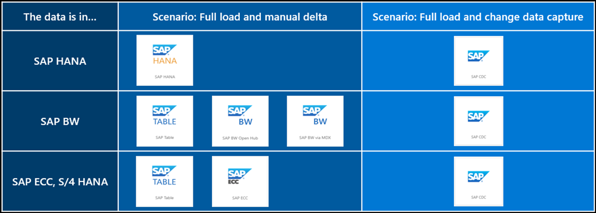

# Different connectors and electing the optimal one

APPLIES TO:  Azure Data Factory Azure Synapse Analytics
SAP applications often run several mission critical and core business processes, and therefore generate a huge amount valuable business data. Moreover, there are a plethora of different SAP applications and solutions across both OLTP such as ECC, CRM, SCM, as well as OLAP such as BW. In addition, SAP applications expose data in several different ways. Therefore, SAP data integration can be a large and complex project. 

# Design considerations for integrating SAP data with Azure

Azure Data Factory and Azure Synapse Analytics pipelines provide several ways and connectors to integrate SAP data into Azure. The approach and SAP connectors you choose will depend on several factors, such as type of SAP application, type of data and how it is exposed, volume of data and expected latency, what do you want to do with the data and where (in SAP or outside of SAP). 

We recommend the following considerations to help you determine your approach and a high-level architecture.
- Define each one of your business use cases including the expected outcome of each. Explain what problem the use case will solve or what business outcome it will achieve and how.
- Identify the applications and systems involved in the concerned SAP data flow and data classification.
- Define the data profile including SAP source systems (for example, ECC, S/4HANA, BW/4HANA, BWoH), volume and type of data (raw data or transformed data) and type of SAP objects the data is available in (for example, underlying database, SAP data dictionary tables such as EKKO, AUFK or logical objects such as CDS Views, SAP extractors, BW objects).
- Decide the right connectors for each scenario. Azure provides several different connectors to connect to SAP systems, and there may be more than one connector available for a given source system, however other factors such as data volumes, SAP product versions, can influence the choice.
- Define what needs to happen with the data (for example, cleansing, validation, transformation, enriching) and where (for example, in SAP or in Azure).
- Decide where the data will be stored (for example, data lake or data warehouse) and how it will be visualized (for example, Power BI).
- Agree the expected latency and frequency of data ingestion (for example, very low latency, every 4 hours, or daily).
- Define governance, classification, access, security, and networking requirements.
- Determine whether a single architecture pattern will serve all use cases, or you need to establish multiple patterns based on the above requirements.
- Identify various Azure services involved, skills and resources required (such as SAP, Azure data platform, security, networking) and various internal organizations involved.
- Consider running a proof of concept with well-defined goal, scope, approach, and success criteria.

> [!TIP]
> Validate that present (and future) SAP components and versions support the solution. 
> 
> When possible, connect to SAP Message Server (Group) instead of Application Server for load balancing. 
> 
> Most of the Azure connectors support connecting to SAP systems using Secure Network Communication (SNC).
> 
> Azure Data Factory and Azure Synapse Analytics pipelines provide [SAP templates](https://learn.microsoft.com/en-us/azure/data-factory/industry-sap-templates) to quickly get started with a pattern-based approach for various SAP scenarios.
> 
> Check if your SAP data extraction scenario affects SAP Licensing.
> 
> You can use ABAP [SDK for Azure](https://github.com/microsoft/ABAP-SDK-for-Azure) for tighter integration of SAP data with Azure.

 
## Choosing the optimal connector

The following considerations will help you get started with the approach based on where your data resided and in what form.
- If the data is already modeled inside an SAP application and is available to consume in the form of logical objects, use a connector that works with logical objects by connecting to NetWeaver AS ABAP.
- If the data is not modeled inside an SAP application but is available in data dictionary tables or views in the raw form, then use a connector that works with raw data by connecting to NetWeaver AS ABAP.
- If the data is available in SAP OLAP or OLTP applications, then use a connector that works with the respective application. 
- If the data is available in SAP HANA database, use the SAP HANA connector which connects to the HANA database using HANA ODBC drivers.
- There are also generic connectors available connecting to the underlying anyDB (non-SAP) databases namely, MS SQL, IBM, and Oracle.
- Lastly, it’s worth highlighting that Azure provides SAP connectors for Azure Logic Apps, Power Apps and Azure Functions to connect to various SAP applications. Although these integration scenarios cover different use cases, it is possible that there is some overlap.

> [!TIP]
>
> If there isn’t a connector available for your application or scenario, consider the feasibility of moving the data to a supported application or scenario.

The following image shows the broader choices available depending on which SAP application you want to fetch data from. 

The following table shows a summary of all SAP connectors available in Azure Data Factory and Azure Synapse Analytics for different SAP sources and scenarios along with the connector’s capabilities. 
<[!Tip!]
> The supported connectors and capabilities usually depend on SAP product instance (for example, BW on HANA vs BW/4HANA) as well as its release. For details, please refer to the production documentation for each connector. 
>
>To learn about overall support for the SAP data integration scenario, see [SAP data integration](https://github.com/Azure/Azure-DataFactory/blob/main/whitepaper/SAP%20Data%20Integration%20using%20Azure%20Data%20Factory.pdf) whitepaper with detailed introduction on each SAP connector, comparison and guidance.

| SAP Source | Type of data |	Azure’s connectors | Supported objects and mode | Protocol and connection| Authentication | Additional information |  Parallelization and performance| Data volumes |
|---|---|---|---|---|---|---|---|---|
| SAP applications based on NetWeaver AS ABAP such as SAP ECC, S/4HANA, CRM, SRM,BW on HANA, BW/4HANA |	Raw data | SAP CDC (*via SLT) | All transparent, pooled and cluster tables support full load and CDC. Certain views (SE11) support full load and CDC | RFC calls to NetWeaver application and message server | Basic SNC | Prerequisites | Yes, Fast with built-in parallel loading based on configurable partitioning | Large |
| SAP applications based on NetWeaver AS ABAP such as SAP ECC, S/4HANA, CRM, SRM, BW on HANA, BW/4HANA | Logical objects | SAP CDC | ABAP CDS views support full load, many of them support delta (e.g., based on time stamps, or triggers), SAP extractors (standard as well as custom) support full load and may also support delta based on configuration, BW InfoProviders such as DSO, ADSO, InfoCubes, MultiProvider, CompositeProvider, Query (if exposed as InfoProvider) support full load and may also support delta subject to support in SAP and based on configuration | RFC calls to NetWeaver application and message server | Basic, SNC |	Prerequisites | Yes, Fast with built-in parallel loading based on configurable partitioning | Large |
| SAP applications based on NetWeaver AS ABAP such as SAP ECC, S/4 HANA, BW on AnyDB, BW on HANA (*BW/4HANA not supported) | Raw data | SAP Table | All transparent, pooled and cluster tables and views (SE11) support full load. You can also extract changes with manual watermarking using timestamp or unique ID column |  RFC calls to NetWeaver application and message server | Basic, SNC | Prerequisites | Yes | Fast with built-in parallel loading based on configurable partitioning | Large |
| BW on AnyDB, BW on HANA (*BW/4HANA not supported) | Logical objects | SAP BW Open Hub | BW objects exposed via Open Hub Destination (OHD) local table such as DataSources, DSO, InfoCube, MultiProvider, CompositeProvider, Query (if exposed as InfoProvider) support full load. Delta is supported if the OHD supports delta | RFC calls to NetWeaver application and message server | Basic | Prerequisites (Create SAP OHD in SAP BW to expose data) | Yes, Fast with built-in parallel loading based on OHD specific schema | Large |
| BW on AnyDB, BW on HANA (*BW/4HANA not supported) | Logical objects | SAP BW via MDX | BW InfoCubes and QueryCubes (including BEx queries) support full load, Delta is not supported | RFC calls to NetWeaver application server | Basic | Prerequisites | Slower | Small |
| SAP ECC, S/4 HANA | Raw data or logical objects | SAP ECC  (*via SAP Gateway) | Any objects exposed by OData services such as SAP tables, views, BAPI objects, extractors, data or IDOCs sent to SAP PI that can be received as OData via relative adapters, support full load. You can also extract changes with manual watermarking using timestamp or unique ID column |  HTTP (OData) calls to NetWeaver application and message server | Basic | Prerequisites - Set up SAP Gateway, activate OData service, and expose entities | Slower |	Small |
| SAP HANA | Raw data or logical objects| SAP HANA | HANA database row and column tables, information models (analytic and calculation views) and custom query all support full load. You can also extract changes with manual watermarking using timestamp or unique ID column | ODBC calls to HANA database|  Basic, Windows (SSO) |	Prerequisites | Yes,  Fast with built-in parallel loading based on configurable partitioning |	Large |
| SAP Cloud for Customer (SaaS CRM) | Raw data or logical objects | SAP C4C | This is a bi-directional connector; it can copy data from and to SAP C4C | Objects that can be exposed by OData services from SAP C4C are supported | HTTP (OData) calls to SaaS service | Basic | Slower | Small | 

It is possible that there is more than one connector available for a certain scenario and the choice will depend on which connector offers you the best possible integration capabilities. However, a good starting point is to consider using the connector that integrates with a higher layer (for example, SAP application instead of the database). The following tables show you the suggested decision direction.

