# SAP data integration with Azure: Performance and troubleshooting

This article is Part 3 of the SAP extend and innovate data: Best practices series. For more information, see [Identify SAP data sources](./sap-lza-identify-sap-data-sources.md) and [Choose the best SAP connector](./sap-lza-choosing-azure-connectors.md).

There are many ways to connect to the SAP system for data integration. The following article describes general and connector-specific considerations and recommendations.

## Performance

It's important to configure optimal settings for the source and target so you can achieve the best performance during data extraction and processing.

### General considerations

- Ensure the correct SAP parameters are set for a max concurrent connection.
- Consider using SAP Group logon type for better performance and load distribution.
- Ensure that the SHIR virtual machine is sized adequately and is highly available.
- When you work with very large datasets, check if the connector you're using provides a partitioning capability. Many of the SAP connectors support partitioning and parallelizing capabilities to speed up data loads. When you use this method, data is packaged into smaller chunks that can be loaded by using several parallel processes. Check connector-specific documentation for more details.

### General recommendations

- Use the SAP transaction RZ12 to modify values for max concurrent connections.

   **SAP parameters for RFC - RZ12**: The following parameter can restrict the number of RFC calls that are allowed for one user or one application, so ensure that this isn't causing a bottleneck.

   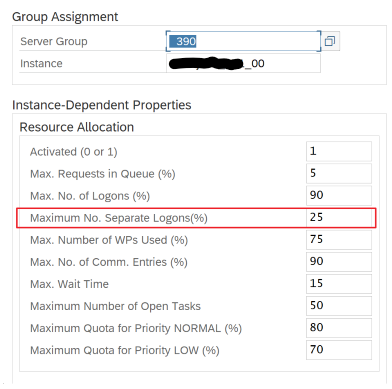

   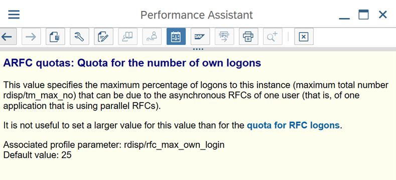

- **Connection to SAP by using Logon Group**: SHIR (self-hosted integration runtime) should connect SAP by using an SAP Logon Group (via message server) and not to a specific application server to ensure a workload distribution across all available application servers.

  > [!NOTE]
  > Dataflow spark cluster and SHIR are powerful. Many internal SAP copy activities, for example 16, can be triggered and executed. But if the SAP server's concurrent connection number is small, for example 8, it affects the perf to read data from the SAP side.

- Start with 4vCPUs and 16 GB VMs for SHIR. The following steps show the connection of the dialog work process in SAP with SHIR.

  1. Check if the customer uses a poor physical machine to setup and online the SHIR to run an internal SAP copy.
  2. Go to the Azure Data Factory portal and find the related SAP CDC linked service that's used in dataflow. Check the referenced SHIR name.
  3. Check the CPU, memory, network, and disk settings of the physical machine where SHIR is installed.
  4. Check how many `diawp.exe` are running on the SHIR machine. One `diawp.exe` can run one copy activity. The number of `diawp.exe` is based on the machine's CPU, memory, network, and disk settings.

   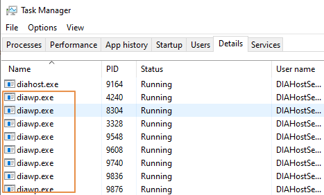

- If you want to run multiple partitions in parallel on SHIR at the same time, use a powerful virtual machine to set up SHIR. Or use scale out by using SHIR high availability and scalability features to have multiple nodes. For more information, see [/azure/data-factory/create-self-hosted-integration-runtime?tabs=data-factory#high-availability-and-scalability](/azure/data-factory/create-self-hosted-integration-runtime?tabs=data-factory#high-availability-and-scalability).

## Partitions

The following section describes the partitioning process for a SAP CDC connector. The process is the same for a SAP Table and SAP BW OpenHub connector.

Scaling can be performed on the self-hosted IR or the Azure IR depending on your performance requirements. Review the CPU consumption of the SHIR to provide you metrics to help you decide on your scaling approach. The SHIR can be vertically or horizontally scaled based on your needs. We recommend that you deploy the Azure IR at a lower SKU and then scale up to meet your performance requirements as determined through load testing rather than starting at the higher end unnecessarily.
> [!NOTE]
> If you're reaching 70% capacity, scale up or scale out for SHIR.

Partitioning is useful for initial or large full loads and is typically not required for delta loads. If you don't specify the partition, by default, 1 "producer" in the SAP system (typically one batch process) fetches the source data into the operational data queue (ODQ), and SHIR fetches the data from ODQ. By default, SHIR uses four threads to fetch the data from ODQ, so potentially four dialog processes are occupied in SAP at that time.

The idea of partitioning is to split a large initial dataset into multiple smaller disjointed subsets that are ideally equal in size and that can be processed in parallel. This method reduces the time it takes to produce the data from the source table into the ODQ in a linear way. This method assumes that there are sufficient resources on the SAP side to handle the load.

> [!NOTE]
>
>- The number of partitions executed in parallel are limited by the number of driver cores in the Azure IR. A resolution for this limitation is currently underway.
>- Each unit or package in SAP transaction ODQMON is a single file in the staging folder.

### SAP change data capture (CDC) connector

#### Design considerations when running the pipelines using CDC

- Check the SAP to stage duration.
- Check the runtime performance in the sink.
- Consider using the partitioning feature to enhance performance for better throughput.
- If the SAP to stage duration is slow, consider resizing SHIR to higher specifications.

    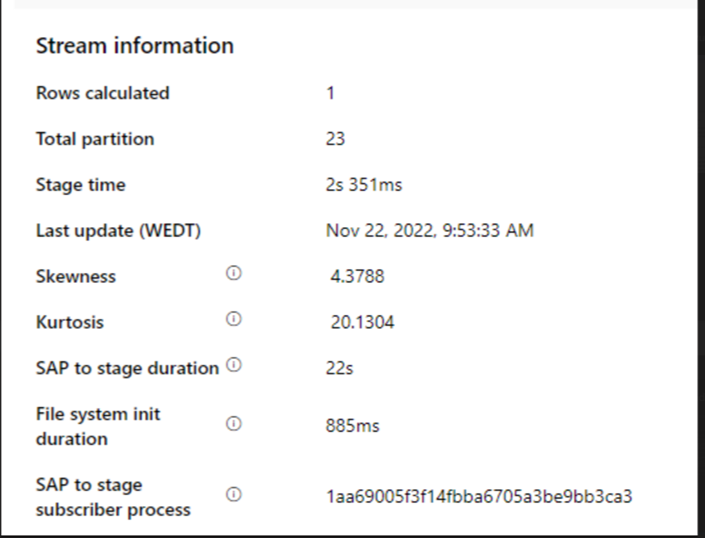

- Check if the sink processing time is too slow.

    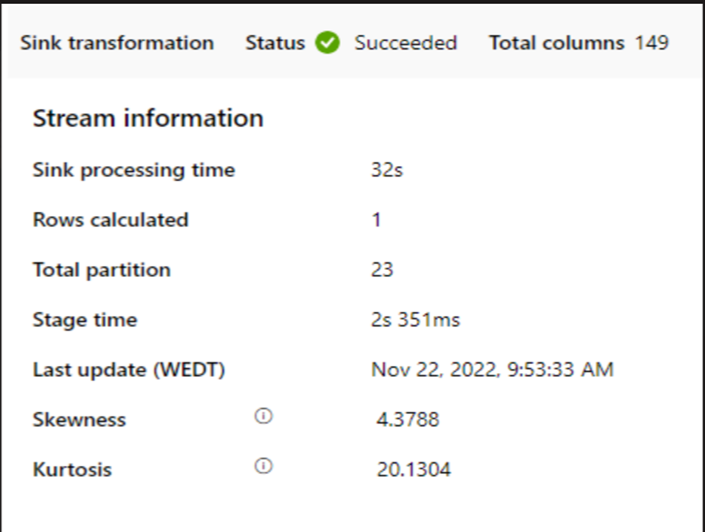

    If a very small cluster is used to run the mapping data flow, this could affect the performance at the sink. Use a large cluster, for example 16 + 256 cores, so the perf reads the data from the stage and writes into the sink.

- For large data volumes, we recommend partitioning the load to run parallel jobs, but keep the number of partitions less than or equal to the Azure IR core, also called the Spark cluster core.

  Use the Optimize tab to define the partitions. You can use source partitioning in the CDC connector.

    

  > [!NOTE]
  >
  >- There's a direct correlation between the number of partitions with SHIR cores and Azure IR nodes.
  >- The SAP CDC connector is listed as Odata subscriber type "Odata access for Operational Data Provisioning" under ODQMON in the SAP system.

### SAP Table connector

#### Design considerations when using Table connector

- Consider Optimizing The partitioning for better Performance
- Consider the degree of parallelism from SAP table.
- Consider Single file design for target Sink.
- Benchmarking the throughput when using large data volumes.

#### Design recommendations when using Table connector

- **Partitioning:** Partitioning in SAP table connector effectively splits one underlying select statement into several using where clauses on a suitable field (for example, a field with high cardinality). If your SAP table has a large volume of data, enable partitioning to split the data into smaller partitions. Try to optimize the number of partitions (parameter _maxPartitionsNumber_) such that the partitions are small enough to avoid memory dumps in SAP, but large enough to speed up extraction.

- **Parallelism:** Degree of copy parallelism (parameter _parallelCopies_) works in tandem with partitioning and instructs the SHIR to make multiple parallel    RFC calls to the SAP system. For example, if you set this parameter to four, the service concurrently generates and runs four queries based on your specified partition option and settings, and each query retrieves a portion of data from your SAP table.

     For optimum results, the number of partitions should be a multiple of number of the degree of copy parallelism.

     When copying data from SAP table to binary sinks, the actual parallel count is adjusted automatically based on the amount of memory available in SHIR. Therefore, it is recommended to record the SHIR VM size for each test cycle in addition to the degree of copy parallelism and the number of partitions. Observe the performance of SHIR VM, performance of source SAP system, desired vs actual degree of parallelism and use an iterative process to identify the optimum settings and the ideal size for SHIR VM considering all ingestion pipelines that will simultaneously load data from one or multiple SAP systems.

     Note the observed number of RFC calls to SAP against the configured degree of parallelism. If you observe that the number of RFC calls to SAP is less than the degree of parallism, verify that the SHIR virtual machine has enough memory and CPU resources available and choose a larger virtual machine if necessary. Another reason for this is that the source SAP system is configured to limit the number of parallel connections, this is explained in generic recommendations in this article.

- **Number of files:** When copying data into a file-based data store and the targeted sink is configured to be a folder, then multiple files are generated by default, but if you set the "fileName" property in the sink, the data will be written to a single file. It's recommended to write to a folder as multiple files to obtain a much higher write throughput compared to writing to a single file.

- **Performance benchmarking:** When it comes to ingesting large amounts of data, we recommend performance benchmarking exercise by varying different parameters such as partitioning, degree of parallelism, number of files to determine the optimum setting for the given architecture, volume and type of data. Gather data from various tests in following format.

     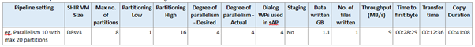

## Troubleshooting

#### Considerations & Recommendations

- Design consideration for Troubleshooting when Extraction from the SAP system is slow or failing – Troubleshoot using SAP logs from SM37 & matching with telemetry in data factory.

Recommendations –

  - If only one Batch job is triggered, please set SAP source partitions to have performance improvement in the Mapping Data flow in the data factory. Please refer to point 6 in [Transform data from an SAP ODP source with the SAP CDC connector in Azure Data Factory or Azure Synapse Analytics - Azure Data Factory & Azure Synapse | Microsoft Learn](https://learn.microsoft.com/en-us/azure/data-factory/connector-sap-change-data-capture#mapping-data-flow-properties)

  - If multiple batch jobs are triggered in the SAP system and each batch job's start-time has big difference, please change the size of Azure Integration Runtime (IR). Increasing the number of driver nodes in Azure Integration Runtime will increase the parallelism of batch jobs in the SAP side.

      > [!NOTE]
      > Please note that the maximum number of driver nodes for Azure IR is 16 and one cannot go beyond that. Currently each driver node can only trigger one batch processes but this limitation might change in the future. This is a current limitation.

- Check the logs in SHIR 

- **Viewing logs:** Go to SHIR Virtual machine and open Event viewer -\> Applications and service logs -\> Connectors -Integration runtime

- **Sending logs to support:** Go to SHIR vm -\> Integration Runtime configuration manager -\> Diagnostic -\> Send Logs. This will send the logs from last 7 days and provide you a "report ID". You will need this report ID and RunId of your run. DONT FORGET to copy the "Report ID" shown to you when you have sent it as you only see it once.

- When using SAP CDC connector with SLT Scenario

    - Ensure that all pre-requisites are met.
       SLT scenario - Roles required for the SLT user (eg ADFSLTUSER) in OLTP systems (eg ECC) for SLT replication to work. --\> [2658517 - What authorizations and roles are needed? - SLT](https://launchpad.support.sap.com/#/notes/2658517)

    - If you face errors using SLT scenario, please see the recommendations for analysis. 
       Isolate and test the scenario within SAP solution first, i.e. test it outside of ADF by running the test program provided by SAP **RODPS\_REPL\_TEST** in **SE38.** If the issue is on the SAP side, you will get the same error when using this report. You can further analyse the data extraction in SAP using transaction code **ODQMON**.

       If the replication works using this test report, but not with ADF, then contact the Azure / ADF support.

       Here is an example screenshot

       **SE38 --\> RODPS\_REPL\_TEST**

       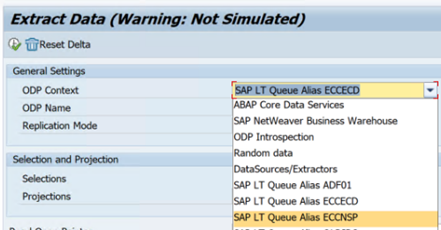

       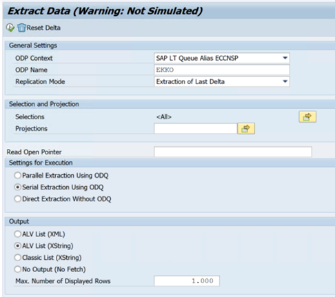

       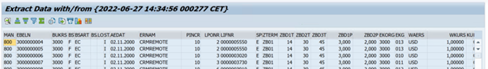

       **Transaction code: ODQMON**

       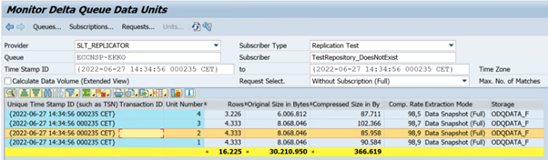

    - ADF Linked Service connecting to SLT system doesn't show SLT Mass Transfer IDs when you refresh "Context"

       

       In order to run the ODP/ODQ replication scenario for SAP LT Replication Server, activate the following BAdI (Business Add-In) implementation.

       BAdi : BADI\_ODQ\_QUEUE\_MODEL

       Enhancement Implementation : ODQ\_ENH\_SLT\_REPLICATION

       Activate it using the expert function "Activate / Deactivate BAdI Implementation" in transaction LTRC.

       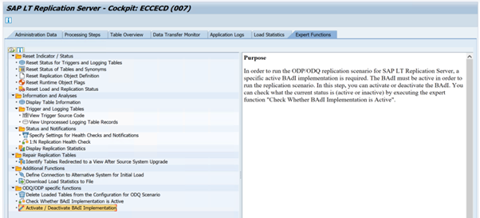

       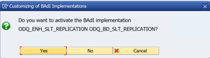

       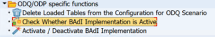

       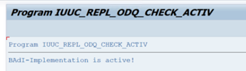

