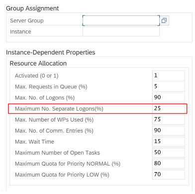
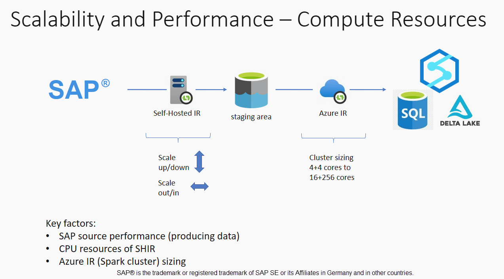

# Performance and troubleshooting for SAP data extraction

This article is part of the "SAP extend and innovate data: Best practices" article series.

- [Identify SAP data sources](./sap-lza-identify-sap-data-sources.md)
- [Choose the best SAP connector](./sap-lza-choose-azure-connectors.md)
- [Performance and troubleshooting for SAP data extraction](./sap-lza-data-extraction-performance-troubleshooting.md)
- [Data integration security for SAP on Azure](./sap-lza-data-integration-security.md)
- [SAP data integration generic architecture](./sap-lza-data-reference-architecture.md)

There are many ways to connect to the SAP system for data integration. The sections below describes general and connector-specific considerations and recommendations.

## Performance

It's important to configure optimal settings for the source and target so you can achieve the best performance during data extraction and processing.

### General considerations

- Ensure the correct SAP parameters are set for a max concurrent connection.
- Consider using the SAP Group logon type for better performance and load distribution.
- Ensure that the SHIR virtual machine is sized adequately and is highly available.
- When you work with large datasets, check if the connector you're using provides a partitioning capability. Many of the SAP connectors support partitioning and parallelizing capabilities to speed up data loads. When you use this method, data is packaged into smaller chunks that can be loaded by using several parallel processes. For more information, see connector-specific documentation.

### General recommendations

- Use the SAP transaction RZ12 to modify values for max concurrent connections.

   **SAP parameters for RFC - RZ12**: The following parameter can restrict the number of RFC calls that are allowed for one user or one application, so ensure that this restriction isn't causing a bottleneck.

   

   

- **Connection to SAP by using Logon Group**: SHIR (self-hosted integration runtime) should connect to SAP by using an SAP Logon Group (via message server) and not to a specific application server to ensure a workload distribution across all available application servers.

  > [!NOTE]
  > Dataflow Spark cluster and SHIR are powerful. Many internal SAP copy activities, for example 16, can be triggered and executed. But if the SAP server's concurrent connection number is small, for example 8, the perf reads data from the SAP side.

- Start with 4vCPUs and 16-GB VMs for SHIR. The following steps show the connection of the dialog work process in SAP with SHIR.

  1. Check if the customer uses a poor physical machine to set up and install SHIR to run an internal SAP copy.
  2. Go to the Azure Data Factory portal and find the related SAP CDC linked service that's used in the data flow. Check the referenced SHIR name.
  3. Check the CPU, memory, network, and disk settings of the physical machine where SHIR is installed.
  4. Check how many `diawp.exe` are running on the SHIR machine. One `diawp.exe` can run one copy activity. The number of `diawp.exe` is based on the machine's CPU, memory, network, and disk settings.

   

- If you want to run multiple partitions in parallel on SHIR at the same time, use a powerful virtual machine to set up SHIR. Or use scale out by using SHIR high availability and scalability features to have multiple nodes. For more information, see [High availability and scalability](/azure/data-factory/create-self-hosted-integration-runtime?tabs=data-factory#high-availability-and-scalability).

## Partitions

The following section describes the partitioning process for an SAP CDC connector. The process is the same for an SAP Table and SAP BW Open Hub connector.

Scaling can be performed on the self-hosted IR or the Azure IR depending on your performance requirements. Review the CPU consumption of the SHIR to view metrics to help you decide on your scaling approach. The SHIR can be vertically or horizontally scaled based on your needs. We recommend that you deploy the Azure IR at a lower SKU. Scale up to meet your performance requirements as determined through load testing, rather than starting at the higher end unnecessarily.
> [!NOTE]
> If you're reaching 70% capacity, scale up or scale out for SHIR.

Partitioning is useful for initial or large full loads and is typically not required for delta loads. If you don't specify the partition, by default, 1 "producer" in the SAP system (typically one batch process) fetches the source data into the operational data queue (ODQ), and SHIR fetches the data from ODQ. By default, SHIR uses four threads to fetch the data from ODQ, so potentially four dialog processes are occupied in SAP at that time.

The idea of partitioning is to split a large initial dataset into multiple smaller disjointed subsets that are ideally equal in size and that can be processed in parallel. This method reduces the time it takes to produce the data from the source table into the ODQ in a linear way. This method assumes that there are sufficient resources on the SAP side to handle the load.

> [!NOTE]
>
>- The number of partitions executed in parallel are limited by the number of driver cores in the Azure IR. A resolution for this limitation is currently underway.
>- Each unit or package in SAP transaction ODQMON is a single file in the staging folder.

## Design considerations when running the pipelines using CDC

- Check the SAP to stage duration.
- Check the runtime performance in the sink.
- Consider using the partitioning feature to enhance performance for better throughput.
- If the SAP to stage duration is slow, consider resizing SHIR to higher specifications.

    

- Check if the sink processing time is too slow.

    

    If a small cluster is used to run the mapping data flow, it could affect the performance at the sink. Use a large cluster, for example 16 + 256 cores, so the perf reads the data from the stage and writes into the sink.

- For large data volumes, we recommend partitioning the load to run parallel jobs, but keep the number of partitions less than or equal to the Azure IR core, also called the Spark cluster core.

  Use the **Optimize** tab to define the partitions. You can use source partitioning in the CDC connector.

    

  > [!NOTE]
  >
  >- There's a direct correlation between the number of partitions with SHIR cores and Azure IR nodes.
  >- The SAP CDC connector is listed as Odata subscriber type "Odata access for Operational Data Provisioning" under ODQMON in the SAP system.

## Design considerations when using a Table connector

- Optimize the partitioning for better performance.
- Consider the degree of parallelism from SAP Table.
- Consider a single file design for the target sink.
- Benchmark the throughput when you use large data volumes.

## Design recommendations when using a Table connector

- **Partitioning:** When you partition in the SAP Table connector, it splits one underlying select statement into several by using where clauses are on a suitable field, for example a field with high cardinality. If your SAP table has a large volume of data, enable partitioning to split the data into smaller partitions. Try to optimize the number of partitions (parameter `maxPartitionsNumber`) so that the partitions are small enough to avoid memory dumps in SAP but large enough to speed up extraction.

- **Parallelism:** The degree of copy parallelism (parameter `parallelCopies`) works in tandem with partitioning and instructs the SHIR to make parallel RFC calls to the SAP system. For example, if you set this parameter to 4, the service concurrently generates and runs four queries based on your specified partition option and settings. Each query retrieves a portion of data from your SAP table.

    For optimum results, the number of partitions should be a multiple of the number of the degree of copy parallelism.

    When you copy data from SAP Table to binary sinks, the actual parallel count is automatically adjusted based on the amount of memory that's available in SHIR. Record the SHIR VM size for each test cycle, the degree of copy parallelism, and the number of partitions. Observe the performance of the SHIR VM, the performance of the source SAP system, and the desired vs. the actual degree of parallelism. Use an iterative process to identify the optimum settings and the ideal size for the SHIR VM. Consider all ingestion pipelines that simultaneously load data from one or multiple SAP systems.

    Note the observed number of RFC calls to SAP against the configured degree of parallelism. If the number of RFC calls to SAP is less than the degree of parallelism, verify that the SHIR VM has enough memory and CPU resources available. Choose a larger virtual machine if necessary. The source SAP system is configured to limit the number of parallel connections. For more information, see the [General recommendations](#general-recommendations) section in this article.

- **Number of files:** When you copy data into a file-based data store and the targeted sink is configured to be a folder, multiple files are generated by default. If you set the `fileName` property in the sink, the data is written to a single file. It's recommended that you write to a folder as multiple files because it obtains a higher write throughput compared to writing to a single file.

- **Performance benchmarking:** We recommend using the performance benchmarking exercise to ingest large amounts of data. This method varies parameters, such as partitioning, degree of parallelism, and the number of files to determine the optimum setting for the given architecture, volume, and type of data. Gather data from tests in the following format.

  

## Troubleshooting

- For troubleshooting when extraction from the SAP system is slow or failing, use SAP logs from SM37 and match with the readings in Azure Data Factory.

- If only one batch job is triggered, set the SAP source partitions to have performance improvement in the mapping data flow in Azure Data Factory. For more information, see step 6 in [Map data flow properties](/azure/data-factory/connector-sap-change-data-capture#mapping-data-flow-properties).

- If multiple batch jobs are triggered in the SAP system, and there's a significant difference between each batch job's start time, change the size of Azure IR. When you increase the number of driver nodes in Azure IR, the parallelism of batch jobs in the SAP side increase.

    > [!NOTE]
    > The maximum number of driver nodes for Azure IR is 16. Each driver node can only trigger one batch processes. This limitation might change in the future.

- Check the logs in SHIR.

- To view logs, go to SHIR VM. Open Event viewer > Applications and service logs > Connectors > Integration runtime.

- To send logs to support, go to SHIR VM. Open the Integration Runtime configuration manager > Diagnostic > Send Logs. This action sends the logs from the last seven days and provides you with a report ID. You need this report ID and RunId of your run. Document the report ID for future reference.

- When you use the SAP CDC connector in an SLT scenario:

  - Ensure that prerequisites are met.
    Roles are required for the SLT user, for example ADFSLTUSER, in OLTP systems, for example ECC, for SLT replication to work. For more information about roles, see [What authorizations and roles are needed](https://launchpad.support.sap.com/#/notes/2658517).

  - If errors occur in an SLT scenario, see the recommendations for analysis. Isolate and test the scenario within the SAP solution first. For example, test it outside of ADF by running the test program provided by SAP `RODPS_REPL_TEST` in SE38. If the issue is on the SAP side, you get the same error when you use the report. You can analyze the data extraction in SAP by using the transaction code `ODQMON`.

    If the replication works when you use this test report, but not with ADF, contact Azure or ADF support.

    The following example shows a report for `RODPS_REPL_TEST` in SE38.

    

    

    

    The following example shows the transaction code `ODQMON`.

    

  - When ADF Linked Service connects to the SLT system, it doesn't show the SLT Mass Transfer IDs when you refresh the **Context** field.

    

  - To run the ODP/ODQ replication scenario for SAP LT Replication Server, activate the following business add-in (BAdI) implementation.

    BAdI: `BADI_ODQ_QUEUE_MODEL`

    Enhancement implementation: `ODQ_ENH_SLT_REPLICATION`

    1. In transaction LTRC, go to the **Expert Function** tab and select **Activate / Deactivate BAdI Implementation** to activate the implementation.

       

    1. Select **Yes**.

       

    1. In the **ODQ/ODP specific functions** folder, select **Check Whether BAdI Implementation is Active**.

       

       The dialog shows the program activity.

       

  - Resetting subscriptions - If you want to start with a fresh extraction or stop replication data then you can remove the subscription directly in the ODQMON.
    This will also remove entries from LTRC. This is done by the master controller job so it may take a couple of mins between resetting the subscription in ODQMON and seeing the effect in LTRC. Its best practice to schedule ODP housekeeping jobs to keep the delta queues clean. ( for e.g. ODQ_CLEANUP_CLIENT_004 )

  - CDS_VIEW - (DHCDCMON transaction) – Starting from release S/4 HANA 1909 , SAP has introduced a new way of replicating data from CDS_Views which uses data 
    based triggers instead of date columns. The overall concept is similar to SLT however, you don’t use the LTRC transaction to monitor it, instead use DHCDCMON transaction. 

## SLT Troubleshooting
SAP LT Replication Server (SLT) allows real-time data replication from SAP sources and/or non-SAP sources to SAP targets and/or non-SAP targets.
There are three types of toolsets to monitor the extraction from SLT to Azure. 
  - ODQMON - This is the overall monitoring tool for Data Extraction. Recommendation is to start the analysis with ODQMON. It allows you to track data inconsistencies, initial performance analysis, open subscriptions and extraction requests. 
  - LTRC – If your issue is with Data replication from source system to ODP, this is the transaction that you should look at including performance analysis. It allows you to monitor dataflow and can be used when you see inconsistencies in the extracted data. 
  - SM37 – Detailed monitoring of each SLT extraction Step. 

Typical problems that you may encounter when extracting data from SLT
  - No extraction is happening – Please check if SAP CDC connection has created a connection in ODQMON and check if the subscription exists. 
  - Data Inconsistencies – Please check odqmon to see the individual request of data and confirm that you can see data there. If you can see the data in ODQMON but not in Azure Synapse or ADF then most likely the investigation should happen on Azure side. If you cannot see the data in ODQMON then perform analysis of the SLT framework using LTRC. 
  - Performance Problems – The extraction happens using two step approach. Firstly, SLT reads data from the source system and transfers them to ODP. Then SAP CDC connector picks up the data from ODP and transfers it to the chosen data store. The LTRC transaction allows you to analyse the first part of the extraction process. For analysing the data extraction from ODP to Azure, use ODQMON and ADF/Synapse monitoring tools. 
  - Housekeeping – The normal housekeeping should be done using ODQMON where you can managing the subscription directly and you should not use LTRC for the same.  

   > [!NOTE]
   > For more details, please refer this 
   > [SLT blog1](https://techcommunity.microsoft.com/t5/running-sap-applications-on-the/sap-cdc-connector-and-slt-part-1-overview-and-architecture/ba-p/3775190)
   > [SLT blog2](https://techcommunity.microsoft.com/t5/running-sap-applications-on-the/sap-cdc-connector-and-slt-part-2-initial-configuration/ba-p/3780884)

## SLT Performance 

- Initial load mode – (ODPSLT) – There are three steps to extract data from SLT into ODP. 
      -   Creating migration Objects which usually takes a couple of seconds.
      - 	Access plan calculation that splits the source table into smaller chunks. 
          This step depends on the Initial load mode that one selected during SLT configuration and highly depends on the size of the table. We usually recommending going with the Resource Optimized Option. 
      - 	Data load – That transfers the data form the source system to ODP. 

  Each step is controlled by the background jobs. One can use the SM37 and LTRC transaction to monitor the duration. It may happen that if your system is overutilized, there would be a delay in starting the background jobs due to the lack of free batch work processes. This can highly impact the performance, since the tasks are idle and waiting to start. 

  If the access plan calculation takes a significant amount of time and your initial load mode is set to Performance optimized , try with changing it to resource optimized and retriggering the extraction. If the data load takes significant amount of time, you can increase the no. of parallel threads in the configuration. 

> [!NOTE]
> The LTRC user interface varies between releases and it may look different based on your release type. Here are some screenshots for the same. 
     
  
      
  

- If you are using standalone architecture for SLT replication (dedicated SLT replication server), the network throughput between the source system and replication server might impact the performance of the extraction. 

- Replication – 
    -  Ensure that you have enough data transfer jobs that are not reserved for the initial load. 
    -  Check that you don’t have unprocessed logging table record in the load statistics.
    -  Ensure that replication options is set to real-time. 

- Advance replication settings are available in LTRS for further tuning of data replication. 

For more details please refer to [SLT troubleshooting guide from SAP](https://help.sap.com/doc/bc5f2d71bca841bab3cf601c746cf902/16.0.4.0/en-US/Replication_Server_Troubleshooting_Guide_en.pdf) 

   
## Monitoring
To monitor the SAP Data extraction, we recommend to check these two places 
  - Monitor SAP Data extraction in ADF/Synapse pipelines - Please refer to ADF monitoring guide to get detailed step by step instructions [Visually monitor Azure Data Factory -  Azure Data Factory | Microsoft Learn](/azure/data-factory/monitor-visually)
  - Monitoring in SAP system for CDC - 
        - ODQMON – Use transaction ODQMON for monitoring the (operational) delta queues. For more details please refer to SAP's [documentation](https://help.sap.com/doc/saphelp_nw74/7.4.16/en-US/7b/5bce89037f4897a69b02ecda028517/frameset.htm) 
        -	Use SM37/36, SM50 transactions in SAP system. 

## Next steps

- [SAP Data Integration Security](./sap-lza-data-integration-security.md)
