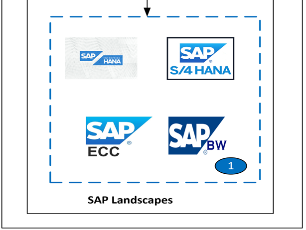
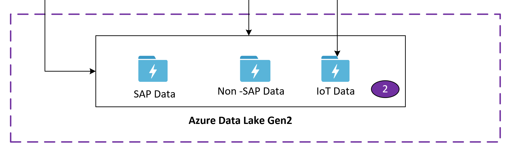
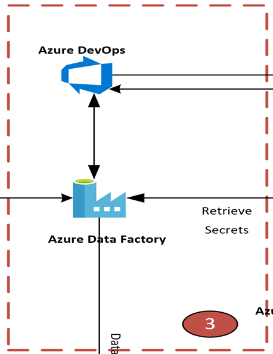
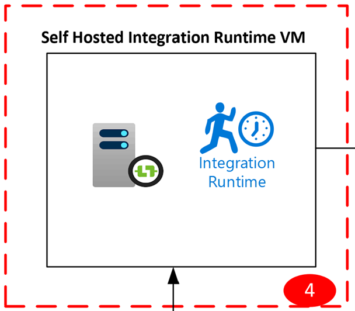
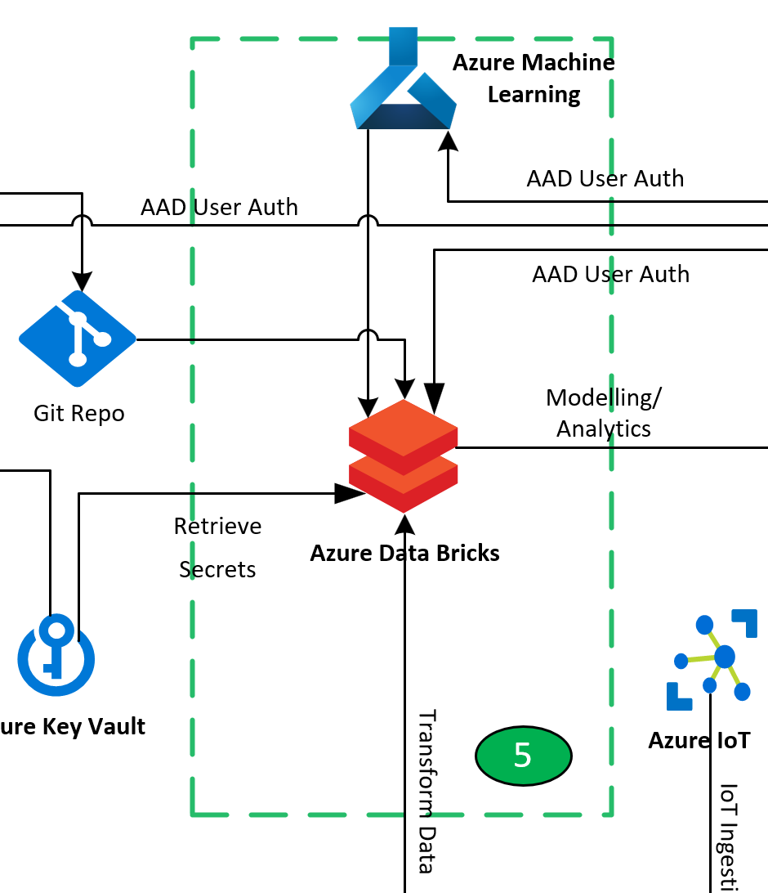
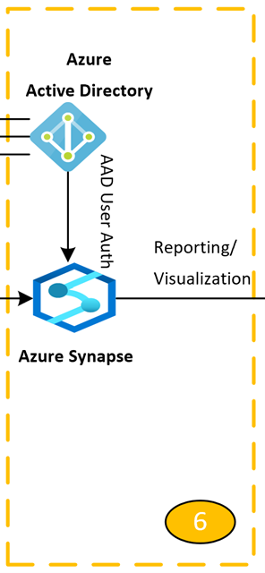

# Data integration security for SAP on Azure

This article is part of the "SAP extend and innovate data: Best practices" article series.

- [Identify SAP data sources](./sap-lza-identify-sap-data-sources.md)
- [Choose the best SAP connector](./sap-lza-choose-azure-connectors.md)
- [Performance and troubleshooting for SAP data extraction](./sap-lza-data-extraction-performance-troubleshooting.md)
- [Data integration security for SAP on Azure](./sap-lza-data-integration-security.md)
- [SAP data integration generic architecture](./sap-lza-data-reference-architecture.md)

The sections below describes different security layers in SAP Extend Scenarios, breaks down each component and provides considerations and recommendations on them. Azure Data Factory management resources are built on Azure security infrastructure and use all possible security measures offered by Azure.

Data Ingestion Layer:

- SAP S/4 HANA/SAP BW4HANA/ SAP Enterprise HANA
- Azure Data Lake Gen2
- Azure Data Factory
- Self-Hosted Integration Runtime VM

The following diagram is a reference architecture of an SAP Data Integration Security on Azure. Use the reference architecture as a starting point. You can download the [Visio file](https://raw.githubusercontent.com/microsoft/CloudAdoptionFramework/master/ready/sap-extend-security-architecture-updated.vsdx) and modify it to fit your specific business and technical requirements.

:::image type="content" source="./media/sap-extend-security-architecture.svg" border="false" alt-text="Diagram that shows the SAP Data Integration Security architecture on Azure.":::

## SAP security

The source systems referenced in the diagram - section 1

The SAP Security Guide has detailed security guidance on various SAP products. Consider analyzing the following security recommendations in the SAP guidance:

- [SAP BW security Guide](https://help.sap.com/docs/SAP_BW4HANA/d3b558c9e49d4eb495c99c63a0ae549a/4f0b56878a585f86e10000000a42189b.html?q=SAP%20Bw4HANA%20security)
- [SAP S4HANA security](https://help.sap.com/doc/d7c2c95f2ed2402c9efa2f58f7c233ec/2020/en-US/SEC_OP2020.pdf)
- [SAP HANA Security](https://help.sap.com/doc/eec734dbb0fd1014a61590fcb5411390/2.0.05/en-US/SAP_HANA_Security_Guide_en.pdf)

## Security for Azure ADLS Gen2

ADLS2 section 2

Considerations and Recommendations for Azure Data Lake Gen2  

- Authorize access to data in Azure Storage - Each time you access data in your storage account, your client application makes a request over HTTP/HTTPS to Azure Storage. By default, every resource in Azure Storage is secured, and every request to a secure resource must be authorized. Understand different options that Azure Storage offers for authorizing access to data. Microsoft recommends using Azure AD credentials to authorize requests to data when possible for optimal security and ease of use. See further details [here](/azure/storage/common/authorize-data-access?toc=%2Fazure%2Fstorage%2Fblobs%2Ftoc.json&bc=%2Fazure%2Fstorage%2Fblobs%2Fbreadcrumb%2Ftoc.json#protect-your-access-keys)

- Consider the use of Azure role-based access control (Azure RBAC) to manage a security principal's permissions to blob, queue, and table resources in a storage account. You can also use Azure attribute-based access control (ABAC) to add conditions to Azure role assignments for blob resources. See further details here - Authorize access to Azure Blob Storage using Azure role assignment conditions - [Azure Storage](/azure/storage/blobs/storage-auth-abac)

- Consider the security recommendations for Blob storage from Data protection, Identity and access management, Networking, Logging/Monitoring perspective mentioned. See [Security recommendations for Blob storage](/azure/storage/blobs/security-recommendations)

- Access control model in Azure Data Lake Storage Gen2: Data Lake Storage Gen2 supports the following authorization mechanisms:
  - Role-based access control (Azure RBAC)
  - Access control lists (ACLs)
  - Security groups
  - Shared Key and Shared Access Signature (SAS) authorization

  Consider applying the recommendations based on the details here - [Access control model](/azure/storage/blobs/data-lake-storage-access-control-model)

- Access control lists (ACLs) in Azure Data Lake Storage Gen2: There are two kinds of Access control lists (ACLs) in Azure Data Lake Storage Gen2. Always use Azure AD security groups as the assigned principal in an ACL entry. Resist the opportunity to directly assign individual users or service principals. Using this structure will allow you to add and remove users or service principals without the need to reapply ACLs to an entire directory structure. Instead, you can just add or remove users and service principals from the appropriate Azure AD security group.
  - Access ACLs  - Access ACLs control access to an object. Files and directories both have access ACLs.
  - Default ACLs - Default ACLs are templates of ACLs associated with a directory that determine the access ACLs for any child items that are created   under that directory. Files do not have default ACLs.

  Further details available here - [Access control lists](/azure/storage/blobs/data-lake-storage-access-control)

## Azure Data Factory security

ADF section 3

- Consider the Security considerations for data movement in Azure Data Factory for the following scenarios mentioned [here](/azure/data-factory/data-movement-security-considerations)
- Cloud scenario: In this scenario, both your source and your destination are publicly accessible through the internet. These include managed  cloud storage services such as Azure Storage, Azure Synapse Analytics, Azure SQL Database, Azure Data Lake Store, Amazon S3, Amazon Redshift, SaaS services such as Salesforce, and web protocols such as FTP and OData. Find a complete list of supported data sources in Supported data stores and formats.

- Hybrid scenario: In this scenario, either your source or your destination is behind a firewall or inside an on-premises corporate network. Or the data store is in a private network or virtual network (most often the source) and is not publicly accessible. Database servers hosted on virtual machines also fall under this scenario.

- Data access strategies: A vital security goal of an organization is to protect their data stores from random access over the internet, might it be an on-premises or a Cloud/ SaaS data store. Typically, a cloud data store controls access using the below mechanisms:
  - Private Link from a Virtual Network to Private Endpoint enabled data sources
  - Firewall rules that limit connectivity by IP address
  - Authentication mechanisms that require users to prove their identity
  - Authorization mechanisms that restrict users to specific actions and data

    Consider the data access strategies mentioned here - [Data access strategies](/azure/data-factory/data-access-strategies)

- Consider Storing credentials in Azure Key Vault: You can store credentials for data stores and computes in an Azure Key Vault. Azure Data Factory retrieves the credentials when executing an activity that uses the data store/compute. Please see details here - [Store credentials in Azure Key Vault](/azure/data-factory/store-credentials-in-key-vault)

- Consider the use of Azure Key Vault to store credentials or secret values in an Azure Key Vault pipeline activities. Please see details here - Use Azure Key Vault secrets in pipeline activities - [Azure Data Factory](/azure/data-factory/how-to-use-azure-key-vault-secrets-pipeline-activities)

- Consider encrypting credentials for on-premises data stores in Azure Data Factory: You can encrypt and store credentials for any of your on-premises data stores (linked services with sensitive information) on a machine with self-hosted integration runtime. Please see details here - [Encrypt credentials in Azure Data Factory](/azure/data-factory/encrypt-credentials-self-hosted-integration-runtime)

- Consider the use of Managed identity for Azure Data Factory: Managed identities eliminate the need to manage credentials. Managed identities provide an identity for the service instance when connecting to resources that support Azure Active Directory (Azure AD) authentication.
There are two types of supported managed identities:
  - **System-assigned** and **User-assigned**
  - See [Managed identity](/azure/data-factory/data-factory-service-identity) for more details.

- Depending on your security policies, consider the encryption of Azure Data Factory with customer-managed keys. Please see the details [here](/azure/data-factory/enable-customer-managed-key)

- Consider the use of Azure Data Factory managed virtual network: When you create an Azure integration runtime within a Data Factory managed virtual network, the integration runtime is provisioned with the managed virtual network. It uses private endpoints to securely connect to supported data stores. Currently, the managed virtual network is only supported in the same region as the Data Factory region. Please see the details here - [Managed virtual network and managed private endpoints](/azure/data-factory/managed-virtual-network-private-endpoint)

- Consider using Azure Private Link for Azure Data Factory: By using Azure Private Link, you can connect to various platform as a service (PaaS) deployment in Azure via a private endpoint. A private endpoint is a private IP address within a specific virtual network and subnet. For a list of PaaS deployments that support Private Link functionality. Please see the details here - [Azure Private Link for Azure Data Factory](/azure/data-factory/data-factory-private-link)

## Self-Hosted Integration runtime VM connections and security

Self-Hosted Integration Runtime (SHIR) - section 4

- Consider the details mentioned [here](/azure/data-factory/data-movement-security-considerations) for On-premises data store credentials:  The credentials can be stored within Data Factory or be referenced by Data Factory during the runtime from Azure Key Vault. If storing credentials within data factory, it is always stored encrypted on the Self-Hosted Integration Runtime.

- Consider the setup of Integration Runtime based on network configuration. The following table summarizes the network and self-hosted integration runtime configuration recommendations based on different combinations of source and destination locations for hybrid data movement.

| **Source**  | **Destination**   | **Network Configuration**   | **Integration Runtime Setup**  |
| ----------- | ----------------- |  -------------------------- | -----------------------------  |
|On-Premises| Virtual machines and cloud services deployed in virtual networks | IPSec VPN (point-to-site or site-to-site)|The self-hosted integration runtime should be installed on an Azure virtual machine in the virtual network |
|On-Premises  | Virtual machines and cloud services deployed in virtual networks | ExpressRoute (private peering) | The self-hosted integration runtime should be installed on an Azure virtual machine in the virtual network |
| On-Premises | Azure-based services that have a public endpoint | ExpressRoute (Microsoft peering) | The self-hosted integration runtime can be installed on-premises or on an Azure virtual machine|

- The following images show the use of self-hosted integration runtime for moving data between an on-premises database and Azure services by using ExpressRoute and IPSec VPN (with Azure Virtual Network) – Consider the firewall configurations and allow list setting up for IP addresses mentioned. See [Security considerations for data movement in Azure Data Factory](/azure/data-factory/data-movement-security-considerations)

**ExpressRoute Private Peering**:

:::image type="content" source="./media/sap-security-expressroute.svg" border="false" alt-text="Diagram that shows ExpressRoute on Azure.":::

**IPSec VPN**:

:::image type="content" source="./media/sap-extend-security-ipsec.svg" border="false" alt-text="Diagram that shows IPSec VPN on Azure.":::

- Ensure that the IP address of the self-hosted integration runtime machine is allowed or configured in the firewall appropriately. The following  cloud data stores require that you allow the IP address of the self-hosted integration runtime machine. Some of these data stores, by default, might not require allow list.
  - Azure SQL Database
  - Azure Synapse Analytics
  - Azure Data Lake Store
  - Azure Cosmos DB
  - Amazon Redshift
  
   For further details, see [Security considerations for data movement in Azure Data Factory](/azure/data-factory/data-movement-security-considerations) and  [Create and configure a self-hosted integration runtime](/azure/data-factory/create-self-hosted-integration-runtime?tabs=data-factory)

## Azure Databricks Security

Azure Databricks Section 5

Consider the Azure security baseline for Azure Databricks mentioned here - [Azure security baseline for Azure Databricks](/security/benchmark/azure/baselines/azure-databricks-security-baseline?toc=%2Fazure%2Fdatabricks%2Ftoc.json). This security baseline applies guidance from the Microsoft cloud security benchmark version 1.0 to Azure Databricks. The Microsoft cloud security benchmark provides recommendations on how you can secure your cloud solutions on Azure.

## Azure Synapse Security

Azure Synapse Security - Section 6

Azure Synapse implements a multi-layered security architecture for end-to-end protection of your data. There are five layers:

- Data protection to identify and classify sensitive data, and encrypt data at rest and in motion – Consider the [Data protection - Azure Synapse Analytics](/azure/synapse-analytics/guidance/security-white-paper-data-protection) whitepaper to understand options available for data discovery & classification, governance and encryption recommendations.

- Access control to determine a user's right to interact with data - Azure Synapse supports a wide range of capabilities to control who can access what data. Consider the recommendations mentioned in the [Security whitepaper](/azure/synapse-analytics/guidance/security-white-paper-access-control)

- Authentication to prove the identity of users and applications – Authentication is the process of proving the user is who they claim to be. Authentication activities can be logged with Azure SQL Auditing, and an IT administrator can configure reports and alerts whenever a login from a suspicious location is attempted. Consider the recommendations mentioned in the [Authentication Security whitepaper](/azure/synapse-analytics/guidance/security-white-paper-authentication)

- Network security to isolate network traffic with private endpoints and virtual private networks - To secure Azure Synapse, there are a range of network security options to consider. Consider the details mentioned in the [Network Security whitepaper](/azure/synapse-analytics/guidance/security-white-paper-network-security)

- Threat protection to identify potential security threats, such as unusual access locations, SQL injection attacks, authentication attacks, and more. Consider the details mentioned in the [Threat Protection Whitepaper](/azure/synapse-analytics/guidance/security-white-paper-threat-protection)

## Data presentation layer

Power BI Security: For detailed information about Power BI security, see the [Power BI Security white paper](/power-bi/guidance/whitepaper-powerbi-security)

To plan for Power BI security, see the Power BI implementation planning [security series of articles](/power-bi/guidance/powerbi-implementation-planning-security-overview). It expands upon the content in the Power BI Security white paper.

## Next steps

- [Example Architecture](./sap-lza-data-reference-architecture.md)
