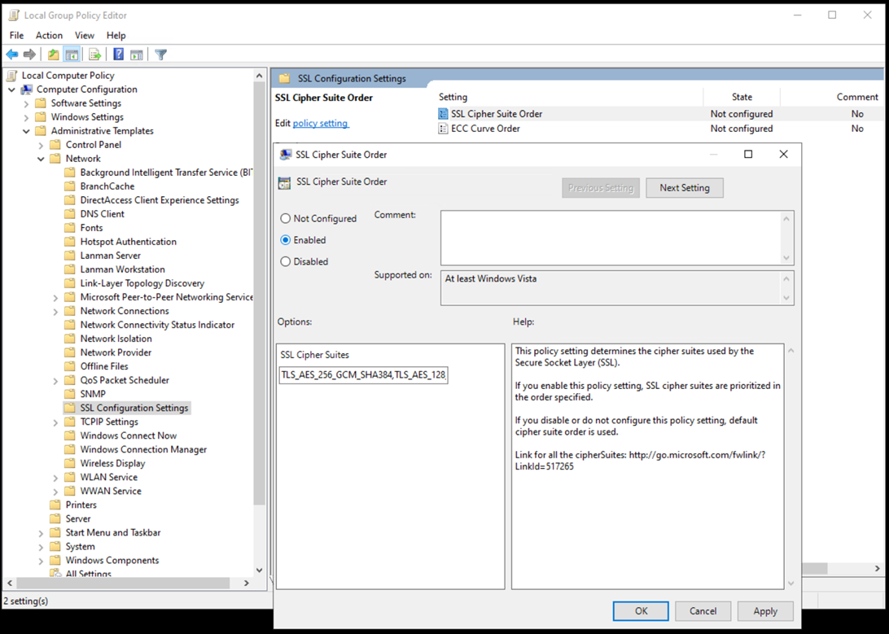

# SQL Server database security for SAP on Azure

This article is part of the "SAP extend and innovate security: Best practices" article series.

- [SQL Server database security for SAP on Azure](./sap-lza-database-security.md)
- [Microsoft Sentinel for SAP on Azure](./sap-lza-sentinel-for-sap.md)
- [Security operations for SAP on Azure](./sap-lza-security-operations.md)

The sections below provides the **considerations and recommendations** for SAP on Azure running on SQL database.

## Secure data at rest

The [SQL Server transparent data encryption (TDE)](/sql/relational-databases/security/encryption/transparent-data-encryption) encrypts the data and log files for user databases and SQL Server system databases. After it's encrypted, copies of the data and log files or backup files can't be restored and used without the associated certificates. This process is called securing data at rest. It's a transparent technology to the SAP system, so it's supported by [SAP note 1380493 - SQL Server TDE](https://me.sap.com/notes/1380493).

For information about the procedure, see [SQL Server encryption](/sql/relational-databases/security/encryption/sql-server-encryption).

All data pages that are read or written to disk must be encrypted or decrypted, so TDE has a CPU penalty. When TDE is applied to a user database, the CPU usage increases between 3% and 8%. Applications that heavily use TempDB of SQL Server or perform large scans on large tables are more affected. When at least one user database on the SQL Server instance is encrypted with TDE, the system databases, like TempDB, are also encrypted. SAP Business Warehouse Systems (SAP BW) is an example of this type of application.

> [!NOTE]
>If the encryption keys or certificates are lost, the data in the encrypted database is lost. It's important to establish extensive processes and steps to secure the certificate backups.

A successful TDE implementation needs:

- Good and thorough testing.
- Well-designed processes for handling certificates and certificate backups.

Real-time replication between a TDE-enabled database on SQL Server and SAP HANA doesn’t work and isn't supported. For more information, see [SAP OSS note 2812637 - Real-time replication isn't supported for TDE-enabled MSSQL Server database](https://me.sap.com/notes/2812637/E).

## Unsupported SQL Server features

SQL Server also offers other features for data protection. These methods allow partial encryption or masking on database column granularity:

- [SQL Server column encryption](/sql/relational-databases/security/encryption/encrypt-a-column-of-data)
- [SQL Server dynamic data masking](/sql/relational-databases/security/dynamic-data-masking)
- [SQL Server always encrypted](/sql/relational-databases/security/encryption/always-encrypted-database-engine)

Based on the restrictions of these three methods and the changes they require on many areas of the SAP NetWeaver components, these functionalities aren't supported by SAP.

## Backup encryption

Backup encryption is when you encrypt the backup file while the backup is taken. It encrypts all the data pages in the backup file and creates a certificate or asymmetric key requirement to restore the backup file, which prevents an unauthorized restore.

If the database isn’t encrypted with TDE before the encrypted backup is taken, it still isn’t encrypted after the restore. Only the backup files get encrypted. The database file and its content aren’t altered.

You can use backup encryption with TDE, but it’s not beneficial  because the data is already encrypted in the database files and in the backup files. When you use backup encryption and TDE together, the encrypted database with the TDE certificate or key-encrypted data pages are encrypted again with the backup certificate or key. This method prolongs the backup process and adds extra CPU load to the system while the backup process runs.

## Secure your SQL Server and SAP system

Server and operating system-level hardening are essential to a secure running system.

Adhere to the following recommendations to secure your [SQL Server](/sql/relational-databases/security/securing-sql-server) and your SAP system. For more information, see [SAP OSS note 2417205](https://me.sap.com/notes/2417205).

SQL Server is based on the Windows implementation of the Transport Layer Security (TLS) protocol and the Secure Sockets Layer (SSL) protocol through the SChannel Security Support Provider (SSP).

You can disable the SSL protocol because TLS is widely used and supported. Most of the SQL Server and SAP product support use the strong [TLS 1.2](https://support.microsoft.com/topic/kb3135244-tls-1-2-support-for-microsoft-sql-server-e4472ef8-90a9-13c1-e4d8-44aad198cdbe) protocol, with the even stronger [TLS 1.3](/sql/relational-databases/security/networking/tds-8-and-tls-1-3) already planned.

You can control most of the security settings for the Schannel SSP through registry changes in the corresponding SCHANNEL branch. With these settings, you can control:

- Which protocols, like SSL and TLS, are enabled for the client and server part of the dialog.
- The ciphers, for example RC2, RC4, Triple DES, and AES, that are enabled and the order that they're enabled.
- The hash algorithms, for example MD5 and SHA.
- The key exchange algorithms, for example Diffie-Hellman and ECDH.

The various combinations of these parts (protocol, cipher, hash and key exchange algorithm) are represented in cipher suites. By disabling one of these parts, for example protocol SSL 2.0, all cipher suites that contain this part are unusable for the system.

> [!NOTE]
>When you combine multiple changes, it can easily lead to a situation where the client, for example the SAP System, and the server, for example SQL Server, can't use a cipher suite to communicate, and the SAP System can no longer start.

You can also control the priority and availability of cipher suites on the system in the local group policy editor.

1. Go to Local Computer Policy > Computer Configuration > Administrative Templates > Network > SSL Configuration Settings.
1. Define a [custom SSL cipher suite order](/windows/client-management/mdm/policy-csp-admx-ciphersuiteorder).

  
This list order defines the priority that the system uses cipher suites. If you remove a cipher suite from the list, it's no longer usable in the system. The group policy setting has priority over the SCHANNEL registry setting. The security department usually controls this setting based on group policies. But the SAP Basis or SQL Server database administration group handle the resulting connection issues.

Consider using the SAP tool, SCoTT, to analyze problems with disabled protocols or cipher suites. The tool can analyze connection problems between the SAP System, like ABAP and Java, and the SQL Server that runs on Linux or Windows. For more information, see [SAP note 2846170](https://me.sap.com/notes/2846170/E).

## Authentication

Here are some considerations for authentication with SAP on Azure.

- **SAP Netweaver on SQL Server**:
  - This type of system has specific requirements for the SAP and SQL Server startup accounts, authentication to the SQL Server instance, SAP database, and DBA access.
  - For more information, see [SAP note 1645041 - Microsoft SQL Server logins and their usage in SAP environments](https://me.sap.com/notes/1645041/E).

- **SAP ABAP NetWeaver System**:
  - It doesn't require SQL Server logins because all connections use Windows Authentication. For example, with the user `SAPService<SID>` or `<sid>adm`.
  - You can disable the SQL Server Authentication feature.

- **SAP JAVA NetWeaver System**:
  - The SQL Server Authentication is needed because the system uses a SQL Server login (`SAP<SID>DB`) for the connection.

- **SAP on SQL Server**:
  - You can disable the SQL Server system administrator account (sa) because the SAP systems on SQL Server don't use the account.
  - Ensure that another user with sysadmin rights can access the server before disabling the sa account.

- **A high-availability system that uses SQL Server AlwaysOn**:
  - Has specific requirements for logins, users, and jobs. All servers that are connected to the system must have the exact same logins and users, so the SAP System can connect even after a failover to another node occurs.
  - All SAP-related SQL Server jobs must have the same owner on all AlwaysOn nodes.
  - To synchronize these setting for logins, users, and jobs, see [Always On - Synchronize SAP login, jobs, and objects](https://techcommunity.microsoft.com/t5/running-sap-applications-on-the/always-on-synchronize-sap-login-jobs-and-objects/ba-p/367942).

- **SQL injections**:
  - [SQL injection](/sql/relational-databases/security/sql-injection) is when malicious code merges into SQL statements that are executed on the SQL Server.
  - When a report is executed within the SAP system, it generates generic SQL statements from the ABAP code of the report. The statements are sent to and transformed by the SAP database layer for SQL Server.
  - This database layer is integrated into the SAP work process and isn't accessible from the outside. After the transformation into SQL Server-specific statements, they're sent to the database, executed and the result returned to the calling report. The only place where these statements could be manipulated is between the database layer of the SAP System and the SQL Server instance (Man-in-the-middle attack).
  - This can prevented when the SAP System is using encrypted connections between the work process and the SQL Server database. In the transaction DBACockpit a rudimentary SQL command window is implemented, where some basic SQL statements can be executed. The access to this transaction is described in note 1027512 - MSSQL: DBA cockpit for basis release 7.00 and later.

## Auditing

- **Disable `xp_cmdshell`**
  - The SQL Server feature `xp_cmdshell` enables an SQL Server internal OS command shell and is often classified as a potential risk in security audits.
  - Installing SAP turns this feature on to gather and display operating system data in transaction `DBACockpit`.
  - The setting can be disabled, and the only effect will be that a minority of monitoring data won't be available in transaction `DBACockpit`
  - Any system with `xp_cmdshell` disabled will display a warning message in the `DBACockpit Message Window` so that you know why data is missing.
  - If `xp_cmdshell` is turned off, see SAP KBA 2283909 - Side effect in monitoring.
  - Additionally, [SAP Note 3019299 - Security Audit Questions or Security Customization in NetWeaver and SQL Server systems](https://me.sap.com/notes/3019299/E) gives more details on questions on security audits.

- **Configure virus scanners correctly**:
  - SAP supports virus scanners to protect the machines against viruses and other malware. But on the other hand, a wrongly configured virus scanner can cause huge performance problems or even database corruption. See [SAP note 106267 - Virus scanner software on Windows](https://service.sap.com/sap/support/notes/106267) on how to setup and configure a virus scanner for the operating system when used for an SAP NetWeaver system. For the usage with a Microsoft SQL Server database several configurations have to be made to avoid performance and corruption problems. These are summarized in this Microsoft Support article:[How to choose antivirus software to run on computers that are running SQL Server](https://support.microsoft.com/topic/how-to-choose-antivirus-software-to-run-on-computers-that-are-running-sql-server-feda079b-3e24-186b-945a-3051f6f3a95b)

## Next steps

- [Sentinel for SAP](./sap-lza-sentinel-for-sap.md)
