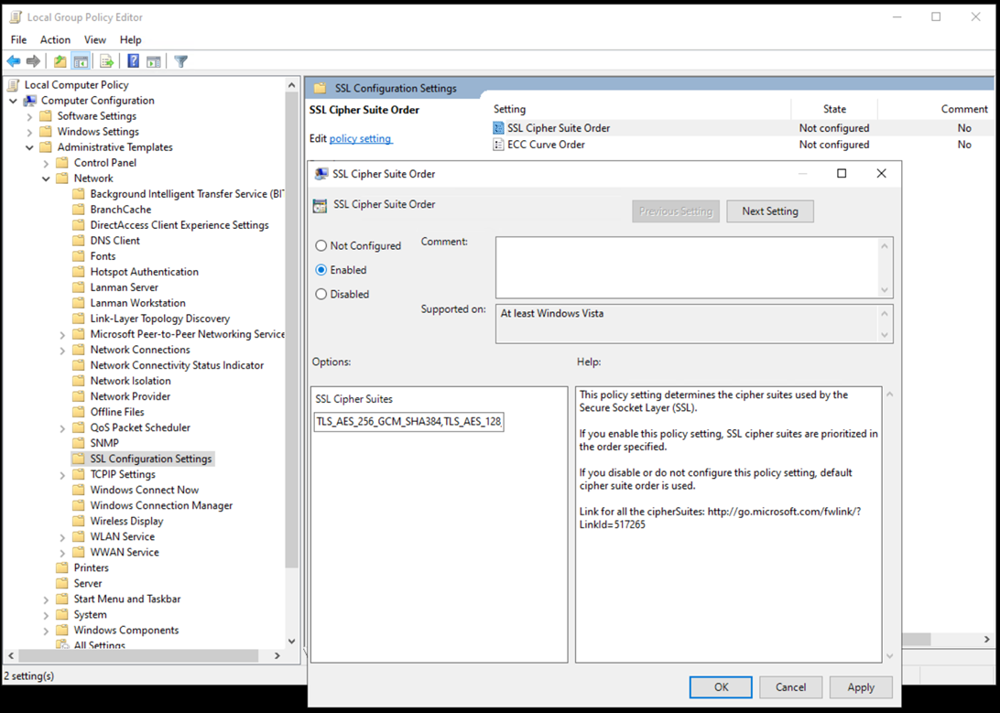

# SAP Security on Azure: SAP on SQL Server Database Security

This article is part of the "SAP extend and innovate security: Best practices" article series.

- [SAP Security on Azure: SAP on SQL Server Database Security](./sap-lza-sap-database-security.md) (this article)
- [SAP Security on Azure: Sentinel for SAP](./sap-lza-sentinel-for-sap.md)
- [SAP Security on Azure: Security Operations](./sap-lza-sap-security-operations.md)
- [SAP data integration security on Azure](./sap-lza-data-integration-security.md)
- [SAP data integration Reference Architecture](./sap-lza-data-reference-architecture.md)

The sections below provides the **considerations and recommendations** for SAP on Azure running on SQL database.

## Secure-at-rest

The [SQL Server transparent data encryption (TDE)](/sql/relational-databases/security/encryption/transparent-data-encryption?view=sql-server-ver16) encrypts the data and log files of user databases and of SQL Server system databases. It ensures that copies of the data and log files or backup files can't be restored and used without the associated certificates. It's known as securing data at rest. As it's a transparent technology to the SAP System it's supported by SAP (Note 1380493 - SQL Server Transparent Data Encryption (TDE)).

The general procedure is explained in the [SQL Server Encryption Microsoft Learn article](/sql/relational-databases/security/encryption/sql-server-encryption?view=sql-server-ver16).

As all data pages that are read or written to disk must be encrypted or decrypted, TDE comes with a CPU penalty. When applied to a user database the CPU usage increases between 3 % and 8 %. Applications that make heavy use of the TempDB of SQL Server or doing large scans on large tables are more affected, as the system databases including TempDB are encrypted as well when at least one user database on the SQL Server instance is encrypted with TDE. SAP Business Warehouse Systems (SAP BW) are a good example of this kind of application.

> [!NOTE]
>If the keys or the certificates that are used for the encryption are lost, then the data in the encrypted database is lost. Therefore, extensive processes and steps need to be taken to secure backups of certificates.

The success of implementing TDE heavily depends on:

- Good and thorough testing
- Well-designed processes around the handling of certificates and their backups

Real-time replication between a TDE-enabled database on SQL Server and SAP HANA doesn’t work and isn't supported, please see SAP OSS note 2812637 -  Real-time replication isn't supported for TDE-enabled MSSQL Server database for details.

## Always Encrypted

Besides TDE, SQL Server offers more features for data protection. These allow partial encryption or masking on database column granularity with:

- [SQL Server column encryption](/sql/relational-databases/security/encryption/encrypt-a-column-of-data?view=sql-server-ver16)
- [SQL Server Dynamic Data Masking](/sql/relational-databases/security/dynamic-data-masking?view=sql-server-ver16)
- [SQL Server Always Encrypted](/sql/relational-databases/security/encryption/always-encrypted-database-engine?view=sql-server-ver16)

Based on the strong restrictions of these three methods and the changes these would require on many areas of the SAP NetWeaver components, these SQL Server functionalities aren't supported by SAP to be used or applied.

## Backup Encryption

One can choose to encrypt the backup file while the backup is taken, this is called Backup Encryption. This encrypts all the data pages in the backup file and prevents the unauthorized restore of the backup file, as you need a certificate or asymmetric key for the restore.

If the database wasn't encrypted (with TDE) before the encrypted backup was taken, it will not be encrypted after the restore. It's only the backup files that get encrypted, the database file and its content won't be touched.

Backup Encryption can be used with TDE, but adds no benefit, as the data is already encrypted, not only in the database files but also in the backup files. When it's used together with TDE, the already encrypted database with the TDE certificate or key encrypted data pages are encrypted again with backup certificate or key. This only prolongs the backup process and adds additional CPU load to the system while the backup process is running.

## Secure-in-transit

Server and OS level hardening are essential to a secure running system.

Ensure that you follow the recommendations below when securing your [SQL server](/sql/relational-databases/security/securing-sql-server?view=sql-server-ver16) and your SAP System, please see SAP OSS note 2417205

SQL Server is based on the Windows implementation of the Transport Layer Security (TLS) protocol and the Secure Sockets Layer (SSL) protocol through the SChannel Security Support Provider (SSP).

The SSL protocol should be disabled as TLS as the successor is widely used and supported. Most of the SQL Server and SAP product support nowadays use the strong [TLS 1.2](https://support.microsoft.com/topic/kb3135244-tls-1-2-support-for-microsoft-sql-server-e4472ef8-90a9-13c1-e4d8-44aad198cdbe) protocol, with the even stronger [TLS 1.3](/sql/relational-databases/security/networking/tds-8-and-tls-1-3?view=sql-server-ver16) already planned.

Most of the security settings for the Schannel Security Support Provider can be controlled through registry changes in the
corresponding SCHANNEL branch. With these settings one can control the following:

- Which protocols (SSL, TLS) are enabled for the client and server part of the dialog
- The ciphers (for example, RC2, RC4, Triple DES, AES) that are enabled and in which order.
- The hash algorithms (for example, MD5, SHA) that can be used.
- The Key Exchange Algorithms that are usable (for example, Diffie-Hellman, ECDH)

The various combinations of these parts (Protocol, Cipher, Hash and Key Exchange Algorithm) are represented in so called cipher suites. By disabling one of these parts (for example, protocol SSL 2.0) all cipher suites that contain this part will be unusable for the system.

> [!NOTE]
>Combining multiple changes can easily lead to a situation where the client (e.g., the SAP System) and the server (SQL Server) cannot use a cipher suite to communicate, and the SAP System cannot start anymore.

- An additional way to control the priority and availability of cipher suites on the system is the local group policy editor.
Under "Local Computer Policy -> Computer Configuration -> Administrative Templates -> Network -> SSL Configuration Setting" one can define a [custom SSL Cipher Suite Order](/windows/client-management/mdm/policy-csp-admx-ciphersuiteorder)

  By changing this list, the priority in which the different cipher suites are used by the system can be changed. Removing cipher suites from this list results in a situation that this cipher suite is no longer usable in the system. This group policy setting has priority over the SCHANNEL registry setting described earlier.
  This setting is often changed and controlled by group policies by the security department, but the resulting connection issues have to be handled by the SAP Basis or SQL Server database administration group.

- Consider using SAP tool (SCoTT) to help to analyze problems with disabled protocols or cipher suites. This tool is described in the SAP note 2846170. It can help to analyze connection problems between the SAP System (ABAP and Java) and the SQL Server, either running on Linux or Windows.

## Authentication

An SAP Netweaver on SQL Server system has specific requirements with regards to the SAP and SQL Server startup accounts, the authentication to the SQL Server instance and the SAP database, and the DBA access. It's described in the SAP note 1645041 - FAQ: Microsoft SQL Server logins and their usage in SAP environment

An SAP ABAP NetWeaver System doesn't require SQL Server logins, all connections are made using Windows Authentication (for example, with the user SAPService<SID> or <sid>adm). Therefore the SQL Server Authentication feature isn't needed and can be switched off.

If an SAP JAVA NetWeaver System is used, the SQL Server Authentication is needed, as the system is using a SQL Server login (SAP<SID>DB) for the connection

The SQL Server system administrator account (sa) isn't used from any SAP system running on SQL Server and can be disabled. One must ensure that another user with sysadmin rights can access the server before disabling the sa account.

A high availability system using SQL Server AlwaysOn technology needs special attention when it comes to logins, users, and jobs. All servers that are participating in such a system must have the exact same logins and users, so that the SAP System can connect even after a failover to another node has happened. Furthermore, all SAP-related SQL Server jobs need the same owner on all AlwaysOn nodes. To synchronize these setting for Logins, users, and jobs SAP developed a script, which you can find here: [Always On - Synchronize SAP login, jobs and objects](https://techcommunity.microsoft.com/t5/running-sap-applications-on-the/always-on-synchronize-sap-login-jobs-and-objects/ba-p/367942)

[SQL Injections](/sql/relational-databases/security/sql-injection?view=sql-server-ver16) are
when malicious code is merged into SQL statements that are executed on the SQL Server. When a report is executed within the SAP system, it generates generic SQL statements from the ABAP code of the report, which are then sent to and transformed by the SAP database layer for SQL Server. This database layer is integrated into the SAP Work process and can't be accessed from the outside. After the transformation into SQL Server specific statements, they're sent to the database, executed and the result returned to the calling report. The only place where these statements could be manipulated is between the database layer of the SAP System and the SQL Server instance (Man-in-the-middle attack) , but this can prevented when the SAP System is using encrypted connections between the work process and the SQL Server database. In the transaction DBACockpit a rudimentary SQL command window is implemented, where some basic SQL statements can be executed. The access to this transaction is described in note 1027512 - MSSQL: DBA cockpit for basis release 7.00 and later.

## Auditing

The SQL Server feature "xp_cmdshell" enables an SQL Server internal OS command shell and is often classified as a potential risk in security audits. The installation of the SAP System turns this feature on to gather and display operating system data in transaction DBACockpit. The setting can be disabled, and the only effect will be that a minority of monitoring data won't be available in transaction DBACockpit. Any system with xp_cmdshell disabled will display a warning message in the DBACockpit Message Window so that you know why data is missing, see SAP KBA 2283909 - Side effect in monitoring if the xp_cmdshell is turned off for more details. SAP Note 3019299 - Security Audit Questions or Security Customization in NetWeaver and SQL Server systems gives more details on questions on security audits.

SAP supports virus scanners to protect the machines against viruses and other malware. But on the other hand, a wrongly configured virus scanner can cause huge performance problems or even database corruption. See SAP note 106267 - Virus scanner software on Windows on how to setup and configure a virus scanner for the operating system when used for an SAP NetWeaver system. For the usage with a Microsoft SQL Server database several configurations have to be made to avoid performance and corruption problems. These are summarized in this Microsoft Support article:[How to choose antivirus software to run on computers that are running SQL Server](https://support.microsoft.com/topic/how-to-choose-antivirus-software-to-run-on-computers-that-are-running-sql-server-feda079b-3e24-186b-945a-3051f6f3a95b)

## Next steps

- [Sentinel for SAP](./sap-lza-sentinel-for-sap.md)
