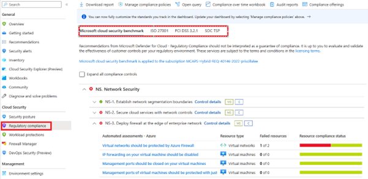
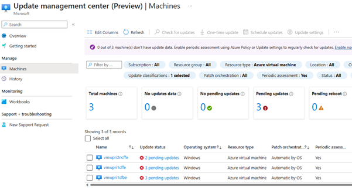

# Security operations for SAP on Azure

This article is part of the "SAP extend and innovate security: Best practices" article series.

- [SQL Server database security for SAP on Azure](./sap-lza-database-security.md)
- [Microsoft Sentinel for SAP on Azure](./sap-lza-sentinel-for-sap.md)
- [Security operations for SAP on Azure](./sap-lza-security-operations.md)

Implementing a comprehensive security operation for SAP in Microsoft Cloud is critical to ensure that organization's sensitive data and applications are protected from cyber threats. Here are some best practice security operation aspects customer can do to secure their SAP environment in Azure.

## Access Control

SAP systems are business critical systems in an enterprise landscape, control and management of access to SAP systems and applications should be based on the principle of least privilege, to ensure that only authorized personnel can access sensitive data and perform critical tasks.

- Use Role-Based Access Control (RBAC) to control access to SAP workload resources deployed in Azure. Every Azure subscription has a trust relationship with an Azure AD tenant. Microsoft recommendations:
  - Creating Azure AD group for SAP administrators
  - Use Azure RBAC to grant permissions to the SAP group

- Configure Single Sign On between SAP and Azure Active Directory or Azure Directory Federation Service (AD FS) to allow SAP users access SAP application with SAP frontend software (SAP GUI) or a browser with HTTP/S (for example, SAP Fiori)

- Azure Privileged Identity Management (PIM) - Azure Privileged Identity Management can be used to manage and assign roles to users and groups that allow them to perform privileged actions and these users only have access to the resources when they need to perform their job such as stop/start VM, and more.

  Azure PIM also provides automate access request and approval, logging and auditing capabilities for managing and controlling privileged access to your SAP system resources in Azure.

- Just-In-Time (JIT) - Additionally, JIT can be used to control temporary elevated access to critical systems to only authorized personnel. With JIT, administrators can grant temporary access to a specific VM or set of VMs only when it's necessary to perform certain tasks, such as system maintenance or troubleshooting.

- Azure Key Vault - When running SAP on Azure, Azure Key Vault can be used to manage and protect sensitive data such as SAP administrator passwords, SAP service account credentials, and encryption keys. Here are some common scenarios where Azure Key Vault can be used in SAP on Azure:

  - Secure storage of SAP passwords: SAP systems require various passwords for different components such as database, application server, and other SAP services. Azure Key Vault can be used to store these passwords securely and then retrieve them during system startup or when it's needed to access the SAP server.
  - Secure storage of encryption keys: SAP systems often require encryption for data protection. Azure Key Vault can be used to store encryption keys and protect them using HSMs (Hardware Security Modules), which are tamper-resistant devices that protect cryptographic keys.
  - Secure storage of certificates: Azure Key Vault can be used to store and manage SSL/TLS certificates, which are required for secure communication between SAP systems and other applications.

## Compliance

Azure provides a comprehensive set of security controls to help customers protect their SAP systems deployed on Azure platform. Here are some of the examples compliance offerings that are relevant for SAP systems:

- ISO/IEC 27001: Azure is certified under the ISO/IEC 27001 standard, which provides a framework for implementing and maintaining an Information
    Security Management System (ISMS). This certification covers a broad range of security controls and best practices, including network security, access control, and risk management.
- SOC 1, SOC 2, and SOC 3: Azure is audited under the SOC (Service Organization Controls) framework, which provides a set of controls for service providers to manage customer data. SOC 1 is for financial reporting, SOC 2 is for security, availability, processing integrity, confidentiality, and privacy, and SOC 3 is for public disclosure of the SOC 2 report.
- GDPR: Azure is compliant with the General Data Protection Regulation (GDPR), which is a data privacy regulation that applies to organizations that process personal data of individuals in the European Union (EU). This compliance offering includes features like data protection, data breach notification, and privacy by design.

Customers can monitor this security baseline and review recommendations, take remediation actions for non-compliance baseline for SAP workloads using Microsoft Defender for Cloud.

   

## Security patching

Keeping your systems up to date is crucial for your security posture. Generally, there are two types of security patching we focus on. Operating System (OS) security patching, and SAP security patching.

### Operating System security patching

Operating System security patches are critical for SAP workloads to prevent security breaches, comply with industry regulations, improve performance, and protect business's reputation.
SAP customers running Windows and Linux virtual machines in Azure, on-premises, and in other cloud environments can use Update Management in Azure Automation to manage operating system updates, including security patches.

Customers can automatically assess and update SAP virtual machines to maintain security compliance with Critical and Security Updates released each month. This is possible by enabling automatic VM guest patching.

> [!NOTE]
>Please be aware that some Linux images for SAP workload (RHEL-SAP and SLES-SAP) are not supported yet. However, Windows server images are supported. Details for requirements for enabling automatic VM guess patching and supported OS images information can be found [here](/azure/virtual-machines/automatic-vm-guest-patching#supported-os-images).

### SAP security patching

Apart from operating system security patching, SAP customers are also recommended to protect the security for other SAP components: database and application security. For these two components, SAP provides best practices, guidance and information in SAP notes, which are available in SAP Support portal.

It's highly recommended to review these SAP security OSS notes regularly since sometimes SAP releases high critical security patches (hot fixes) which need to be action immediately to protect your SAP systems.

The priority of an SAP Security Note is determined by its CVSS v3 base score (Common Vulnerability Scoring Systems). The Common Vulnerability Scoring System (CVSS) is an open and vendor-neutral framework for communicating the characteristics and severity of software vulnerabilities. It's designed to unify the approaches to risk assessment across multiple vendors. CVSS is under the custodial care of FIRST (Forum of Incident Response and Security Teams).
For more information, please refer [SAP Security News](https://support.sap.com/en/my-support/knowledge-base/security-notes-news.html)
