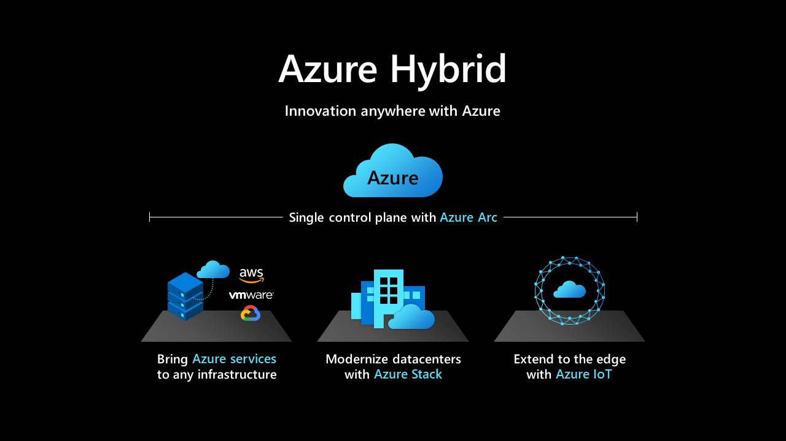

# Introduction to hybrid and multicloud products on Azure

**DEL**During these challenging times, businesses are shifting priorities to enable remote work, taking advantage of cloud innovation, and maximizing existing on-premises investments.**DEL** Relying on an effective multi-cloud, multi-edge hybrid approach is even more important than it has ever been. Azure has been hybrid by design since the beginning, focused on supporting the hybrid needs of customers, and for the last several years, has centered efforts around hybrid integration across Azure products.

As customers have grown more sophisticated in their adoption of multiple clouds, a number of Azure products have broadened that perspective to support the on-premises, multicloud, edge, and unified operations requirements of customers. Hybrid integration means that customers can consistently build and deploy apps and databases, operate seamlessly, and deliver integrated cloud security across heterogeneous environments, with unified governance and management.

This article won't introduce all of the Azure products with hybrid and multicloud capabilities, but introduces a few of the core products that can unlock this capability across your cloud portfolio.

See the [Azure hybrid and multicloud hub](https://docs.microsoft.com/hybrid/) for a deeper look at what you can do with Azure's hybrid and multicloud products.

This article series will help to integrate these tools into relevant processes—from initial business strategy to workload optimization, and long into your operations management cycles.

## Manage hybrid and multicloud environments with unified operations tools

- [Azure Arc](https://docs.microsoft.com/azure/azure-arc/?bc=%2fazure%2fcloud-adoption-framework%2f_bread%2ftoc.json&toc=%2fazure%2fcloud-adoption-framework%2ftoc.json) This cloud-based service extends the Azure Resource Manager-based management model to non-Azure resources including virtual machines (VMs), Kubernetes clusters, and containerized databases.
- [Azure Arc enabled servers](https://docs.microsoft.com/azure/azure-arc/servers/overview?bc=%2fazure%2fcloud-adoption-framework%2f_bread%2ftoc.json&toc=%2fazure%2fcloud-adoption-framework%2ftoc.json) This hybrid service allows you to manage your Windows and Linux machines, hosted outside of Azure, on your corporate network or other cloud provider. This is similar to how you manage native Azure VMs.
- [Azure Arc enabled Kubernetes](https://docs.microsoft.com/azure/azure-arc/kubernetes/overview?bc=%2fazure%2fcloud-adoption-framework%2f_bread%2ftoc.json&toc=%2fazure%2fcloud-adoption-framework%2ftoc.json) This hybrid service allows you to streamline deployment and management of Kubernetes clusters inside or outside of Azure.
- [Azure Arc enabled SQL Server](https://docs.microsoft.com/sql/sql-server/azure-arc/overview?bc=%2fazure%2fcloud-adoption-framework%2f_bread%2ftoc.json&toc=%2fazure%2fcloud-adoption-framework%2ftoc.json) This part of the Azure Arc enabled servers extends Azure services to SQL Server instances, hosted outside of Azure in the customer’s datacenter, on the edge or in a multi-cloud environment.
- [Azure Arc enabled data services](https://docs.microsoft.com/azure/azure-arc/data/overview?bc=%2fazure%2fcloud-adoption-framework%2f_bread%2ftoc.json&toc=%2fazure%2fcloud-adoption-framework%2ftoc.json) This hybrid service makes it possible to run Azure data services on-premises, at the edge, and in public clouds using Kubernetes and the infrastructure of your choice.
- [Azure Arc enabled SQL Managed Instance](https://docs.microsoft.com/azure/azure-arc/data/managed-instance-overview?bc=%2fazure%2fcloud-adoption-framework%2f_bread%2ftoc.json&toc=%2fazure%2fcloud-adoption-framework%2ftoc.json) This Azure SQL data service can be created on your choice of infrastructure that hosts Azure Arc enabled data services.

## Deploy hybrid and multicloud solutions
 
- [Azure Stack HCI (20H2)](https://docs.microsoft.com/azure-stack/hci/overview?bc=%2fazure%2fcloud-adoption-framework%2f_bread%2ftoc.json&toc=%2fazure%2fcloud-adoption-framework%2ftoc.json) This is a hyperconverged infrastructure (HCI) cluster solution that hosts virtualized Windows and Linux operating system (OS) workloads and their storage in a hybrid on-premises environment. A cluster consists of two to 16 physical nodes.
- [Azure Kubernetes Service on Azure Stack HCI](https://docs.microsoft.com/azure-stack/aks-hci/overview?bc=%2fazure%2fcloud-adoption-framework%2f_bread%2ftoc.json&toc=%2fazure%2fcloud-adoption-framework%2ftoc.json) This is an implementation of AKS, which automates running containerized applications at scale on Azure Stack HCI.
- [Azure Kubernetes Service](https://docs.microsoft.com/azure/aks/intro-kubernetes?bc=%2fazure%2fcloud-adoption-framework%2f_bread%2ftoc.json&toc=%2fazure%2fcloud-adoption-framework%2ftoc.json) This is a service that makes it simple to deploy a managed Kubernetes cluster in Azure.
- [Azure IoT Edge](https://docs.microsoft.com/azure/iot-edge/?bc=%2fazure%2fcloud-adoption-framework%2f_bread%2ftoc.json&toc=%2fazure%2fcloud-adoption-framework%2ftoc.json) Deploy cloud-based solutions to the edge of your local environment, with full support from Azure to manage those devices and the IoT data they produce.

## Connect your hybrid and multicloud environments

- [Virtual WAN](https://docs.microsoft.com/azure/virtual-wan/?bc=%2fazure%2fcloud-adoption-framework%2f_bread%2ftoc.json&toc=%2fazure%2fcloud-adoption-framework%2ftoc.json) Connect to a secure, global branching solution.
- [Express Route](https://docs.microsoft.com/azure/expressroute/?bc=%2fazure%2fcloud-adoption-framework%2f_bread%2ftoc.json&toc=%2fazure%2fcloud-adoption-framework%2ftoc.json) Establish a fast, private connection to Microsoft cloud services
- [VPN Gateway](https://docs.microsoft.com/azure/vpn-gateway/vpn-gateway-about-vpngateways?bc=%2fazure%2fcloud-adoption-framework%2f_bread%2ftoc.json&toc=%2fazure%2fcloud-adoption-framework%2ftoc.json) Send encrypted traffic to Azure
- [Azure Firewall](https://docs.microsoft.com/azure/firewall/overview?bc=%2fazure%2fcloud-adoption-framework%2f_bread%2ftoc.json&toc=%2fazure%2fcloud-adoption-framework%2ftoc.json) Fully stateful firewall as a service with built-in high availability and unrestricted cloud scalability.
