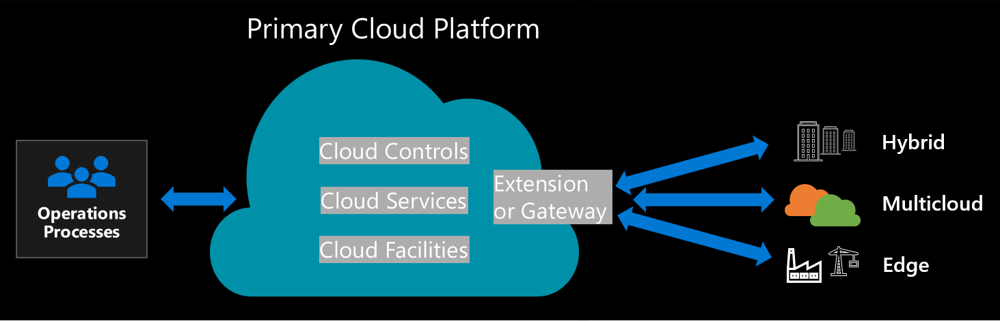

# Unified operations for hybrid, multicloud, and edge

Hybrid, multicloud, and edge deployment approaches can often lead to steep increases in operating costs. When mapping your cloud transformation journey to business outcomes, [having a fiscal conversation within your organization](https://docs.microsoft.com/azure/cloud-adoption-framework/strategy/business-outcomes/fiscal-outcomes) is necessary to understand what might affect primary cost options, such as capital expenses and operating costs.

In any hybrid and multicloud strategy, the first increase in overhead costs can manifest in the form of duplicated cloud platform utilities: network, identity, governance, security, and operations tooling. In the longer term, more negative business impacts could emerge in the form of challenges like staffing core functions or teams with the skills needed to manage diverse environments.

When [setting up a skills readiness plan](https://docs.microsoft.com/azure/cloud-adoption-framework/plan/adapt-roles-skills-processes), organizations should move toward adapting and building existing roles and skills for the cloud. Support the skills readiness plan with cross-team organizational processes to align your organization with agile practices, and required cloud functions that support developing a long-term cloud operating model.

Develop and evolve a [mature team](https://docs.microsoft.com/azure/cloud-adoption-framework/organize/organization-structures#best-practice-minimum-viable-product-mvp), starting from a Minimum viable product (MVP) that balances innovation and risk, and move towards a cross-team [CCoE model](https://docs.microsoft.com/azure/cloud-adoption-framework/organize/cloud-center-of-excellence)—with central IT as collaborative  partner. Accelerate cloud innovation, while increasing business agility with agile, cloud-first hybrid and multicloud solutions. Delegate responsibilities, and execute on modern technical abilities.

Hybrid and multicloud strategies have lead many decisions makers to falsely conclude that the cloud is more expensive than on-premises technology options. A recent Forrester Consulting study commissioned by Microsoft found that a hybrid and multi-cloud strategy can provide very significant [three-year return on investment, and substantial avoided on-premises infrastructure and staff costs](https://azure.microsoft.com/en-us/resources/forrester-tei-microsoft-azure-iaas/) for organizations. A second study by Accenture and WSP Environment & Energy concluded that cloud solutions add [significantly increased energy efficiencies for large deployments](https://download.microsoft.com/download/7/3/9/739BC4AD-A855-436E-961D-9C95EB51DAF9/Microsoft_Cloud_Carbon_Study_2018.pdf), with organizations reducing energy use and carbon emissions by more than 30 percent against business applications installed on-premise. (For small deployments, energy use and emissions can be reduced by more than 90 percent with a shared cloud service).

Organizations can modernize and optimize overall operations using a simple approach to overcoming risks—overhead cost increases, or challenges related to staffing core functions. **"Unified Operations"** is the approach to hybrid, multi-cloud, and edge cloud strategy that reduces short-term duplication and long-term strain on your technology staff. This article describes the provider-neutral approach of using unified operations to extend a control plane over distributed resources across hybrid, multi-cloud, and edge environments.

Subsequent articles will outline the Azure-specific approach to delivering [governance](./govern.md) and [operations management](./manage.md) across distributed resources with a unified operations approach. The overall goal in an Azure-specific approach to unified operations is to inventory, organize, and govern IT resources anywhere, on any infrastructure, from one central control plane—using one consistent cloud management experience across on-premises, multi-cloud, and edge environments.

## Primary cloud platform

The most successful hybrid, multicloud, and edge strategies begin with a primary cloud platform.

Whether located in a public or private cloud, your primary cloud platform is where your operational processes are hosted. There is a set of defined cloud facilities in that primary platform. In Azure, those facilities are [Azure regions](https://azure.microsoft.com/global-infrastructure/), whereas on-premises, they could be datacenters. These facilities host cloud services that are required for core operations and to support other workloads hosted on the platform. Your primary cloud platform will also include a series of controls, designed to support operations within that cloud.

> [!NOTE]
> Your primary cloud platform may not host all, or even the majority, of your workloads. But it does host the services and controls required to complete the core processes for operations management, governance, compliance, security, etc. 
>
> [!CAUTION]
> You probably already have a primary cloud platform. However, many cloud platforms were designed and built before operations required hybrid, multicloud, or edge deployment options. This has often forced customers into replicating processes—using different cloud controls to manage cloud services across each cloud platform. If your cloud strategy calls for hybrid, multicloud, or edge deployment options ***and*** your primary cloud platform doesn't support them, you should consider a platform that can deploy the requisite functionalities for unified operations.
>

## Unified operations

The concept behind unified operations is simple. Implement an extension (or gateway) in order to apply the controls in your primary cloud provider across your hybrid, multicloud, or edge deployments. Manage and govern your operations consistently—across disparate on-premises, multi-cloud, and edge resource environments.

One cloud management experience that manages operations of distributed assets at scale (porting consistent management, app development, and cloud services to any infrastructure, anywhere) brings cloud innovation to all resource environments across your entire IT estate. Enabling consistent management and governance for organizations, a gateway with cloud controls extending Azure management and Azure data services to on-premises, multi-cloud and edge enables an integral hybrid and multi-cloud strategy that can increase your future innovation, agility, and business growth, anywhere.

> [!WARNING]
> Implementation of unified operations can be relatively straightforward. But, if your cloud platform isn't able to manage unified operations, it will require additional capital expenditures, with costly development to create extensions or gateways to other clouds. Existing primary cloud platforms with these limitations is the main reason why customers create duplicated or fractured operations and processes.
>
> An inconsistent approach to implementing unified operations can multiply cost inefficiencies for your organization—with increased operating costs (from having duplicated cloud platform utilities, operations tooling), and negative business impacts (staffing teams without necessary cloud skilling).
>

If your current primary cloud provider doesn't offer the required capabilities for unified operations, consider optimizing your operations and processes using a modern cloud provider.

## Unified operations decomposed

This image displays the individual components required for unified operations, and shows how they interact with each other. The following sections provide a detailed outline for each unified operations component.

## Customer processes

The primary objective of unified operations is creating as much process consistency as possible across deployments. No cloud service provider will be able to reach 100% feature parity across all hybrid, multicloud, and edge deployments. However, the provider should be able to deliver baseline feature sets common across all deployments, so that your [governance](https://docs.microsoft.com/azure/cloud-adoption-framework/govern/) and [operations management](https://docs.microsoft.com/azure/cloud-adoption-framework/manage/) processes remain consistent.

 Most commonly, customers require the ability to deliver consistency within their defined governance and operations management processes. To meet long-term requirements, your unified operations solution will need to be able to scale to meet the common processes (as specified below).

### Common **governance** processes (tasks):
- Cost Management: view, manage, or optimize costs and **identify and provide mitigation guidance for cloud-related IT spend risk**.
- Security Baseline: audit, apply, or automate requirements from recommended security controls and **identify and provide mitigation guidance for security-related business risks**.
- Resource Consistency: onboard, organize, and configure resources and services to **identify and provide risk mitigation guidance for potential business risks**.
- Identity Baseline: enforce authentication and authorization across user identity and access to **identify and provide risk-mitigation guidance for potential identity-related business risks**.
- Deployment Acceleration: drive consistency, using templates, automation, and pipelines (for deployments, configuration alignment, and reusable assets) and **establishing policies to ensure compliant, consistent, and repeatable resource deployment and configuration**.

### Common **operations management** processes (tasks):
- Inventory and visibility: account for, and ensure reporting for all assets, and **collect and monitor your inventory's run state in enterprise-grade environments**.
- Optimized operations: track, patch, and optimize supported resources and **minimize business interruption risks from configuration drift or vulnerabilities from inconsistent patch management**.
- Protection and recovery: backup, business continuity, and disaster recovery best practices and **reduce the duration and impact of unpreventable outages**.
- [Platform operations](https://docs.microsoft.com/azure/cloud-adoption-framework/manage/azure-management-guide/platform-specialization?tabs=SystemsDesign%2CAutomatedRemediation%2CServiceCatalog%2CContinuousImprovement): specialized operations for common technology platforms such as SQL, WVD, and SAP (for medium to high criticality workloads).
- [Workload operations](https://docs.microsoft.com/azure/cloud-adoption-framework/manage/azure-management-guide/workload-specialization): specialized operations (for high priority/mission-critical workloads) with greater operations requirements.

Platform and workload operations both execute an equivalent *iterative process* to **improve system design, automate remediation, scale changes with a service catalog, and continuously improve system design, automation, and scale**.

Your primary cloud platform should be able to provide the required technical capabilities and tooling to automate processes, and reach the goals above for your governance and operations management. Your unified operations solution should enable you to extend these processes across all hybrid, multicloud, and edge deployments.

## Primary Cloud Controls

Your primary cloud platform should include a number of important features to facilitate or automate the customer processes typically required in the cloud:

### Basic features: 
(All of these basic features are required in order to deliver a cloud adoption plan at scale):
- **Search, index, group, and tag** all deployed assets, extending basic visibility and management.
- **Templatize, automate, and extend tooling** for consistent deployment
- **Create access and security boundaries** to protect deployed assets

### Enhanced features:
(You will likely need most, if not all, of the following enhanced features):
- **Performance and inventory reporting**
- **Security and compliance auditing and automation**
- **Tracking and reporting on applications and dependencies**
> **Automated controls**:
>
> **Automate your environment** with tools to modernize your operations and optimize operational costs:
>
> - Environment and in-guest policy
> - Configuration and updates
> - Protection and recovery

These features are likely already included in the control sets you are currently using to operate your primary cloud provider. (There are likely many additional features and automated processes available in that set of controls). These are the primary control functionalities that should be available across hybrid, multicloud, and edge in your unified operations solution. 

It's because they are implemented as primary controls that the features above are the ones that we commonly see lead to fractured or duplicated operations. As mentioned before, an inconsistent approach to implementing unified operations from increased operating costs (e.g., duplicated cloud platform utilities, operations tooling) can multiply cost inefficiencies for your organization, and incur significant capital expenditures in the early phase of the cloud adoption journey.
>

### Hybrid, multicloud, and edge extension/gateway

To extend your primary cloud controls, you need to configure an extension or gateway. That extension will allow your controls to see and interact with resources that have been deployed outside of the cloud platform (**creating one control plane**). In Microsoft's cloud platforms, Azure Arc is that extension. Azure Arc extends the cloud controls used to govern Azure, so that you can apply the same control and processes to services running on-prem, in a competing public cloud, or on the edge.
**Add additional description of extending ARM (Azure Resource Manager), (as the operating system of Azure) and reaching outside Azure to project those resources inside Azure and represent them as first-class citizens.**

## Get started with Azure Arc
**Outline proposed for Azure Arc zero to hero implementation scenarios. Needs input from Lior** 

### [Azure Arc Jumpstart Scenarios](https://github.com/microsoft/azure_arc)

- [Azure Arc enabled servers](https://github.com/microsoft/azure_arc/tree/main/azure_arc_servers_jumpstart)
- [Azure Arc enabled SQL Server](https://github.com/microsoft/azure_arc/tree/main/azure_arc_sqlsrv_jumpstart)
- [Azure Arc enabled Kubernetes](https://github.com/microsoft/azure_arc/tree/main/azure_arc_k8s_jumpstart)
- [Azure Arc enabled data services](https://github.com/microsoft/azure_arc/tree/main/azure_arc_data_jumpstart)

### Unified Operations Use Cases

Once you have server resources projected into Azure with Azure Arc, you can start to use native Azure tooling to manage the servers as native Azure resources. The following scenarios show examples of using Azure management tools such as resource tags, Azure Policy, Log Analytics, and more with Azure Arc enabled servers.

- Inventory Tagging
- Monitoring Agent Extension
- Custom Script Extension
- Azure Policy
- Key Vault Integration
- Security Center
- Azure Sentinel
- Update Management

### Reference architectures for TBD sections

#### Apps:
- https://docs.microsoft.com/en-us/azure/architecture/solution-ideas/articles/ai-at-the-edge
- https://docs.microsoft.com/en-us/azure/architecture/solution-ideas/articles/ai-at-the-edge-disconnected
- https://docs.microsoft.com/en-us/azure/architecture/hybrid/azure-functions-hybrid
- https://docs.microsoft.com/en-us/azure/architecture/hybrid/azure-stack-robo
- https://docs.microsoft.com/en-us/azure/architecture/hybrid/hybrid-containers
- https://docs.microsoft.com/en-us/azure/architecture/hybrid/deploy-ai-ml-azure-stack-edge

#### Data
- https://docs.microsoft.com/en-us/azure/architecture/hybrid/azure-stack-hci-dr
- https://docs.microsoft.com/en-us/azure/architecture/solution-ideas/articles/backup-archive-on-premises
- https://docs.microsoft.com/en-us/azure/architecture/solution-ideas/articles/backup-archive-on-premises-applications
- https://docs.microsoft.com/en-us/azure/architecture/hybrid/hybrid-file-services
- https://docs.microsoft.com/en-us/azure/architecture/hybrid/azure-file-share

#### Management
- https://docs.microsoft.com/en-us/azure/architecture/hybrid/arc-hybrid-kubernetes 
- https://docs.microsoft.com/en-us/azure/architecture/hybrid/azure-arc-hybrid-config
- https://docs.microsoft.com/en-us/azure/architecture/hybrid/azure-arc-sql-server 
- https://docs.microsoft.com/en-us/azure/architecture/hybrid/azure-update-mgmt 
- https://docs.microsoft.com/en-us/azure/architecture/hybrid/azure-automation-hybrid 
- https://docs.microsoft.com/en-us/azure/architecture/hybrid/azure-stack-backup 
- https://docs.microsoft.com/en-us/azure/architecture/solution-ideas/articles/build-high-availability-into-your-bcdr-strategy 
- https://docs.microsoft.com/en-us/azure/architecture/hybrid/azure-stack-vm-dr 
- https://docs.microsoft.com/en-us/azure/architecture/solution-ideas/articles/disaster-recovery-smb-azure-site-recovery 

#### Security
- https://docs.microsoft.com/en-us/azure/architecture/hybrid/hybrid-security-monitoring

### MS Learn Content 
- [Manage hybrid infrastructure with Azure Arc](https://docs.microsoft.com/learn/paths/manage-hybrid-infrastructure-with-azure-arc/)
- [Manage hybrid workloads with Azure Arc](https://docs.microsoft.com/learn/modules/manage-hybrid-workloads-azure-arc/)
- [Introduction to Azure hybrid cloud services](https://docs.microsoft.com/learn/modules/intro-to-azure-hybrid-services/)
- [Design a hybrid network architecture on Azure](https://docs.microsoft.com/learn/modules/design-a-hybrid-network-architecture/)
- [Implement hybrid network infrastructure](https://docs.microsoft.com/learn/modules/implement-hybrid-network-infrastructure/)
- [Azure Stack HCI foundations](https://docs.microsoft.com/en-us/learn/paths/azure-stack-hci-foundations/)

## Next Steps

Use the best practices in this article series to manage assets using Azure's unified operations tools.
To get started, [Inventory and Tag resources](./server/best-practices/arc_inventory_tagging.md) to get familiar with the most basic operations management functions. From there, use the best practices to add more operational capability &/or onboard additional resources.
