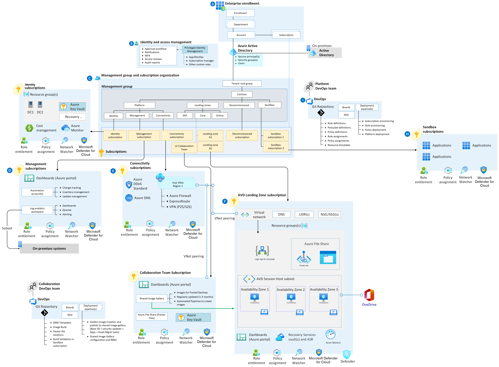

# Enterprise-scale support for the Azure Virtual Desktop construction set

Enterprise-scale construction sets provide you with a specific architectural approach and reference implementation. These construction sets enable effective construction and start-up of platform workload landing zones. These landing zones are within the Cloud Adoption Framework enterprise-scale landing zone. The Azure Virtual Desktop construction set is used after you've implemented an enterprise-scale landing zone. Review the [enterprise-scale overview](../../ready/enterprise-scale/index.md) and [implementation guidance](../../ready/enterprise-scale/implementation.md) before deploying the Azure Virtual Desktop construction set.

## Getting started with the Azure Virtual Desktop construction set

Not everyone adopts Azure Virtual Desktop in the same way. The Cloud Adoption Framework for Azure enterprise-scale construction set architecture varies between organizations. The technical considerations and design recommendations of the construction set might result in trade-offs based on your organization's needs. Some variation happens, but if you follow the core recommendations, the resulting architecture prepares your organization for sustainable scale. The construction set is modular by design so that you can customize environmental variables. The construction set approach to landing zones includes three sets of assets to support cloud teams.

### Design guidelines

Learn about guidelines that drive the design of the Cloud Adoption Framework for Azure enterprise-scale landing zone. There are six critical design areas:

- [Identity and access management](./eslz-identity-and-access-management.md)
- [Network topology and connectivity](./eslz-network-topology-and-connectivity.md)
- [Management and monitoring](./eslz-management-and-monitoring.md)
- [Business continuity and disaster recovery](./eslz-business-continuity-and-disaster-recovery.md)
- [Security, governance, and compliance](./eslz-security-governance-and-compliance.md)
- [Platform automation and DevOps](./eslz-platform-automation-and-devops.md)

### Architecture

The following image shows a conceptual reference architecture that demonstrates design areas and best practices.

### Implementation with Azure Resource Manager (ARM) templates for Remote Desktop Services

ARM Azure Virtual Desktop templates provide a collection of infrastructure-as-code ARM templates to deploy an Azure Virtual Desktop environment on Azure.

The [automate Azure Virtual Desktop deployments in Azure](https://github.com/Azure/RDS-Templates/tree/master/ARM-wvd-templates) GitHub repository contains code that lets you automatically deploy Azure Virtual Desktop environments in the Azure cloud.

## Next steps

Review the critical design areas for the Azure Virtual Desktop construction set for considerations and recommendations about your Azure Virtual Desktop construction set architecture.

> [!div class="nextstepaction"]
> [Identity and access management](./eslz-identity-and-access-management.md)