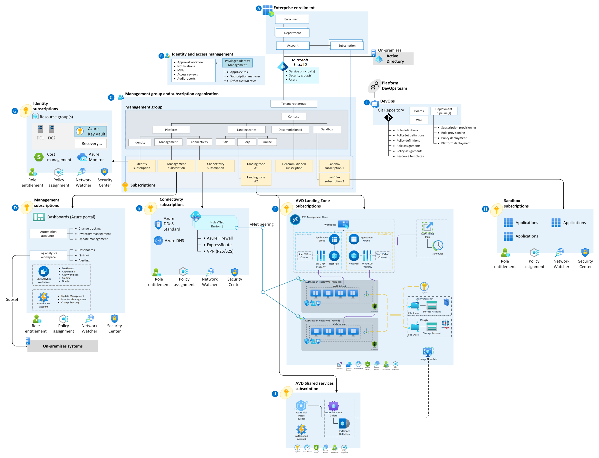

# Enterprise-scale support for Azure Virtual Desktop

The Azure Virtual Desktop (AVD) Landing Zone Accelerator provides a specific architectural approach and reference implementation for preparing landing zone subscriptions for an enterprise Azure Virtual Desktop (AVD) deployment.

Its reference implementation adheres to the architecture and best practices of the Cloud Adoption Framework's Azure landing zones with a particular focus on the enterprise-scale design principles. Use this solution after implementing an enterprise-scale landing zone. Review the [enterprise-scale overview](../../ready/enterprise-scale/index.md) and [implementation guidance](../../ready/enterprise-scale/implementation.md) before deploying the enterprise-scale for Azure Virtual Desktop solution.

This AVD solution is open source. You can adapt its templates to create an architecture that meets your specific needs. This article's guidance includes design considerations for building an enterprise ready AVD deployment.

## Adopt Azure Virtual Desktop Landing Zone Accelerator

Not everyone adopts Azure Virtual Desktop in the same way; architectures vary between organizations. This landing zone accelerator's technical considerations and design recommendations might result in trade-offs based on your organization's needs.

Some variation is normal. If you follow the core recommendations, your resulting architecture will prepare your organization for sustainable scaling. The AVD Landing Zone Accelerator is modular by design to let you customize environmental variables.

### Design guidelines

Learn the guidelines that direct the design of the Cloud Adoption Framework for Azure enterprise-scale landing zone. The guidelines cover eight critical design areas:

- [Enterprise enrollment](./eslz-enterprise-enrollment.md)
- [Identity and access management](./eslz-identity-and-access-management.md)
- [Network topology and connectivity](./eslz-network-topology-and-connectivity.md)
- [Resource organization](./eslz-resource-organization.md)
- [Management and monitoring](./eslz-management-and-monitoring.md)
- [Business continuity and disaster recovery](./eslz-business-continuity-and-disaster-recovery.md)
- [Security, governance, and compliance](./eslz-security-governance-and-compliance.md)
- [Platform automation and DevOps](./eslz-platform-automation-and-devops.md)

### Architecture

The following diagram shows a conceptual reference architecture that demonstrates major design areas and design best practices in an AVD environment.

## Deploy Azure Virtual Desktop with the Landing Zone Accelerator

The AVD Landing Zone Accelerator includes an open source collection containing Azure Resource Manager and Bicep templates to help you set up your AVD environment quickly following best practices. The accelerator will create an AVD environment with infrastructure components like virtual machines, networks, and storage in Azure.

The AVD Accelerator is available in the [`AVD Accelerator`](https://github.com/Azure/avdaccelerator) repo.

This accelerator is to be used as starter kit and you can expand its functionality by developing your own deployments.

Ideally, this workload should be deployed after an enterprise-scale landing zones deployment and be connected to the hub.
## Next steps

Review the critical design considerations and recommendations for identity and access management specific to the deployment of Azure Virtual Desktop.

> [!div class="nextstepaction"]
> [Identity and access management](./eslz-identity-and-access-management.md)
