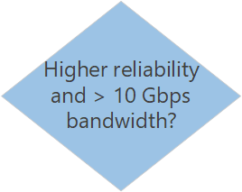

# Network topology and connectivity considerations for Azure Virtual Desktop

## Review network options

Designing and implementing Azure Virtual Desktop Azure networking capabilities is critical for your Azure Virtual Desktop landing zone. Azure networking products and services support a wide variety of networking capabilities. How you structure these services and the networking architectures you choose depends on your organization's workload, governance, and connectivity requirements.

## Identify workload networking requirements

Identify the networking capabilities that your landing zone needs to support. Assess each application and service in your workloads to determine their connectivity network control requirements. After you identify and document the requirements, create policies for your landing zone. Policies control networking resources and configuration based on your workload needs.

For each application or service you'll deploy to your landing zone, use the following decision tree to help you determine the networking tools or services to use:

The following questions help you make decisions based on the Azure networking services decision tree:

- Is a virtual network needed for Azure Virtual Desktop?

  Yes, Azure Virtual Desktop virtual machines must be deployed in an Azure virtual network.

- What is the size of your virtual network?

  The number of IP addresses needed in the virtual network will mainly depend on the load you want to handle. Use appropriate address ranges as defined in your existing networking architecture to be able to scale out your Azure Virtual Network infrastructure.

- Will your workloads require connectivity between virtual networks and your on-premises datacenter?

  Several reasons can require that you connect your virtual network to you on-premises datacenter, such as extending your Active Directory on-premises domain in Azure or allowing an application that runs on your Azure Virtual Desktop deployment to reach on-premises resources.

  Azure provides two solutions for establishing hybrid networking capabilities:

  - Azure VPN Gateway connects your on-premises networks to Azure through Site-to-Site VPNs similar to how you might set up and connect to a remote branch office. VPN Gateway has a maximum bandwidth of 10 Gbps. For more information, see [What is Azure VPN Gateway?](/azure/vpn-gateway/vpn-gateway-about-vpngateways)
  - Azure ExpressRoute offers higher reliability and lower latency by using a private connection between Azure and your on-premises infrastructure. Bandwidth options for ExpressRoute range from 50 Mbps to 100 Gbps. For more information, see [What is Azure ExpressRoute?](/azure/expressroute/expressroute-introduction)

- Will you need to inspect and audit outgoing traffic by using on-premises network devices?

  Cloud-native workloads can use Azure Firewall or third-party network virtual appliances for internet traffic. For more information, see [What is Azure Firewall?](/azure/firewall/overview). Additionally, Microsoft Defender for Endpoint can provide insights for per-session traffic analysis when using Windows 10 Enterprise multi-session devices. For more information, see [Onboard Windows 10 Enterprise multi-session devices in Azure Virtual Desktop](/microsoft-365/security/defender-endpoint/onboard-windows-10-multi-session-device).

  Your security policies might require internet-bound outgoing traffic to pass through centrally managed devices in the on-premises environment. Forced tunneling supports these scenarios, but not all managed services support forced tunneling. For more information, see [Virtual network traffic routing](/azure/virtual-network/virtual-networks-udr-overview).

  Azure Virtual Desktop supports forced tunneling, as long as all traffic form the virtual machines to the Azure Virtual Desktop management plane doesn't go back on-premises. For more information on Azure Virtual Desktop safe URLs list, see [Azure Virtual Desktop required URL list](/azure/virtual-desktop/safe-url-list#virtual-machines)

  We recommend bypassing proxies for Azure Virtual Desktop traffic. Proxies don't make Azure Virtual Desktop more secure because the traffic is already encrypted. However, some organizations require that all user traffic goes through a proxy server for tracking or packet inspection. For more information on proxy server guidelines for Azure Virtual Desktop, see [Proxy server guidelines for Azure Virtual Desktop](/azure/virtual-desktop/proxy-server-support)

- Do you need to connect multiple virtual networks?

  You can use virtual network peering to connect instances of Azure Virtual Network. Peering can support connections across subscriptions and regions. For more information, see [Virtual network peering](/azure/virtual-network/virtual-network-peering-overview).

  Virtual network peering provides connectivity between only two peered networks. You might provide services across multiple subscriptions or need to manage a large number of network peerings. Consider adopting a hub and spoke networking architecture or using Azure Virtual WAN. For more information, see:

  - [Software Defined Networking: hub and spoke](../../decision-guides/software-defined-network/hub-spoke.md)
  - [What is Azure Virtual WAN?](/azure/virtual-wan/virtual-wan-about)

- Will you need to support custom DNS management?

  Azure DNS is a hosting service for DNS domains. Azure DNS provides name resolution by using the Azure infrastructure. For more information, see [What is Azure DNS?](/azure/dns/dns-overview)

  Your workloads might require name resolution support beyond Azure DNS. Since Azure Virtual Desktop requires Active Directory services, consider using Azure Active Directory Domain Services to augment Azure DNS capabilities or deploy custom IaaS virtual machines. For more information, see:

- [What is Azure Active Directory Domain Services?](/azure/active-directory-domain-services/overview)
  - [Name resolution for resources in Azure Virtual Network](/azure/virtual-network/virtual-networks-name-resolution-for-vms-and-role-instances)

## Understand common networking scenarios

Azure networking includes products and services that provide different networking capabilities. As part of your networking design process, compare your workload requirements to networking scenarios. Identify the Azure tools or services that provide these networking capabilities:

| Scenario | Networking product or service |
| --- | --- |
| I need networking infrastructure to connect everything, from virtual machines to incoming VPN connections. | [Azure Virtual Network](/azure/virtual-network/) |
| I need to balance inbound and outbound connections and requests to my applications or services. | [Azure Load Balancer](/azure/load-balancer/) |
| I want to optimize delivery from application server farms while increasing application security with a web application firewall. | [Azure Application Gateway](/azure/application-gateway/) and [Azure Front Door](/azure/frontdoor/) |
| I need to securely use the internet to access Azure Virtual Network through high-performance VPN gateways. | [Azure VPN Gateway](/azure/vpn-gateway/) |
| I need ultra-fast DNS responses and ultra-high availability for all my domain needs. | [Azure DNS](/azure/dns/) |
| I need to accelerate the delivery of high-bandwidth content to customers worldwide. This content includes applications, stored content, and streaming video. | [Azure Content Delivery Network (CDN)](/azure/cdn/) |
| I need to protect my Azure applications from DDoS attacks. | [Azure DDoS Protection](/azure/ddos-protection/ddos-protection-overview) |
| I need to distribute traffic optimally to services globally across Azure regions, while providing high availability and responsiveness. | [Azure Traffic Manager](/azure/traffic-manager/) and [Azure Front Door](/azure/frontdoor/) |
| I need to add private network connectivity to access Microsoft cloud services from my corporate networks as if they were on-premises. | [Azure ExpressRoute](/azure/expressroute/) |
| I want to monitor and diagnose conditions at a network level. | [Azure Network Watcher](/azure/network-watcher/) |
| I need native firewall capabilities, with built-in high availability, unrestricted cloud scalability, and zero maintenance. | [Azure Firewall](/azure/firewall/overview) |
| I need to connect business offices, retail locations, and sites securely. | [Azure Virtual WAN](/azure/virtual-wan/) |
| I need a scalable, security-enhanced delivery point for global microservices-based web applications. | [Azure Front Door](/azure/frontdoor/) |

## Choose a networking architecture

After you identify the Azure networking services to support your workloads, design the architecture to combine these services. To learn about networking architecture patterns for your landing zone, see the [Software Defined Networking decision guide](../../decision-guides/software-defined-network/index.md).

The following table summarizes the primary scenarios that these patterns support:

| Scenario  | Suggested network architecture |
| --- | --- |
| All of the Azure-hosted workloads in your landing zone are platform as a service (PaaS) resources. These resources don't require a virtual network and aren't part of a wider cloud adoption effort that includes infrastructure as a service (IaaS) resources. | [PaaS-only](../../decision-guides/software-defined-network/paas-only.md) |
| Your Azure-hosted workloads deploy IaaS-based resources like virtual machines or the workloads require a virtual network. These resources don't require connectivity to your on-premises environment.  | [Cloud-native](../../decision-guides/software-defined-network/cloud-native.md) |
| Your Azure-hosted workloads require limited access to on-premises resources, but you're required to treat cloud connections as untrusted. | [Cloud DMZ](../../decision-guides/software-defined-network/cloud-dmz.md) |
| Your Azure-hosted workloads require limited access to on-premises resources. You plan to implement mature security policies and secure connectivity between the cloud and your on-premises environment. | [Hybrid](../../decision-guides/software-defined-network/hybrid.md) |
| You deploy and manage a large number of virtual machines and workloads, you need to share services across subscriptions, or you need a more segmented structure for role, application, or permission segregation. For more information, see [Azure subscription and service limits, quotas, and constraints](/azure/azure-resource-manager/management/azure-subscription-service-limits). | [Hub and spoke](../../decision-guides/software-defined-network/hub-spoke.md) |
| You have many branch offices that need to connect to each other and to Azure. | [Azure Virtual WAN](/azure/virtual-wan/virtual-wan-about) |

<!-- TODO: Refactor VDC content below. -->
<!-- docutune:casing "Azure Virtual Datacenter" -->

In addition to using one of these architecture patterns, if you plan to host more than 1,000 assets, including applications, infrastructure, and data assets, in the cloud within 24 months, consider an enterprise-scale landing zone. The enterprise-scale landing zone provides a combined approach to networking, security, management, and infrastructure.

For organizations that meet some of the following criteria, you may also want to start with an enterprise-scale landing zone:

- Your enterprise is subject to regulatory compliance requirements for centralized monitoring and audit capabilities.
- You maintain common policy, governance compliance, and centralized IT control over core services.
- Your industry depends on a complex platform that requires complex controls and deep domain expertise to govern the platform. This situation is common in large enterprises in finance, oil and gas, or manufacturing.
- Your existing IT governance policies require tight parity with existing features, even during early stage adoption.

For more information, see [Start with Cloud Adoption Framework enterprise-scale landing zones](../../ready/enterprise-scale/index.md).

## Follow Azure networking best practices

As part of your networking design process, see these articles:

- [Plan virtual networks](/azure/virtual-network/virtual-network-vnet-plan-design-arm). Learn how to plan for virtual networks based on your isolation, connectivity, and location requirements.
- [Azure best practices for network security](/azure/security/fundamentals/network-best-practices). Learn about Azure best practices that can help you enhance your network security.
- [Best practices for networking when you migrate workloads to Azure](../../migrate/azure-best-practices/migrate-best-practices-networking.md). Get more guidance about how to implement Azure networking to support workloads.

## Next steps

[Management and monitoring](eslz-management-and-monitoring.md)
