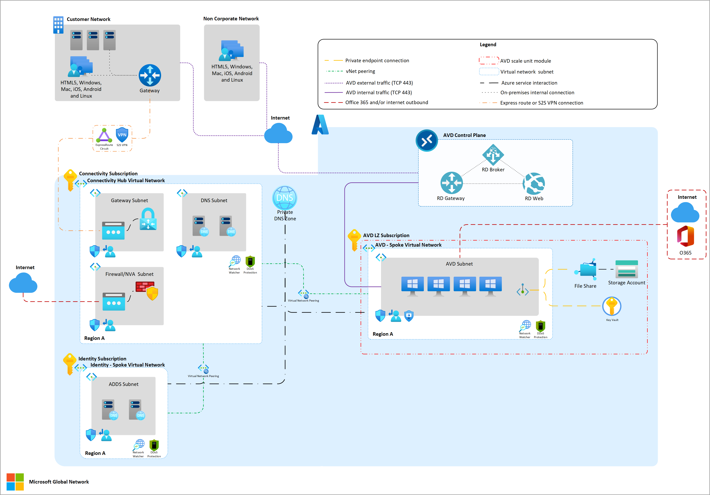

# Network topology and connectivity for Azure Virtual Desktop

The design and implementation of Azure Virtual Desktop Azure networking capabilities is critical for your Azure Virtual Desktop landing zone. This article builds on several Cloud Adoption Framework [enterprise-scale landing zone](../../ready/landing-zone/design-area/network-topology-and-connectivity.md) architectural principles and recommendation to manage network topology and connectivity at scale.

The design foundations include:

- **Hybrid integration** for connectivity between on-premises, multicloud, edge, and global users. For more information, see [Enterprise-scale support for hybrid and multi-cloud](../hybrid/enterprise-scale-landing-zone.md).
- **Performance and reliability at scale** for consistent, low-latency experience, and scalability for workloads.
- **Zero-trust based network security** to secure network perimeter and traffic flows. For more information, see [Network security strategies on Azure](/azure/architecture/framework/security/design-network).
- **Extensibility** for easily expanding network footprint without design rework.

## Networking components and concepts

- [**Azure Virtual Network**](/azure/virtual-network/virtual-networks-overview) is the fundamental building block for private networks in Azure. With Azure Virtual Network, many types of Azure resources, such as Azure Virtual Machines (VMs), can securely communicate with each other, the internet, and on-premises datacenters. A virtual network is similar to a traditional network that you operate in your own datacenter, but has the Azure infrastructure benefits of scale, availability, and isolation.

- [**Hub-spoke network topology**](/azure/architecture/reference-architectures/hybrid-networking/hub-spoke?tabs=cli), a hub virtual network acts as a central point of connectivity to several spoke virtual networks. The hub can also be the connectivity point to on-premises datacenters. The spoke virtual networks peer with the hub and helps to isolate workloads.

- [**Azure Virtual WAN**](/azure/virtual-wan/virtual-wan-about) is a networking service that brings networking, security, and routing functions together in a single operational interface.

- [**Network virtual appliance (NVA)**](https://azure.microsoft.com/blog/azure-firewall-and-network-virtual-appliances/) is a network device that supports functions like connectivity, application delivery, wide-area network (WAN) optimization, and security. NVAs include Azure Firewall and Azure Load Balancer.

- In [**Forced tunneling**](/azure/vpn-gateway/vpn-gateway-forced-tunneling-rm#:~:text=Forced%20tunneling%20in%20Azure%20is%20configured%20via%20virtual,virtual%20networks%2C%20see%20User-defined%20routes%20and%20IP%20forwarding.) scenario all internet-bound traffic originating on Azure VMs is routed or "forced" to go through an inspection and auditing appliance. Unauthorized internet access can potentially lead to information disclosure or other types of security breaches without the traffic inspection or audit.

- [**Network security groups (NSGs)**](/azure/virtual-network/network-security-groups-overview) are used to filter network traffic to and from Azure resources in an Azure virtual network. A network security group contains security rules that allow or deny inbound network traffic to, or outbound network traffic from, several types of Azure resources.

- [**Application security groups**](/azure/virtual-network/application-security-groups) enable you to configure network security as a natural extension of an application's structure. You can use them to group virtual machines and define network security policies based on those groups. You can reuse your security policy at scale without needing to manually maintain explicit IP addresses.

- [**User Defined Routes (UDR)**](/azure/virtual-network/virtual-networks-udr-overview) can be used to override Azure's default system routes, or to add additional routes to a subnet's route table.

## Networking scenarios

To establish the Azure Virtual Desktop landing zone, the design and implementation of networking capabilities is critical. Azure networking products and services support a wide variety of capabilities. Which architecture to choose and how to structure services depends on your organization's workloads, governance, and requirements.

The following key requirements and considerations affect your Azure Virtual Desktop deployment decisions:

- Internet ingress and egress requirements.
- NVA use in the current architecture.
- Azure Virtual Desktop connectivity to a standard hub virtual network or Virtual WAN hub.
- Session host connection model (native and [RDP Shortpath](/azure/virtual-desktop/rdp-shortpath)).
- Traffic inspection requirements for:
  - Internet egress from Azure Virtual Desktop.
  - Internet ingress to Azure Virtual Desktop.
  - Azure Virtual Desktop to on-premises datacenters.
  - Azure Virtual Desktop to other Azure Virtual Network.
  - Traffic within the Azure Virtual Desktop virtual network.

The most common networking scenario for Azure Virtual Desktop is hub and spoke with hybrid connectivity.

## Scenario: Hub and spoke with hybrid connectivity

### Customer profile

This scenario is ideal if:

- You don't need traffic inspection between Azure Virtual Desktop networks and other Azure virtual networks.
- You don't need traffic inspection between Azure Virtual Desktop networks and on-premises datacenters.
- You don't need traffic inspection of internet outbound traffic from Azure Virtual Desktop networks.
- You don't need to control the public IPs use to SNAT Azure Virtual Desktop internet outbound connections.
- You don't enforce Azure Virtual Desktops networks internal traffic.
- You have pre-existing hybrid connectivity to on-premises (Express Route or S2S VPN).
- You have pre-existing AD DS and DNS custom servers.
- You consume Azure Virtual Desktop with standard connection model (No RDP Shortpath).

### Architectural components

You can implement this scenario with:

- AD DS servers and custom DNS servers.
- Network security groups.
- Network Watcher.
- Outbound internet via default Azure vNet path.
- Express route or VPN virtual network gateway for hybrid connectivity to on-premises.
- Azure private DNS zone.
- Azure private endpoints.
- Azure files service on storage accounts.
- Azure key vault.

### Considerations

- This scenario doesn't account for client direct network connectivity to session public or private (no RDP Shortpath) hosts.
- Azure Virtual Desktop control plane gateway (public endpoint) manages client connections. Therefore, Azure Virtual Desktop clients can create outbound connections to required Azure Virtual Desktop URLs. For more information, see [Required URLs for Azure Virtual Desktop](/azure/virtual-desktop/safe-url-list).
- No public IPs or any other public inbound path to session hosts is needed, traffic from clients to session hosts flows through Azure Virtual Desktop control plane gateway.
- No virtual network peering between Azure Virtual Desktop spokes, all the traffic goes through the connectivity hub.
- Outbound internet connection from Azure Virtual Desktop session hosts goes through the default Azure outbound NAT using dynamic Azure public IPs (no customer control on outbound public IPs used).
- Connections from session hosts to Azure files (storage accounts) are established using private endpoints.
- Azure private DNS zones are used to resolve private endpoint namespaces:
  - Storage account file service (privatelink.file.core.windows.net).
  - Key vaults (privatelink.vaultcore.azure.net).
- Even though for this scenario network filtering is not enforced, NSGs are placed on all subnets to enable monitoring and insights by using network watcher NSG flow logs and traffic analytics.

## General design considerations and recommendations

Here are some general design considerations and recommendations for Azure Virtual Desktop network topology and connectivity:

### Hub and spoke vs. Virtual Wide Area Network (WAN) network topology

Virtual WAN supports [transit connectivity between VPN and ExpressRoute](/azure/virtual-wan/virtual-wan-about#transit-er), but doesn't support hub-and-spoke topology.

### Identity services

The identity services connectivity requirements of Azure Virtual Desktop session hosts depend on the identity model.

- Azure AD Domain Services (AD DS) joined VMs: Azure Virtual Desktop networks must have connectivity to the network where the identity service is hosted.
- [Azure AD (Azure AD) joined VMs](/azure/architecture/example-scenario/wvd/azure-virtual-desktop-azure-active-directory-join): Azure Virtual Desktop session hosts create outbound connections to Azure AD public endpoints, therefore no private connectivity configurations required.

### DNS

Azure Virtual Desktop session hosts have the same name resolution requirements as any other IaaS workload, therefore connectivity to custom DNS servers or access (via vNet network link) to Azure Private DNS zones is required. Additional Azure private DNS zones are required to host the private endpoint namespaces of certain (storage accounts, key) Platform As A Service (PaaS) services.

- [Azure private endpoint DNS configuration](/azure/private-link/private-endpoint-dns)

To facilitate end user Azure Virtual Desktop client configuration (subscription to RDS feed), it is recommended to set up email discovery in the public DNS domain and [set up email discovery to subscribe to your RDS feed](/windows-server/remote/remote-desktop-services/rds-email-discovery).

### Bandwidth and latency

Azure Virtual Desktops use Remote Desktop Protocol (RDP). To know more about RDP, see [Remote Desktop Protocol (RDP) bandwidth requirements](/azure/virtual-desktop/rdp-bandwidth).

The connection latency varies depending on the location of the users and the virtual machines. Azure Virtual Desktop services continuously rolls out to new geographies to improve latency. To minimize the latency perceived by Azure Virtual Desktop clients, use the [Azure Virtual Desktop Experience Estimator](https://azure.microsoft.com/services/virtual-desktop/assessment/) to get round trip time (RTT) sample from clients. You can use this information to place session hosts in the closest region with the lowest RTT to the end users ([interpreting results from estimator tool](/azure/virtual-desktop/connection-latency)).

### Quality of Service (QoS) with RDP Shortpath

RDP Shortpath for managed networks provides a direct UDP-based transport between Remote Desktop Client and Session host. RDP Shortpath for managed networks enables configuration of Quality of Service (QoS) policies for the RDP data. QoS in Azure Virtual Desktop allows real-time RDP traffic that's sensitive to network delays to "cut in line" in front of traffic that's less sensitive.

For more information, see [Implement Quality of Service (QoS) for Azure Virtual Desktop](/azure/virtual-desktop/rdp-quality-of-service-qos).

### Internet

Azure Virtual Desktop compute resources and clients require access to specific public endpoints, so they need internet-bound connections. Network scenarios like forced tunneling to enhance security and filtering are supported when Azure Virtual Desktop requirements are met.

See [Required URL list and check tool](/azure/virtual-desktop/safe-url-list) to understand the requirements for AVD session hosts and client devices.

### Ports and protocols requirements

The Azure Virtual Desktop connection flow uses:

- [Standard model](/azure/virtual-desktop/network-connectivity): 443/TCP
- [RDP Shortpath model](/azure/virtual-desktop/shortpath): 443/TCP and 3390/UDP

### Business continuity and disaster recovery (BCDR)

A networking setup with the same capabilities as the one on the source environment or that at least has connectivity to identity and DNS services is required to deploy and recover these resources to a target environment.

## Next steps

Learn about resource organization for an Azure Virtual Desktop enterprise-scale scenario.

> [!div class="nextstepaction"]
> [Resource organization](./eslz-resource-organization.md)
