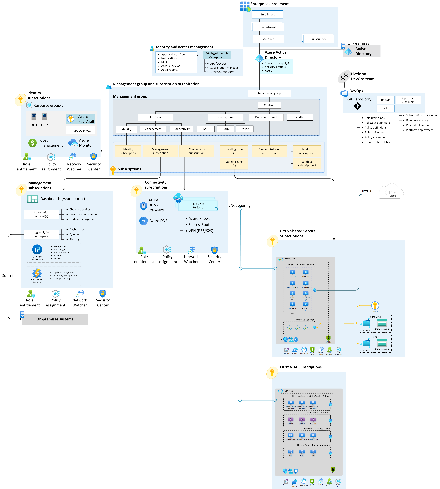

# Enterprise-scale support for Citrix on Azure

Employees need a consistent experience and seamless access to vital applications and insights whether they work in the office, on the road, or at home. In this reference implementation, Citrix and Microsoft partner to accelerate the future of work.

This implementation follows the Cloud Adoption Framework Azure landing zone architecture and best practices, with a focus on enterprise-scale design principles. Although you can deploy this implementation in any Azure environment that complies with the [prerequisites](https://github.com/Azure/avdaccelerator#getting-started), it's best to use this solution after you implement an [enterprise-scale landing zone](../../../ready/landing-zone/index.md). For more information, see [Landing zone implementation options](../../../ready/landing-zone/implementation-options.md).

## Potential use cases

This solution is ideal for scenarios that require:

- Critical applications or services to remain on-premises.
- Migrations from on-premises to Azure that occur in multiple phases, but provide seamless access by end users throughout.
- Advanced security capabilities to accommodate user workflows or maintain compliance. Security requirements can cover session recording, screen capture and keylogging protection, and granular peripheral controls like USB, clipboard, and printing.
- 3D graphics, or connectivity over challenging low bandwidth or high latency networks.
- A unified platform for secure remote access to virtual desktops and physical workstations.
- Built-in image lifecycle and provisioning tools to help streamline management of large, complex portfolios of virtual apps or virtual desktops.
- Citrix application delivery per software vendor recommendation.
- Linux support.
- Support for non-persistent workloads.
- Non-Microsoft solutions for collaboration, authentication, or identity.
- Business-to-business or guest user access.

The preceding list doesn't cover all Citrix capabilities when deployed with Microsoft solutions. For more information and customer scenarios, see [Citrix Tech Zone – Enhancing Azure Virtual Desktop](https://docs.citrix.com/en-us/tech-zone/learn/tech-briefs/windows-virtual-desktop-value-add.html).

## Architecture

The following diagram shows a reference architecture that demonstrates major design areas and design best practices in a Citrix Cloud and Azure environment.

[Download the Visio file.](https://raw.githubusercontent.com/microsoft/CloudAdoptionFramework/master/scenarios/Citrix-accelerator-enterprise-scale-alz-architecture.vsdx)

## Design guidelines

Design guidelines for the Cloud Adoption Framework for Citrix Cloud in an Azure enterprise-scale landing zone cover the following critical areas:

- [Enterprise enrollment](../eslz-enterprise-enrollment.md)
- [Identity and access management](citrix-identity-access-management.md)
- [Resource organization](citrix-resource-organization.md)
- [Network topology and connectivity](citrix-network-topology-connectivity.md)
- [Management and monitoring](citrix-management-monitoring.md)
- [Security governance and compliance](citrix-security-governance-compliance.md)
- [Business continuity and disaster recovery](citrix-business-continuity-disaster-recovery.md)

Design guidance for [Citrix DaaS on Microsoft Azure](https://docs.citrix.com/en-us/citrix-daas-azure.html) is available on Citrix TechZone. This guidance highlights the system, workload, user, and network considerations for Citrix technologies in alignment with Cloud Adoption Framework design principles.

## Next steps

Review the critical design considerations and recommendations for identity and access management specific to the deployment of Citrix on Azure.

- [Identity and access management](citrix-identity-access-management.md)
