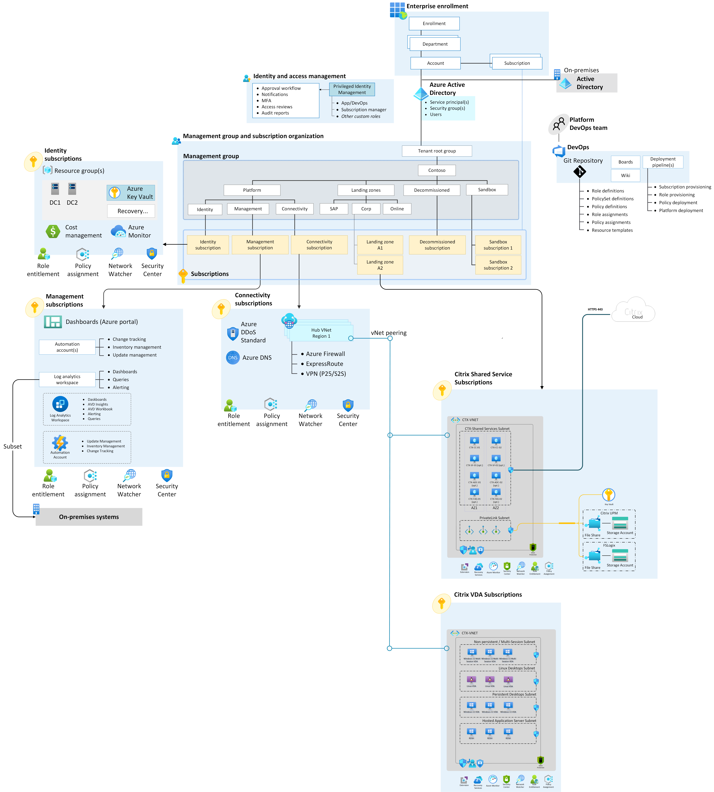

# Enterprise-scale support for Citrix on Azure

Employees need a consistent experience and seamless access to vital applications and insights whether they work in the office, on the road, or at home. In this reference implementation, Citrix and Microsoft partner to accelerate the future of work.

This implementation follows the Cloud Adoption Framework Azure landing zone architecture and best practices, with a focus on enterprise-scale design principles. Although you can deploy this implementation in any Azure environment that complies with the [prerequisites](https://github.com/Azure/avdaccelerator/wiki/Getting-Started#Getting-Started), it's best to use this enterprise-scale desktop virtualization solution after you implement an [enterprise-scale landing zone](../../ready/landing-zone.md). For more guidance, see [Landing zone implementation options](../../ready/landing-zone/implementation-options.md).

## Architecture

The following diagram shows a reference architecture that demonstrates major design areas and design best practices in a Citrix Cloud and Azure environment.

<!--Download the [Visio file](../media/Citrix-accelerator-enterprise-scale-alz-architecture.vsdx) here.-->

## Potential use cases

This solution is ideal for the following scenarios:

- Critical applications or services must remain on-premises.
- Migration from on-premises to Azure will occur in multiple phases, but requires seamless access by end users throughout the project.
- Advanced security capabilities are required to accommodate user workflows or maintain compliance. Security requirements can include session recording, screen capture and keylogging protection, and granular peripheral controls such as USB, clipboard, and printing.
- The workload uses 3D graphics or requires connectivity over challenging low bandwidth or high latency networks.
- A unified platform for secure remote access to virtual desktops and physical workstations is required.
- Built-in image lifecycle and provisioning tools are needed to assist in streamlining management of large, complex portfolios of virtual apps or virtual desktops.
- A software vendor recommends using Citrix for application delivery.
- Support for Linux workloads is required.
- Support for non-persistent workloads is required.
- Non-Microsoft solutions for collaboration, authentication, or identity are required.
- Business-to-business or guest user access is required.

The previous list doesn't cover all Citrix capabilities when deployed with Microsoft solutions. For more information and customer scenarios, see [Citrix Tech Zone – Enhancing Azure Virtual Desktop](https://docs.citrix.com/en-us/tech-zone/learn/tech-briefs/windows-virtual-desktop-value-add.html).

## Design guidelines

The design guidelines for the Cloud Adoption Framework for Citrix Cloud in an Azure enterprise-scale landing zone cover eight critical areas:

- [Enterprise enrollment](../eslz-enterprise-enrollment.md)
- [Identity and access management](../landing-zone-for-citrix/ctx-identity-and-access-management.md)
- [Network topology and connectivity](../landing-zone-for-citrix/ctx-network-topology-and-connectivity.md)
- [Resource organization](../landing-zone-for-citrix/ctx-resource-organization.md)
- [Security, governance, and compliance](../landing-zone-for-citrix/ctx-security-governance-and-compliance.md)
- [Management and monitoring](../landing-zone-for-citrix/ctx-management-and-monitoring.md)
- [Business continuity and disaster recovery](../landing-zone-for-citrix/ctx-business-continuity-and-disaster-recovery.md)

Design guidance for [Citrix DaaS on Microsoft Azure](https://docs.citrix.com/en-us/citrix-daas-azure.html) is available on Citrix TechZone. This guidance highlights the system, workload, user, and network considerations for Citrix technologies in alignment with Cloud Adoption Framework design principles.

## Next steps

Review the critical design considerations and recommendations for identity and access management specific to the deployment of Citrix on Azure.

- [Identity and access management](./ctx-identity-and-access-management.md)
