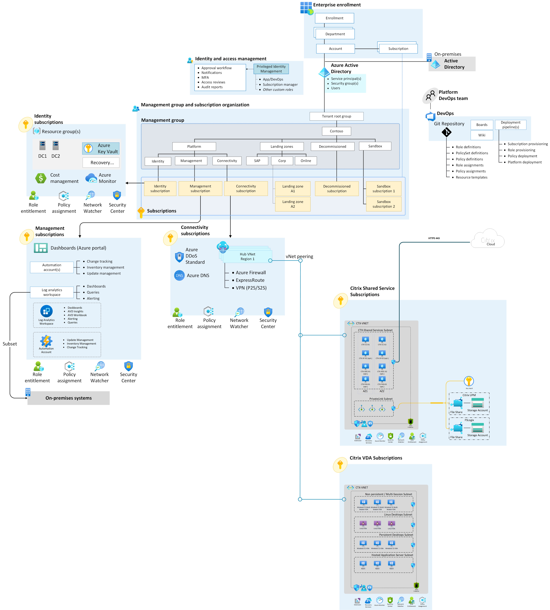

# Hybrid connectivity by using Citrix Cloud and Azure

This article describes a reference architecture that demonstrates major design areas and design best practices in a Citrix Cloud and Azure environment with multiple subscriptions.

## Architecture

The following architectural diagram shows a Citrix Cloud and Azure environment with multiple subscriptions.

## Architectural components

You can implement this scenario with the following components:

- Active Directory Domain Services (AD DS) servers and custom domain name system (DNS) servers
- Network security groups
- Azure Network Watcher
- Outbound internet via a default Azure Virtual Network path
- Azure ExpressRoute or virtual private network (VPN) virtual network gateway for hybrid connectivity to on-premises
- Azure private endpoints
- Azure Files service on storage accounts
- Azure Key Vault

This scenario also includes the following Citrix components within the Azure landing zone:

- [Citrix Cloud Connector](https://docs.citrix.com/en-us/citrix-cloud/citrix-cloud-resource-locations/citrix-cloud-connector/technical-details.html#system-requirements) establishes a connection between Citrix Cloud and your resource locations.
- [Citrix Virtual Delivery Agent (VDA)](https://docs.citrix.com/en-us/citrix-virtual-apps-desktops/install-configure/install-vdas.html) installs on a master image or target device that hosts your apps or desktops. This agent enables connectivity, provisioning, and orchestration of these resources as persistent or non-persistent machines. The VDA is compatible with physical or virtual devices and Windows Server, Windows Client, or Linux OS.
- [Citrix Workspace](https://docs.citrix.com/en-us/tech-zone/learn/tech-briefs/citrix-workspace.html) is a cloud service that delivers secure access to the information, apps, and other content that's relevant to an end user's role in your organization. Citrix Workspace integrates Azure and on-premises assets, enabling unified access to all the resources available to your users in one location from anywhere, on any device.

### Optional Citrix components

The following Citrix components within the Azure landing zone are optional. Consider these components if you need advanced functionality.

- [Citrix Federated Authentication Service](https://docs.citrix.com/en-us/xenapp-and-xendesktop/7-15-ltsr/secure/federated-authentication-service.html) dynamically issues certificates for users, allowing them to log on to an Active Directory environment as if they had a smartcard. This service enables single sign-on when using Security Assertion Markup Language (SAML)-based authentication. You can use a broad range of authentication options and third-party identity providers, such as Okta and Ping.
- [Citrix StoreFront](https://www.citrix.com/products/citrix-daas/citrix-storefront.html) is an alternative internal user access point from the Citrix Workspace cloud service. StoreFront is self-managed and seamlessly aggregates resources across multiple on-premises and Azure environments. Lift and shift scenarios often use StoreFront for existing Citrix deployments, to maintain existing user access while moving workloads to Azure.
- [Citrix ADC (NetScaler)](https://www.citrix.com/products/citrix-adc/) is an alternative external user access point from the Citrix Workspace and Gateway Service cloud services. Citrix ADC is a self-managed virtual appliance within your Azure tenant that provides secure proxy for external connectivity and authentication. You can integrate Citrix ADC with StoreFront or Workspace. Lift and shift scenarios often use Citrix ADC for existing Citrix deployments, to maintain existing user access while moving workloads to Azure.
- [Citrix Provisioning](https://docs.citrix.com/en-us/provisioning/current-release/architecture.html) is a network-based image management solution that you can deploy within your Azure tenant to enable scalable deployment of up to thousands of non-persistent machines. Citrix Provisioning supports rapid updates and reduced storage requirements by streaming centralized images over an Azure virtual network.
- [Citrix App Layering appliance](https://docs.citrix.com/en-us/citrix-app-layering/4/install-appliance/ms-azure.html) is the central component for the App Layering technology that hosts the management console and allows the creation and management of layers, layer assignments, and image templates. App Layering helps manage single OS and app instances and compose images from layers, greatly reducing effort in environments with many golden images.

## Citrix design considerations

Design guidance for Citrix DaaS on Microsoft Azure is available on [Citrix TechZone - Design Guidance for Citrix DaaS on Microsoft Azure](https://docs.citrix.com/en-us/tech-zone/toc/by-solution/daas-for-azure/design-guidance.html) This guidance highlights the system, workload, user, and network considerations for Citrix technologies in alignment with Cloud Adoption Framework design principles.

The Citrix on Azure solution requires a certain amount of throughput for each user, various protocols and ports, and other network considerations. All network appliances, such as Citrix ADC and firewalls, must be sized appropriately to handle load increases during disaster recovery scenarios. For more information, see [Design Decision: Azure Specific Considerations](https://docs.citrix.com/en-us/tech-zone/design/design-decisions/azure-system-considerations.html).

### Network segmentation

Citrix also provides guidance for Azure network segmentation and logically segmented subnets. When you review the guidance, use the following guidelines to help with initial planning on network segmentation for Citrix workloads:

#### Segment by workload types

Create separate single-session and multisession virtual networks or subnets to enable growth of both network types without impacting the scalability of the other type. For example, filling a shared multisession and single-session subnet with virtual desktop infrastructure (VDI) results in creating a new hosting unit to support an application use case. This new hosting unit forces the usage of multiple machine catalogs, the Citrix name for resource pools, to support scaling the application or migrating the existing app catalogs to a new subnet.

If you use [workload subscriptions](https://www.citrix.com/blogs/2020/10/14/citrix-tips-citrix-on-azure-enterprise-scale-landing-zones-part-1/) as part of a multisubscription architecture, understand Citrix Machine Creation Service (MCS) [limits](https://docs.citrix.com/en-us/citrix-virtual-apps-desktops-service/limits.html#machine-creation-services-mcs-limits) on the number of virtual machines (VMs) per Azure subscription. Consider these limits as you plan for [IP addressing](../../../ready/enterprise-scale/network-topology-and-connectivity.md#plan-for-ip-addressing) and your virtual network design.

#### Segment by tenant, business unit, or security zone

If you're running a multitenant deployment, such as a [Citrix Service Provider architecture](https://docs.citrix.com/en-us/tech-zone/design/reference-architectures/csp-cvads.html), isolating tenants between networks or subnets is recommended. Consider isolating separate business units or security zones within an organization if your existing security standards need specific isolation requirements at a network level.

Weigh business unit segmentation outside of workload-specific networks against the effect of increased complexity on the overall environment. This methodology should be the exception rather than the rule, and be applied with the right justification and projected scale. For example, you could create a network for 1,000 contractors supporting finance to accommodate security needs beyond the standard single-session VDI network.

You can use [application security groups](/azure/virtual-network/application-security-groups) to allow only specific VMs to access business unit application backends on a shared virtual network. For example, you could limit customer relations management (CRM) backend access to the CRM machine catalog VMs that Marketing uses in the multisession VDA network.

## Next steps

To learn more about Azure networking best practices and how to plan for virtual networks based on your isolation, connectivity, and location requirements, see [Plan virtual networks](/azure/virtual-network/virtual-network-vnet-plan-design-arm).

Review the critical design considerations and recommendations for management and monitoring specific to the deployment of Citrix on Azure.

- [Management and monitoring](citrix-management-and-monitoring.md)

