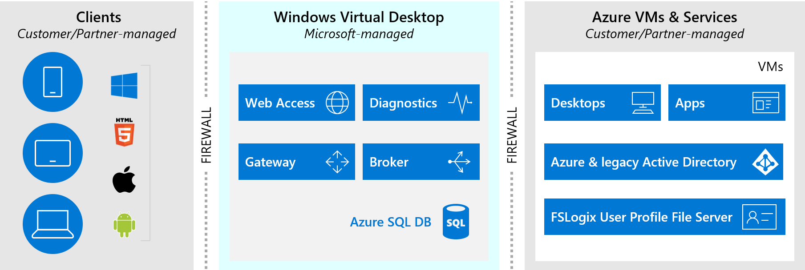

# Strategic benefits of an Azure Virtual Desktop environment

Best practice guidance encourages customers to create a single centralized cloud adoption strategy, using the [Cloud Adoption Framework's Strategy methodology](../../strategy/index.md). If you haven't already, use the [strategy and plan template](https://raw.githubusercontent.com/microsoft/CloudAdoptionFramework/master/plan/cloud-adoption-framework-strategy-and-plan-template.docx) to record your cloud adoption strategy.

This guidance will help expose several considerations about virtual desktops that will have an impact on your strategy.

## Virtual desktop outcomes

Virtual desktop migrations are motivated by a few common target outcomes, as shown and listed here:

- Organizations want to extend productivity to PCs, phones, tablets, or browsers that might not be under the direct control of the IT team.
- Employees need to access corporate data and applications from their devices.
- As workloads are migrated to the cloud, employees need more support for a low-latency, more optimized experience.
- The costs of current or proposed virtual desktop experiences need to be optimized to help organizations scale their remote work more effectively.
- The IT team wants to transform the workplace, which often starts with transforming employees' user experience.

Virtualization of your end users' desktops in the cloud can help your team realize these outcomes.

## The strategic impact of Azure Virtual Desktop in the cloud

Azure Virtual Desktop products form a mission-critical platform for many organizations. When these products are foundational to an organization's business processes, the dependencies on Azure Virtual Desktop can be seen throughout the portfolio. The cloud adoption plan for this platform can directly and indirectly impact cloud adoption for all related workloads. While Azure Virtual Desktop isn't typically the first platform that an organization moves to the cloud, it can be the most important. To understand the strategy for an Azure Virtual Desktop cloud migration and the future-state innovation targets is critical to the success of all other cloud adoption plans.

This article uses the [strategy and plan template](https://raw.githubusercontent.com/microsoft/CloudAdoptionFramework/master/plan/cloud-adoption-framework-strategy-and-plan-template.docx) and other resources from the Cloud Adoption Framework to capture the strategic impact of Azure Virtual Desktop cloud adoption.

## Reasons to move to an Azure Virtual Desktop platform in the cloud

Azure Virtual Desktop is an influential platform, and organizations have several motivations to adopt Azure Virtual Desktop in the cloud. When an organization considers a cloud strategy for Azure Virtual Desktop, the following motivations tend to shape cloud adoption plans:

- **Critical business events:** Customers often adopt Azure Virtual Desktop in the cloud to mitigate contractual, regulatory, compliance, or sovereignty risks.

- **Migration motivations:** If other assets depend on Azure Virtual Desktop to migrate successfully, then customers tend to focus on reducing costs, complexities, or operational overhead.

- **Innovation motivations:** The cloud unlocks new opportunities for Azure Virtual Desktop to expand and deliver transformative products and services.

- **Infrastructure scale flexibility requirements:** The cloud offers the ability to seamlessly scale up and down with infrastructure as part of business transformation with Azure Virtual Desktop.

- **Choice and flexibility:** Customers now have the choice and flexibility to choose from any of the available virtual machine families and sizes, all optimized for different usage requirements. They can provide these virtual machines seamlessly to their user estate, all of which will likely have different compute requirements based on their application portfolio.

- **Potential cost savings:** Customers can take advantage of Azure as an operational cost rather than upfront cost, because it's a consumption-based service. For example, virtual machines charge costs only for the time they are powered on, providing the capability to realize cost savings back to their organizations.

Azure Virtual Desktop customers are often motivated by all six categories above. To successfully implement an Azure Virtual Desktop platform in the cloud, it's imperative for a cloud strategy team, including business and IT leaders, to review and prioritize the motivations listed in [Cloud motivations](../../strategy/motivations.md). This input will help the cloud adoption team make informed decisions throughout the implementation process.

Motivations to adopt an Azure Virtual Desktop platform in the cloud are often based on an organization's strategic objectives. The following topics are applicable for your organization if your team is reviewing this adoption scenario:

1. Cycles to refresh on-premises virtual desktop infrastructure require significant capital expenditures. If your virtual desktop infrastructure is due for a refresh, the benefits of cloud adoption can unlock timely strategies to reduce costs.

2. Infrastructure hosting contracts lock in vendors for multiple years. If your hosting, managed service, or maintenance contracts are coming up for renewal, some cloud adoption opportunities and benefits are agility, new innovations opportunities, and streamlined operations for your most mission-critical platforms.

3. Refresh and contract renewals can be triggered by on-premises virtual desktop upgrade cycles or a business driver to expand into Azure Virtual Desktop. If your organization is seeking to expand Azure Virtual Desktop capabilities, cloud adoption will provide opportunities to reduce costs, innovate, optimize, and be more agile.

## How to build a business justification for cloud migration

[Building a business justification for cloud migration](../../strategy/cloud-migration-business-case.md) can dispel many common myths for your team's financial plan. However, your finance team might need to develop a detailed financial model to account for all parts associated with Azure Virtual Desktop cloud adoption.

The [Forrester study on the total economic impact of Microsoft Azure for Azure Virtual Desktop](https://azure.microsoft.com/resources/the-total-economic-impact-of-microsoft-azure-virtual-desktop-a-commissioned-study-conducted-by-forrester-consulting/) offers an analysis where the following justifications are typically defendable:

- Time to market benefits exceed $3 million USD
- Cost avoidance exceeds $7 million USD
- 102 percent return on investment
- Pay back in nine months

Actual returns are likely to vary for individual customers. However, the tables in the Forrester study can capture your organization's financial data for validation and business justification activities.

Understand that your initial business justification is a directional estimate that can help to drive strategic alignment. Your organization can create transparency between the cloud strategy team and other stakeholders by affirming that this justification can change significantly throughout planning activities. Look for consensus that there's enough value to [gather inventory and develop a plan](./plan.md). Once your digital estate is cataloged and assessed, you can refine your business case and present clear plans for financial returns.

## Approach: Azure Virtual Desktop refactor and modernization

In the approach outlined in this article series, the existing Citrix, VMware, or Remote Desktop Services farms are modernized and replaced with a platform as a service (PaaS) solution called Azure Virtual Desktop.

In this scenario, desktop images are either migrated to Azure or new images are generated. Similarly, user profiles are either migrated to Azure or new profiles are created. Usually, the client solution is enabled and largely unchanged by this migration effort.

When the migration to the cloud is finished, the overhead and costs of managing a virtual desktop farm are replaced with a cloud-native solution that manages the virtual desktop experience for your team. The team will only be responsible for support of the desktop images, available applications, Azure Active Directory, and user profiles.

## How to measure progress during an Azure Virtual Desktop adoption

Once you understand the top motivations for this scenario, the cloud strategy team can define measurable outcomes to further guide adoption activities. Examples of business outcomes commonly seen during cloud adoption can be reviewed in [Business outcomes](../../strategy/business-outcomes/index.md).

Given the impact of an Azure Virtual Desktop platform, you need to create many defined objectives and measurable key results. Commonly known as OKRs, objectives and key results can help you break down Azure Virtual Desktop adoption into manageable efforts. For more information, see [Objectives and key results](../../strategy/business-outcomes/okr.md) to understand OKRs in more detail.

## Next step: Plan for a virtual desktop environment

The following resources provide guidance for specific points throughout the cloud adoption journey to help you be successful in the adoption of Azure Virtual Desktop, as part of your cloud environment.

- [Plan for Azure Virtual Desktop migration or deployment](./plan.md)
- [Review your environment or Azure landing zones](./ready.md)
- [Complete an Azure Virtual Desktop proof-of-concept](./proof-of-concept.md)
- [Assess for Azure Virtual Desktop migration or deployment](./migrate-assess.md)
- [Deploy or migrate Azure Virtual Desktop instances](./migrate-deploy.md)
- [Release your Azure Virtual Desktop deployment to production](./migrate-release.md)
- [Enterprise-scale landing zone for Azure Virtual Desktop](./enterprise-scale-landing-zone.md)
- [Manage your virtual desktop environment](./manage.md)
- [Govern your virtual desktop environment](./govern.md)
