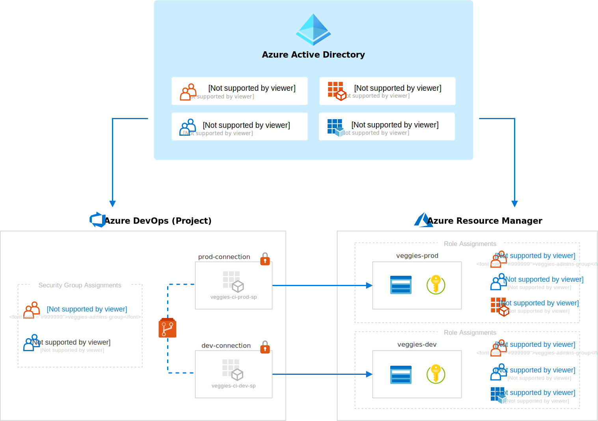

# End-to-end governance from DevOps to Azure

It's not sufficient to plan and implement an [Azure role-based access control (RBAC) model](../../ready/considerations/roles.md) for Azure Resource Manager templates (ARM templates), which restricts access via Azure portal and Azure CLI.

If this model isn't mirrored for DevOps automation, your organization might leave a **security back-door** open. Consider an example where a developer doesn't have access via ARM templates, but still has sufficient permissions to change application code or infrastructure as code and trigger an automation workflow. The developer, indirectly via DevOps, can access and make destructive changes to your ARM templates.

This article explains best practices to help plan for and avoid a scenario where destructive changes can occur.

## Single identity management plane with Azure AD groups

The first step is to integrate Azure Active Directory to use [single sign-on per identity management best practice](/azure/security/fundamentals/identity-management-best-practices#enable-single-sign-on).

If you aren't using an Azure first party CI product like Azure DevOps, check if your vendor offers Azure AD integration.

The second step is to use Azure AD groups, the same groups you're already using for your ARM templates RBAC model. It's a [best practice to assign roles to Azure AD groups](/azure/role-based-access-control/best-practices#assign-roles-to-groups-not-users), not to individuals. To create an end-to-end governance model, you will need to do this step for ARM templates and DevOps.

Azure DevOps has tight integration with Azure Active Directory including [Azure AD groups membership](/azure/devops/organizations/security/add-ad-aad-built-in-security-groups?tabs=preview-page), making it easy to apply role assignments to the same Azure AD group.

> [!NOTE]
> If you are using another CI vendor, you might have an intermediary logical container for managing group memberships, which you also need to maintain if Azure AD group membership is not synchronized.

The following diagram illustrates how Azure AD is used as the single identity management plane. In ARM templates and in our DevOps tooling (Azure DevOps in this example), we only need to manage role assignments, not memberships, which should be managed in Azure AD. Note the resource names follow recommended [naming conventions](../../ready/azure-best-practices/resource-naming.md) and [abbreviations](../../ready/azure-best-practices/resource-naming.md) for Azure resources.

### Example scenario: Remove contractor access with a single step, Azure AD membership

To make end-to-end governance concrete, let's examine the benefits with an example scenario.

If you use Azure AD as your single identity management plane, you can remove a developer's access to your Azure resources in one action, by adjusting their *Azure AD group memberships*. For example, if a contractor's access should be revoked upon project completion, when you remove the contractor's membership from the relevant Azure AD groups, access to ARM templates and Azure DevOps is removed.

## Mirror RBAC model with role assignments

When planned well, the RBAC model in your CI tooling will closely mirror your Azure RBAC model. Although the Azure AD group name examples in the diagram above imply security rules, membership alone doesn't enforce security. Remember that RBAC is a combination of principals, definitions, and scopes, which does not go into effect **until the role assignment is created**.

- The diagram illustrates role assignment for a single Azure AD group, `contoso-admins-group`.
- This Azure AD group is assigned the Owner role for Azure ARM templates at **multiple** subscription scopes:
  - `contoso-dev-sub` subscription
  - `contoso-prod-sub` subscription
- The `contoso-admins-group` is added to the Project Administrators group for Azure DevOps at a **single** project scope.

The Azure AD group has similarly privileged roles for both ARM templates and DevOps. Following this logic, if we have a developer group assigned the Contributor role for ARM templates, we would not expect them to belong in the Project Administrators group for DevOps.

Now that you understand the need to secure ARM templates and DevOps workflows, you should:

- Review your RBAC model and think about how the roles and responsibilities you have defined for ARM templates match to your CI/CD workflow.
- Review your CI platform's identity management solutions and integrate Azure Active Directory. Ideally, you want to include the Azure AD group membership.
- Review the roles and access levels offered by your CI tooling and compare them with your Azure RBAC model. The roles and access levels will not map one to one. Check your configuration. If a developer doesn't have access for ARM templates, they shouldn't have access for DevOps. In the simplest example, a developer who doesn't have *write* permissions to production resources shouldn't have direct access to trigger production pipeline runs.

To learn more about governance design and permissions, see:

- [Governance design for multiple teams](../../govern/resource-consistency/governance-multiple-teams.md)
- [Recommended method for granting and restricting permissions](/azure/devops/organizations/security/restrict-access#recommended-method-for-granting-and-restricting-permissions)
- [Default permissions and access for Azure DevOps](/azure/devops/organizations/security/permissions-access)
- [Managing people's access to your organization with roles](https://docs.github.com/en/organizations/managing-peoples-access-to-your-organization-with-roles)

## Next steps

Now that you understand the need to secure ARM templates and DevOps workflows, learn how to manage secrets in a secure way.

> [!div class="nextstepaction"]
> [Manage secrets in a secure way](./manage-secrets.md)
