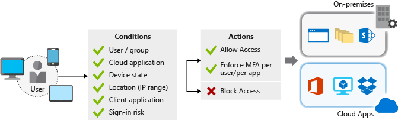

# Identity and access management best practices

## Checklist: How are you managing the identity for your workload?

> [!div class="checklist"]
>
> - Treat identity as the primary security perimeter.
> - Define clear lines of responsibility and separation of duties for each function. Restrict access based on a need-to-know basis and least privilege security principals.
> - Use role-base access control. Assign permissions to users, groups, and applications at a certain scope through Azure RBAC. Use built-in roles when possible.
> - Prevent deletion or modification of a resource, resource group, or subscription through management locks.
> - Use managed identities to access resources in Azure.
> - Support a single enterprise directory. Keep the cloud and on-premises directories synchronized, except for critical-impact accounts.
> - Centralize identity management. Designate a single Azure AD directory as the authoritative source for corporate and organizational accounts. Consistency and a single authoritative sources will increase clarity and reduce security risks from human errors and configuration complexity.
> - Set up Azure AD Conditional Access. Enforce and measure key security attributes when authenticating all users, especially for critical-impact, high privilege accounts.
> - Lower exposure of privilege accounts.
> - Choose a passwordless authentication method when possible.
> - Enable password management and roll our self service password reset. Enable Microsoft's password guidance.
> - Create an organization specific custom banned password list.
> - Block legacy protocols and authentication methods. This can be achieved with conditional access.
> - Manage connected tenants.
> - Plan for routine security improvements.
> - Enforce multifactor verification for users.
> - Enable single sign-on
> - Use Azure AD for storage authentication.
> - Enable Privileged Identity Management for tracking admin roles.
> - Enable Azure Active Directory identity protection.
> - Use risk detection to trigger multifactor authentication and password changes.
> - Automate threat response.
> - Monitor Azure AD Connect Health in hybrid environments.

## Azure services for identity

- [Azure AD](/azure/active-directory/fundamentals/active-directory-whatis) Azure AD allows application management for cloud and on-premises applications using Application Proxy, the my applications portal or access panel, and software as a service applications. It allows authentication, self service password resets, multifactor authentication, custom banned password list, and smart lockout. It allows developers to build applications that sign in all Microsoft identities, get tokens to call Microsoft Graph, other Microsoft APIs or custom APIs.among the features provided by Azure AD are: conditional access, device management, manage license assignments for enterprise users, access to applications and setup delegates using groups and administrator roles. Use Azure Active Directory connect and connect health to provide a single user identity for authentication and authorization to all resources, regardless of location (cloud or on-premises) through hybrid identity. It offers identity governance and protection, managed identities to access Azure resources, Privileged Identity Management (PIM) as well as reports and monitoring.
- [Azure AD Connect](/azure/active-directory/hybrid/whatis-hybrid-identity) synchronize Azure AD with your existing on-premises Active Directory using Azure AD Connect. Often this is in place already if you have services like Office 365 or Microsoft Dynamics Online deployed.
- [Azure AD B2B](/azure/active-directory/external-identities/what-is-b2b) Azure Active Directory (Azure AD) business-to-business (B2B) collaboration is a feature within external identities that lets you invite guest users to collaborate with your organization. With B2B collaboration, you can securely share your company's applications and services with guest users from any other organization, while maintaining control over your own corporate data. Work safely and securely with external partners, large or small, even if they don't have Azure AD or an IT department. A simple invitation and redemption process lets partners use their own credentials to access your company's resources. Developers can use Azure AD business-to-business APIs to customize the invitation process or write applications like self-service sign-up portals.
- [Azure AD B2C](/azure/active-directory-b2c/overview) Azure Active Directory B2C provides business-to-customer identity as a service. Your customers use their preferred social, enterprise, or local account identities to get single sign-on access to your applications and APIs. Azure Active Directory B2C (Azure AD B2C) is a customer identity access management solution capable of supporting millions of users and billions of authentications per day. It takes care of the scaling and safety of the authentication platform, monitoring and automatically handling threats like denial-of-service, password spray, or brute force attacks. Azure AD B2C is a white-label authentication solution. You can customize the entire user experience with your brand so that it blends seamlessly with your web and mobile applications. It allows single sign-on access with a user-provided identity using standards-based authentication protocols including OpenID Connect, OAuth 2.0, and SAML.

Azure AD external identities focuses less on a user's relationship to your organization and more on how the user wants to sign in to your applications and resources. Within this framework, Azure AD supports a variety of scenarios from business-to-business (B2B) collaboration to access management for business-to-consumer (B2C) applications designed for consumers, customers, or citizens. For more information about comparing external identity solutions and determine which service is best for your scenario, see [Compare external identity solutions](/azure/active-directory/external-identities/compare-with-b2c#compare-external-identities-solutions).

## Managed identities to access Azure resources

Identity management is at the core of all data protection. Identity-based attacks work because passwords are hard for busy people but are easy target for attackers. Credentials in the source code, passwords that are reused across environment and services, easy-to-remember passwords are some of the pitfalls that bad actors can exploit.

Use managed identities to access data resources in Azure whenever possible, this will avoid the user of credentials and protect access to the resource using Azure Active Directory. Ideally, credentials are never stored in developers' workstations and aren't checked into source control, using a managed identity allows this identity to authenticate with any service that supports Azure AD authentication, without credentials in the code.

[Managed identities](/azure/active-directory/managed-identities-azure-resources/overview) (formerly known as managed service identities) allow you to give a resource in Azure an identity. Internally, managed identities are service principals of a special type, which are locked for use only with Azure resources. There are two types of managed identities:

- **System-assigned managed identity:** The lifecycle of a system-assigned identity is directly tied to the Azure service instance that it's enabled on. If the instance is deleted, Azure automatically cleans up the credentials and the identity in Azure AD.
- **User-assigned managed identity:** After the identity is created, the identity can be assigned to one or more Azure service instances. The lifecycle of a user-assigned identity is managed separately from the lifecycle of the Azure service instances to which it's assigned.

[Services that support managed identities](/azure/active-directory/managed-identities-azure-resources/services-support-managed-identities#azure-services-that-support-managed-identities-for-azure-resources)

## Examples of securing database access and storage using managed identities

- [Secure Azure SQL Database connection from Azure App Service using managed identity](/azure/app-service/app-service-web-tutorial-connect-msi)
- [Connect with managed identity to Azure Database for MySQL](/azure/mysql/howto-connect-with-managed-identity)
- [Connect to and Azure Database for PostgreSQL using managed identities](/azure/postgresql/howto-connect-with-managed-identity)
- [Connect to Azure Storage using managed identities](/azure/search/search-howto-managed-identities-storage)

## Modern authentication and provisioning protocols

Microsoft Azure Active Directory (Azure AD) enables integration with many authentication and synchronization protocols. The authentication integrations enable you to use Azure AD and its security and management features with little or no changes to your applications that use legacy authentication methods. The synchronization integrations enable you to sync user and group data to Azure AD, and then user Azure AD management capabilities

### OAuth 2.0 authentication with Azure AD

The OAuth 2.0 is the industry protocol for authorization. It allows a user to grant limited access to its protected resources. Designed to work specifically with Hypertext Transfer Protocol (HTTP), OAuth separates the role of the client from the resource owner. The client requests access to the resources controlled by the resource owner and hosted by the resource server. The resource server issues access tokens with the approval of the resource owner. The client uses the access tokens to access the protected resources hosted by the resource server.

### OpenID Connect

OpenID Connect extends the OAuth 2.0 authorization protocol for use as an authentication protocol, so that you can do single sign-on using OAuth. OpenID Connect introduces the concept of an *ID token*, which is a security token that allows the client to verify the identity of the user. The ID token also gets basic profile information about the user. It also introduces the `UserInfo` endpoint, an API that returns information about the user.

For more information about OAuth 2.0 and OpenID Connect, the terminology and endpoints, as well as the grants to securely obtain tokens, see [OAuth 2.0 and OpenID Connect protocols](/azure/active-directory/develop/active-directory-v2-protocols).

The Microsoft identity platform supports authentication for these application architectures:

- [Single-page applications](/azure/active-directory/develop/scenario-spa-overview)
- [Web app that signs in users](/azure/active-directory/develop/scenario-web-app-sign-user-overview)
- [Web app that calls web APIs](/azure/active-directory/develop/scenario-web-app-call-api-overview)
- [Protected web API](/azure/active-directory/develop/scenario-protected-web-api-overview)
- [Web API that calls web APIs](/azure/active-directory/develop/scenario-web-api-call-api-overview)
- [Desktop application](/azure/active-directory/develop/scenario-desktop-overview)
- [Mobile apps](/azure/active-directory/develop/scenario-mobile-overview)
- [Daemon applications](/azure/active-directory/develop/scenario-daemon-overview)

Applications use the different authentication flows to sign in users and get tokens to call protected APIs. Depending on the type of application and the supported scenario, the token requests will follow different grants or authentication flows:

- [Scenarios and supported authentication flows](/azure/active-directory/develop/authentication-flows-app-scenarios#scenarios-and-supported-authentication-flows)
- [How each flow emits tokens and codes](/azure/active-directory/develop/msal-authentication-flows)

## Microsoft identity platform

The following diagram outlines the most common application scenarios and their identity components.

### SAML v2.0

Security Assertion Markup Language (SAML) is an open standard for exchanging authentication and authorization data between an identity provider and a service provider. SAML is an XML-based markup language for security assertions, which are statements that service providers use to make access-control decisions. The SAML specification defines three roles:

- The principal, generally a user
- The identity provider
- The service provider

Use when there's a need to provide an single sign-on (SSO) experience for an enterprise SAML application.

### Authentication libraries

Many developers have built and deployed applications using the Azure Active Directory authentication library (ADAL). We now recommend using the Microsoft authentication library (MSAL) for authentication and authorization of Azure AD entities.

By using MSAL instead of ADAL:

- You can authenticate a broader set of identities:

  - Azure AD identities
  - Microsoft accounts
  - Social and local accounts by using Azure AD B2C

- Your users will get the best single-sign-on experience.

- Your application can enable incremental consent.

- Supporting conditional access is easier.

- You benefit from innovation. Because all Microsoft development efforts are now focused on MSAL, no new features will be implemented in ADAL.

> [!IMPORTANT]
> MSAL is now the recommended authentication library for use with the Microsoft identity platform. Migrate existing applications from Azure Active Directory authentication library (ADAL) to Microsoft authentication library (MSAL).

## Identity platform additional considerations

> [!div class="checklist"]
>
> - Apply [Microsoft platform policies](/legal/microsoft-identity-platform/terms-of-use)
> - Keep the information associated to the account used to register and manage applications up-to-date.
> - Implement proper branding guidelines for applications.
> - Provide links to your application terms of service and privacy statements.
> - Manage all redirect URIs.
> - Minimize and manage the list of application registration owners.
> - Don't enable support for OAuth 2.0 implicit grant flow.
> - Move beyond username and password, don't use resource owner password credential (ROPC) flow.
> - Protect and manage application credentials for web apps, web APIs and daemon applications. Use certificate credentials instead of password credentials or client secrets.
> - Don't store credentials in code or configuration files. Use manage identities and Azure Key Vault to store and rotate credentials.
> - Use least privilege principle on applications so it only asks for the permissions in needs only when needed.
> - Use modern authentication solutions (OAuth 2.0 and OpenID Connect)
> - Don't program directly against these protocols. Instead, use the Microsoft authentication library (MSAL) and migrate applications that use ADAL to use MSAL.
> - In web apps of web APIs, keep one token cache per account.
> - Don't look at the access token value, or attempt to parse it as a client. They can change values, formats, or even become encrypted without warning - always use the id_token if your client needs to learn something about the user, or call Microsoft Graph.
> - Understand user consent experience
> - Test for conditional access policies.

For more information, see:

- [Microsoft identity platform (overview)](/azure/active-directory/develop/v2-overview)
- [Microsoft identity platform protocols reference](/azure/active-directory/develop/active-directory-v2-protocols)
- [Access tokens reference](/azure/active-directory/develop/access-tokens)
- [ID tokens reference](/azure/active-directory/develop/id-tokens)
- [Authentication libraries reference](/azure/active-directory/develop/reference-v2-libraries)
- [Permissions and consent in the Microsoft identity platform](/azure/active-directory/develop/v2-permissions-and-consent)

## Identity and access APIs

With **Microsoft Graph**, you can access [Azure Active Directory](/azure/active-directory/fundamentals/active-directory-whatis) resources to enable scenarios like managing administrator (directory) roles, inviting external users to an organization, and, if you are a Cloud Solution Provider (CSP), managing your customer's data. Microsoft Graph also provides methods that applications can use to, for example, discover information about users' transitive group and role memberships.

Directory resources and APIs can open up new ways for you to engage with users and manage their experiences with Microsoft Graph. You can try the API in the [Graph Explorer](https://developer.microsoft.com/graph/graph-explorer).

You can use the [Azure Active Directory PowerShell for Graph module](/powershell/module/azuread/?view=azureadps-2.0&preserve-view=true) for Azure AD administrative tasks such as user management, domain management and for configuring single sign-on. The Azure AD PowerShell for graph module has two versions: a public preview version and a general availability version. It's not recommended to use the public preview version for production scenarios.

## Use SCIM to automate provisioning on Azure AD

Azure Active Directory (Azure AD) can automatically provision users and groups to any application or system that is fronted by a web service with the interface defined in the system for cross-domain identity management (SCIM) 2.0 protocol specification.

For more information, see:

- [Decision tree to help you choose between SCIM and Microsoft Graph to automate provisioning](/azure/active-directory/app-provisioning/scim-graph-scenarios)

- [SCIM protocol compliance](/azure/active-directory/app-provisioning/application-provisioning-config-problem-scim-compatibility)

## Azure AD Conditional Access

The modern security perimeter now extends beyond an organization's network to include user and device identity. Organizations can use these identity signals as part of their access control decisions.

Azure AD Conditional Access bring signals together to make decisions and enforce organizational policies. Conditional access is at the heart of the new identity-driven control plane.

By using conditional access policies, you can apply the right access controls when needed to keep your organization secure and stay out of your user's way when not needed.

In the following illustration, user requests to access the on-premises and cloud applications are first checked against a list of conditions. The requests are either allowed access, forced to go through multifactor authentication, or blocked based on the conditions that they satisfy.

For more information, see:

- [Conditional access overview and main concepts](/azure/active-directory/conditional-access/overview)
- [How to build a conditional access policy](/azure/active-directory/conditional-access/concept-conditional-access-policies)

## Overview of passwordless and multifactor authentication

### Passwordless authentication

Features like multifactor authentication are a great way to secure your organization, but users often get frustrated with the additional security layer on top of having to remember their passwords. Passwordless authentication methods are more convenient because the password is removed and replaced with something you have, plus something you are or something you know.

Microsoft global Azure offer the following three passwordless authentication options that integrate with Azure Active Directory (Azure AD):

- Windows Hello for Business
- Microsoft authenticator app
- Fido2 security keys

### Multifactor authentication

Multifactor authentication is a process where a user is prompted during the sign-in process for an additional form of identification, such as to enter a code on their cellphone or to provide a fingerprint scan.

If you only use a password to authenticate a user, it leaves an insecure vector for attack. If the password is weak or has been exposed elsewhere, is it really the user signing in with the username and password, or is it an attacker? When you require a second form of authentication, security is increased as this additional factor isn't something that's easy for an attacker to obtain or duplicate.

Azure AD multifactor authentication works by requiring two or more of the following authentication methods:

- **Something you know**, typically a password.
- **Something you have**, such as a trusted device that is not easily duplicated, like a phone or hardware key.
- **Something you are**, such as biometric characteristics like a fingerprint or face scan.

For more information, see:

- [Deploying passwordless authentication](/azure/active-directory/authentication/howto-authentication-passwordless-deployment)
- [How multifactor authentication works](/azure/active-directory/authentication/concept-mfa-howitworks)

## Privileged Identity Management

Privileged Identity Management is a domain within identity management focused on the special requirements of powerful accounts within the IT infrastructure of an enterprise. It's frequently used as an information security and governance tool to help companies in meeting compliance regulations and to prevent internal data breaches through the use of privileged accounts.

Privileged Identity Management (PIM) is a service in Azure Active Directory (Azure AD) that enables you to manage, control, and monitor access to important resources in your organization. It's part of identity governance in Azure AD and enables just-in-time and scheduled access, approval workflows for Azure AD and Azure resource roles.

### Reasons to use PIM, what does it do?

Organizations want to minimize the number of people who have access to secure information or resources, because that reduces the chance of a malicious actor getting that access, or an authorized user inadvertently affecting a sensitive resource. However, users still need to carry out privileged operations in Azure AD, Azure, Microsoft 365, or SaaS applications. Organizations can give users just-in-time privileged access to Azure resources and Azure AD.

Here are some of the key features of Privileged Identity Management:

- Provide just-in-time privileged access to Azure AD and Azure resources
- Assign time-bound access to resources using start and end dates
- Require approval to activate privileged roles
- Enforce multifactor authentication to activate any role
- Use justification to understand why users activate
- Get notifications when privileged roles are activated
- Conduct access reviews to ensure users still need roles
- Download audit history for internal or external audit

*Using this feature requires an Azure AD Premium P2 license.*

## Security controls for identity management

[Security control v2: identity management](/security/benchmark/azure/security-controls-v2-identity-management)

- [IM-1: Standardize Azure Active Directory as the central identity and authentication system](/security/benchmark/azure/security-controls-v2-identity-management#im-1-standardize-azure-active-directory-as-the-central-identity-and-authentication-system)
- [IM-2: Manage application identities securely and automatically](/security/benchmark/azure/security-controls-v2-identity-management#im-2-manage-application-identities-securely-and-automatically)
- [IM-3: Use Azure AD single sign-on (SSO) for application access](/security/benchmark/azure/security-controls-v2-identity-management#im-3-use-azure-ad-single-sign-on-sso-for-application-access)
- [IM-4: Use strong authentication controls for all Azure AD-based access](/security/benchmark/azure/security-controls-v2-identity-management#im-4-use-strong-authentication-controls-for-all-azure-active-directory-based-access)
- [IM-5: Monitor and alert on account anomalies](/security/benchmark/azure/security-controls-v2-identity-management#im-5-monitor-and-alert-on-account-anomalies)
- [IM-6: Restrict Azure resource access based on conditions](/security/benchmark/azure/security-controls-v2-identity-management#im-6-restrict-azure-resource-access-based-on-conditions)
- [IM-7: Eliminate unintended credential exposure](/security/benchmark/azure/security-controls-v2-identity-management#im-7-eliminate-unintended-credential-exposure)
- [IM-8: Secure user access to legacy applications](/security/benchmark/azure/security-controls-v2-identity-management#im-8-secure-user-access-to-legacy-applications)

## Summary

- When communicating with Azure platform services managed identities are preferred over API keys and connection strings. Try to avoid authentication with keys (such as connection strings or API keys) and always prefer managed identities (formerly known as managed service identity or MSI). Managed identities enable Azure services to authenticate to each other without presenting explicit credentials via code. Typical use case is a web app accessing Key Vault credentials or a virtual machine accessing SQL Database.
- All APIs in this workload require clients to authenticate.API URLs used by client applications are exposed to attackers (JavaScript code on a website can be viewed, mobile application can be decompiled and inspected) and should be protected. For internal APIs, requiring authentication can increase the difficulty of lateral movement if an attacker obtains network access. Typical mechanisms include API keys, authorization tokens, IP restrictions or Azure managed identities.
- Modern authentication protocols (OAuth 2.0 and OpenID Connect) are used by this workload. Modern authentication protocols support strong controls such as multifactor authentication and should be used instead of legacy.
- Azure Active Directory or other managed identity providers (such as Microsoft accounts or Azure B2C) is used for user authentication. If possible, applications should use Azure Active Directory or other managed identity providers to avoid managing user credentials with custom implementation. Modern protocols like OAuth 2.0 use token-based authentication with limited time span, identity providers offer additional functionality like multifactor authentication or password reset.
- Authentication via identity services is prioritized for this workload vs. cryptographic keys. Consideration should always be given to authenticating with identity services rather than cryptographic keys when available. Managing keys securely with application code is difficult and regularly leads to mistakes like accidentally publishing sensitive access keys to code repositories like GitHub. Identity systems (such as Azure Active Directory) offer secure and usable experience for access control with built-in sophisticated mechanisms for key rotation, monitoring for anomalies, and more.
- Conditional access policies are implemented for users of this workload. Modern cloud-based applications are often accessible over the internet and location-based networking restrictions don't make much sense, but it needs to be mapped and understood what kind of restrictions are required. Multifactor authentication is a necessity for remote access, IP-based filtering can be used to enable ad hoc debugging, but VPNs are preferred.
- Password-less or multifactor authentication is enforced for users of this workload. Attack methods have evolved to the point where passwords alone cannot reliably protect an account. Modern authentication solutions including password-less and multifactor authentication increase security posture through strong authentication.
- Current on-premises Active Directory is synchronized with Azure AD or other cloud identity system.

## Related resources

- [Identity management best practices](/azure/security/fundamentals/identity-management-best-practices)

- [Security checklist for identity management](/azure/security/fundamentals/steps-secure-identity)

- [Choose passwordless authentication](/azure/active-directory/authentication/concept-authentication-passwordless)

- [Microsoft security best practices for identity and access management](/security/compass/identity)

- [Azure AD deployment 30, 90 and beyond](/azure/active-directory/fundamentals/active-directory-deployment-checklist-p2)

- [Identity platform best practices](/azure/active-directory/develop/identity-platform-integration-checklist)
