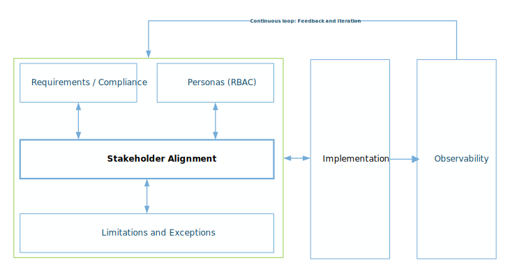

# Manage secrets in a secure way

The management of company sensitive secrets, keys, and certificates (and associated private keys) aligns with a critical process to improve your security posture. This guidance offers several security best practices on how to manage each of these sensitive assets. Some of these best practices might also align with your compliance or attestation requirements.

Before you continue, it's highly recommended to document the following items within your organization so your alignment with these best practices can be put into action:

1. Limitations and exceptions: understand and document how various security configurations have a direct effect to performance and cost. Ensure your documentation aligns with your overall business requirements. Next, review each business requirement to ensure all stakeholders agree and accept the overhead and complexities various security requirements will place on your secrets management implementation.
2. Identify your compliance and attestation requirements. For example: Center for Internet Security (CIS), National Institute of Standards and Technology (NIST), Health Insurance Portability and Accountability Act (HIPAA), HITRUST, cybersecurity maturity model certification (CMMC), protected B, medium integrity, and medium availability (pbmm), and federal information processing standard (FIPS). With respect to implementation, several of these compliance requirements might be implemented through built-in governance policy-based rule sets within Azure services. For example, there are various security controls in Azure Policy that can be applied to Azure Key Vault.
3. Identify the personas and their access requirements to the various Azure services. For example, developers and applications might only require read access to the secrets stored in Azure Key Vault within a development environment. On the other hand, operators or administrators will require full management access to all key vaults within each environment.
4. The overall *observability methodology* used by your organization to ensure your logging, monitoring, auditing, and alerting configurations are aligned with business requirements.

The following illustration is a high-level logical representation of these processes:

## Anticipate limitations and exceptions

To anticipate exceptions to best practices will be difficult and these exceptions might occur within various phases of your cloud journey. Ensure that exceptions and their risks to the business are documented and accepted across all stakeholders. Each Azure service will have limitations or quotas documented that might affect your Azure workload. Review each of the service limits that applies to your workload to ensure they are documented and align with stakeholder expectations.

There might be other limitations and exceptions that will require documentation and require alignment with your business requirements. For example, when you perform a backup of keys, secrets, and certifications and their number of [object versions allowed](/azure/key-vault/general/service-limits) within Azure Key Vault.

> [!IMPORTANT]
> The best practice to apply for each exception encountered is: *mitigate as much as possible to ensure your risks are minimized*. If each risk can't be mitigated, ensure your *observability methodology* will enable you to identify any nefarious activities as early as possible with the information that will support your:
>
> - Time to be notified and time to acknowledge, also known as MTTA
> - Time to detection, also known as MTTD
> - Root cause analysis and compromise recovery, also known as MTTR processes.

## External configuration store pattern

Most of these best practices across your enterprise and workloads deployed to the cloud will use a secret store. To understand the external configuration store cloud design pattern will not only provide context, it will provide insights to various issues and considerations that might affect your workload architectural design.

For example, there are rare exceptions to the security best practice of using Azure Key Vault to store secrets, such as connection strings. These exceptions might be revealed during the development implementation phase when conducting performance and load testing. Ensure your business stakeholders state that performance is critical to the workload.

Understanding alternatives to using Azure Key Vault and adhering to the external configuration store design pattern will ensure alignment with best practices and compliance requirements. An alternative might be to have secrets stored closer to the application's compute layer, for example, Azure App Service application settings that will only be accessed by designated and approved personas for the connections that require lower latency.

> [!IMPORTANT]
> The overall best practice on how to implement the external configuration store cloud design pattern is to ensure:
>
> - Alignment with your business and compliance requirements
> - Ensure at a minimum that the appropriate personas, their scope, and their permissions adhere to the least-privilege model
> - Implement observability, for example: logging, monitoring, and alerting
> - If you use Azure Key Vault:
>   - Implement the security baseline for Azure Key Vault
>   - Enable [Azure Defender for Azure Key Vault](/azure/security-center/defender-for-key-vault-introduction)
>   - Enable logging for Azure Key Vault

To learn more, see:

- [Azure subscription and service limits](/azure/azure-resource-manager/management/azure-subscription-service-limits)
- [External configuration store pattern](/azure/architecture/patterns/external-configuration-store)
- [Understanding separation of duties within NIST](https://csrc.nist.gov/glossary/term/Separation_of_Duty)
- [Applying Azure Policy's NIST SP 800-53 R4 controls, including separation of duties](/azure/governance/policy/samples/nist-sp-800-53-r4)
- [Start with the Azure Key Vault security baseline](/security/benchmark/azure/baselines/key-vault-security-baseline?context=/azure/key-vault/general/context/context)
- [Review and validate against the Azure Key Vault authentication fundamentals](/azure/key-vault/general/authentication)
- [Azure Policy regulatory compliance controls for Azure Key Vault](/azure/key-vault/security-controls-policy)
- [Observability using Azure Key Vault logging](/azure/key-vault/general/logging?tabs=Vault)

## Manage keys in a secure way

There are different types of keys that can be used within various Azure services:

- Keys that are cryptographic, such as encryption-at-rest or encryption-in-transit.
- Keys used for connectivity, also known as a token for authentication (AuthN) and authorization (AuthZ) to various Azure services.

### Keys used for cryptographic keys: Encryption-at-rest

Read the [encryption security fundamentals](/azure/security/fundamentals/encryption-overview) document for an encryption overview in Azure.

The two types of keys for encryption-at-rest are:

- Platform-managed keys (PMK)
- Customer-managed keys (CMK), also known as bring-your-own-key (BYOK)

As mentioned above, document your various business requirements. For example, what are your encryption-at-rest requirements with respect to key management? Ask yourself: *Are there any limitations or exceptions that I need to be made aware of?*

You might find limitations or exceptions with various Azure services that might not support customer-managed keys (CMK). Validate and document these items with your business stakeholders for each Azure service within your workload.

> [!IMPORTANT]
> When CMKs are not required, use PMKs due to operational simplicity as they are managed (including rotation) by the platform.

If your business requires customer-managed keys for encryption-at-rest, ensure you document the various Azure services that support this and their limitations or their release status, such as preview or GA. For example, Azure Monitor supports customer-managed keys and the documents any limitations.

> [!IMPORTANT]
>
> - When you use customer-managed keys, rotation of each key should be conducted on a frequent interval for each of the Azure services in your workloads.
> - If backups are encrypted with your CMKs, ensure your key rotation allows these backups to be restored successfully.
> - If your compliance requirements need backups to be stored that span several years, ensure that the keys used to encrypt said backups are available and can successfully restore these backups.

To learn more about keys used for encryption, see:

- [Azure Monitor customer-managed key](/azure/azure-monitor/logs/customer-managed-keys?tabs=portal)
- [Customer-managed keys for Azure Storage encryption](/azure/storage/common/customer-managed-keys-overview)
- [Replicate machines with CMK enabled disks](/azure/site-recovery/azure-to-azure-how-to-enable-replication-cmk-disks)
- [Configure customer-managed keys for your Azure Cosmos DB account with Azure Key Vault](/azure/cosmos-db/how-to-setup-cmk)

### Other security-based cloud design patterns

For the following sections on keys (used as tokens) and secrets, there are several cloud design patterns that address security best practices and should be considered when designing your workloads. These patterns are:

- **Valet key pattern:** Use a token that provides clients with restricted direct access to a specific resource, in order to offload data transfer from the application.

- **Command and query responsibility segregation (CQRS) pattern:** The command and query responsibility segregation (CQRS) pattern separates read and update operations for a data store. Implementing CQRS in your application can maximize its performance, scalability, and security. The flexibility created by migrating to CQRS allows a system to better evolve over time and prevents update commands from causing merge conflicts at the domain level.

> [!IMPORTANT]
> For each of your workloads, identify various established cloud design patterns that address each of the problem domains to ensure alignment with your business security requirements.

To learn more, see:

- [Valet pattern](/azure/architecture/patterns/valet-key)
- [CQRS pattern](/azure/architecture/patterns/cqrs)

### Keys used as connectivity or tokens: Invocation or within connection strings

The other type of keys are used for various Azure services for connectivity or tokens, for example, Azure Storage or Azure Service Bus access keys.

There are limitations or exceptions for the keys of various Azure services. Understanding and aligning with your business requirements will validate the best choice or practice below. For example, Azure Storage has support for shared access policies, shared access signatures, Azure AD, and so on.

Understanding each of these [options](/azure/storage/common/storage-auth?toc=/azure/storage/blobs/toc.json) and documenting them to your business requirements will guide you through this decision process.

Additionally, many Azure services support managed identities for authentication.  [What are managed identities?](/azure/active-directory/managed-identities-azure-resources/overview)

> [!IMPORTANT]
>
> - Use Azure AD managed identities when your use cases support the capabilities of managed identities for the various Azure services your solution will be composed of.
> - If Azure AD managed identities is not suitable for your use cases nor available to an Azure service, following a "least-privilege model" by using stored access policies or shared-access signatures (SAS) with explicit access and time-bound values.

Several Azure services might not have the features to use a stored access signature; however, these services might have the following policy features: manage, send, listen. For example, Azure Service Bus, Azure Event Hubs, [Azure IoT Hub](/azure/iot-hub/iot-hub-devguide-security) have these types of security access policies in addition to using Azure Active Directory.

> [!IMPORTANT]
> Following a "least-privilege model", when defining and configuring a policy will only provide at the specified scope the necessary operations needed.

Several Azure services use a key to allow an invocation to be performed. For example, non-anonymous Azure Functions have an access code (also known as a key).

> [!IMPORTANT]
> Ensure the keys used for invocation have a defined purpose. Create several keys for their intended purpose and renew or regenerate these keys on a frequent interval or when the key is compromised.

Lastly, various Azure services have features that support key rotation. Understanding [shared responsibility](/azure/security/fundamentals/shared-responsibility) in the cloud will support your documentation for various workloads.

> [!IMPORTANT]
> Within each of your workloads, periodically rotate your connection string keys for each of the Azure services. Use automation and an external configuration store, such as Azure Key Vault so that there is minimized disruption. When not using an external configuration store, each of these Azure services have two keys so that they can be used to minimize disruption during your maintenance window.

To learn more about keys used to invocate or within connection strings, see:

- [Define a stored access policy on Azure Storage](/rest/api/storageservices/define-stored-access-policy)
- [Manage storage account keys with Key Vault and the Azure CLI](/azure/key-vault/secrets/overview-storage-keys)
- [Grant limited access to Azure Storage resources using shared access signatures](/azure/storage/common/storage-sas-overview)
- [Azure Policy regulatory compliance controls for Azure Service Bus](/azure/service-bus-messaging/security-controls-policy)
- [Samples: `Azure.Security.KeyVault.Administration` using .NET](/samples/azure/azure-sdk-for-net/azuresecuritykeyvaultadministration-samples/)
- [Managing CMKs with Azure Service Bus](/azure/service-bus-messaging/configure-customer-managed-key)
- [Automate the rotation of secret for resources that use one set of augmentation credentials](/azure/key-vault/secrets/tutorial-rotation)
- [Automate the rotation of secret for resources that use two sets of authentication credentials](/azure/key-vault/secrets/tutorial-rotation-dual?tabs=azure-cli)

## Manage your secrets in a secure way

Secrets store sensitive information and are typically passwords, credentials, or fully qualified connection strings.

Passwords and secrets are managed outside of application artifacts, using tools like Azure Key Vault. API keys, database connection strings, and passwords need to be stored in a secure store and not within the application code or configuration. Using a centrally managed external configuration store simplifies operational tasks like key rotation in addition to improving overall security.

Applying automation will improve operational efficiencies and using credentials for various automated runbooks will need to be aligned with your business requirements. For example, a runbook within an Azure Automation account that purges expired data from storage accounts needs to have credentials to perform that action.

> [!IMPORTANT]
> Use an external configuration store, such as Azure Key Vault, to store sensitive information. For example, fully qualified connection strings or passwords. Where possible, automate rotation of secrets and store them in Azure Key Vault so that there is minimized disruption.

To learn more, see:

- [Azure Service Bus authentication and authorization](/azure/service-bus-messaging/service-bus-authentication-and-authorization)
- [Azure architecture blog: managing and rotating secrets with Azure Key Vault](https://techcommunity.microsoft.com/t5/azure-architecture-blog/managing-and-rotating-secrets-with-azure-key-vault-managed/ba-p/1800612)
- [Automate the rotation of secret for resources that use one set of authentication credentials](/azure/key-vault/secrets/tutorial-rotation)
- [Automate the rotation of secret for resources that use two sets of authentication credentials](/azure/key-vault/secrets/tutorial-rotation-dual?tabs=azure-cli)
- [Using credentials in Azure Automation runbooks](/azure/automation/shared-resources/credentials?tabs=azure-powershell)

## Renew certificates

Certificates are used for encryption, authorize automation actions, device management, and many other functionalities. Certificates are time bound and when they expire without a robust operational model, these expired certificates cause disruption to your workloads.

There are limitations and exceptions, such as authorizing automation actions within Azure Automation accounts when using Desired State Configuration (DSC), and where these certificates are stored.

> [!IMPORTANT]
> Align with the authorized personas, use central storage of these certificates, such as Azure Key Vault, and ensure the expiry dates of SSL/TLS certificates are monitored and there are renewal processes in place that align with your business requirements.

To learn more, see:

- [About Azure Key Vault certificates](/azure/key-vault/certificates/about-certificates)
- [Renew your Azure Key Vault certificates](/azure/key-vault/certificates/overview-renew-certificate)
- [Manage certificates in Azure Automation](/azure/automation/shared-resources/certificates?tabs=azure-powershell)

## Next steps

> [!div class="nextstepaction"]
> [Secure DevOps](./secure-devops.md)
