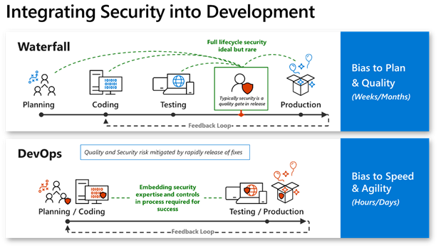

# Development innovation security

This article describes how to balance innovation speed and accountability in your organization within the context of development security.

## Balance innovation and accountability

Each organization's enterprise risk appetite is variable. To calculate it, you have to continuously balance the level of innovation your organization pursues and the accountability your organization owes its customers, shareholders, and regulators.

Some organizations stress rapid innovation to stay competitive. Others are intolerant of brand damage - even from an otherwise minor test application that could be compromised.

Balance your organization's security and speed of innovation. You can use the [Azure landing zone policy-driven governance design](../ready/landing-zone/design-principles.md#policy-driven-governance), which provides guardrails for your organization's platform (and applications deployed on it). For more information, see [Adopt policy-driven rails in your resource organization](../ready/enterprise-scale/dine-guidance.md).

Learn about the [hierarchy of management groups and subscriptions](/azure/governance/management-groups/overview) and how to create [top-level sandbox management groups](../ready/landing-zone/design-area/resource-org-management-groups.md#management-group-recommendations).

## Incremental and continuous improvements

Involve all stakeholders in your effort to balance the drive for innovation with the development lifecycle of continuous improvement. Iteratively improve the process across all aspects of innovation (such as speed or security).

Define a successful and sustainable minimum viable product (MVP) of innovation for your organization. It must meet minimum critical attributes across DevSecOps domains:

- **Development:** Must meet business requirements for market and customer relevance and responsiveness to evolving needs.
- **Security:** Must ensure safety, confidentiality, integrity, and availability.
- **Operations:** Must satisfy quality, performance, and reliability standards.

Embrace Shift Left testing as a natural part of your technical ideation and development. Integrate security early in the process. Fixing issues early is cheaper and more efficient than fixing them after you find them in production systems (often while an attacker is exploiting a workload and causing business damage).

Modify existing DevOps processes so you can implement security and innovation in development practices. This modification can involve adding new elements that fit naturally into a process.

Fine-tune these incremental practices to generate healthy friction among team members. The friction can generate important bugs to fix, and can prompt valuable critical thinking (such as threat modeling that helps you understand an attacker's "user persona"). Generating healthy friction among team members also helps you avoid unhealthy friction, wasted effort, and antipatterns.

## Native innovation efficiencies

Natively integrate security, identity, compliance standards, and other efficiencies into your development process to create invisible guardrails that avoid slowing down developer innovation. Educate all your teams on innovation efficiencies, and engage all teams in addressing them.

Remain flexible through continuous assembly of innovation. Adapt security elements, and tailor approaches to each individual developer team and their current process maturity/structure stage.

## Integrate security into the development process

DevOps increases agility and speed by bringing the planning and development processes and the testing and production processes together. DevOps mitigates enterprise risk by performing rapid updates rather than a deep scan before release. Security's role shifts from traditional quality gateway to integral process toward lowering risk (seen as incremental increases of a team's knowledge and education, process updates, and more).

Shift your organization from a waterfall development cycle to a DevOps lifecycle to enable rapid incremental releases for applications. The DevOps model allows you to rapidly address security concerns and avoid the longer planning and testing cycle of the waterfall model. DevOps also offers many non-security benefits that allow increased responsiveness to customers and internal user requirements in a rapidly evolving marketplace.

## Shift Left

Continually work to increase security in your DevOps processes using a Shift-left approach. In this security engineering approach, you integrate security earlier in the development lifecycle and operations (OSA) processes. You can catch security issues more easily and with much lest cost than if they went unaddressed until later in development.

Incorporate governance, risk, and compliance considerations into your strategy so you ensure security and the Shift-left approach are sustained over time.

## Next steps

> [!div class="nextstepaction"]
> [Securing DevOps strategy and process](devops-strategy-process-security.md)
