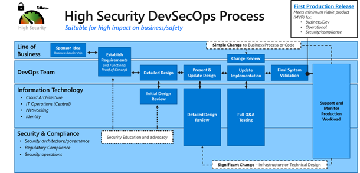
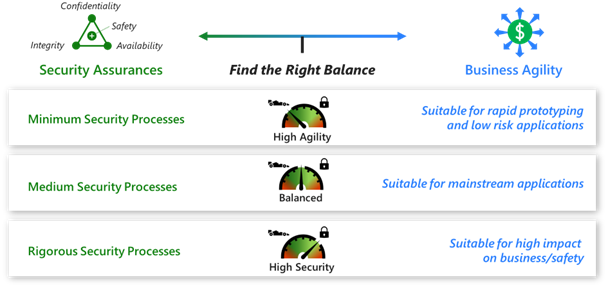

# Development security architecture

This article describes steps to help you achieve an ideal end state for development security in your organization.

Your development security architecture should integrate these key components:

- security best practices
- innovations in DevOps culture, tools, processes, and technology
- Infrastructure as Code (IaC), to ensure deployment consistency

Align security best practices and technologies with processes and workflows that operationalize DevOps architecture. Maximize the automation of your security analysis tools, threat modeling processes, security posture management, and other security techniques, along with their integration with CI/CD processes. Establish clear roles and responsibilities for security elements.

## IaC deployment consistency

Automating tasks using Infrastructure as Code (IaC) helps you ensure their consistent and correct execution and meet your organization's efficiency and security goals. IaC enables repeatable infrastructure deployments and environmental design configurations so you can consistently manage, govern, or support multiple workloads. Work with IaC developers to ensure that security is integrated into all automation and that the IaC architecture and development processes follow security best practices.

Azure landing zones contain pre-existing code and make things easier for your organization's IT and security teams. Azure landing zones provide a repeatable, predictable method for applying templatized landing zone implementations with design-area considerations for security, management, governance, and platform automation/DevOps.

Include security tools in your broader Azure landing zone architecture implementation that involves:

- A target architectural end-state for most organizations
- A scaled-out, mature environment
- A broad range of Microsoft best practices for Azure environment design
- Strong foundations that allow organizations to establish continuously improving management, governance, and security processes

## Integrated process for security development

Code security in the cloud needs to integrate with existing processes so you successfully operationalize and sustain it over time. The following diagram shows an example method of integrating secure development and operations practices into the innovation process.

The example process shown in this diagram is suitable for business-critical functions that require the highest level of security rigor (for example, APIs and applications that process financial transactions or business critical information).

Consider developing simpler, streamlined versions of this process for different use cases, as demonstrated in the following diagram:

Identify the steps involved in your organization's development workflows, people, and technologies that are necessary to progress from idea to production and ongoing operations. Also identify the process for resolving major and minor changes and bug fixes during the development lifecycle.

## Next steps

> [!div class="nextstepaction"]
> [Development security implementation and operations](development-security-implementation-operations.md)
