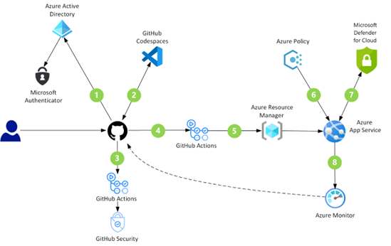

# Development security implementation and operations

This article describes implementation and operations for your organization in the context of development security.

Follow [development security best practices architecture](security-best-practices-introduction.md). Use secure landing zone deployments with repeatable governance and security tools and controls to quickly achieve a security baseline for your organization. The Cloud Adoption Framework's Security Baseline discipline doesn't replace the IT teams, processes, and procedures that your organization currently uses to secure cloud-deployed resources.

The Security Baseline discipline is key to your implementation and ongoing operations. It identifies security-related business risks and provides risk-mitigation guidance to the staff responsible for your organization's infrastructure and development. As you develop governance policies and processes, make sure you involve all relevant IT development teams in your planning and review processes.

Use repository tooling like GitHub workflow management and PR-based code contribution to operationalize the processes, policies, and toolsets you develop. Following security best practices across all [Azure DevOps tooling](/azure/devops/) and [GitHub Actions](https://github.com/marketplace?type=actions).

The following diagram shows DevSecOps architecture with Shift-left strategy. Security is integrated into developer workflows from the beginning and remains integrated across the entire development lifecycle. This scenario's complex dataflow starts with Microsoft Entra ID configured as GitHub identity provider (with multifactor authentication enabled for extra security).

The DevSecOps flow ends with Microsoft Defender for Cloud's active threat monitoring on the Azure Kubernetes Service across node-level (VM) and internal threats.

For detailed technical guidance on assessing and deploying well-architected workloads, see [Microsoft Azure Well-Architected Framework](/azure/architecture/framework/).

Implement the processes, policies, and tools from previous sections to continue operationalizing your security engineering approach. Integrate security across security development lifecycles (SDL) and operations (OSA) processes.

Ensure your organization's developers use consistent tooling and focus on the security pillar of the [Microsoft Azure Well-Architected Review](/assessments/?id=azure-architecture-review&mode=pre-assessment).

## DevSecOps controls

Learn how you to [integrate security processes and tools](./devsecops-controls.md) into your DevOps development process.

Learn how to implement secure and rapid innovation for your organization:

> [!VIDEO https://www.microsoft.com/videoplayer/embed/RWVu6q]

For more information about core DevOps security controls in the Azure Security Benchmark, see [Security Control v3: DevOps security](/security/benchmark/azure/security-controls-v3-devops-security).

## Next steps

> [!div class="nextstepaction"]
> [Infrastructure and development security best practices overview](security-best-practices-introduction.md)

> [!div class="nextstepaction"]
> [Define a security strategy](../strategy/define-security-strategy.md)
