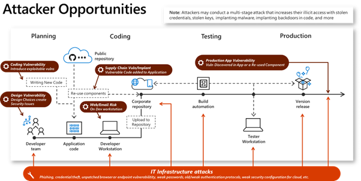

# Development

## Development security strategy

Development security is a broad technical area with multiple distinct elements, and these best practices reflect that. 

As illustrated in the graphic below, development security requires protecting both the application or code itself, as well as the underlying infrastructure, platform, or device.

Securing the code requires integrating security practices into the development process to ensure that security risks are reduced in both the design and the implementation of the code as they are developed. 

Development can take many forms including :
- application code to run on a server as an application or API
- publishing an API
- scripting
- automation such as *infrastructure deployment* (e.g., automating a Terraform deployment), *infrastructure configuration* (using an Azure Resource Manager template to deploy an Azure Network Security Group, and create security group rules), and *operational tasks* (using Azure Functions to run scheduled tasks by executing code on pre-defined timed intervals).
- code to be deployed to firmware,
- mobile apps—aggregation of application-level code with Platform services, deployed as a system,
- full systems (comprised of infrastructure components, operating systems, PaaS services, and code) assembled into an executable blueprint deployed to Azure as IaC.
- And more.

In addition to the breadth of what can be considered "development," advances in processes and technologies have enabled accelerated time to production—including faster Continuous Integration/Continuous Development pipelines, [DevOps](/devops/what-is-devops), and [DevSecOps](/devops/operate/security-in-devops).

This has led to the need for organizations to take a step back and determine the processes and technologies they can make use of to provide the development agility and speed needed to meet business demands in a secure and compliant way.

First, a good development strategy needs to account for your business and security needs—in addition to your organization's developer ecosystem. The goal is to have security "built in" to development processes with the security team being more of an enabler than a blocker/hindrance to get to production. Another part of a successful development security strategy is to meet the developers "where they are at" and try to make any changes to their work as frictionless and as small as possible. Small steps and automation are best, as well as showing development staff how having security incorporated into development processes can accelerate and ultimately remove friction from developer efforts.

## Next steps:

- [Innovation security](development-innovation-security.md)
