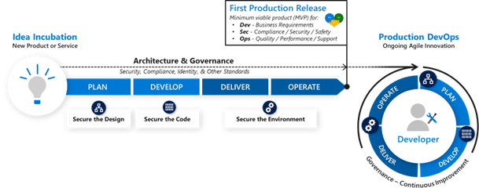
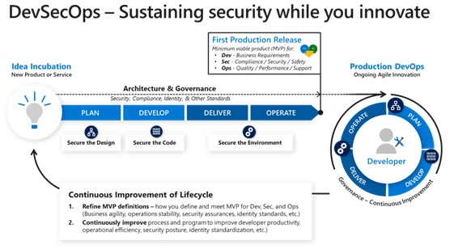

# Securing DevOps strategy and process

This article describes how to secure DevOps strategy and process for your organization in the context of development security.

Adopt a DevSecOps strategy that blends DevOps with elements of classic security and operations approaches. In the classic waterfall development model, security and other governance mechanisms are built into large longer-term releases. In the DevOps model, smaller, iterative changes are pushed in rapid releases. Rapid iteration enables organizations to meet continuously evolving marketplace expectations.

Approach DevSecOps strategies as an ideal state your organization should continually work toward, not a quick transformation away from its current development practices.

## Governance and production releases

The following diagram illustrates an organization's adoption of DevOps continuous improvement strategies.

As your organization prepares to adopt DevOps strategies, make sure you first adapt security and other governance processes to your approach. This approach mitigates security risk but doesn't decrease the value of rapid release cycles.

Before you put an application into full production, ensure that the minimum viable product (MVP) for production release across Dev, Sec, and Ops domains meets each discipline's requirements. MVPs vary with an organization's goals, culture, and industry, but they should always balance the needs for rapid release, security/safety, and production performance and reliability.

Prioritizing requirements and meeting all needs requires a team effort. Your organization won't benefit from a product that is released too late, doesn't meet market needs, doesn't scale or perform well, or compromises sensitive information and customer trust.

Use the following guidelines to make sure applications and workloads don't provide easy (low cost, low friction) means for attackers to abuse their functionality:

- **Secure design:** Follow a sound security design approach. This can involve using a threat modeling technique.
- **Secure code:** Validate the security of actual implementations. (including dependent components). This can involve using tooling like static and dynamic analysis to find and correct bugs.
- **Secure environment:** Validate that underlying infrastructure configurations follow best practices for patching, configuration, and more.

## Secure production DevOps

After a workload's first production release, it enters the production DevOps phase where changes and bug fixes are applied rapidly.

Integrate security natively in this process to ensure that security lessons get integrated within the developer operations cycle. Review security aspects of design during design reviews, and report security bugs using the same tools and prioritization terminology you use for other bugs.

Fix security bugs quickly, and follow a bottom-up approach to reduce their volume and effects. Implement security practices and tools during the development lifecycle to reduce the count and potential severity of security bugs.

## Continuous incremental improvement

The previous diagram illustrates how working together and learning as a team can refine your understanding of the continuous incremental improvement process.

The lessons you learn through these team efforts shape:

- How you determine an MVP across the Dev, Sec, and Ops domains
- How you can make incremental progress with less friction
- How your team can better collaborate and balance trade-offs

## Security as team sport

DevOps security is a team effort that involves integrating security throughout the application development lifecycle. DevOps security offers high security threat visibility, shorter development cycles, and automated cloud security implementations.

## Delivering end-user value faster

DevOps enables fast and continuous delivery of value to end users by tightly integrating development and operations. As you mature this process, ensure it continues to grow security as mindset and practice. You can do this through security development lifecycle (SDL) and Operational Security Assurance (OSA) processes like:

- **Providing training:** Focus on ramping up your team's collective knowledge of security best practices and the mindset of attackers, including how attackers exploit configuration mistakes and architectural weaknesses.
- **Defining requirements:** Establish a minimum-security baseline for your security and compliance controls. Bake the baseline into the DevOps process and pipeline. Your baseline should consider current, real-world threats, known industry challenges, and regulatory requirements stretching across the technology stack.
- **Defining metrics and reporting:** Drive desired behaviors across your engineering team. Define specific metrics that can drive action and support compliance objectives.
- **Using Software Composition Analysis (SCA) and governance:** Analyze and maintain an inventory of third-party components and create a plan to evaluate reported vulnerabilities. Consider possible vulnerabilities of third-party components in your system security.
- **Performing threat modeling:** Use a structured approach to quickly identify security vulnerabilities, and use threat modeling to determine and mitigate risk. Your team can effectively choose security features and establish appropriate mitigation strategies while optimizing cost.
- **Using automation and tools:** Carefully select intelligent automation and tools to help engineers and ensure process consistency. Choose toolsets that are already integrated into engineering processes. Focus on fixing issues, and avoid overloading engineers with processes alien to the engineering ecosystem. Secure DevOps workflow tools are integrated into CI/CD pipelines. Avoid security expertise requirements and avoid high false-positive issue-reporting rates.
- **Keeping credentials safe:** Scan for credentials and sensitive content in source files during pre-commit to reduce the risk of propagating sensitive information into your team's CI/CD process. Don't store sensitive keys in code. Consider using a bring-your-own-key (BYOK) solution that generates keys using a hardware security module (HSM).
- **Using continuous learning and monitoring:** Use advanced analytics to monitor applications, infrastructure, and networks and uncover security and performance issues. Couple CI/CD practices with monitoring tools to gain better visibility into your application health and identify and mitigate risks, reducing exposure to attacks. Monitoring supports a defense-in-depth strategy and can reduce your organization's mean time to identify (MTTI) and mean time to contain (MTTC) metrics.

A comprehensive DevOps ecosystem of development lifecycle and native security encompasses strategy, security, architecture, and implementation/operations, along with toolsets to support this ecosystem (such as Azure DevOps).

The following diagram illustrates an example of DevOps workflows/processes from the initial Idea Incubation phase (invention of new products or services) through to DevOperations (continuous Agile innovation).

The diagram highlights how security teams implement continuous improvements across the lifecycle to both:

- Refine an MVP across the various Dev (Business Requirements), Sec (compliance/security/safety), and Ops (quality/performance/support) domains
- Continuously improve the security process and program itself (developer productivity, operational efficiency, security posture, identity standardization protocols, and more)

## Next steps

> [!div class="nextstepaction"]
> [Securing the pipeline and CI/CD workflow](./best-practices/secure-devops.md)
