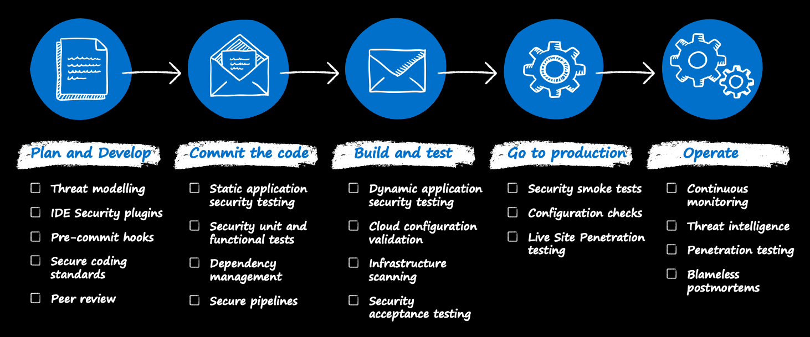

# DevSecOps controls

DevSecOps is the application of [innovation security](./innovation-security.md) by integrating security processes and tools into the DevOps development process.

Because DevOps itself is an emerging discipline with a high degree of process variations, successful DevSecOps is best achieved by understanding and thoughtfully integrating security into development process. Adding security should start with low friction changes to the code, the development processes, and the infrastructure that hosts the workload. Focus first on changes that have the highest positive impact on security while placing a low burden on DevOps processes and skills.

This documentation reviews each stage of a continuous integration and continuous delivery (CI/CD) DevOps process and what security controls we recommend integrating first.

## Plan and develop

Typically, modern development follows an agile development methodology. Scrum is one implementation of agile methodology that has every sprint start with a planning activity. Introducing security into this part of the development process should focus on:

- **Threat modeling** to view the application through the lens of a potential attacker
- **IDE security plug-ins and pre-commit hooks** for lightweight static analysis checking within an integrated development environment (IDE).
- **Peer reviews and secure coding standards** to identify effective security coding standards, peer review processes, and pre-commit hooks.

It's not mandatory to add all of these steps, however, each one helps discover security issues early, when they're much cheaper and easier to fix.

### Threat modeling

Threat modeling is arguably the most important security practice. It delivers immediate results and helps develop a security mindset in developers that can improve security in all of their future projects.

Threat modeling is a simple concept, though it can become detailed and technical if it needs to be. Threat modeling develops and documents a realistic security view of your application that includes:

- How attackers can abuse the application's design
- How to fix these issues
- How important it is to fix them

Threat modeling effectively puts you in the mindset of an attacker. It allows you to see the application through their eyes and can block their attack before they get a chance to do anything about it. If your team uses user personas in design, you can treat the attacker as a hostile user persona.

There are several differently published approaches for threat modeling that range from simple question and answer methods to detailed tool-based analysis. The can be based on methodologies like the [STRIDE model](/azure/security/develop/threat-modeling-tool-threats), the [DREAD model](https://en.wikipedia.org/wiki/DREAD_(risk_assessment_model)), or [OWASP threat modeling](https://owasp.org/www-community/Threat_Modeling).

#### Threat modeling: Start simple

Because some approaches to threat modeling can be a time consuming and skill intensive process, we recommend starting with a simpler approach based on basic questions. These simpler methods aren't as thorough, but start the critical thinking process and quickly identify major security issues

These simple questions for threat modeling are ideal to get your started:

- [Simple questions method from Microsoft](/security/compass/applications-services#simple-questions-method): This method asks specific technical questions designed to surface common security design mistakes.
- [OWASP threat modeling](https://owasp.org/www-community/Threat_Modeling): This method focuses on asking simple, non-technical questions to get the process started.

You can use either or both of these approaches, depending on what works better for the team.

As the team gets more comfortable with the process, they can apply more advanced techniques from Microsoft [security development lifecycle](https://www.microsoft.com/securityengineering/sdl/threatmodeling) and integrate threat modeling tools like [Microsoft threat modeling tool](/azure/security/develop/threat-modeling-tool) to get deeper insights and help automate the process.

Another helpful resource is [a guide to threat modeling for developers](https://martinfowler.com/articles/agile-threat-modelling.html).

### IDE security plug-ins and pre-commit hooks

Developers focus on the speed of delivery, and security controls might slow down the process. Typically, the slow-down occurs if the security checks start at the pipeline. A developer will find out about the potential vulnerability after pushing the code to the repository. To speed up this process and give immediate feedback, it's worth adding steps such as IDE security plug-ins and pre-commit hooks.

IDE security plug-ins identify different security issues during the development process in the developer's comfort zone, which is their IDE environment. Plug-ins can provide immediate feedback if there's a potential security risk in the developer's written code, or the third-party library or package included. Depending on the chosen IDE, many open-source or commercial plug-ins are provided by security companies available on the market.

Another step worth considering is to introduce a pre-commit framework if the version control system allows it. A pre-commit framework provides Git hook scripts that enable identification issues before submitting code for code review. One example is [pre-commit](https://pre-commit.com) and can be implemented in GitHub.

### Peer review and secure coding standards

Pull requests are standard in the development process. Part of the pull request process is peer reviews that allow detecting uncovered defects, bugs, or issues related to human mistakes. It's a good practice to have a security champion or knowledgeable security teammate who can incorporate and guide the developer during the peer review before creating a pull request.

Secure coding practice guidelines help developers learn essential secure coding principles and how they should be applied. There are secure coding practices such as [OWASP secure coding practices](https://owasp.org/www-project-secure-coding-practices-quick-reference-guide/migrated_content) available and incorporated with the general coding practices.

## Commit the code

Typically, developers create, manage, and share their code in repositories such as GitHub or Azure Repos. This approach provides a central, version-controlled library of code that can be collaborated on easily. However, enabling many collaborators on a single codebase can also introduce the risk of changes being introduced. That risk can lead to vulnerabilities or the unintentional inclusion of credentials or tokens in commits.

To address this risk, development teams should evaluate and implement a repository scanning capability. Repository scanning tools perform static code analysis on source code within repositories and look for vulnerabilities or credentials and flag items found for remediation. This capability acts to protect against human error and is a useful safeguard for distributed teams where many people are collaborating in the same repository.

### Dependency management

It's known that up 90 percent of the code in current applications contains and is based on external packages and libraries. With the adoption of dependencies in the source code, it's essential to address potential risks. Many third-party libraries have serious security problems themselves. Additionally, developers not consistently implement the proper lifecycle and keep them up to date.

Developer teams should ensure that they know what components are included in their applications, be sure that secure and up-to-date versions are downloaded from the known sources, and there's a process for keeping them up to date. This can be done with tools like the OWASP Dependency-Check project, WhiteSource, and others.

To focus on the dependency vulnerabilities or their lifecycle only is not enough. It's also important to address package feeds security. There are known attack vectors toward package management systems: typosquatting, compromising existing packages, substitution attacks, and others. Therefore responsible for the package management administration must address those risks. For more information, see the white paper [Three Ways to Mitigate Risk When Using Private Package Feeds](https://aka.ms/pkg-sec-wp).

### Static application security testing

Once third-party libraries and package management have been addressed, it's essential to shift the focus and improve one's written code security state. There are different ways to improve code security, like using IDE security plug-ins and wiring incremental static analysis pre-commit and commit checks discussed before. It's also possible to do the complete source code scanning to catch some mistakes missed by previous steps. It's needed but might take hours or days to run on a large block of code. This approach can slow down development and introduce burden.

There's a need to start from somewhere when you start to implement static code scanning practices. One way is to introduce static code analysis inside of continuous integration to verify security as soon as changes are made. One of these tools is SonarCloud, which wraps multiple static application security testing (SAST) tools for different languages. SonarCloud assesses and tracks technical debt with a focus on maintainability, such as code quality and style, and has security-specific checkers. There are many others commercial and open-source tools available on a market.

To ensure that the feedback loop is effective, it's crucial to tune the tool to minimize false positives and provide clear, actionable feedback on problems to fix. Additionally, it's good to implement the workflow, which prevents code commit to the default branch if there are findings. For both quality and security findings. In this way, security becomes a part of the unit testing experience.

### Secure pipelines

DevOps brings automation on another level where everything goes through the pipelines. Continuous integration and continuous delivery is a large part of modern development. Infrastructure is why pipelines are a central part of the development and have keys to the kingdom. Pipelines introduce unique security challenges. They can be compromised to run malicious code, credentials might be stolen from pipelines, or an attacker without access to the production might modify the pipeline to achieve their goals.

DevOps teams must ensure the proper security controls are implemented for the pipeline. Depending on the chosen platform, there are different guidelines on how to address those risks. For more information, see [Securing Azure Pipelines](/azure/devops/pipelines/security/overview).

## Build and test

Many organizations use build and release pipelines to automate and standardize the processes for building and deploying code. This use of pipelines allows development teams to make iterative changes to sections of code quickly and at scale, without the need to spend large amounts of time redeploying or upgrading existing environments. Using pipelines also enables teams to promote code from development environments, through testing environments and ultimately into production. As part of this automation, development teams should include security tools that run scripted automated tests when they deploy code into testing environments. The test should include testing such as unit testing the applications features to check for vulnerabilities or checking for public endpoints to ensure they're intentionally accessible.

### Dynamic application security testing

In a classical waterfall development model, security was typically introduced on the last stop, right before going to production. One of the most popular security approaches is penetration testing or pen test. The penetration test is an important step, which allows looking at the application from the black-box security perspective, closest to the attacker mindset. A penetration test consists of several action points, one of them is known as dynamic application security testing (DAST). DAST is a web application security test that finds security issues in the running application by seeing how the application responds to specially crafted requests. DAST tools are also known as web application vulnerability scanners. One of them is an open-source [OWASP Zed Attack Proxy (ZAP)](https://owasp.org/www-project-zap/), which finds vulnerabilities in the running web application. There are several ways how OWASP ZAP does the scan: passive baseline scan or full scan depending on the configuration.

The downside of a pen test is that it takes time. The proper pen test might take up to several weeks, and with DevOps development speed, it becomes unsustainable. However, it's still worth adding a *lighter* version of pen test during the development process to uncover what might be missed by SAST and previous steps. DAST tools like OWASP ZAP might help. Developers can integrate OWASP ZAP in the pipeline as a task. During the execution, the OWASP ZAP scanner is spun up in the container and does the scanning process after it publishes results. This approach might not be a perfect, as it's not complete penetration testing, however, it's one more quality gate in the development cycle for improving the security posture.

### Cloud configuration validation and infrastructure scanning

Alongside scanning and securing the code for applications, it's important to ensure that the environments that applications are deployed into are also secure. This is key for organizations who want to move at pace, innovate, and use new technologies or create environments quickly for experimentation. Azure has capabilities that enable organizations to create security standards from environments, such as Azure Policy, that can be used to create policy sets that prevent the creation of certain workload types or configuration items such as public IP addresses. These *guardrails* enable teams to experiment within a safe and controlled environment, balancing innovation and governance.

One of the DevOps aspects when bringing closer developers and operations in cooperation is transferring infrastructure into an infrastructure-as-code approach.
> Infrastructure as code (IaC) is the management of infrastructure (networks, virtual machines, load balancers, and connection topology) in a descriptive model, using the same versioning as the DevOps team uses for source code. Like the principle that the same source code generates the same binary, an IaC model generates the same environment every time it's applied. IaC is a key DevOps practice and is used in conjunction with [continuous delivery](/devops/deliver/what-is-continuous-delivery).

DevSecOps is shifting security left and it's not only about application security but about infrastructure security as well. One of the steps is to introduce security scanning of infrastructure before it's deployed in the cloud. As infrastructure became code, it became possible to apply the same security actions as those for application security shown in the previous challenges. There are security tools that can do the security scanning based on chosen IaC strategy.

With the adoption of the cloud, containerization is a popular approach in application architecture decisions. Some of the container repositories scan images to catch packages with the known vulnerabilities. There's still a risk that a container might contain out-of-date software. Because of this risk, it's vital to scan the container for security risks. There are plenty of open-source and commercial security tools targeting this area and supporting tight integration in the continuous delivery process. Those tools are helping to adopt DevSecOps for infrastructure as code and specifically containers part.

## Go to production and operate

When the solution is delivered to the production, it's vital to continue overseeing and managing the security state. At this stage, it's time to focus on the cloud infrastructure and application overall.

### Configuration and infrastructure scanning

To obtain visibility for cloud subscriptions and resource configuration across multiple subscriptions, the [Azure tenant security solution](https://github.com/azsk/AzTS-docs) from the AzSK team can be used.

Azure includes monitoring and security capabilities that are designed to detect and alert anomalous events or configurations that require investigation and potential remediation. Technologies such as [Azure Defender](/azure/security-center/azure-defender), [Azure Security Center](/azure/security-center/security-center-introduction), and [Azure Sentinel](https://techcommunity.microsoft.com/t5/azure-sentinel/become-an-azure-sentinel-ninja-the-complete-level-400-training/ba-p/1246310) are first-party tools that natively integrate into the Azure environments. These tools complement the environment and code security tools to provide a broad-reaching set of security monitoring to enable organizations to experiment and innovate at a pace in a secure way.

### Penetration testing

Penetration testing is a recommended practice for environments to check for any vulnerabilities in the infrastructure or application configuration that might create weaknesses that attackers could exploit.

There are many products and partners that provide penetration testing services. Microsoft provides guidance for [penetration testing in Azure](/azure/security/fundamentals/pen-testing).

Testing typical covers the following test types:

- Tests on your endpoints to uncover vulnerabilities.
- Fuzz testing (finding program errors by supplying malformed input data) of your endpoints.
- Port scanning of your endpoints.

### Actionable intelligence

The tools and techniques in this guidance can significantly contribute toward a holistic security model for organizations who want to move at pace and experiment with new technologies that aim to drive innovation. A key element of DevSecOps is data-driven, event-driven processes that enable the three functions to operate effectively in identifying, evaluating, and responding to potential risks. Many organizations choose to integrate these alerts and telemetry into their IT service management (ITSM) platform in order to bring the same structured workflow to security events that they use for other incidents are requests.

### Feedback loops

All of these techniques and tools enable teams to find and flag risks and vulnerabilities that require investigation and potential resolution. Operations teams who receive an alert, or discover a potential issue when they investigate a support ticket, need a route back to the development team to flag items for review. A smooth, collaborative, feedback loop is vital to address issues quickly and to minimize the risk of a vulnerability as much as possible. A common pattern for this feedback is to integrate it into the organization's developer work management system, such as Azure DevOps or GitHub to link alerts or incidents to work items for developers to plan and action. This process provides an effective way for developers to resolve issues within their standard workflow, including development, testing, and release.
