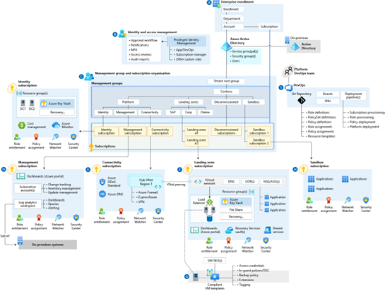

# Infrastructure security architecture

This is the beginning of the Infrastructure security architecture section that describes best practices related to the ideal end state and key components of infrastructure security. Advance to [Infrastructure security implementation, operations, and governance](infrastructure-security-implementation.md).

## Build scalable, modular Azure landing zones
Microsoft has created the [Cloud Adoption Framework](/azure/cloud-adoption-framework/overview) to help customers with a proven starting point for the cloud journey, including the [Secure methodology](/azure/cloud-adoption-framework/secure/). Another critical component of the Framework within the [Ready methodology](/azure/cloud-adoption-framework/ready/), is the concept of an Azure landing zone. Azure landing zones (ALZ) accelerate cloud adoption by providing automated implementation of complete architectures and operating environments, including security elements. Security best practices are integrated within Azure landing zones, so you can quickly and securely migrate your first workloads with baked-in security and governance best practices.

During the process of designing and implementing your organization’s landing zone, use the reference architecture below as a target end-state that captures mature and scaled-out environmental design considerations.

[Download the Visio file](https://raw.githubusercontent.com/microsoft/CloudAdoptionFramework/master/ready/enterprise-scale-architecture.vsdx)—and adapt the landing zone's design configuration to fit your organization's specific business and technical requirements.

We recommend using Azure landing zones where possible in your cloud adoption plans as this simplifies the application of security best practices and provides an architectural starting point. Whether you are deploying a new workload, migrating existing workloads, or improving already-deployed workloads, Azure landing zones can help you quickly follow security and other best practices, all at once or incrementally. 

> [!NOTE] 
> Your organization can customize the Azure landing zone architecture to meet your unique business requirements. Read additional [guidance on reference implementation options](/azure/cloud-adoption-framework/ready/landing-zone/tailoring-alz) to help your organization get started quickly. Use configurations that deliver Azure landing zone conceptual architecture and best practices across design areas.

Azure landing zones contain pre-existing code that makes it easier on your organization's IT and security teams. These landing zones offer a repeatable, predictable method to apply a templatized landing zone implementation that includes a deployment approach, [design principles](/azure/cloud-adoption-framework/ready/landing-zone/design-principles), and [design areas](/azure/cloud-adoption-framework/ready/landing-zone/design-areas) for security, management, and governance processes—as well as platform automation and DevOps.

## Use Zero Trust principles

This approach uses Azure landing zones as a starting model which your organization can adapt to—based on additional ASB best practices and Zero Trust (ZT) principles, already included in the target architecture. Move towards the best practice-aligned target architecture—implementing additional security considerations and Zero Trust principles that incrementally build on and improve your organization's security and governance MVP.

Extend Zero Trust architectural approaches that "never trust and always verify," integrating an end-to-end strategy across your digital state that encompasses identities, endpoints, network, data, apps, and infrastructure.

## Follow Azure Security Benchmark security recommendations

> [!TIP]
> Azure landing zones assign the ASB policy by default to the top of its hierarchy to ensure all subscriptions and workloads beneath it are monitored for ASB compliance.

We recommend that your organization follow the high-impact security recommendations of the Azure Security Benchmark (ASB) alongside guidance within Azure landing zones and the Cloud Adoption Framework itself—including it as part of your architectural strategy by reviewing all pertinent [documentation and service-specific baselines](/security/benchmark/azure/overview). ASB controls most applicable to securing infrastructure resources are:

- [Governance and Strategy](/security/benchmark/azure/security-controls-v3-governance-strategy)
- [Data protection](/security/benchmark/azure/security-controls-v3-data-protection)
- [Asset Management](/security/benchmark/azure/security-controls-v3-asset-management)
- [Network Security](/security/benchmark/azure/security-controls-v3-network-security)
- [Endpoint security](/security/benchmark/azure/security-controls-v3-endpoint-security)
- [Backup and recovery](/security/benchmark/azure/security-controls-v3-backup-recovery)

## Next steps:

- [Implementation](infrastructure-security-implementation.md)